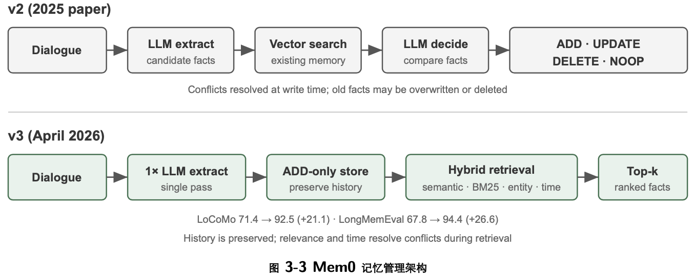

```toc
```

这种持久化的记忆体系可以从两个尺度来理解。用户记忆是针对单个用户的个性化记忆——Agent 在与每位用户的交互中逐渐了解其偏好、习惯和需求，构建专属于该用户的知识模型。知识库则是面向所有用户共享的集体知识——比如一个行业的法规体系、一家公司内部的操作流程、一个技术领域的专业文档。前者让 Agent 成为“懂你的助手”，后者让 Agent 成为“领域专家”。

两者解决的其实是同一个问题，只是尺度不同：一个关注个体，一个关注群体。也正因如此，两者共用许多底层技术——向量检索、知识压缩——也面临同样的麻烦：信息冲突、知识过期、检索不准。


## 用户记忆系统

要让 Agent 跨会话提供个性化服务，需要一层持久的用户记忆。它不保存每句对话，而是用额外的 LLM 调用提取、压缩并审查对未来有用的事实；这与只在当前窗口生效的上下文学习不同。

提取结果应同时满足三条规则：**选择性**（丢弃“搜索返回 3 个选项”这类短期细节）、**抽象化**（把本次“靠窗座位”归纳为长期偏好）和**结构化**（用可检索的字段保存事实）。

### 记忆能力的评估：三层次框架

学术界已发布若干公开基准，其中 LoCoMo（Long-term Conversational Memory，长期对话记忆）是较具代表性的一项：它构造了平均约 300 轮、最多 35 个会话的超长多轮对话，通过问答（细分为单跳、多跳、时间推理、开放域和对抗性问题）、事件摘要和多模态对话生成三类任务，考察模型对长程对话的记忆
与理解能力。

综合 LoCoMo 等各类记忆基准与商业记忆产品的实践，用户记忆能力可归纳为以下八项（这是笔者的归纳口径，而非某一基准的原始分类）：

- 个人信息保留：记住用户身份等长期个人信息
- 偏好追踪：跟踪并记住用户的长期偏好
- 上下文切换：在多个话题之间切换时保持连贯
- 记忆更新：当用户提供与旧信息矛盾的新信息时能正确处理
- 多会话连续性：跨会话保持知识
- 复杂思考：基于多个记忆片段联合思考，例如当用户对花生过敏时推荐泰国菜应主动提醒注意花生成分
- 时间感知：记住日期、理解相对时间、进行时间计算
- 冲突解决：识别并处理记忆之间的不一致

在此基础上，我们设计了更贴合 Agent 场景的三层次评估框架，将记忆能力划分为三个递进层级。

第一层：基础回忆——这是记忆系统最根本的能力，要求 Agent 能够准确存储和检索用户直接提供的、结构化的、无歧义的信息。如“我的会员号是 12345”，在后续需要时精确返回。这一层级确保了记忆系统的基本可靠性，是后续更复杂能力的基础。

第二层：多会话检索——要求 Agent 在面对来自不同对象、不同时期的多段会话时，能检索出所有相关信息并推理判断。真实世界的交互往往不是一次性完成的，而是通过不同客服渠道或在不同时间分别完成的。

第三层：主动服务——这是衡量 Agent 是否达到“助理”水准的最高标准。它要求系统综合来自多个会话、甚至很久以前的信息，提供具有预见性的主动帮助，从看似无关的记忆中发现深层联系。


### 记忆的层次结构

有了评估标准，就可以进入具体设计。记忆系统的设计可以拆成三个独立的维度——放哪里、怎么存、存什么。本节先回答“放哪里”。

**轨迹**（Trajectory）是一次 Agent 运行过程中的完整历史记录——对应第一章定义的“动态轨迹”（用户消息 + 模型回复 + 工具执行结果，也称 trajectory）。轨迹记录从对话开始到当前时刻的所有事件，按时间顺序排列，只增不改。当然为了控制长度，可以对相关数据进行压缩。

轨迹是单次会话的完整原始记录，按时间顺序追加且不修改；用户长期记忆则是跨会话提炼出的稳定信息，会被反复改写、合并、淘汰。前者是流水账，后者是档案。

**用户长期记忆**是跨会话、跨实例的持久化存储，通常以键值对形式与特定用户 ID 绑定，其中存储着偏好设置、历史交互摘要和提取的知识点。 Agent 通过特定工具调用显式读取和更新长期记忆，实现跨会话的个性化和连续性。

### 用户记忆的四种存储格式

**Simple Notes** 体现极简主义设计，每条记忆是一个最小的、不可再分的事实（如“用户邮箱： john@example.com”）。

**Enhanced Notes** 采用整体视角，将每条记忆保存为包含完整上下文的段落。例如，同样的工作信息可以存储为：“用户在 TechCorp 担任高级软件工程师，专注于机器学习已有三年，目前领导一个推荐系统项目，团队 5 人。”这种表示保留了信息的叙事结构，确保语义完整而丰富。但代价是存储冗余（相同信息在多个段落中重复）、更新复杂（属性变化需重写多个段落）。


**JSON Cards** 采用三层嵌套结构（类别 → 子类别 → 键值对，如 personal.contact.email、 work.position.title），模拟人类对信息的分类方式。它支持部分更新（修改 work.position.title 不影响 work.company.name），可预测且可扩展。但刚性结构假设信息可清晰分类——“周末用 Python 开发个人项目”同时涉及时间偏好、技术偏好和活动类型，强制归入单一类别会丢失多维性。

**Advanced JSON Cards** 代表了记忆系统从信息存储到知识管理的范式转变。每张卡片不仅记录事实，还加入信息来源的叙事背景（backstory）、主体身份（person）、与用户的关系（relationship）和时间戳。这背后的核心思想是：同一条信息在不同场景下可能有完全不同的含义——“张医生”可能是用户自己的牙科医生，也可能是用户父亲的心脏科医生，脱离了具体情境就无法正确理解。注意：这里其实还是 json 结构，知识记录的信息更全面，更有逻辑性。

实践中的选择标准是：关键且少量的数据（如用户偏好、关键人物关系）用 Advanced JSON Cards 以保证可检索性；大量且非关键的对话事实用 Simple Notes 以降低成本；多数生产系统采用混合模式——同一 Agent 内不同类别的信息走不同路径。


### 进阶知识表示形态：可执行代码

前面四种格式本质上都是文本：擅长召回单条事实，却要把聚合、冲突检测和约束执行交给 LLM“心算”。User as Code1 把用户状态改成带类型的可执行对象，并把规则写成普通函数，让“表示”和“推理”使用同一种可验证介质。

其实可以理解为 LangGraph 中的 chekerpointer 原理，就是相当于可以从记录中恢复当时的信息以及状态。 

### 用户记忆的认知科学基础

认知科学把记忆划分为工作记忆（Working Memory）和长期记忆。工作记忆对应 Agent 的上下文窗口——用于处理当前任务的临时信息空间（轨迹就是工作记忆中最核心的内容，但工作记忆还可能包含从长期记忆中激活加载的信息）。长期记忆则细分为三种类型，每种都能在 Agent 记忆中找到直接对应：

- 情景记忆（Episodic Memory）：关于具体事件和经历的记忆。人类例子：“上周三和同事在那家意大利餐厅吃了一顿很棒的晚餐”。Agent 对应：前面订机票例子中的“用户订了下周五去东京的 ANA 航班”——记录了一个具体事件的时间、对象和细节。
- 语义记忆 （Semantic Memory）：从具体事件中抽象出的一般性知识。人类例子：“意大利的首都是罗马”。 Agent对应：“用户是素食者”、“用户偏好靠窗座位”——这些不是某次对话的记录，而是从多次交互中提炼出的稳定特征。
- 程序记忆（Procedural Memory）：关于行为模式和流程的记忆。人类例子：骑自行车的能力。Agent 对应：从用户反复订机票的模式中学到的通用流程——“先搜索直飞航班 → 确认座位偏好 → 使用常旅客号码 → 订餐”。


**记忆设计的三套分类体系**

| 分类体系 | 回答的问题 | 具体类型 |
| ---- | ----- | ---- |
|记忆层次|存在哪里？|轨迹（当前会话）、用户长期记忆（跨会话）、业务状态（任务阶段）|
|存储格式|怎么存？|Simple Notes、 Enhanced Notes、 JSON Cards、 Advanced JSON Cards|
|认知类型|存什么？|情景记忆（具体事件）、语义记忆（一般知识）、程序记忆（行为流程）|

### 记忆框架案例

Mem0：从写入时消歧到检索时推理。 Mem0 的演进提供了一个很有启发性的系统设计案例：2025 年论文（Chhikara 等人，arXiv:2504.19413）和 v2 把冲突处理放在写入阶段，而 2026 年 4 月发布的 v3 新算法把它移到
了检索阶段


2025 年论文与 v2——提取、对比、决策。对话结束后，LLM 先抽取候选事实；系统再用向量检索找到相近的已有记忆，由 LLM 在 ADD、UPDATE、DELETE、NOOP 中做出决定。用户先说“我住在北京”，后来又说“我搬到了上海”时，系统会将前一条更新（UPDATE）为“住在上海”，在写入时消除冲突。论文还描述了图记忆变体Mem0-g，用实体—关系图支持多跳与时序问题。这个方案的优势是记忆库始终简洁一致；风险则是一次错误的更新或删除会不可逆地丢失历史信息，而且每条候选事实都要经历检索和第二次 LLM 判断。

2026 年 v3——仅追加写入、混合检索。 当前管线用一次 LLM 调用抽取事实，并且只做 ADD；“住在北京”和稍后的“搬到上海”会作为带时间信息的两条事实并存。查询时，系统融合语义相似度、 BM25 关键词和实体匹配，并结合时间信息排序；Agent 确认完成的动作也成为一等事实。这样既避免错误 UPDATE/DELETE 丢失历史，又减少 LLM 调用，还能用多种检索信号和时间排序找出当前事实。 Mem0 报告 LoCoMo 从 71.4 提升到 92.5 （+21.1），LongMemEval 从 67.8 提升到 94.4（+26.6）。当前 OSS 已移除外部图存储及 relations 返回值，实体链接仅用于内部检索加权；因此 Mem0-g 应理解为历史设计。详见 Mem0 OSS v2 到 v3 迁移指南。

Memobase：用户画像与事件记忆。 Memobase（开源项目 memodb-io/memobase）的设计理念与 Mem0 不同：与其做通用的记忆流水线，不如聚焦“用户画像”这一具体形态。它把用户记忆组织为两部分。 用户画像（Profile）是一组可由开发者配置的槽位，按主题—子主题两级组织（如 basic_info→ 姓名、 interest→ 兴趣偏好、 work→ 职位），存放从对话中提取的稳定用户属性，开发者可以精确控制画像的范围和粒度。 事件记忆（Event Memory） 则按时间线记录用户经历的事件，用于回答“我们上次讨论预算是什么时候”这类与时间有关的问题。工程上， Memobase采用缓冲批处理策略：对话先在缓冲区累积，达到一定规模或时限后再统一触发一次记忆提取，以摊薄 LLM 调用成本，同时让查询侧只需读取已整理好的画像和事件，保证低延迟。

两个框架各自只覆盖了记忆设计空间的一部分： Mem0 的事实条目接近语义记忆， Memobase 的画像近似语义记忆、事件记忆近似情景记忆。

### 记忆压缩与整理机制

1.第一层通过重要性评分筛选。一种常见的重要性评分思路是综合四个因素：访问频率（经常被检索的记忆更重要）、时间衰减（越久远的记忆越容易被遗忘）、情感强度（带有强烈情感标记的记忆更易保留）和信息独特性（重复信息的重要性降低）。低于阈值的记忆标记为可压缩或可删除。例如，一条被访问 5 次、创建于 3 天前、带有强情感标记、且无重复记录的记忆会获得较高的重要性得分；而一条仅被访问 1 次、创建于 90 天前、无情感标记、且与其他 3 条记忆高度重复的记忆则可能低于压缩阈值。

2.第二层采用聚类。相似记忆被分组，每组生成代表性摘要（如多次天气对话压缩为“用户经常询问天气，特别关心降雨”）。原始详细记忆可存档到二级存储。

3.第三层是抽象和泛化——从具体情景记忆中提取一般性规律，转化为语义或程序记忆。例如从多次购物对话中学习到“偏好性价比高的产品，重视用户评价”。


## RAG 基础：构建 Agent 的知识获取管道

构建共享知识库的核心技术是检索增强生成（Retrieval-Augmented Generation, RAG）。其核心思想是将大型语言模型的思考和生成能力，与外部知识库的广度和时效性相结合。模型本身的训练数据有截止日期，而知识库可以随时更新。

典型的 RAG 系统由两部分构成：检索器负责从知识库里找出相关片段，生成器（通常是 LLM）拿到这些片段作为上下文来生成答案。

RAG 的核心流程是：**检索相关片段 → 注入上下文 → LLM 基于上下文生成答案（检索，增强，生成）**。
下面先看文档进入知识库的第一道工序——文档分块，再重点看检索器的两大技术路线：稠密嵌入和稀疏嵌入，以及如何把二者结合起来。

### 文档分块（Chunking）

分块必不可少，原因有二。其一，嵌入模型对输入长度有限制，且一整篇文档只压缩成一个向量时，多个主题混在一起，向量无法精确表达任何一个——这与前面 Enhanced Notes 遇到的问题同源：段落越长，嵌入越难抓住重点。其二，检索的目标是只把相关的那部分注入上下文，片段太大会连带引入大量无关内容，浪费窗口、稀释注意力。


常见的分块策略有三类：

固定大小切分：最简单的方法，按固定的 token 数（如 512）切分，通常在相邻块之间保留一定重叠（如 50-100 token），避免关键句子恰好在边界处被切断。实现简单、结果可预测，但完全无视文档结构——一个段落、一段代码、一张表格都可能被拦腰截断。

递归/结构感知切分：按文档的自然边界（章节标题、段落、句子）递归切分——先尝试按大边界切块，仍超长时再降级到更小的边界。Markdown、HTML 这类有显式结构的文档尤其适合。这是目前生产系统最常用的默认选择。

语义切分：计算相邻句子的嵌入相似度，在语义“断崖”处（相似度骤降的位置）下刀，使每个块内部主题尽量单一。切分质量更高，代价是需要额外的嵌入计算。

块大小与重叠量的选择是一对典型权衡：块太小，单块信息不完整，脱离上下文后语义会变得模糊（“该公司收入增长了 3%”——哪家公司？哪个季度？）；块太大，一个块混杂多个主题，嵌入向量被稀释，检索精度下降，命中后还会带入更多无关内容。实践中常见的起点是每块 256-1024 token、相邻块重叠 10%-20%，再根据检索质量实测调优。


### 稠密嵌入：从词汇关联到语义理解

其实就是向量化，然后计算余弦相似度。“稠密”是相对于后面将介绍的“稀疏嵌入”而言：稠密向量的每个维度都有数值，稀疏向量大部分维度为零。


#### 从 Word2Vec 到上下文感知

在稠密嵌入的早期，以 Word2Vec 为代表的技术通过分析海量文本中词汇的共现关系，为每个词生成一个固定向量。这种向量能捕捉有趣的语言规律，比如向量运算"king"-"man"+"woman"≈"queen"（前面嵌入概念介绍中提过的“国王-男性 + 女性≈ 女王”就来这一发现），证明词向量空间能以线性可计算的方式编码复杂语义关系。

然而，静态词向量存在根本局限：无法处理一词多义。现代嵌入模型（如 BERT、BGE-M3）能在生成一个词的向量时充分考虑其所在的整个句子甚至段落的上下文。这得益于自注意力（Self-Attention）机制——模型在计算每个词的向量时，会同时参考句子中所有其他词的信息。因此，同一个词“苹果”在“苹果公司发布新产品”和“买了两斤苹果”中会得到不同的向量表示。

### 稀疏嵌入：精确匹配的关键词检索

与捕捉语义相似性的稠密嵌入不同，稀疏嵌入（Sparse Embedding）根植于传统信息检索，核心是精确的关键词匹配。它将文档表示为极高维度的向量，绝大多数维度为零，只有与文档中出现的词汇对应的维度具有非零值。理论基石是经典的词袋模型（Bag of Words, BoW）——它把一段文本看作一个“装满词的袋子”，只关心哪些词出现了、出现了几次，完全忽略词序。

#### 从 TF-IDF 到 BM25

TF-IDF（Term Frequency– Inverse Document Frequency，词频–逆文档频率）的核心直觉是：一个词在当前文档中出现得越多、在整个语料库中越少见，它对检索越重要。假设 100 篇文章中有 60 篇包含“模型”，只有 3 篇包含“蒸馏”，那么“蒸馏”更能区分哪些文章真正与“模型蒸馏”相关。

BM25 可以看作对这两个局限的经典修正：它保留 IDF 对稀有词的加权，同时引入词频饱和与长度归一化

### 混合检索：两全其美的艺术

典型的混合检索流水线包含三个阶段，三者各司其职、层层递进。

第一阶段是并行检索，系统同时向稠密和稀疏两个引擎发送查询，各自召回一部分候选文档。

第二阶段是结果融合，负责把两路结果合成一个统一的候选池。难点在于两路得分不可直接比较：稠密检索的余弦相似度得分（通常是 0 到 1）和稀疏检索的 BM25 得分（可能是 0 到几十的任意值），尺度和分布完全不同。常用的融合方法是倒数排名融合（Reciprocal Rank Fusion, RRF），完全抛开原始得分、只看排名，每个文档的综合得分是它在各路结果中排名的平滑倒数之和，即得分 = Σ 1/(k + rank)，其中 k 是平滑常数（常取 60），用于压低排名最靠前几个位置之间的得分差距。 RRF 简单且稳健，但只利用了排名信息，丢失了原始得分中蕴含的丰富相关性信号。


打个比方：求职者把简历交给猎头快速筛选，是双编码器；面试官与每位候选人深谈，是跨编码器。前者依靠预先抽取的特征做大规模初筛，后者则让查询和候选文档“面对面”逐字斟酌。重排序器采用的正是“跨编码器（Cross-Encoder）”架构，与检索阶段的“双编码器（Bi-Encoder）”形成鲜明对比。双编码器为查询和文档独立生成向量，通过向量运算计算相似度，速度极快，但无法捕捉深层的匹配关系，适合从海量数据中做初步筛选。跨编码器则把查询和候选文档拼接成一段完整的文字送入模型，让模型逐词比对、输出一个综合的相关性得分，慢得多，但判断更准确。常用的重排序模型如 BAAI/bge-reranker-v2-m3 就采用这种架构。


### 结构化索引：从信息检索到知识建模

结构化索引的思路是：索引之前先用 LLM 把知识整理一遍——归纳、抽象、建立关联。多花一些计算资源，换取更好的检索质量。业界目前主要有两条路：树状层次（RAPTOR）和实体关系图（GraphRAG，Graph-based RAG，基于知识图谱的检索增强生成）。

RAPTOR（Recursive Abstractive Processing for Tree-Organized Retrieval）采用自下而上的递归抽象方式。它首先将长文档切分为小的文本块作为“叶子节点”，然后通过聚类算法将语义相近的叶子节点分组——聚类类似于把图书馆的书按主题自动分堆：算法计算每本书（每个文本块）之间的相似度，把最相似的归为一类，每一类就代表一个主题。**这种树状结构使得检索可以在多个抽象层次上进行，既能精确回答细节问题，也能提供对宏观概念的理解**。

GraphRAG 将文档知识建模为由实体（Entities）和关系（Relationships）构成的知识图谱。知识图谱通过实体-关系-实体三元组（Triple）构建信息网络。三元组用“主语-关系-宾语”的形式表达一条知识，例如（北京, 是首都,中国）、（张三, 就职于, 腾讯）。大量三元组交织在一起，就形成了一张知识之网。知识图谱的核心优势体现在两个方面。

1.多跳关系推理。 这是知识图谱最不可替代的能力。当用户问“我的医生所在医院的地址”时，系统需要依次解析“用户 → 医生 → 医院 → 地址”这条关系链。在扁平化的记忆存储中，这类多跳查询要么需要多次独立检索再由 LLM 拼接（效率低且容易断链），要么根本无法表达。知识图谱的图结构天然支持沿关系边遍历，使得这类查询既高效又可靠。

2.实体消歧（Entity Disambiguation）。这同样是知识图谱的强项。注意它与前文稠密嵌入部分讨论的“一词多义”不同：判断“bank”在句中指河岸还是银行，是词义消歧（Word Sense Disambiguation）的任务，靠上下文感知的嵌入即可解决


### 知识应该如何更新

完整的更新机制必须同时包含两条路径：事件触发的增量更新，以及周期触发的全量整理。

#### 用户记忆和知识库的增量更新

一般工程实践就是类似于代码库的管理方式：
提交 PR -> 审核 -> 收敛 -> 合入发布


#### 用户记忆和知识库的定期整理

这个过程至少包含三项核心工作：

1.去重、去旧与合并。全量扫描当前知识，识别语义重复、已被取代、过度碎片化或只有表述差异的条目，将其删除、归并或重写。同时重新建立文件间的链接、入口页和索引页，必要时拆分过大文件、合并过小文件或调整目录层次。这里删除的是可服务的知识表达，不是下层只增不改的原始证据。

2.回到原始数据核查。不能只在已有摘要之间相互改写，否则早期的遗漏和误读会一代代传下去。整理 Agent需要逐段对照原始对话、 execution trajectory、业务文档和工具输出，检查旧摘要是否遗漏关键事实、丢失否定词或时间条件，以及是否把推测错当成了事实。对大型知识库可按目录、时间或主题分批扫描，但必须保留覆盖清单，确保分批处理最终覆盖全量，而不是随机抽样。

3.冲突解决与场景限定（qualification）。 遇到互相矛盾的说法时，不应简单地“保留最新一条”或让模型猜哪一条正确，而要追溯各自的原始信息源，检查它们是否分别在不同时间、对象、地域、任务或前置条件下成立。如果两者都有效，就不是删除其中一条，而是把各自的适用场景明确写入知识；如果证据仍不足，则应保留冲突和待确认状态，不得强行收敛成一个确定结论。


后续章节可以快速过...


