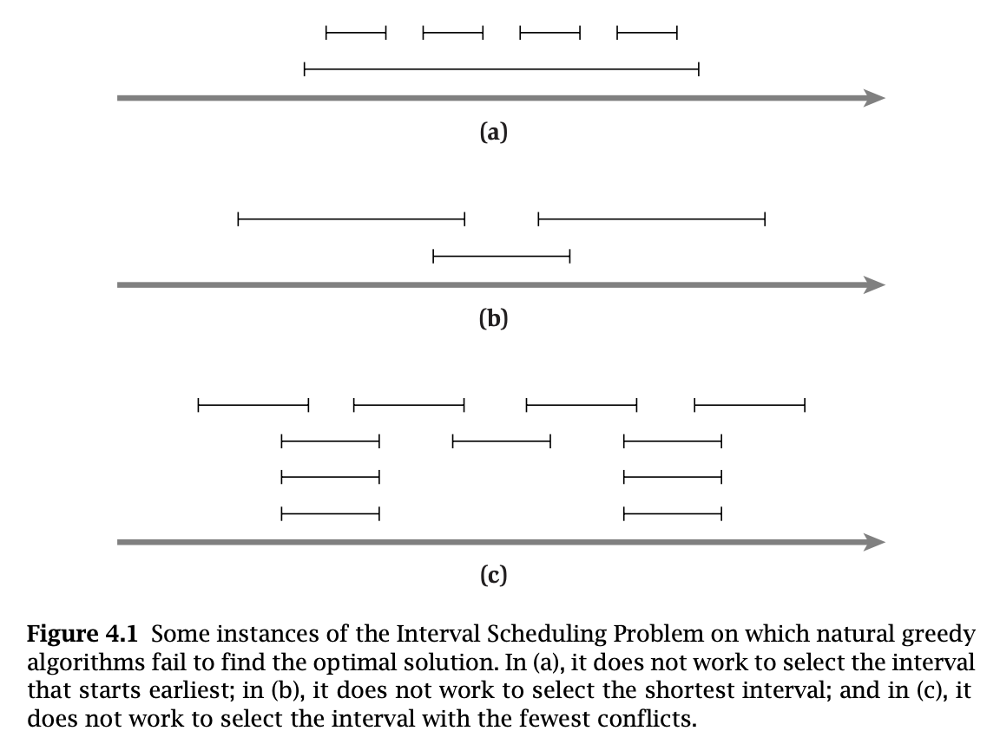
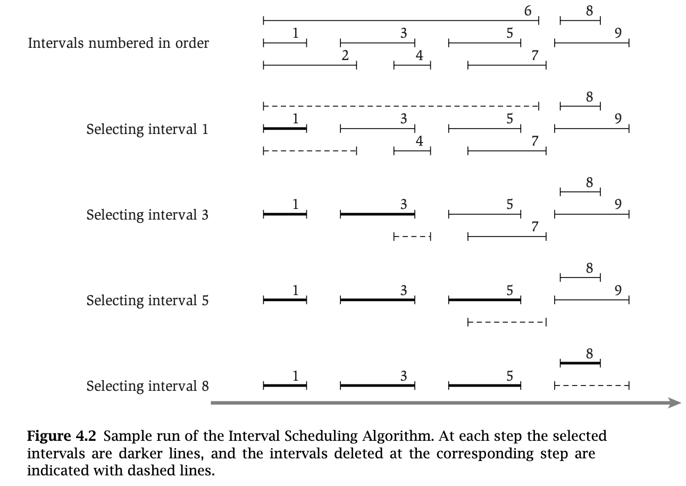
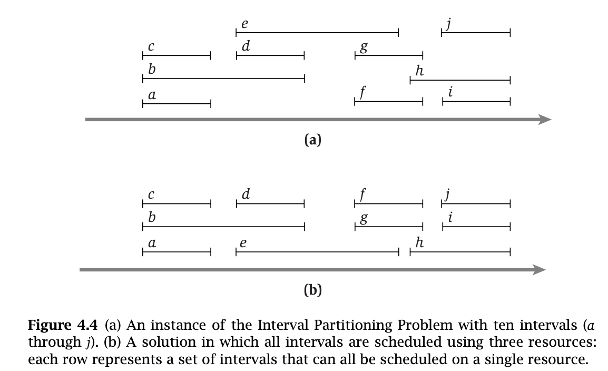
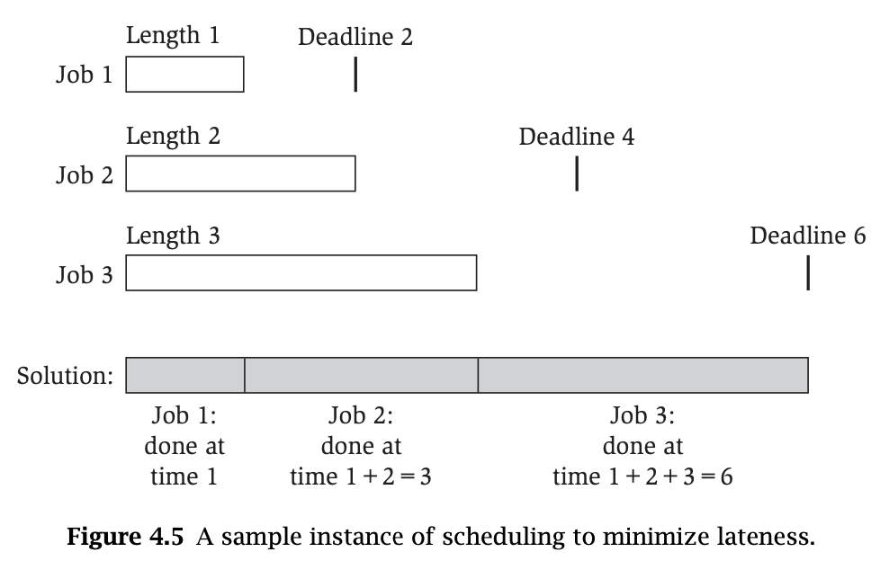
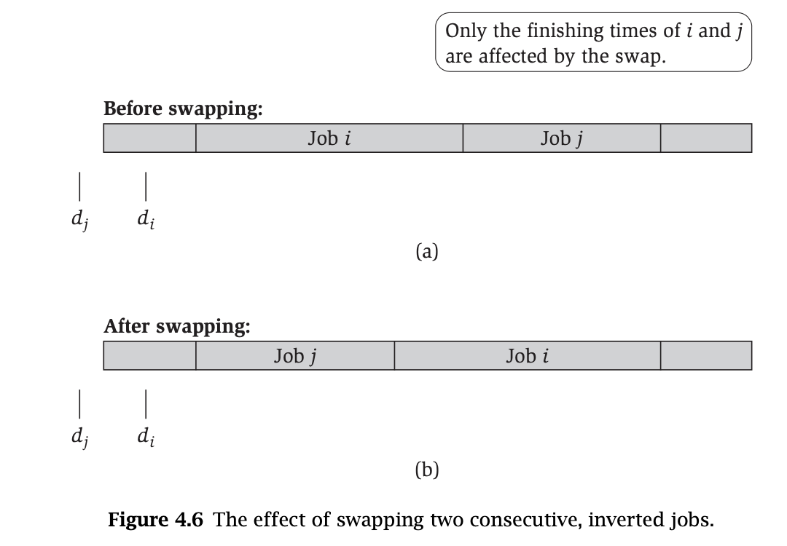
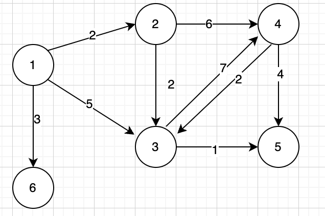

```toc
```
本章首先阐明两个基本的方法来证明一个贪心算法对问题提供一个最优解。第一个方法可以看作是建立*贪心算法领先* 的概念。这里的含义是如果一个人以一步接一步的方式测量贪心算法的进展时，他会看到在每一步做得都比其他的算法好。从而证明产生了一个最优解。第二个方法被称为*交换论证*，它是更一般化：考虑对这个问题的任何可能的解，逐渐把它转换成由贪心算法找到的解且不损害它的质量。从而也证明了贪心法一定能找到一个至少与任何其他解一样好的解。

后续将专注于贪心算法的几个最著名的应用：图中的最短路径，最小生成树问题，以及为实现数据压缩构造 Huffman 码。最后要有一个更复杂的应用，最小费用有向树问题，它将把什么事贪心算法的概念进一步推广。

## 1. 区间调度-贪心算法领先

回顾一下区间调度问题，有一组需求 $\{1,2,\dots,n\}$，第 $i$ 个需求与一个始于 $s(i)$ 且止于 $f(i)$ 的时间区间相对应。如果没有两个需求在时间上重叠，就说需求的子集是相容的，我们的目标是找到一个最大的相容子集，也叫最优子集。

区间调度的贪心算法中国呢的基本思想就是使用一个简单的规则来选择第一个需求 $i_1$，一旦一个需求 $i_1$ 被接受，那么拒绝所有与 $i_1$ 不相容的需求，然后选择下一个被接受的需求 $i_2$，并且再次拒绝所有与 $i_2$ 不相容的需求，以此类推。这里最大的挑战是决定用哪个简单的规则来选择，这里有许多自然但给不出好的解释的规则。

* 最明显的规则可能总是选择最早开始的有效需求——即一个具有最小开始时间 $s(i)$ 的需求。按这种方式能尽早的开始使用我们的资源。这个方法不能得到最优解。如果最早需求 $i$ 是关于一个酣畅时间区间的，那么接受了需求 $i$，我们可能要拒绝一大批对于较短时间区间的需求。**我们的目标是满足尽可能多的需求**，我们将以一个不是最理想的解结束。在真的坏的情况——比如说，当结束时间 $f(i)$ 是所有需求中最大的——所接受的需求 $i$ 将使我们的资源这个那个时间都被它占用。在这种情况下我们的贪心法只接受一个需求，而最优解可能接受许多需求，如图 (a)。

* 这可能建议我们应该从接受最小时间区间的需求开始——即 $f(i)-s(i)$ 尽可能小的需求。结果是，某种情况下这是比前一个规则好一点的规则，但是它仍旧可能产生一个不是最理想的调度。如图 (b)，在中间接受一个最短的区间将阻止我们接受其他构成最优解的两个区间。

* 在前一个贪心规则中，我们的问题是第二个需求与第一和第三个需求都竞争——即接受这个需求使得我们拒绝了其他两个的需求。我们可以基于下面的思想来设计一个贪心算法：对每个需求，我们计算其他不相容的需求个数，并且接受有着最少不相容个数的需求。这个贪心选择在前一个例子将得到最优解。为这个规则找一个坏的例子有难度，但是是可以做到的，如图 (c)。



一个导致最优解的贪心规则是基于第四个思想：**接受最早结束的需求**，即 $f(i)$ 尽可能的小的需求 $i$ 为第一个需求。这是一个比较自然的想法：当能够满足一个需求时，保证资源尽可能早地被释放。

举例说明，使用 $R$ 表示既没有接受也没有拒绝的需求的集合，用 $A$ 表示被接受的需求集合。如下图



基本算法如下
>初始令 $R$ 是所有需求的集合，设 $A$ 为空
>while $R$ 不为空
>	选择一个有最小结束时间的需求 $i \in R$
>	把 $i$ 加到 $A$ 中
>	从 $R$ 中删除与需求 $i$ 不相容的所有需求
>end while
>返回集合 $A$ 作为被接受的需求集合

*命题*
> $A$ 是一个相容的需求集。

$A$ 是一个相容的需求集显而易见，终点在于需要证明这是一个最优解。为了便于比较，令 $O$ 是一个最优解的区间集合，理想的是证明 $A=O$，但是这太难了，我们可以证明：可能存在许多最优解，$A$ 是其中一个，即 $|A|=|O|$，即 $A$ 和 $O$ 包含同样的区间个数，也是其中一个最优解。

这里证明的主要思想就是：贪心法"领先"于这个解 $O$。也就是贪心法计算的每一步都"领先"于 $O$。设 $i_1, i_2,\dots,i_k$ 是 $A$ 中的需求，并按照其加入到 $A$ 到次序排列。$|A|=k$。设 $O$ 中的需求是 $j_1, j_2,\dots,j_m$，于是证明目标就是证明 $k=m$。

上面的贪心法保证了 $f (i_1)\leq f(j_1)$，这就是说贪心法第一步"领先"了。那后面的每一步是不是都"领先"呢？

*命题*
>对所有的指标 $r\leq k$，有 $f (i_r)\leq f(j_r)$。

这里采用归纳法进行证明。
对于 $r=1$，有 $f (i_1)\leq f(j_1)$。
假设 $r-1$ 时，有 $f (i_{r-1})\leq f(j_{r-1})$。注意：$f$ 表示起始时间，$s$ 表示结束时间。于是 $f (i_{r-1})\leq f (j_{r-1}) < s(j_{r-1}) \leq f(j_{r})$。这就说明，当贪心法计算到任务 $i_{r-1}$ 时，是可以选择任务 $j_r$ 的，因为是相容的。所以就有 $f (i_r)\leq f(j_r)$。

*定理*
>贪心法返回一个最优的集合 $A$

这其实很好证明了，通过上面命题的证明，我们证明了贪心法每一步都“领先” $O$，如果 $O$ 中有比 $A$ 多的需求，那么 $A$ 是一定可以选择进来的。

**运行时间**
首先可以使用算法以 $O(nlog_n)$ 时间对 $n$ 个需求进行排序，然后每次选择第一个区间，于是使用 $O(n)$ 对时间构造一个数组 $S[1,2,\dots,n]$。


### 1.1 相关问题：调度所有的区间

上面的区间调度处理的问题是在一个给定的时间区间内，尽可能多的接受任务，也就是找到一个任务的最大相容子集。而考虑这样一个问题，任务是固定的，我们想使用尽可能少的资源满足所有的需求。如图所示，下面的任务使用三个资源就可以将所有任务安排。



如图所示，需求被分成了三行，每行代表一个资源，每行中的需求都是相容的。有没有可能只只用两个资源就能满足呢？这是不可能的，因为 $a,b,c$ 三个任务是不相容的，所以至少需要三个资源。

我们定义一个区间集合的**深度**是通过时间线上任何一点的最大区间数。

*命题*
>在任何区间划分的实例中，资源数必须至少是区间集合的深度。


**设计算法**

设 $d$ 是区间集合的深度，对每个区间分配一个标签，其中标签取自数集 $\{1,2,\dots,d\}$，并且有如下性质：重叠的区间必须使用不同的数作为标签。这其实就已经给出了所需要的解，因为完全可以将标签翻译成资源的名字。

*算法*
>对所有的任务区间，根据开始时间进行排序
>设 $I_1, I_2,\dots,I_n$ 表示排序后的任务区间
>for $j = 1, 2, \dots, n$
>	取一个任务 $I_j$，设其起初的标签集都是 $S_i=\{1,2,\dots,d\}$
>	for $i=1, 2,\dots,j-1$ 的任务 $I_i$
>		将所有与 $I_j$ 重叠的 $I_i$ 的标签都从 $S_i$ 中移除
>	end for
>	if $S_i$ 不为空
>		分配一个标签给 $I_j$
>	else
>		暂时不给 $I_j$ 分配标签 (如果 $d$ 足够，不会出现此种情况)
>	end if
>end for

这里其实一开始如果不清楚 $d$ 的取值，可以在程序执行过程中进行递增，然后补充到标签集合中。

*命题*
>如果我们使用上述贪心算法，每个区间将被分配一个标签，且没有两个重叠的区间接受同样的标签。

*定理*
>上述贪心算法使用与区间集合深度等量的资源为每个区间安排一个资源，这是所需资源的最优数量。


## 2. 最小延迟调度：一个交换论证

考虑下面情况，我们有单一资源和一组使用资源的 $n$ 个需求，每个需求需要在一个时间区间。假设资源在时刻 $s$ 开始有效。但是与前面的问题相反，每个需求 $i$ 现在更加灵活，不是开始时间和结束时间的限制，而是需求 $i$ 有一个截止时间 $d_i$，并且要求一个长为 $t_i$ 的连续时间区间，希望被安排在截止时间之前的任何时刻。每个被接受的需求必须被分配一个长为 $t_i$ 的时间区间，且不同的需求被分配在不重叠的区间。**注意：目标是找到一个总延迟时间最小的调度**。

假设我们计划满足每个需求，但是允许让某些需求延迟启动，把每个需求的执行时间设为 $[s(i),f(i)]$，其中 $f(i)=s(i)+t_i$。如果需求 $i$ 错过了截止时间（即 $f(i)>d_i$），就表示需求延迟了。需求 $i$ 的延迟定义为 $l_i=f(i)-d_i$。，如果需求没有被延迟，那么 $l_i=0$。于是我们的目标就是用不重叠的区间安排所有的需求，使得最大的延迟 $L=max_il_i$ 达到最小。如下图就是一个最大延迟为 0 的例子




### 设计算法

有几种自然的贪心方法，我们考虑任务的数据 $(t_i,d_i)$，并且按照某种简单的规则对它们排序
* 一种方法是把任务安长度 $t_i$ 增长的次序安排，使得短的任务尽快结束。这个方法完全忽略了任务的截止时间，可以通过一个坏的例子来证明不可行。如两个任务 $(1,100),(10,10)$。如果想达到延迟 $L$ 最小，那么第二个任务需要先开始。
* 在上面方法的建议下，我们可能考虑有效松弛时间 $d_i-t_i$ 非常小的任务——它们是哪种需要用最小延迟开始的任务。遗憾的是，这种方法也是不可行的。如有两个任务 $(1,2),(10,10)$，按照这种方法，第二个任务应该先开始执行，但是这显然无法使得 $L$ 最小。

其实，有一种方法是总能产生最优解的。那就是和最初的区间调度算法一样，按照结束时间 $d_i$ 增长次序排序，并且按照这个次序安排（即最早截止时间优先）。也就是 $d1\leq \dots \leq d_n$。任务 1 将在区间 $(s(1), f(1)=s(1)+t_1)$ 执行，任务 2 将在 $(s(2)=f(1),f(2)=s(2)+t_2)$ 区间执行，以此类推。

>按照截止时间进行排序，假定 $d1\leq \dots \leq d_n$
>初始， $f=s$
>按照这个次序考虑任务 $i=1, 2,\dots,n$
>	将任务 $i$ 安排在从 $s(i)=f$ 到 $f(i)=f+t_i$ 的时间区间
>	令 $f=f+t_i$
>end
>对 $i=1, 2,\dots,n$ 返回被安排的这组区间 $[s(i),f(i)]$


### 分析

首先算法产生的调度是没有"空隙"的，或者说没有空闲时间：存在任务要做，但是机器由于相关原因处于空闲状态。

*命题*
>存在一个没有空闲时间的最优调度

考虑一个最优调度 $O$，我们计划逐步修改 $O$，每步保持其最优性，但是最终把它转换成一个与贪心算法得到的调度 $A$ 相等的调度，这种方式也叫交换论证。首先明确一个概念，如果任务 $i,j$ 有截止时间为 $d_i,d_j$ 的两个任务，其中 $d_i>d_j$，也就是任务 $i$ 的截止时间在任务 $j$ 的后面，但是在调度的时候却被安排在了任务 $j$ 的前面，这样的调度 $A^{'}$ 我们说其有一个**逆序**。

*命题*
>所有没有逆序也没有空闲时间的调度有相同的最大延迟

*定理*
>存在一个既没有逆序也没有空闲时间的最优的调度

证明将由一系列论断构成
(a) 如果 $O$ 有一个逆序，那么存在一对任务 $i$ 和 $j$，使得 $j$ 被安排在 $i$ 的后面，并且 $d_i>d_j$。
现在让我们交换两个任务的顺序来减少其逆序。于是
(b) 在交互两个任务后，调度中较少了一个逆序的调度
(c) 这个新的被交换的调度的最大延迟不大于 $O$ 的最大延迟

很明显，如果证明了 (c)，那就完成了证明。初始调度 $O$ 最多可能有 $n \choose 2$ 个逆序。假定每个需求 $r$ 被安排在区间 $[s(r),f(r)]$ 并且延时为 $l_r^{'}$。设 $L^{'}=max_rl_r^{'}$ 表示最大延迟。令 $\overline{O}$ 表示被交换的调度，后面将使用 $\overline{s}(r), \overline{f}(r), \overline{l_r}, \overline{L}$ 表示相关的变量。




如图所示，两个任务在交换之前，任务 $i$ 的截止时间 $d_i$ 是大于任务 $j$ 的截止时间 $d_j$ 的。此时对两个任务进行交换，注意：这个交换对其他任务是没有影响的。于是 $\overline {l_i}=\overline{f}(i)-d_i=f(j)-d_i$。进而推导出 $\overline{l_i}=f(j)-d_i<f(j)-d_j=l_j^{'}$。也就是说调度 $O$ 对延迟 $L^{'} \geq l_j^{'}> \overline{l_i}$。这就证明了交换之后延迟时间并没有增加。

*定理*
>由这个贪心算法产生的调度 $A$ 有最优的最大延迟


## 3. 最优超高速缓存：一个更复杂的交换论证

### 问题

比如我们使用的电脑，存储包含 cpu 中的高速缓存，内存，硬盘。其容量依次增大，而访问速度却依次减小。我们希望能够最快的拿到所需要的数据，于是会将相关数据存入到缓存中，但是缓存容量有限，这就涉及到如何处理数据的存入与回收，这就是超高速缓存算法——一个快速存储器中存储少量数据以便减少与一个慢速存储器的交互而花费的时间。

站在抽象立场来看这个问题，考虑存储在主存中的 $n$ 块数据集合 $U$。有一个高速缓存，一次能保存 $k<n$ 块数据。如果这个缓存保存了一组 $k$ 项数据。从 $U$ 中取出一系列数据项 $D=d_1, d_2,\dots,d_m$ 提供给我们——这是需要处理的存储访问序列——在处理的时候需要决定在每个时刻哪 $k$ 项需要保存在缓存中。当需要项 $d_i$ 的时候，如果它已经在缓存中了，就可以非常快的访问到，否则，就需要将其存入到缓存中。若此时缓存满了，那么就需要回收某项来为 $d_i$ 腾出位置，这就叫**超高速缓存缺失**，我们希望尽可能的减少这种缺失。

举例说明：假设有三个项目 $\{a,b,c\}$，缓存大小是 $k=2$，访问数据的顺序是 $a,b,c,b,c,a,b$。若缓存初始包含 $a,b$，然后从第三项开始，可以回收 $a$ 然后放入 $c$。然后在第六项，可以回收 $c$ 然后放入 $a$。整个过程引起了两次缓存缺失。同时也可以断言任何调度至少包含两次缺失。

当然在实际操作条件下，超高速缓存维护算法并不知道将来需要什么数据。下面研究下，给定一个存储访问的完全序列，怎样的调度可以使得缓存缺失次数最少？

### 分析

在 20 世纪 60 年代，Les belady 证明了下面的简单规则将总是得到最小的缺失次数

>when $d_i$ 需要被放入超高速缓存
>	收回在最远的将来才被需要的那个项

这个叫做**最远将来算法**。当到了回收某个项的时候，检查下下一次在超高速缓存中将被访问的每一项，并且选出最迟的那一项。这是一个非常自然的算法，考虑下面序列：
$$序列:a(1),b(2),c(3),d(4),a(5),d(6),e(7),a(8),d(9),b(10),c(11)$$

这里 $k=3$，初始缓存中的项是 $\{a,b,c\}$。最远将来将产生一个调度 $S$，将在第四步回收 $c$ 并且在第七步回收 $b$。存在另一个回收调度 $S^{'}$，它刚好是同样的好，其在第四步回收 $b$ 并且在第七步回收 $c$，这样和 $S$ 有同样的缺失次数。所以我们发现，可能不用最远将来规则也可以产生最优的调度。

实际上，第四步回收 $b$ 或者 $c$ 其实是无关紧要的，因为第四步回收其中一个，另外一个在第七步也会回收。于是，给定一个调度，其中 $b$ 被先回收，我们可以不增加缺失次数交换对 $b$ 和 $c$ 的选择，这种把一个决定换成另外一个构成了证明最远将来规则最优性的交换论证对第一个要点。

在进一步分析之前，这里说明一件重要的事情。如果在第 $i$ 步有对 $d$ 对需求，并可此时 $d$ 不在缓存中，那么至今我们考虑的所有超高速缓存维护算法读产生在第 $i$ 步向缓存中放入项 $d$ 的调度。这种调度叫做**简化的**——它做最少的给定步所必须的工作。但是可能存在一种并非产生简化调度的算法，它可能在某些步中放入一些非必需的项，可能缺失次数并不比简化调度多。那这里就需要证明对每个非简化的调度存在一个同样好的简化调度。

设 $S$ 可能不是一个简化调度，定义一个新的调度 $\overline S$ —— $S$ 的简化。在任何一步 $i$，$S$ 放入一个非必需的项 $d$，而 $\overline S$ "假装"做这件事，实际上把 $d$ 留在主存中，仅当在这后的下一个需要 $d$ 的步 $j$，它再将 $d$ 放入缓存中。于是 $\overline S$ 在步 $j$ 产生的缓存缺失可以被算作 $S$ 在步 $i$ 执行的更早的超高速缓存操作。

*命题*
> $\overline S$ 是一个与 $S$ 放入至多一样多个项的简化调度

也就是说 $\overline S$ 的放入操作次数最多与 $S$ 相等。而且注意到，对任何简化调度，放入项的次数恰好就是缺失的次数。

**证明最远将来规则的最优性**
考虑任意一个存储访问序列 $D$，令 $S_{FF}$ 表示最远将来规则产生的调度，$S^*$ 表示一个产生最小缺失次数的调度。现在逐渐把调度 $S^*$ "转换"成调度 $S_{FF}$，一次转换一个回收决定，并且不增加缺失次数。

*定理*
>对于某个数 $j$，令 $S$ 是在序列中的前 $j$ 项与 $S_{FF}$ 做同样回收决定的简化调度。那么存在一个在序列中的前 $j+1$ 项与 $S_{FF}$ 做同样回收决定的简化调度 $S^{'}$，并且 $S^{'}$ 不比 $S$ 产生更多的缺失。

**证**
考虑第 $j+1$ 步，项 $d=d_{j+1}$。因为 $S$ 与 $S_{FF}$ 一直到这一点之前都是一致的，它们有同样的超高速缓存内容。此时如果 $d$ 已经在缓存中，那么不需要回收，于是到 $j+1$ 步，$S$ 与 $S_{FF}$ 是一致的，即 $S=S^{'}$。如果 $d$ 不在缓存中，那么其实 $S,S_{FF}$ 都需要回收某个项，都需要进行回收操作，于是 $S=S^{'}$ 还是成立的。

但是回收的项可能不同，设 $S$ 在 $j+1$ 步回收了项 $f$ 而 $S_{FF}$ 回收了 $e\neq f$，于是到 $j+1$ 步后 $S$ 和 $S_{FF}$ 已经不再一致了，因为 $S$ 有 $e$ 在缓存中，而 $S_{FF}$ 有 $f$ 在缓存中。那为了让 $S=S^{'}$ 应该怎么做呢？

那第一步肯定就是让 $S^{'}$ 回收 $e$ 而不是 $f$（因为前 $j+1$ 项 $S^{'}$ 需要和 $S_{FF}$ 一致）。同时还需要保证 $S^{'}$ 不会比 $S$ 产生更多的缺失。到 $j+1$ 步为止，如果能保证剩余步骤 $S^{'}$ 和 $S$ 一致，即可证明 $S=S^{'}$。于是在 $j+1$ 步有两种情况：

(i) 存在一个对于项 $g\neq e,f$ 的需求，且不在 $S,S^{'}$ 中，那让 $S$ 回收 $e$，而 $S^{'}$ 回收 $f$ 即可得到 $S=S^{'}$。
(ii) 存在一个需求 $f$，$S$ 回收了项 $e^{'}$。
* 如果 $e^{'} = e$，那此时 $S^{'}$ 可直接访问 $f$，于是 $S^{'}$ 相比 $S$ 并没有增加缺失次数，并且在这之后 $S,S^{'}$ 的超高速缓存是相同的。
* 如果 $e^{'}\neq e$，那么 $S,S^{'}$ 都需要回收一次，这也使得 $S,S^{'}$ 有相同的超高速缓存。但是此时 $S^{'}$ 放入了一个非必需的项，不再是一个简化调度，但是根据上面命题，是可以将 $S^{'}$ 转换成一个项数相同的简化调度的 $\overline {S^{'}}$。
于是得证。

*定理*
> $S_{FF}$ 比任何其他的调度 $S^*$ 不产生更多的缺失，因此是最优的

但是现实的情况是，一般我们并不知道需求的访问顺序，经验上，在这种情况下最好的高速缓存算法似乎是另一种最近最少使用原则 (LRU)，这个原则建议从超高速缓存中回收最久以前被访问的项。这个后续章节再进行说明。


## 4. 一个图的最短路径-Dijkstra 算法

图常常用于对网络的建模，在网络中从一个点到另一个点到旅行——经过交叉点沿一系列公路点旅行，或者经中介路由器沿一系列通信链路点旅行。因此，一个基本的算法问题就是确定图中结点之间的最短路径。我们可以把它作为一个点到点的问题来问：给定结点 $u,v$，什么是最短的 $u-v$ 路径？或者说给定一个开始结点 $s$，什么是从 $s$ 到其他结点的最短路径？

最短路径问题的具体结果如下：给定有向图 $G=(V,E)$，以及一个指定的开始结点 $s$。假设 $s$ 有一条路径通向 $G$ 中的每个其他结点。每条边 $e$ 有一个长度 $l_e\geq 0$，表示在 $e$ 上旅行用的时间（或者距离，费用）。对于路径 $P$，$P$ 的长度 $l(P)$ 是 $P$ 中所有边的长度之和。当然这种是针对有向图的，不过对于无向图，只是将之前的一条边换成两条即可。

### 算法设计

1959 年，Edsger Dijkstra 提出了一个非常简单的贪心算法来求解单源最短路径问题。这个算法只是确定从 $s$ 到图的每个其他结点的最短路径的长度。维护一个结点 $u$ 的集合 $S$，对于这些结点，我们已经确定了其到起点 $s$ 的最短距离 $d(u)$。也就是说这些结点已经被访问过了。初始的时候 $S=\{s\},d(s)=0$。然后对于剩下的未访问过的结点 $v\in V$，找到一条到 $s$ 到最短路径。其实就是计算 $(u,v)$ 的距离，因为结点 $u$ 到 $s$ 的距离是已经知道了的。然后将每次访问的结点 $v$ 从集合 $V$ 中移动到集合 $S$ 中。当然初始情况下，如果结点 $v$ 和 $s$ 不相邻，那么其距离是 $\infty$。也就是 $d^{'}=min_{e=(u, v):u\in S}d (u) + l_e$。然后我们选择某个使得这个值最小的结点 $v$ 继续往后面探查访问，并更新结点到 $s$ 的距离。下面举例说明


这里以 $D$ 作为起点。

第一步：$d (D)=0, d (C)=3, d (E)=4, d (other)=\infty$，此时 $S=\{C,D,E\},d(D)=0,d(C)=3,d(E)=4$，$V={A, B, F, G}, d (any)=\infty$。此时 $d(C)=3$ 是最小的距离，下一步以此结点为基准进行探查。

第二步：$d (D)=0, d (C)=3, d (E)=4$，然后计算之后得到 $d (B)=10+d (C)=13, d (F)=6+d (c)=9$，而 $d^{'}=min(5+d(C)=8, d(E))=4$。最终 $$d(D)=0,d(C)=3,d(E)=4,d(F)=9,d(B)=13,d(other)=\infty$$，然后更新相关集合 $$S=\{C,D,E\},d(D)=0,d(C)=3,d(E)=4,d(B)=13,d(F)=9, V=\{A,G\}, d(any)=\infty$$。

第三步：$$S=\{B,C,D,E,F,G\},d(G)=12, V=\{A\}$$，此时与 $E$ 相邻的有 $F,G$，于是 $d (F)=2+4=6, d(G)=8+4=12$。最终结果就是 $d (D)=0, d (C)=3, d (E)=4, d (B)=13, d (F)=6, d (G)=12, d (A)=\infty$

第四步: 在第三步中 $d(F)$ 是最小的 (注意：$E$ 结点在第二步已经探查过了)，此时与 $F$ 相邻的有 $A,B,G$，计算后 $d (B)=6+7=13, d(A)=6+16=22,d(G)=9+6=13$。然后比较大小后最终结果就是 $$d(D)=0,d(C)=3,d(E)=4,d(B)=13,d(F)=6,d(G)=12,d(A)=22$$
第五步：上一步中 $A,B,G$ 三个结点中 $d(G)$ 是最小的，此时只有 $A$ 与之相邻。计算后最终结果就是 $$d(D)=0,d(C)=3,d(E)=4,d(B)=13,d(F)=6,d(G)=12,d(A)=22$$。于是就计算出了起点到每个结点的最短路径长度。可以看到此算法其实就是一种宽度优先搜索算法。


基本算法如下:
>Dijkstra 算法 $(G, l)$
>设 $S$ 是被探查到结点的集合，$V$ 是未探访过的结点集合
>	对每个 $u\in S$，存储一个距离 $d(u)$
>初始 $S=\{s\},d(s)=0$
>while $S \neq V$
>	选择一个结点 $v\notin S$ 使得从 $S$ 到 $v$ 至少有一条边并且 $d^{'}=min_{e=(u, v): u\in S}d (u) + l_e$ 最小
>	将 $v$ 加入到 $S$ 并且定义 $d(v)=d^{'}(v)$
>end while


**证明**

*定理*
>考虑在算法执行中任意一点的集合 $S$，对每个 $u\in S$，路径 $P_u$ 是最短的 $s-u$ 路径

下面使用归纳法进行证明。

首先 $|S|=1$ 是容易证明的，因为此时 $S=\{s\},d(s)=0$。
假设对某个 $k\geq 1$，当 $|S|=k$ 时命题正确，下面加入结点 $v$ 使得 $S$ 大小增加到 $k+1$。令 $(u,v)$ 是 $s-v$ 路径上的最后一条边。根据假设 $P_v$ 是对某个结点 $u\in S$ 的最短 $s-u$ 路径。现在考虑任意其他的 $s-v$ 路径 $P$。为了到达结点 $v$，这条路径一定在某个地方离开了集合 $S$, 设 $y$ 是在 $P$ 上但不在 $S$ 中的第一个结点，且设 $x\in S$ 是紧接在 $y$ 前面的结点。如图所示


证明的关键就是 $P$ 不可能比 $P_v$ 短。其实在 $P$ 离开 $S$ 时就至少已经与 $P_v$ 一样长了，因为在将 $v$ 加入到 $S$ 中时一定也考虑过通过 $(x,y)$ 将 $y$ 加入到 $S$ 中，只是其长度大于 $P_v$ 才放弃的，所以很容易得证。更数学化的证明如下：
令 $P^{'}$ 表示从 $s$ 到 $x$ 的子路径。因为 $x\in S$，于是知道 $P(x)$ 是最短的 $s-x$ 路径（长度为 $d(x)$），且因此 $l (P^{'}) \geq l(P_x)=d(x)$。于是 $P$ 到结点 $y$ 的子路径有长度 $l (P^{'})+l (x, y)\geq d (x)+l (x, y)\geq d^{'}(y)$。然后根据算法我们知道最终选择了 $v$，于是 $d^{'}(y)\geq d^{'}(v)=l(P_v)$。推导出 $l (P)\geq l (P^{'})+l (x, y)\geq l(P_v)$。

这里要考虑一个问题，就是如果某些边可以取负值时，算法不一定总能找到对短路径。这需要用到更为复杂的算法——Bellman 和 Ford 算法，这属于动态规划算法范畴。如果某些边可以取负值，那么上面证明中 $l (P^{'})+l (x, y)\geq d (x)+l (x, y)\geq d^{'}(y)$ 就不再成立了。

### 实现


网上找了几种实现，分别是邻接矩阵的实现、邻接表实现和优先队列实现，如下
```java
/**  
 * 邻接矩阵/邻接表实现  
 **/
 public class Dijkstra1 {  
  
    /**  
     * 邻接矩阵实现  
     *  
     * @param graph 图-邻接矩阵  
     * @param s     起点  
     */  
    public void dijkstra(int[][] graph, int s) {  
        int n = graph.length;  
  
        // dist[i]表示原点到结点i的最短路径长度  
        int[] dist = new int[n];  
        Arrays.fill(dist, Integer.MAX_VALUE);  
  
        // 如果visited[i]=true，说明结点i已经加入到了S集合，否则V-S集合  
        boolean[] visited = new boolean[n];  
        Arrays.fill(visited, false);  
  
        dist[s] = 0;  
        for (int i = 0; i < n; i++) {  
            int minIdx = -1;// 最短路径的index  
            int minDist = Integer.MAX_VALUE;//最短路径的值  
  
            // 找到最短路径结点  
            for (int j = 0; j < n; j++) {  
                if (!visited[j] && dist[j] < minDist) {  
                    minIdx = j;  
                    minDist = dist[j];  
                }  
            }  
  
            // 没有找到最小的，说明剩下的结点和s不连通  
            if (minIdx == -1) {  
                return;  
            }  
            // 标记为已访问  
            visited[minIdx] = true;  
  
            for (int v = 0; v < n; v++) {  
                // 如果v未访问 且 minIdx能到达v 且 以minIdx为中介点可以使得dist[v]更优，则更新  
                if (!visited[v] && graph[minIdx][v] != Integer.MAX_VALUE &&  
                    dist[minIdx] + graph[minIdx][v] < dist[v]) {  
                    dist[v] = dist[minIdx] + graph[minIdx][v];  
                }  
            }  
        }  
    }  
  
    /**  
     * 邻接表实现  
     *  
     * @param graph 图-邻接矩阵  
     * @param s     起点  
     */  
    public void dijkstra(List<Node[]> graph, int s) {  
        int n = graph.size();  
  
        // dist[i]表示原点到结点i的最短路径长度  
        int[] dist = new int[n];  
        Arrays.fill(dist, Integer.MAX_VALUE);  
  
        // 如果visited[i]=true，说明结点i已经加入到了S集合，否则V-S集合  
        boolean[] visited = new boolean[n];  
        Arrays.fill(visited, false);  
  
        dist[s] = 0;  
  
        for (int i = 0; i < n; i++) {  
            int minIdx = -1;// 最短路径的index  
            int minDist = Integer.MAX_VALUE;//最短路径的值  
  
            // 找到最短路径结点  
            for (int j = 0; j < n; j++) {  
                if (!visited[j] && dist[j] < minDist) {  
                    minIdx = j;  
                    minDist = dist[j];  
                }  
            }  
  
            // 没有找到最小的，说明剩下的结点和s不连通  
            if (minIdx == -1) {  
                return;  
            }  
            // 标记为已访问  
            visited[minIdx] = true;  
  
            // 只有下面才与邻接矩阵实现是不同的  
            for (int j = 0; j < graph.get(minIdx).length; j++) {  
                int v = graph.get(minIdx)[j].v;  
                if (!visited[v] && dist[minIdx] + graph.get(minIdx)[j].dist < dist[v]) {  
                    dist[v] = dist[minIdx] + graph.get(minIdx)[j].dist;  
                }  
            }  
        }  
    }  
  
    public static class Node {  
  
        int v;  
        int dist;  
    }  
}
```
这里按照网上的说法，邻接矩阵是现实时，主要是外层循环为 $O(n)$ 与内层循环（寻找最小的 $dist[minIdx]$ 需要 $O (n)$、枚举 $v$ 需要 $O(n)$ 产生)，总复杂度为 $O(n*(n+n))=O(n^2)$。然后邻接表与之有细微差别，主要是内层循环中的枚举 $v$ 不同，为 $O(m)$，于是复杂度变成为了 $O(n^2+m)$。然后寻找最小的 $dist[minIdx]$ 的耗时可以通过使用优先队列来降低，其负责度为 $O(log_{2}n)$，总复杂度为 $O(nlog_{2}n + m)$。这里我们把内层循环的两个操作分别叫做"查找最小结点"和"松弛操作"。

但是很奇怪的是，为什么每次都需要查找最小的 $dist[minIdx]$ 呢？为什么每次循环不用一个变量记录下来呢？举例来说，按照上面那个图来说


第一次 $dist[minIdx]=dist[D]=0$，于是计算，得到 $dist[C]=3, dist[E]=4$，于是此次循环中 $minIdx=C,dist[minIdx]=3$，那为什么不把这个值记录下来用于下次循环，根本不需要每次去查找，于是查找 $dist[minIdx]$ 的复杂度就是 $O(1)$，整体复杂度就变成了 $O(n+m)$ 了，实现如下


```java
package datastructure;  
  
import java.util.ArrayList;  
import java.util.Arrays;  
import java.util.List;  
import java.util.stream.Collectors;  
  
/**  
 * Dijkstra算法  
 *  
 **/
 public class Dijkstra {  
  
    public static void main(String[] args) {  
        Dijkstra d = new Dijkstra();  
        Graph graph = d.createGraph();  
        Integer[] resultS = d.dijkstra(graph, 3);  
        String result = "";  
        for (int i = 0; i < resultS.length; i++) {  
            result = result + graph.points.get(i) + ":[" + resultS[i] + "],";  
        }        System.out.println(result.substring(0, result.length() - 1));  
    }  
  
    /**  
     * 算法  
     * @param graph 图-邻接表  
     * @param sIdx 起点在图中的位置  
     */  
    public Integer[] dijkstra(Graph graph, int sIdx) {  
  
        int len = graph.adjList.size();  
  
        // 结果集，[结点编号,到起点的距离]  
        Integer[] dist = new Integer[len];  
        Arrays.fill(dist, Integer.MAX_VALUE);  
        dist[sIdx] = 0;  
  
        List<Integer> path = new ArrayList<>();  
  
        // 记录每次迭代最小路径结点  
        int minIdx = sIdx;  
  
        for (int i = 1; i < len; i++) {  
            int basePathValue = dist[minIdx];  
            // 每次将上次最小的路径结点存入到已探访过的集合中  
            path.add(minIdx);  
            // 每个结点的最小路径值需要重置  
            int minValue = Integer.MAX_VALUE;  
            // 获取结点的边信息  
            Integer[][] curNodes = graph.adjList.get(minIdx);  
            for (Integer[] curNode : curNodes) {  
                Integer nodeIdx = curNode[0];  
                if (path.contains(nodeIdx)) {  
                    // 已探查访问过的结点不再计算  
                    continue;  
                }  
                Integer pathValue = curNode[1];  
  
                // 更新当前结点距离起点的信息  
                pathValue += basePathValue;  
                pathValue = dist[nodeIdx] > pathValue ? pathValue : dist[nodeIdx];  
                dist[nodeIdx] = pathValue;  
  
                if (minValue > pathValue) {  
                    minIdx = nodeIdx;  
                    minValue = pathValue;  
                }  
            }  
        }  
        System.out.println(path.stream()  
            .map(e->graph.points.get(e))  
            .collect(Collectors.joining(",")));  
        return dist;  
    }  
  
    public Graph createGraph() {  
        /*  
         A   [1(B),12],[5(F),16],[6(G),14]         
         B   [0(A),12],[2(C),10],[5(F),7]         
         C   [1(B),10],[3(D),3],[4(E),5],[5(F),6]         
         D   [2(C),3],[4(E),4]         
         E   [2(C),5],[3(D),4],[5(F),2],[6(G),8]         
         F   [0(A),16],[1(B),7],[2(C),6],[4(E),2],[6(G),9] 
         G   [0(A),14],[4(E),8],[5(F),9]         
         */        
        Integer[][] a = new Integer[][]{{1,12},{5,16},{6,14}};  
        Integer[][] b = new Integer[][]{{0,12},{2,10},{5,7}};  
        Integer[][] c = new Integer[][]{{1,10},{3,3},{4,5},{5,6}};  
        Integer[][] d = new Integer[][]{{2,3},{4,4}};  
        Integer[][] e = new Integer[][]{{2,5},{3,4},{5,2},{6,8}};  
        Integer[][] f = new Integer[][]{{0,16},{1,7},{2,6},{4,2},{6,9}};  
        Integer[][] g = new Integer[][]{{0,14},{4,8},{5,9}};  
  
        List<Integer[][]> adjList = Arrays.asList(a,b,c,d,e,f,g);  
        List<String> points = Arrays.asList("A", "B", "C", "D","E", "F", "G");  
  
        Graph graph = new Graph();  
        graph.adjList = adjList;  
        graph.points = points;  
        return graph;  
    }  
  
    public static class Graph {  
        // 邻接表  
        List<Integer[][]> adjList;  
        // 结点集合，注意和矩阵有对应关系，这里主要是为了表示结点名字，便于输出后检查  
        List<String> points;  
    }  
}
```

输出：
>D, C, E, F, G, A
>A:[22], B:[13], C:[3], D:[0], E:[4], F:[6], G:[12]

这里采用 BFS 算法实现（使用的是邻接表），这里时间复杂度应该是 $O(n+m)$。
这个实现的复杂度感觉更低。这是最初自己的想法，但是这种方法有个漏洞，也就是每次松弛的过程中我们确实可以找到最短路径结点，但是这些节点只限于本次松弛计算的结点，而可能漏掉了非本次松弛计算的结点。




如上图，原点为 $v(1)$，进行松弛，于是 $v(2)=2,v(3)=5,v(6)=3$，于是下一轮以结点 $v(2)$ 进行松弛，计算得到 $v(3)=4,v(4)=8$，但是此时使用我们的方法则会选择下一次松弛的结点为 $v(3)$，而其实应该以 $v(6)$ 进行松弛，因为此结点才是最短路径。

同时此算法针对有负权值边的情况是有漏洞的，如果存在这种情况，就需要用到 Floyd 算法了。

## 5. 最小生成树问题

假设有结点集合 $V=\{v_1,v_2,\dots,v_n\}$，我们想在顶部建立一个通信网络，网络应该是连通的——在每对结点之间应该有一条路径——但是要服从这个需求，我们希望尽可能便宜的建立它。

对于确定的对 $(v_i,v_j)$ 可能以某个费用 $c (v_i, v_j)>0$ 建立两个结点之间的连接，于是可以使用一个图 $G=(V,E)$ 来表示可能被建立的连接集合。与每条边 $e=(v_i,v_j)$ 相关的有一个正的费用 $c_e$。问题就是找到一个边的子集 $t\subseteq E$ 使得图 $(V,T)$ 是连通的，且总费用最小。

命题
>令 $T$ 是上述定义的网络设计问题的最小费用解，那么 $(V,T)$ 是一棵树

证明：根据定义，$(V,T)$ 是连通的，我们需要证明其不包含圈。假设包含一个圈 $C$，且令任意边 $e\in C$。我们断言 $(V,T-\{e\})$ 仍然是连通的，因为之前使用这条边的任何路径现在可以改为沿着圈 $C$ 剩下的部分绕行，同时由于不存在圈，$(V,T-\{e\})$ 花费更少，这就与命题中"最小费用"相冲突了。

如果允许某些边的费用为 0，那么对网络设计问题的最小费用的解可能有额外的边——有 0 费用并且能够随意被删除的边，但是即使在这种情况下，总会有一个最小费用的解是一棵树。我们可以从任何一个最优解开始，继续删除在圈 $C$ 上的边直到得到一棵树。由于边是非负的，总费用则不会增加。

如果 $(V,T)$ 是一棵树，我们把子集 $T\subseteq E$ 叫做图 $G$ 的一棵生成树。网络设计问题的目标可以被改述为找图的最便宜的生成树，于是这个问题也叫**最小生成树问题**。


### 设计

这里有三个贪心算法，其中每一个都能正确找到一棵最小生成树
- Kruskal 算法：初始根本没有任何边，按照费用递增次序通过不断插入来自 $E$ 中的边来建立一棵生成树。每次把 $e$ 加入到已经插入的边中间，只要不构成圈，就继续下去。
- Prim 算法：这个算法可以模拟 Dijkstra 的路径算法来设计，尽管事实上对它来说要更简单。从根节点 $s$ 开始，试图从 $s$ 向外贪心的增长一棵树。在每一步，仅仅加入一个结点使得它尽可能便宜地连接到这颗树的已有部分。更具体地说，维持一个集合 $S\subseteq V$，初始，$S=\{s\}$，每次迭代在 $S$ 中插入一个结点，把结点 $v$ 加入到 $S$ 能使得"附加费用"$min_{e=(u,v):u\in S}c_e$ 达到最小，并且包含来在生成树中达到这个最小值的边 $e=(u,v)$。
- 逆向删除算法：可以通过 Kruskal 算法"向后"倒序运行设计一个贪心算法。具体来说，我们从整个图 $(V,E)$ 开始，并且依照费用递减的次序开始删除边。当到达每条边 $e$ 时（从最贵的边开始），只要这样做不破坏当前图的连通性，就可以删除


