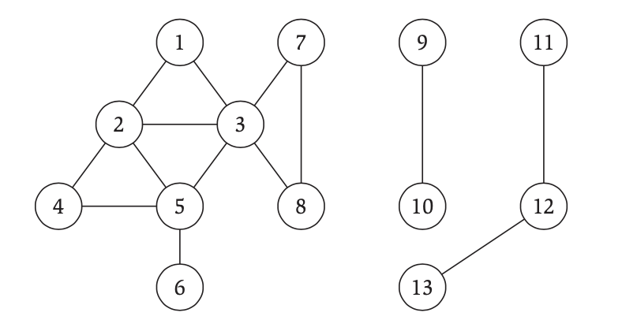
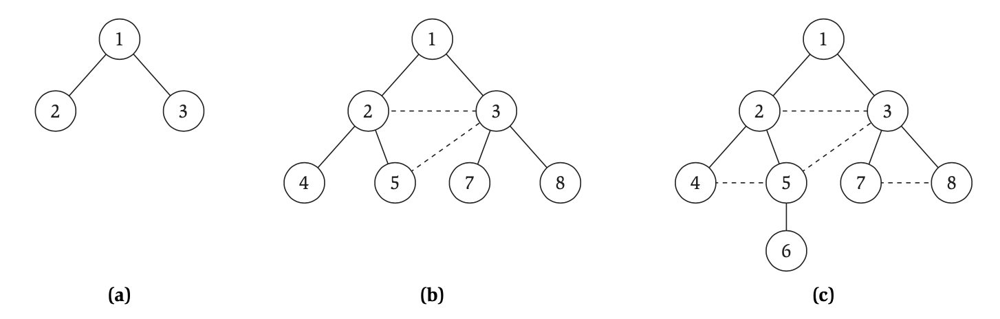
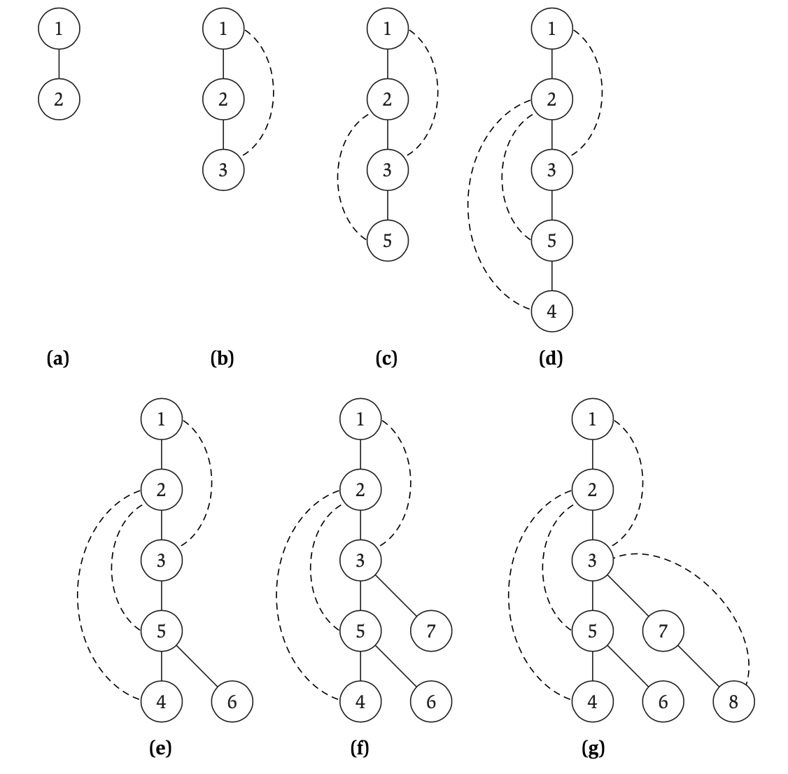
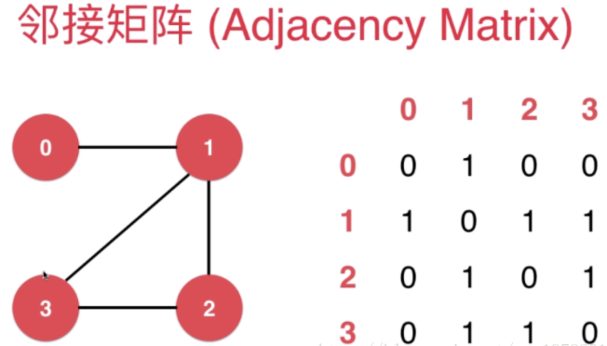
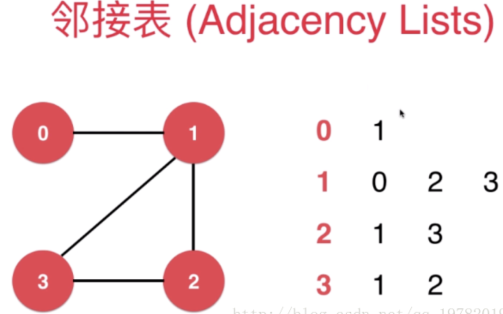
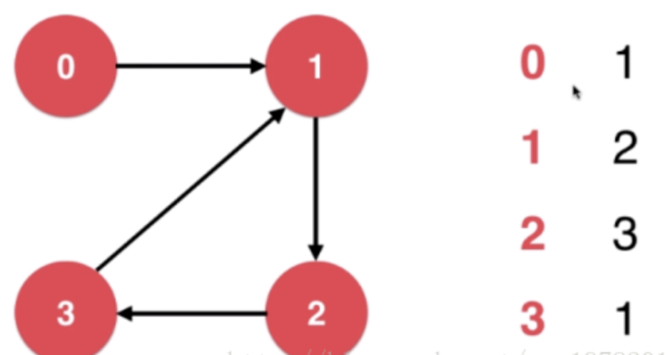
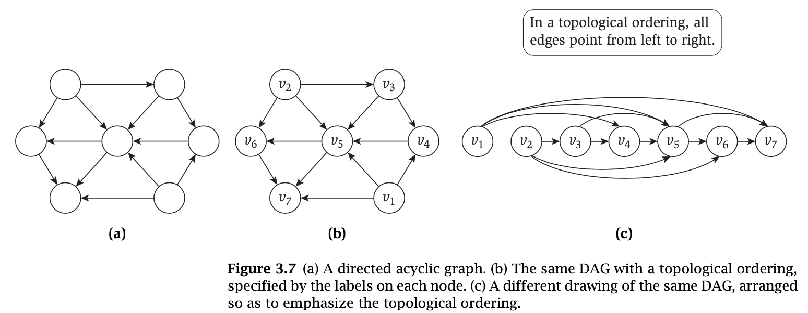

```toc
```

## 1. 基本定义与应用

图 $G$ 由结点集合 $V$ 和边集合 $E$ 构成，其中每条边与两个结点"相交"。因此对某些 $u, v \in V$ ，我们把一条边 $e \in E$ 表示成 V 的一个二元子集： $e={u,v}$，我们称 $u$ 和 $v$ 是 $e$ 的端点。这里结点对 $(u, v)$ 构成了 $E$ 中的一条边，对于这条边我们同样可以说是由 $(v, u)$ 构成的，也就是说这个结点对是无序的，那么我们称这个图为*无向图*，否则如果 $E$ 中的边只能由 $(u, v)$ 构成一条有方向的边，那么称这个图为*有向图*。

### 1.2 路径的连通性

图的基本操作之一就是沿着一系列用边连通的结点旅行，于是，我们把无向图 $G=(V, E)$ 中的一条路径定义为具有下述性质的结点 $v_1, v_2,\dots, v_{k-1},v_k$ 的序列 $P$，其中每对连续的结点 $v_i,  v_{i+1}$ 被一条 $G$ 中的边相交。$P$ 常常被叫做从 $v_1$ 到 $v_k$ 的路径，或者 $v_1-v_k$ 的路径。

如果一条路径所有的结点都是互相不同的，那就说这个路径是简单的。而一个圈就是路径 $v_1, v_2,\dots, v_{k-1},v_k$，其中 $k>2$，前 $k-1$ 个结点都是不同的，且 $v_1=v_k$。

如果对每对结点 $u$ 和 $v$，存在一条从 $u$ 到 $v$ 的路径，那么就说一个无向图是连通的。怎样定义一个有向图的连通性呢？如果对每两个结点 $u$ 和 $v$，都存在一条 $u$ 到 $v$ 的路径和一条从 $v$ 到 $u$ 的路径，则有向图是强连通的。进一步，我们相知道是否存在一条短的路径。于是把两个结点 $u$ 与 $v$ 的距离定义为 $u-v$ 路径中最少的边数，我们可能想要知道最少的边数。

### 1.3 树

一个无向图如果是连通的，且不包含一个圈，那么它就是一棵树。

*命题*
>每棵 $n$ 个结点的数恰好有 $n-1$ 条边

*定理*
> 设 $G$ 是具有 $n$ 个结点的无向图。下面任意两个语句都可以退出第三个语句
> (i) $G$ 是连通的
> (ii) $G$ 不包含一个圈
> (iii) $G$ 有 $n-1$ 条边

## 2. 图的连通性与图的遍历

假设给定一个图 $G=(V, E)$ 以及两个特定的结点 $s$ 与 $t$。我们想找到一个有效的算法回答这个问题：在 $G$ 中是否存在一条从 $s$ 到 $t$ 的路径？这个问题也叫做 $s-t$ 连通性问题，或者叫迷宫求解问题。

### 2.1 宽度优先搜索

也许为确定 $s-t$ 连通性的最简单的算法是宽度有限搜索 (BFS)，在这个算法中我们从 $s$ 向外在所有可能的方向上探查，一次增加一“层”结点。举例说明



如图所示，开始以结点 1 作为起点 $s$，搜索的第一层是 2，3，第二层是 4，5，7，8，第三层是 6，没有第四层了。

于是我们可以更精确的将 BFS 算法构造的层 $L_1, L_2,\dots,$ 定义如下：
* 层 $L_1$ 由 $s$ 的所有邻居组成（为了符号上的缘故，有时使用层 $L_0$ 表示仅由 $s$ 组成的集合）
* 假定我们已经定义了层 $L_1, L_2,\dots, L_j$，那么层 $L_{j+1}$ 由不属于前面的层并且有一条边通向层 $L_j$ 的某个结点的所有结点组成。

于是有下面定理

*定理*
>对每个 $j\geq 1$ ，由 BFS 产生的层 $L_j$ 恰好由所有到 $s$ 距离为 $j$ 的结点组成，存在一条从上 $s$ 到 $t$ 到路径当且仅当 $t$ 出现在某个层中。

其实就是说 $s-t$ 最短路径就是 $s-t$ 有多少层。

宽度优先搜索到另一个性质就是，它在从 $s$ 可达的结点集合上以一种非常自然的方式产生一颗根在 $s$ 的数 $T$。明确地说，对每个这样的结点 $v$（$s$ 除外），考虑 $v$ 被 BFS 算法第一次"发现"对时刻刚好就是在层 $L_j$ 的某个结点 $u$ 正在被检查的时候，我们发现 $u, v$ 之间有一条边。其实就是我们对从 $s$ 开始对每一层进行检查对时候，比如检查层 $L_j$ 时上面的某个结点 $u$ 如果发现和 $v$ 是连通的。我们把一条边 $(u, v)$ 加到这棵树 T 上—— $u$ 变成了 $v$ 的父节点，也就是 $u$ 对完成通向 $v$ 的路径"负责"。我们把以这种方式产生的数 $T$ 叫做*宽度优先搜索树*。



如图就是从之前的图中产生的三棵 BFS 树，其中虚线不属于树的边。

*定理*
>设 $T$ 是一棵 BFS 树，设 $x$ 和 $y$ 是 $T$ 中分别属于层 $L_i$ 和 $L_j$ 的结点，并且设 $(x, y)$ 是 $G$ 的一条边，那么 $i$ 与 $j$ 至多差 1.

### 2.2 探查一个连通分支

由 BFS 算法发现的结点集确切地说就是那些从起始点 $s$ 可达的结点。我们把这个集合 $R$ 看作 $G$ 的包含 $s$ 的连通分支；一旦知道了包含 $s$ 的连通分支，就可以简单地检查 $t$ 是否属于它来回答 $s-t$ 的连通性问题。显然 BFS 算法只不过是产生这个连通分支的一种可能方式。我们定义 $R=\{s\}$，显然在任意时刻，如果能找到一条边 $(u, v)$，其中 $u \in R$ 而 $v \notin R$ ，就可以把 $v$ 加入到 $R$ 中。

基本算法
> $R$ 将由那些有一条路径从 $s$ 通向它的结点组成
  初始 $R={s}$
  while 存在一条边 $(u, v)$，其中 $u \in R$ 而 $v \notin R$
>     将 $v$ 加入到 $R$ 中
>end while

  

*定理*
> 在算法结束产生的集合 $R$ 恰好是 $G$ 的包含 $s$ 的连通分支


### 2.3 深度优先搜索

另外有一条从 $s$ 可达结点的自然方法，如果图 $G$ 真是一个互相连通的房间构成的迷宫，并且你正在里面走来走去，你很可能采用这种方法。你想从 $s$ 开始并且尝试第一条从 $s$ 出发的边，到另外一个结点 $v$。然后验证从 $v$ 触发到第一条边出来，以这种方式继续下去，直到你到达一个“死终点”——你已经探查过它的所有邻居结点。然后你回溯直到到达有尚未被探查邻居的一个结点，并且从此处重新开始。这就是深度优先搜索（DFS）。

基本算法如下
>DFS ($u$):
>    将 $u$ 标记为"Explored" 并且把 $u$ 加入到 $R$
>    for 每条连接到 $u$ 的边 $(u, v)$
>        if $v$ 没有标记为 "Explored" then
>            递归调用 DFS ($v$)
>       end if
>   end for

当 DFS 最终访问恰好与 BFS 一样的结点集合时，一般以非常不同的次序来做：沿着一条长的路径试探它的路，在回去试那些比较近的尚未探查的结点之前，可能到达距离 $s$ 非常远的地方，类似的，DFS 在包含 $s$ 的分支上产生一个自然的根树 $T$，但是一般来说，这棵树将和 BFS 树有非常不同的结构。令 $s$ 作为树 $T$ 的根，当 $u$ 返现了 $v$ 时，令 $u$ 作为 $v$ 的父亲。即当调用 $DFS(u)$ 期间，只要 $DFS (v)$ 被直接调用，我们就把边 $(u, v)$ 加入到 $T$ 中，最后得到的树叫做分支 $R$ 的*深度优先搜索树*。

举例说明
给出之前的图 $G$


其搜索如下图所示



其中实线是 T 的边，虚线边是 G 中不属于 T 的边

首先进行搜索，一直搜索到如图步骤 (`d`)，到达 4 这个“死终点”，然后回溯到结点 5，然后从 5 开始进行搜索。

*命题*
>对于给定的递归调用 $DFS (u)$，在这次激活和这个递归调用结束之间被标记为“Explored”对所有的结点都是 $u$ 在 $T$ 中的后代。

*定理*
>设 T 时一棵深度优先搜索树，$x$ 与 $y$ 是 $T$ 中的结点，且 $(x, y)$ 是 $G$ 中不属于 $T$ 的一条边，那么 $x$ 或 $y$ 一种一个是另一个的祖先。

如图中虚线边。


### 2.4 所有连通分支的集合

*定理*
>对图中任意两个结点 $s$ 和 $t$，它们的连通分支集合要么相等，要么不相交。

其实就是说最大的连通分支集合肯定是最大的，或者根本就不相交。比如图 $G$ 就被分成了三块。


## 3. 用优先队列与栈实现图的遍历

### 3.1 图的表示

存在两种基本的方法来表示图：邻接矩阵和邻接表。

**邻接矩阵**
考虑具有 $n$ 个结点的图 $G =(V, E)$，假设结点集 $V=\{1,2,\dots,n\}$。表示图的最简单方法是用邻接矩阵，它是一个 $n \times n$ 的矩阵 `A`，如果这个图包含边 $(u,v)$，那么 $A[u,v]$ 等于 1，否则为 0. 如果这个图是无向的，那么矩阵 `A` 是对称的，即对所有结点 $u, v \in V, A[u,v]=A[v,u]$。邻接矩阵表示使得我们能用 $O(1)$ 的时间检查给定边 $(u,v)$ 是否出现在这个图中。但是这种表示有两个基本缺点：

* 这个表示占用 $\Theta(n^2)$ 的空间。当这个图的边比 $n^2$ 少许多时，可以有更紧凑的表示
* 许多图算法需要检查邻接到给定结点 $v$ 的所有的边。在邻接矩阵表示中，做这件事要考虑到所有其他的结点 $w$，并且检查矩阵的项 $A[v,w]$，看看边 $(v,w)$ 是否出现——并且这将用 $\Theta(n)$ 的时间。在最坏情况下，$v$ 可能有 $\Theta(n)$ 条邻接边，检查所有的这些边需要用 $\Theta(n)$ 的时间，这个时间与表示无关。实践中图一般有很少的边邻接到大多数结点，因此能更有效的找到所有这些邻接边将是一件好事。




可以看到 0～0 表示自己，值为 0，0～1 和 1～0 有结点，用 1 表示，以此类推。可以看到如果是无向图，那么矩阵是对称的，当然也可以表达有向图，同时如果边含有权值，那么矩阵中的相关元素的值就不是 1 了。


**邻接表**
后面我们将用邻接表来表示图，它对*稀疏图*——即这些图的边比 $n^2$ 少很多——更有效。在邻接表中对每个结点 $v$ 有一个记录，这个记录包含一个结点表，从 $v$ 到其中每个结点都有边。准确地说，就是有一个数组 $Adj$，其中 $Adj[v]$ 是包含到 $v$ 的所有结点的表的一个记录。对无向图 $G=(V,E)$，每条边 $e=(v, w)\in E$ 出现在两个邻接表里：结点 $w$ 出现在结点 $v$ 的临界表里，并且 $v$ 出现在结点 $w$ 的临界表里。



邻接表与邻接矩阵的不同之处就在于：邻接矩阵把所有点与点之间的关系是否存在都表示出来了，而邻接矩阵只把存在关系的点表示出来，没有表示则表明不存在着边关系。从上往下依次是 4 个结点的邻接表。当然，邻接表表示法也可以用来表示有向图，如下图所示：



一个邻接矩阵需要 $O(n^2)$ 的空间，相反，邻接表表示仅需要 $O(m+n)$ 的空间，因为任何边 $e=(v,w)$ 恰好出现在两个表中，于是总表长度是 $2m=O(m)$。可以简单证明下：
定义一个结点 $v$ 的度 $n_v$ 是它相交的边数。在 $Adj[v]$ 的表长是 $n_v$。因此总长度是 $O(\displaystyle \sum_{v\in V} n_v)$ 。每条边 $e=(,w)$ 在这个求和中恰好贡献两次，于是结果是 $2m$

*命题*
> $O (\displaystyle \sum_{v \in V} n_v) = 2m$

*定理*
>一个图的邻接矩阵表示需要 $O(n^2)$ 的空间，而邻接表表示只需要 $O(m+n)$ 的空间。

因为当基础图是稀疏图时，$m \leq n^2$，这个界 $O(m+n)$ 不比 $O(n^2)$ 更坏。


### 3.2 队列与栈

在 DFS 和 BFS 中，元素被考虑的次序是至关重要的，最简单的的选择就是把元素集合作为一个队列或栈来维护

### 3.3 BFS 实现

邻接表数据结构对于实现 BFS 是理想的。算法一条接一条地检查给定结点地边。当扫描离开 $u$ 的边并且来到边 $(u, v)$ 时，我们需要知道结点 $v$ 是否在前面已经被发现过。

为了简单起见，只要搜索到 $v$，就维护一个长为 $n$ 的数据 $Discovered$，并且置 $Discovered[v]=true$，正如之前描述的，算法构造了结点的层 $L_1, L_2,\dots$，其中 $L_i$ 是与源 $s$ 距离 $i$ 的结点的集合。为了维护在层 $L_i$ 的结点，对每个 $i=0, 1,\dots$，有一个表 $L[i]$。基本算法如下：

> $BFS(s)$ :
>    置 $Discovered[s]=ture$ 且对所有其他的 $v$，置 $Discovered[v]=false$
>    初始化 $L[0]$ 由单个元素 $s$ 构成
>    置层计数器 $i=0$
>    置当前的 $BFS$ 树 $T=\emptyset$
>    while $L[i]$ 不为空
> 		 初始化一个空表 $L[i+1]$
> 		 for 每个结点 $u \in L[i]$
> 				 考虑每条关联到 $u$ 的边 $(u,v)$
> 				 if $Discovered[v]=false$ then
> 					 置 $Discovered[v]=ture$
> 					 把边 $(u,v)$ 加入到树 $T$ 上
> 					 把 $v$ 加到表 $L[i+1]$
> 				 end if
> 		 end for
> 		 把层计数器加 1
>     end while

*定理*
>如果图是由邻接表给出的，BFS 算法的上述实现将以 $O(m+n)$ 的时间运行。

下面使用邻接表实现 BFS：
```java
package datastructure;  
  
import java.util.ArrayList;  
import java.util.Arrays;  
import java.util.LinkedList;  
import java.util.List;  
import java.util.Queue;  
  
/**  
 * BFS-邻接表实现  
 *  
 * @author YJ  
 * @date 2022/11/22  
 **/public class BFSAdjLists {  
  
    public List<String> search(Graph g) {  
        int n = g.points.size();  
        // 结果集合  
        List<String> resList = new ArrayList<>();  
        // 队列，用于回溯, FIFO  
        Queue<Integer> queue = new LinkedList<>();  
        // 是否被访问过  
        boolean[] visited = new boolean[n];  
        Arrays.fill(visited, false);  
        if (visited[0]) {  
            return resList;  
        }        
        visited[0] = true;  
        queue.offer(0);  
        resList.add(g.points.get(0));  
  
        while (!queue.isEmpty()) {  
            Integer curPoint = queue.poll();  
            Integer[] curList = g.adjList.get(curPoint);  
            for (int j = 0; j < curList.length; j++) {  
                if (!visited[curList[j]]) {  
                    visited[curList[j]] = true;  
                    queue.offer(curList[j]);  
                    resList.add(g.points.get(curList[j]));  
                }  
            }  
        }  
        return resList;  
    }  
  
  
    public Graph createGraph() {  
        /*  
         P1   1(P2),  2(P3)         
         P2   0(P1),  2(P3),  3(P4),  4(P5)         
         P3   0(P1),  1(P2),  4(P5),  6(P7), 7(P8)         
         P4   1,  4         
         P5   1,  2,  3,  5         
         P6   4         
         P7   2,  7         
         P8   2,  6         
         P9   9         
         P10  8         
         P11  11         
         P12  10,  12         
         P13  11         
         */        
         
        Integer[] p1Arr = new Integer[]{1, 2};  
        Integer[] p2Arr = new Integer[]{0, 2, 3, 4};  
        Integer[] p3Arr = new Integer[]{0, 1, 4, 6, 7};  
        Integer[] p4Arr = new Integer[]{1, 4};  
        Integer[] p5Arr = new Integer[]{1, 2, 3, 5};  
        Integer[] p6Arr = new Integer[]{4};  
        Integer[] p7Arr = new Integer[]{2, 7};  
        Integer[] p8Arr = new Integer[]{2, 6};  
        Integer[] p9Arr = new Integer[]{9};  
        Integer[] p10Arr = new Integer[]{8};  
        Integer[] p11Arr = new Integer[]{11};  
        Integer[] p12Arr = new Integer[]{10, 12};  
        Integer[] p13Arr = new Integer[]{11};  
  
        List<Integer[]> adjList = Arrays.asList(  
            p1Arr, p2Arr, p3Arr, p4Arr,  
            p5Arr, p6Arr, p7Arr, p8Arr,  
            p9Arr, p10Arr, p11Arr,  
            p12Arr, p13Arr);  
  
        List<String> points = Arrays.asList(  
            "P1", "P2", "P3", "P4",  
            "P5", "P6", "P7", "P8",  
            "P9", "P10", "P11",  
            "P12", "P13");  
  
        Graph graph = new Graph();  
        graph.adjList = adjList;  
        graph.points = points;  
        return graph;  
    }  
  
    public static class Graph {  
  
        // 邻接表  
        List<Integer[]> adjList;  
        // 结点集合，注意和矩阵有对应关系，这里主要是为了表示结点名字，便于输出后检查  
        List<String> points;  
    }  
  
    public static void main(String[] args) {  
        BFSAdjLists bfs = new BFSAdjLists();  
        List<String> resList = bfs.search(bfs.createGraph());  
        System.out.println(String.join(",", resList));  
    }  
}
```

输出：
```
P1,P2,P3,P4,P5,P7,P8,P6
```

下面使用邻接矩阵实现 BFS
```java
package datastructure;  
  
import java.util.ArrayList;  
import java.util.Arrays;  
import java.util.LinkedList;  
import java.util.List;  
import java.util.Queue;  
  
/**  
 * BFS-邻接矩阵实现  
 *  
 * @author YJ  
 * @date 2022/11/22  
 **/public class BFSAdjMatrix {  
  
    public List<String> search(Graph g) {  
        int n = g.points.size();  
        // 结果集合  
        List<String> resList = new ArrayList<>();  
        // 队列，用于回溯, FIFO  
        Queue<Integer> queue = new LinkedList<>();  
        // 是否被访问过  
        boolean[] visited = new boolean[n];  
        Arrays.fill(visited, false);
        // 这里其实也可以使用 while(!queue.isEmpty())
        // 前提是先把起点添加到队列中  
        for (int i = 0; i < n; i++) {  
            if (visited[i]) {  
                return resList;  
            }  
            visited[i] = true;  
            queue.add(i);  
            resList.add(g.points.get(i));  
            while (!queue.isEmpty()) {  
                Integer idx = queue.poll();  
                for (int j = 0; j < n; j++) {  
                    if (g.adjMatrix[idx][j] == 1 && !visited[j]) {  
                        visited[j] = true;  
                        queue.add(j);  
                        resList.add(g.points.get(j));  
                    }  
                }  
            }  
        }  
        return resList;  
    }  
  
  
    public Graph createGraph() {  
        // 1表示两点之间有连接，0表示没有
        /*  
                   P1  P2  P3  P4  P5  P6  P7  P8  P9  P10 P11 P12 P13         
              P1   0,  1,  1,  0,  0,  0,  0,  0,  0,  0,  0,  0,  0         
              P2   1,  0,  1,  1,  1,  0,  0,  0,  0,  0,  0,  0,  0         
              P3   1,  1,  0,  0,  1,  0,  1,  1,  0,  0,  0,  0,  0         
              P4   0,  1,  0,  0,  1,  0,  0,  0,  0,  0,  0,  0,  0         
              P5   0,  1,  1,  1,  0,  1,  0,  0,  0,  0,  0,  0,  0         
              P6   0,  0,  0,  0,  1,  0,  0,  0,  0,  0,  0,  0,  0         
              P7   0,  0,  1,  0,  0,  0,  0,  1,  0,  0,  0,  0,  0         
              P8   0,  0,  1,  0,  0,  0,  1,  0,  0,  0,  0,  0,  0         
              P9   0,  0,  0,  0,  0,  0,  0,  0,  0,  1,  0,  0,  0         
              P10  0,  0,  0,  0,  0,  0,  0,  0,  1,  0,  0,  0,  0         
              P11  0,  0,  0,  0,  0,  0,  0,  0,  0,  0,  0,  1,  0         
              P12  0,  0,  0,  0,  0,  0,  0,  0,  0,  0,  1,  0,  1         
              P13  0,  0,  0,  0,  0,  0,  0,  0,  0,  0,  0,  1,  0         
        */        
        
        int[][] adjMatrix = {  
            {0,  1,  1,  0,  0,  0,  0,  0,  0,  0,  0,  0,  0},  
            {1,  0,  1,  1,  1,  0,  0,  0,  0,  0,  0,  0,  0},  
            {1,  1,  0,  0,  1,  0,  1,  1,  0,  0,  0,  0,  0},  
            {0,  1,  0,  0,  1,  0,  0,  0,  0,  0,  0,  0,  0},  
            {0,  1,  1,  1,  0,  1,  0,  0,  0,  0,  0,  0,  0},  
            {0,  0,  0,  0,  1,  0,  0,  0,  0,  0,  0,  0,  0},  
            {0,  0,  1,  0,  0,  0,  0,  1,  0,  0,  0,  0,  0},  
            {0,  0,  1,  0,  0,  0,  1,  0,  0,  0,  0,  0,  0},  
            {0,  0,  0,  0,  0,  0,  0,  0,  0,  1,  0,  0,  0},  
            {0,  0,  0,  0,  0,  0,  0,  0,  1,  0,  0,  0,  0},  
            {0,  0,  0,  0,  0,  0,  0,  0,  0,  0,  0,  1,  0},  
            {0,  0,  0,  0,  0,  0,  0,  0,  0,  0,  1,  0,  1},  
            {0,  0,  0,  0,  0,  0,  0,  0,  0,  0,  0,  1,  0}  
        };  
  
        List<String> points = Arrays.asList("P1", "P2", "P3", "P4",  
            "P5", "P6", "P7", "P8",  
            "P9", "P10", "P11",  
            "P12","P13");  
  
        Graph graph = new Graph();  
        graph.adjMatrix = adjMatrix;  
        graph.points = points;  
        return graph;  
    }  
  
    public static class Graph {  
        // 邻接矩阵  
        int[][] adjMatrix;  
        // 结点集合，注意和矩阵有对应关系，这里主要是为了表示结点名字，便于输出后检查  
        List<String> points;  
    }  
  
    public static void main(String[] args) {  
        BFSAdjMatrix bfs = new BFSAdjMatrix();  
        List<String> resList = bfs.search(bfs.createGraph());  
        System.out.println(String.join(",", resList));  
    }  
}
```

输出：
```
P1,P2,P3,P4,P5,P7,P8,P6
```
这里我们使用的图就是最初的图 $G$。通过代码可以发现由于是一个稀疏图，中间在判断时有很多无效的检查。


### 3.4 DFS 实现

之前将 DFS 实现作为一个递归过程，这是一种自然的方式。但是，也可以把它看成与 BFS 近似相同，区别仅仅在于它用一个栈而不是队列来维护即将被处理的结点。BFS 和 DFS 在发现与探查一个结点 $v$ 的动作时不同的。在 BFS 中会一次性将当前结点的所有邻居都探查一遍，然后继续处理所有的邻居结点；而 DFS 则是探查到当前结点的第一个未被访问的邻居结点后，使用同样的方式对此邻居结点进行探查。

基本算法如下：
> $DFS(s):$
>	初始化 $S$ 为具有一个元素 $s$ 的栈
>	while $S$ 非空
>		从 $S$ 中取一个结点 $u$
>		if $explored[u]=false$ then
>			置 $explored[u]=true$
>			for 每条与 $u$ 关联的边 $(u, v)$
>				把 $v$ 加到栈 $S$
>			end for
>		end if
>	end while

下面通过邻接矩阵实现
```java
package datastructure;  
  
import java.util.ArrayList;  
import java.util.Arrays;  
import java.util.List;  
import java.util.Stack;  
  
/**  
 * DFS-邻接矩阵实现  
 *  
 * @author YJ  
 * @date 2022/11/22  
 **/public class DFSAdjMatrix {  
  
    public List<String> search(Graph g) {  
        int n = g.points.size();  
        // 结果集合  
        List<String> resList = new ArrayList<>();  
        // 栈，用于回溯，LIFO  
        Stack<Integer> stack = new Stack<>();  
        // 是否被访问过  
        boolean[] visited = new boolean[n];  
        Arrays.fill(visited, false);  
  
        stack.push(0);  
        visited[0] = true;  
        resList.add(g.points.get(0));  
  
        while (!stack.isEmpty()) {  
            Integer idx = stack.peek();  
            for (int i = 0; i < n; i++) {  
                if (g.adjMatrix[idx][i] == 1 && !visited[i]) {  
                    // 如果已经是最后一个邻居了，那么要将自己从栈中移出  
                    if (i == n - 1) {  
                        stack.pop();  
                    }  
  
                    visited[i] = true;  
                    stack.push(i);  
                    resList.add(g.points.get(i));  
                    break;  
                } else {  
                    if (i == n - 1) {  
                        stack.pop();  
                    }  
                }  
            }  
  
  
        }  
        return resList;  
    }  
  
  
    public Graph createGraph() {  
        // 1表示两点之间有连接，0表示没有  
        /*  
              P1  P2  P3  P4  P5  P6  P7  P8  P9  P10 P11 P12 P13         
         P1   0,  1,  1,  0,  0,  0,  0,  0,  0,  0,  0,  0,  0         
         P2   1,  0,  1,  1,  1,  0,  0,  0,  0,  0,  0,  0,  0         
         P3   1,  1,  0,  0,  1,  0,  1,  1,  0,  0,  0,  0,  0         
         P4   0,  1,  0,  0,  1,  0,  0,  0,  0,  0,  0,  0,  0         
         P5   0,  1,  1,  1,  0,  1,  0,  0,  0,  0,  0,  0,  0         
         P6   0,  0,  0,  0,  1,  0,  0,  0,  0,  0,  0,  0,  0         
         P7   0,  0,  1,  0,  0,  0,  0,  1,  0,  0,  0,  0,  0         
         P8   0,  0,  1,  0,  0,  0,  1,  0,  0,  0,  0,  0,  0         
         P9   0,  0,  0,  0,  0,  0,  0,  0,  0,  1,  0,  0,  0         
         P10  0,  0,  0,  0,  0,  0,  0,  0,  1,  0,  0,  0,  0         
         P11  0,  0,  0,  0,  0,  0,  0,  0,  0,  0,  0,  1,  0         
         P12  0,  0,  0,  0,  0,  0,  0,  0,  0,  0,  1,  0,  1         
         P13  0,  0,  0,  0,  0,  0,  0,  0,  0,  0,  0,  1,  0         
         */        
         
         int[][] adjMatrix = {  
            {0,  1,  1,  0,  0,  0,  0,  0,  0,  0,  0,  0,  0},  
            {1,  0,  1,  1,  1,  0,  0,  0,  0,  0,  0,  0,  0},  
            {1,  1,  0,  0,  1,  0,  1,  1,  0,  0,  0,  0,  0},  
            {0,  1,  0,  0,  1,  0,  0,  0,  0,  0,  0,  0,  0},  
            {0,  1,  1,  1,  0,  1,  0,  0,  0,  0,  0,  0,  0},  
            {0,  0,  0,  0,  1,  0,  0,  0,  0,  0,  0,  0,  0},  
            {0,  0,  1,  0,  0,  0,  0,  1,  0,  0,  0,  0,  0},  
            {0,  0,  1,  0,  0,  0,  1,  0,  0,  0,  0,  0,  0},  
            {0,  0,  0,  0,  0,  0,  0,  0,  0,  1,  0,  0,  0},  
            {0,  0,  0,  0,  0,  0,  0,  0,  1,  0,  0,  0,  0},  
            {0,  0,  0,  0,  0,  0,  0,  0,  0,  0,  0,  1,  0},  
            {0,  0,  0,  0,  0,  0,  0,  0,  0,  0,  1,  0,  1},  
            {0,  0,  0,  0,  0,  0,  0,  0,  0,  0,  0,  1,  0}  
        };  
  
        List<String> points = Arrays.asList("P1", "P2", "P3", "P4",  
            "P5", "P6", "P7", "P8",  
            "P9", "P10", "P11",  
            "P12","P13");  
  
        Graph graph = new Graph();  
        graph.adjMatrix = adjMatrix;  
        graph.points = points;  
        return graph;  
    }  
  
    public static class Graph {  
        // 邻接矩阵  
        int[][] adjMatrix;  
        // 结点集合，注意和矩阵有对应关系，这里主要是为了表示结点名字，便于输出后检查  
        List<String> points;  
    }  
  
    public static void main(String[] args) {  
        DFSAdjMatrix bfs = new DFSAdjMatrix();  
        List<String> resList = bfs.search(bfs.createGraph());  
        System.out.println(String.join(",", resList));  
    }  
}
```


邻接表实现
```java
package datastructure;  
  
import java.util.ArrayList;  
import java.util.Arrays;  
import java.util.List;  
import java.util.Stack;  
  
/**  
 * DFS-邻接表实现  
 *  
 * @author YJ  
 * @date 2022/11/22  
 **/public class DFSAdjLists {  
  
    public List<String> search(Graph g) {  
        int n = g.points.size();  
        // 结果集合  
        List<String> resList = new ArrayList<>();  
        // 栈，用于回溯，LIFO  
        Stack<Integer> stack = new Stack<>();  
        // 是否被访问过  
        boolean[] visited = new boolean[n];  
        Arrays.fill(visited, false);  
        if (visited[0]) {  
            return resList;  
        }        
        visited[0] = true;  
        stack.push(0);  
        resList.add(g.points.get(0));  
  
        while (!stack.isEmpty()) {  
            Integer curPoint = stack.peek();  
            Integer[] curList = g.adjList.get(curPoint);  
            for (int j = 0; j < curList.length; j++) {  
                if (!visited[curList[j]]) {  
                    if (j == curList.length - 1) {  
                        stack.pop();  
                    }  
                    visited[curList[j]] = true;  
                    stack.push(curList[j]);  
                    resList.add(g.points.get(curList[j]));  
                    break;  
                } else {  
                    if (j == curList.length - 1) {  
                        stack.pop();  
                    }  
                }  
            }  
        }  
        return resList;  
    }  
  
  
    public Graph createGraph() {  
        /*  
         P1   1(P2),  2(P3)         
         P2   0(P1),  2(P3),  3(P4),  4(P5)         
         P3   0(P1),  1(P2),  4(P5),  6(P7), 7(P8)         
         P4   1,  4         
         P5   1,  2,  3,  5         
         P6   4         
         P7   2,  7         
         P8   2,  6         
         P9   9         
         P10  8         
         P11  11         
         P12  10,  12         
         P13  11         
         */        
        Integer[] p1Arr = new Integer[]{1, 2};  
        Integer[] p2Arr = new Integer[]{0, 2, 3, 4};  
        Integer[] p3Arr = new Integer[]{0, 1, 4, 6, 7};  
        Integer[] p4Arr = new Integer[]{1, 4};  
        Integer[] p5Arr = new Integer[]{1, 2, 3, 5};  
        Integer[] p6Arr = new Integer[]{4};  
        Integer[] p7Arr = new Integer[]{2, 7};  
        Integer[] p8Arr = new Integer[]{2, 6};  
        Integer[] p9Arr = new Integer[]{9};  
        Integer[] p10Arr = new Integer[]{8};  
        Integer[] p11Arr = new Integer[]{11};  
        Integer[] p12Arr = new Integer[]{10, 12};  
        Integer[] p13Arr = new Integer[]{11};  
  
        List<Integer[]> adjList = Arrays.asList(  
            p1Arr, p2Arr, p3Arr, p4Arr,  
            p5Arr, p6Arr, p7Arr, p8Arr,  
            p9Arr, p10Arr, p11Arr,  
            p12Arr, p13Arr);  
  
        List<String> points = Arrays.asList(  
            "P1", "P2", "P3", "P4",  
            "P5", "P6", "P7", "P8",  
            "P9", "P10", "P11",  
            "P12", "P13");  
  
        Graph graph = new Graph();  
        graph.adjList = adjList;  
        graph.points = points;  
        return graph;  
    }  
  
    public static class Graph {  
  
        // 邻接表  
        List<Integer[]> adjList;  
        // 结点集合，注意和矩阵有对应关系，这里主要是为了表示结点名字，便于输出后检查  
        List<String> points;  
    }  
  
    public static void main(String[] args) {  
        DFSAdjLists bfs = new DFSAdjLists();  
        List<String> resList = bfs.search(bfs.createGraph());  
        System.out.println(String.join(",", resList));  
    }  
}
```

输出
```
P1,P2,P3,P5,P4,P6,P7,P8
```


## 4. 二分性测试：BFS 的一个应用

首先看下二部图的定义：二部图是一个图，其中结点集 $V$ 可以用下述方式划分成集合 $X$ 与 $Y$，每条边的一端在 $X$ 中而另一端在 $Y$ 中。更通俗理解就是，如果对于一张图，用黑白两个颜色给顶点染色，要求相邻结点颜色不同，最终可以完成染色的图就是二部图。

一般地说，考虑一个奇数长度地圈 $C$，结点标记为 $1, 2, 3,\dots, 2k, 2k+1$。如果把结点 1 着红色，结点 2 着蓝色，也就是奇数结点着红色，偶数结点着蓝色，以此类推，这样结点 $2k+1$ 必须着红色，而它有一条边通向地是红色结点 1。于是有下面定理

*定理*
>如果一个图是二部图，那么它不可能包含一个奇圈。

其实这个着色过程和 BFS 很类似，都是先对当前结点着色，然后对其邻居结点进行着色。

*定理*
>设 $G$ 是一个连通图，令 $L_1, L_2,\dots,$ 是由始于结点 $s$ 对 BFS 所产生的层，那么下面两件事一定恰好成立其一
>(i) $G$ 中没有边与同一层对两个结点相交。在这种情况下 $G$ 是二部图
>(ii) $G$ 中有一条边与同一层对两个结点相交，在这种情况下，$G$ 包含一个奇数长度地圈，不可能是二部图

其实很好理解第一种情况，而第二种情况也是好理解的，因为根据 BFS 算法产生的层，如果一条边的两个结点在同一层，那肯定有相同的父结点，那这三个点刚好组成一个圈。

实现也是很简单的（当然注意：这里 $G$ 是一个连通图）
```java
package datastructure;  
  
import java.util.Arrays;  
import java.util.LinkedList;  
import java.util.List;  
import java.util.Queue;  
  
/**  
 * 二部图判断-BFS-邻接表实现  
 *  
 * @author YJ  
 * @date 2022/11/22  
 **/public class BipartiteGraph {  
  
    public boolean isBipartiteGraph(Graph g) {  
        int n = g.points.size();  
  
        // 队列，用于回溯, FIFO  
        Queue<Integer> queue = new LinkedList<>();  
  
        // 着色数组，-1-未着色, 0-红色，1-蓝色  
        int[] colors = new int[n];  
        Arrays.fill(colors, -1);  
  
        colors[0] = 0;  
        queue.offer(0);  
  
        while (!queue.isEmpty()) {  
            Integer curPoint = queue.poll();  
            Integer[] curList = g.adjList.get(curPoint);  
            for (Integer next : curList) {  
                // 未着色：未被访问过  
                if (colors[next] == -1) {  
                    colors[next] = (colors[curPoint] == 0) ? 1 : 0;  
                    queue.offer(next);  
                } else {  
                    // 已被着色，如果自己与自己的邻居颜色相同，那就可以判断不是二部图  
                    if (colors[next] == colors[curPoint]) {  
                        return false;  
                    }  
                }  
            }  
        }  
        return true;  
    }  
  
  
    public Graph createGraph() {  
        /*  
         P1   1(P2),  2(P3)         
         P2   0(P1),  2(P3),  3(P4),  4(P5)         
         P3   0(P1),  1(P2),  4(P5),  6(P7), 7(P8)         
         P4   1,  4         
         P5   1,  2,  3,  5         
         P6   4         
         P7   2,  7         
         P8   2,  6         
         */        
         
        Integer[] p1Arr = new Integer[]{1, 2};  
        Integer[] p2Arr = new Integer[]{0, 2, 3, 4};  
        Integer[] p3Arr = new Integer[]{0, 1, 4, 6, 7};  
        Integer[] p4Arr = new Integer[]{1, 4};  
        Integer[] p5Arr = new Integer[]{1, 2, 3, 5};  
        Integer[] p6Arr = new Integer[]{4};  
        Integer[] p7Arr = new Integer[]{2, 7};  
        Integer[] p8Arr = new Integer[]{2, 6};  
  
        List<Integer[]> adjList = Arrays.asList(  
            p1Arr, p2Arr, p3Arr, p4Arr,  
            p5Arr, p6Arr, p7Arr, p8Arr);  
  
        List<String> points = Arrays.asList(  
            "P1", "P2", "P3", "P4",  
            "P5", "P6", "P7", "P8");  
  
        Graph graph = new Graph();  
        graph.adjList = adjList;  
        graph.points = points;  
        return graph;  
    }  
  
    public static class Graph {  
  
        // 邻接表  
        List<Integer[]> adjList;  
        // 结点集合，注意和矩阵有对应关系，这里主要是为了表示结点名字，便于输出后检查  
        List<String> points;  
    }  
  
    public static void main(String[] args) {  
        BipartiteGraph bfs = new BipartiteGraph();  
        boolean result = bfs.isBipartiteGraph(bfs.createGraph());  
        System.out.println(result ? "是二部图":"不是二部图");  
    }  
}
```


## 5. 有向图中的连通性

*命题*
>如果 $u$ 和 $v$ 是相互可达的，$v$ 和 $w$ 是相互可达的，那么 $u$ 和 $w$ 也是相互可达的


*定理*
>对有向图中的任何两个结点 $s$ 和 $t$，他们的强连通性分支要么相等，要么不相交。


## 6. 有向无圈图与拓扑排序

如果一个无向图没有圈，那么它有一个特别简单的结构：它的每个连通分支都是一棵树。但是对一个有向图，可能没有（有向）圈单仍有一个丰富的结构。如，这个图可能有大量的边：如果我们从结点集合 $\{1,2,\dots,n\}$ 开始，并且只要 $i<j$ 就包含一条边 $(i,j)$，那么得到的有向图有 ${n \choose 2}$ 条边，但是没有圈。

如果一个有向图没有圈，则叫做*有向无圈图*, 或者叫 DAG。



其中 (a) 是一个有向无圈图，(b) 对 (a) 中的每个结点进行标记，具有拓扑排序的同一个 DAG，(c) 是（b）的另一种更容易理解的画法。

DAG 可以以一种自然的方式用于对优先关系或依赖性的描述。比如有标记为 $\{1,2,\dots,n\}$ 的任务集需要执行，它们之间存在依赖性，对某对任务 $i,j$，限制 $i$ 必须在 $j$ 之前完成。比如每节课程之间就有依赖性。于是基于这种关系，我们说如果 $i$ 必须在 $j$ 之前完成，就有一条有向边 $(i,j)$。如果这个优先关系全都是有意义的，所得到的图 $G$ 一定是一个 DAG。因为如果包含一个圈，那每个任务都是不可能完成的，因为没有第一个能做的任务。

*定理*
>如果 $G$ 有一个拓扑排序，那么 $G$ 是一个 DAG


### 6.1 设计与分析算法

如果想要设计一个算法计算拓扑排序的有效性，关键在于找出一种开始的方法：把那个结点放在拓扑排序的起点？

*命题*
>在每个 DAG 中，存在一个没有输入边的结点。

这个结点就可以用作起点。

*定理*
>如果 $G$ 是一个 DAG，那么 $G$ 有一个拓扑排序


