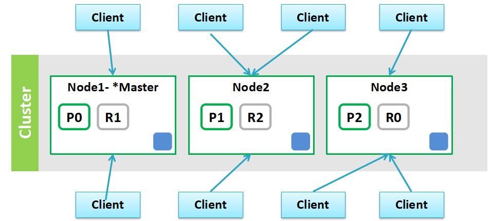

```toc
```

## 基本概念




这里每个 Node 保存多个分片，一个 Node 上有多个分片。

- **Master Node：主节点**，如上图中的 `Node1` 就是 master 主节点，主要是**负责一些索引的创建、删除、决定分片要分配到哪个结点、维护整个集群的更新等**
- **Master eligible nodes：可以参与选举的合格节点**，当主节点挂了该节点就可以参与选举，该节点也是 Master 主结点的一个从结点
- **Data Node：专门用于存放数据的节点**，如索引插入的数据就是存放在这个节点中。由 master 主结点负责如何将分片分发到数据节点上，通过数据节点解决数据的水平扩展和解决数据的单点问题。
- **Coordinating Node：协调节点，用于接收和响应请求，完成数据的接收和分发**


## 写入

1、客户端随机将数据发送到一个 node 节点，此节点就是一个协调节点；
2、通过路由算法，找到该数据的主分片，将数据进行写入；
3、同时主分片会同步副分片上；
4、此时是写入到了内存，然后通过 refresh（默认 `1s`） 生成 segment，使用 WAL 事务日志（内存续写 translog）写入磁盘（flush【默认 30 分钟或 translog 达到 512 M】），用于宕机时恢复。

注意：主分片返回 ACK 那么表示数据写入成功。


路由算法：
通过对文档 id 哈希后与 node 数量取模，并未使用 hash 环，同时可以自定义 routing 精确控制数据落点。比如把同一个用户对所有文档都用 user_id 进行路由，这样就会落到同一个分区。


## 扩容

上面说了，数据写入使用的取模算法，不是哈希环。这里牺牲了动态扩缩容换来了路由无状态、计算确定的简洁性。同时一般数据不会频繁变化，相比 Cassandra 这类去中心化存储。

所以一般要求主分片不可变。如果要扩容，一种方式是重建索引迁移数据；另一种就是把路由空间放大成 2 的幂，再按倍数把旧分片拆分成新分片，从而尽量复用原有数据。

## 读取

请求发送到一个 node 节点（协调节点），此时从多个分片通过分词倒排检索 topN，然后在协调节点统一倒排取 topN，返回客户端最终的 topN。


