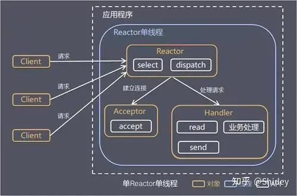
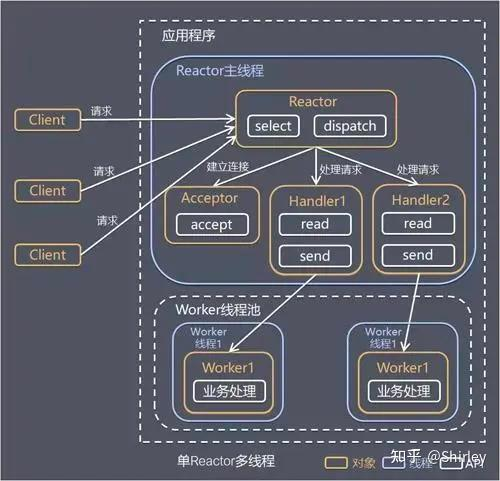
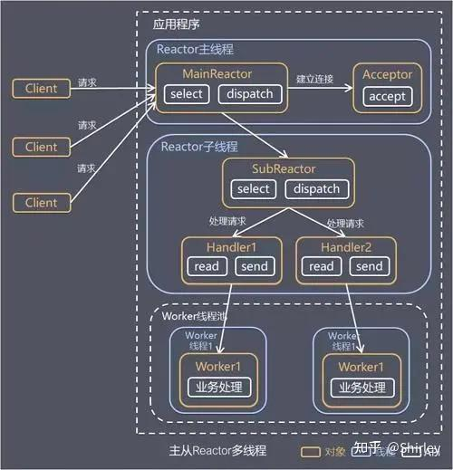

```toc
```


**凡是需要高性能、高并发、自定义网络通信协议的地方，几乎都有 Netty 的身影。**

它本质上是一个**异步事件驱动的网络应用框架**，帮开发者屏蔽了 Java NIO 的复杂性，让你能专注于业务逻辑。


## 核心组件

| 组件                  | 职责                                         |
| ------------------- | ------------------------------------------ |
| **EventLoop**       | 事件循环，一个线程 + 一个 Selector，负责监听和处理 IO 事件      |
| **EventLoopGroup**  | EventLoop 的集合，通常分为 BossGroup 和 WorkerGroup |
| **Channel**         | 网络连接的抽象，每个 Channel 绑定一个 EventLoop          |
| **ChannelPipeline** | 责任链，串联多个 ChannelHandler                    |
| **ChannelHandler**  | 具体处理器，处理入站/出站事件                            |


## 线程模型

EventLoopGroup 是 Netty 的核心处理引擎，是 Netty Reactor 线程模型的具体实现方式，Netty 通过创建不同的 EventLoopGroup 参数配置，就可以支持 Reactor 的三种线程模型：

- 单线程模型：EventLoopGroup 只包含一个 EventLoop，Boss 和 Worker 使用同一个 EventLoopGroup；
- 多线程模型：EventLoopGroup 包含多个 EventLoop，Boss 和 Worker 使用同一个 EventLoopGroup；
- 主从多线程模型：EventLoopGroup 包含多个 EventLoop，Boss 是主 Reactor，Worker 是从 Reactor，它们分别使用不同的 EventLoopGroup，主 Reactor 负责新的网络连接 Channel 创建，然后把 Channel 注册到从 Reactor。

### 单线程模型

一个线程需要执行处理所有的 accept、read、decode、process、encode、send 事件。对于高负载、高并发，并且对性能要求比较高的场景不适用。




|角色|职责|
|---|---|
|**Reactor**|事件循环核心，用 Selector 监听所有 IO 事件，负责分发|
|**Acceptor**|专门处理 `OP_ACCEPT` 事件，建立新连接|
|**Handler**|处理已建立连接的读写事件，执行业务逻辑|

关键点：**三者运行在同一个线程中**，不存在线程切换和锁竞争。


基本逻辑就是 Reactor 用**一个 Selector** 监听所有事件。  
当 `OP_ACCEPT` 就绪时，Reactor 调用 **Acceptor** 建立连接，并把新 Channel **注册回同一个 Selector**，监听 `OP_READ`，同时绑定一个 **Handler**。  
当 `OP_READ` 就绪时，Reactor 通过 attachment 找到 Handler，**回调**它的 `read()` 方法。  
Handler 读取数据、处理业务，然后**尝试写回 Channel**。  
如果一次写不完，会注册 `OP_WRITE`，等下次可写时继续写。  
整个过程中，**所有事件处理都在同一个 Reactor 线程中串行执行**，业务逻辑如果耗时，必须交给业务线程池。当然细节有三点：

1、Acceptor 不是把连接“交给”Handler 就完事，而是把新 Channel **注册回 Reactor 的 Selector**。后续这个连接的读写事件，仍然由 Reactor 统一监听和分发。

2、Handler 并不是一个独立运行的线程，它只是**挂在 Channel 上的一个附件**。
当 Reactor 检测到某个 Channel 的 `OP_READ` 就绪时，才会通过 `attachment` 找到对应的 Handler，调用它的 `read()` 方法。Handler 是被动调用的，它的执行时机由 Reactor 决定，而不是自己主动运行。

3、提到“处理结果直接放到 Channel 中返回”，这在**数据量小、一次能写完**的情况下是对的。但如果**数据量大、TCP 缓冲区满**，`write()` 可能只写入一部分，剩下的需要等待下次可写。

在非阻塞模式下，如果一次写不完，标准做法是：
1. 把剩余数据存到 Handler 的**待写队列**中。
2. 向 Selector 注册 `OP_WRITE` 事件。
3. 等下次 `OP_WRITE` 就绪时，继续写剩余数据。
4. 写完后**取消 OP_WRITE 注册**（否则会一直触发，浪费 CPU）。

**重点**：写回 Channel 不是“一写了之”，在高负载下需要配合 `OP_WRITE` 事件做**分次写入**。


### 多线程模型

**多线程模型**满足绝大部分应用场景，并发连接量不大的时候没啥问题，但是遇到并发连接大的时候就可能会出现问题，成为性能瓶颈。




### 主从多线程模型

从一个 主线程 NIO 线程池中选择一个线程作为 Acceptor 线程，绑定监听端口，接收客户端连接的连接，其他线程负责后续的接入认证等工作。连接建立完成后，Sub NIO 线程池负责具体处理 I/O 读写。




