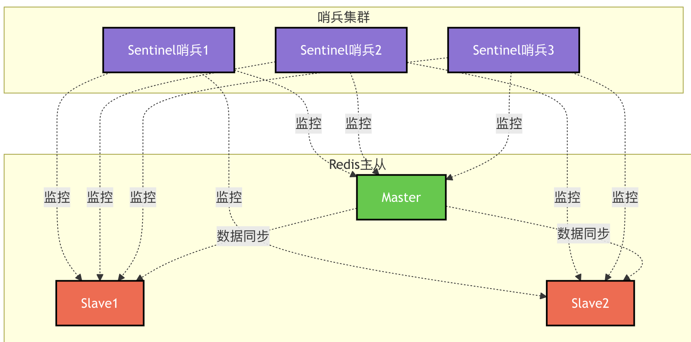

```toc
```


## 单机模式

内存容量限制：单机 redis 受限于物理机内存。虽然理论上单机支持几百 GB 内存，但实际生产环境中内存超过 20 GB 时会面临各种问题。如 RDB 持久化时 fork 进程导致的内存翻倍、AOF 重写带来的性能抖动等。

计算资源瓶颈：Redis 是单线程模型，虽然高线但是无法利用多核 CPU。即使 6.0 版本后引入多线程，但是核心操作仍然是单线程。

可用性隐患：单机故障风险高。


## 主从复制架构

其实就是主节点写入、副节点读取。采用主从复制进行数据同步。

## 哨兵监控架构

为了解决主从模式无法自动容错和恢复的问题，Redis 引入了哨兵模式（Sentinel）集群架构。

哨兵模式是在主从复制架构基础上增加了哨兵节点组件。哨兵节点是一种特殊类型的 Redis 节点，专门用于监控主节点和从节点的运行状态。当主节点发生故障时，哨兵节点能够自动执行故障转移操作，从健康的从节点中选举出一个合适的节点提升为新主节点，并通知其他从节点和客户端应用进行配置更新。




哨兵节点会定期向所有主节点和从节点发送 PING 心跳检测命令，如果在设定的超时时间内未收到 PONG 响应，哨兵节点会将该节点标记为"主观下线"。如果一个主节点被多数哨兵节点（超过半数）同时标记为"主观下线"，那么该主节点将被判定为"客观下线"。


## 分片集群架构

Redis Cluster 同样采用主从复制机制来提升整体可用性。每个分片都包含一个主节点和若干从节点。主节点负责处理写操作，从节点则负责复制主节点的数据并处理读请求。

Redis Cluster 具备自动故障检测能力。当某个主节点失去连接或变得不可达时，Redis Cluster 会自动将该节点标记为不可用状态，并从该分片的可用从节点中选举提升一个新的主节点。


