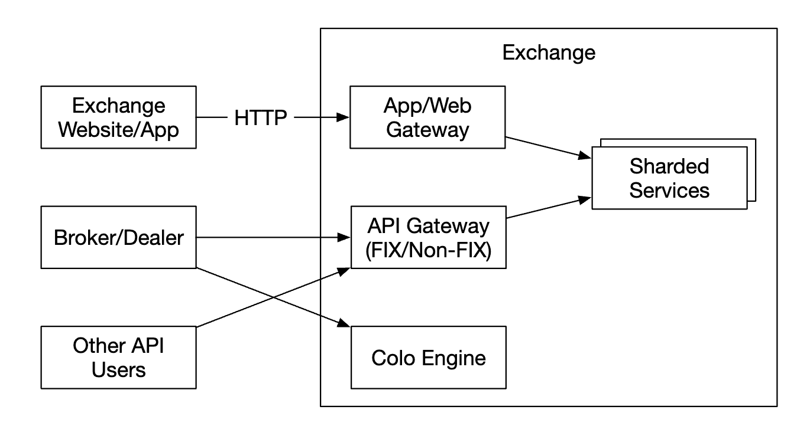
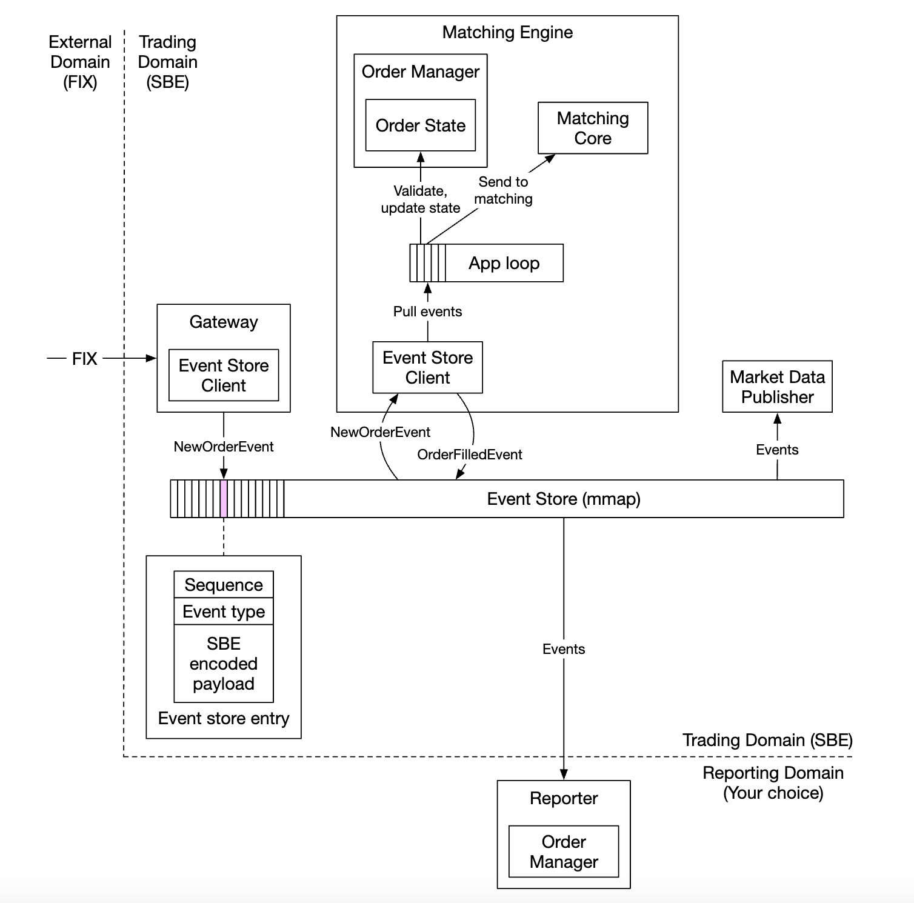

```toc

```


## 分析

交易所的基本功能是高效地撮合买卖双方。

现代交易所是一个对延迟、吞吐量和健壮性都有严格要求的复杂系统。在开始之前，让我们向面试官提几个问题来明确需求。

**候选人**：我们要交易哪些证券？股票、期权还是期货？ 
**面试官**：为简单起见，只涉及股票。

**候选人**：支持哪些订单操作？下单、撤单还是改单？需要支持限价单、市价单还是条件单？ 
**面试官**：需要支持以下功能：下新单和撤单。订单类型只考虑限价单。

**候选人**：系统需要支持盘后交易吗？ 
**面试官**：不需要，只支持正常交易时段。

**候选人**：能描述一下交易所的基本功能吗？交易所的规模如何，比如有多少用户、多少交易品种、多少订单？ 
**面试官**：客户可以提交新的限价单或撤销订单，并实时收到成交通知。客户还应能实时查看订单簿（买卖挂单列表）。交易所需要支持至少数万名用户同时交易，并支持至少 100 个交易品种（symbol）。在交易量方面，需要支持每天数十亿笔订单。此外，交易所是受监管的机构，因此需要确保运行风控检查。

**候选人**：请问风控检查的具体要求是什么？ 
**面试官**：做简单的风控检查即可。例如，一个用户在一天内对某只股票的交易量不得超过 100 万股。

**候选人**：我注意到您没有提及用户钱包管理。这也是我们需要考虑的吗？ 
**面试官**：问得好！我们需要确保用户下单时有充足资金。如果一笔订单正在订单簿中等待成交，该订单所需的资金需要被冻结，以防止超额支出。


### 非功能需求

- **可用性**：至少 99.99%。可用性对于交易所至关重要。哪怕停机几秒钟，也会损害声誉。
- **容错性**：需要具备容错能力和快速恢复机制，以降低生产事故的影响。
- **延迟**：往返延迟需达到毫秒级，尤其要关注 99 百分位延迟。往返延迟是指市价单进入交易所到返回成交执行结果的时间。持续偏高的 99 百分位延迟会对少数用户造成极差的体验。
- **安全性**：交易所需要有账户管理系统。出于法律和合规要求，交易所需在新账户开立前执行 KYC（了解你的客户）检查，以验证用户身份。对于包含行情数据的网页等公共资源，需要防御分布式拒绝服务攻击（DDoS）。

### 粗估

- 100 个交易品种 
- 每日 10 亿笔订单
- NYSE 的交易时间为周一至周五，东部时间上午 9:30 至下午 4:00，共 6.5 小时。
- QPS = 10 亿 / 6.5 / 3600 ≈ 43,000
- 峰值 QPS = 5 × QPS = 215,000。早盘开市和午盘收市前，交易量显著更高。


## 设计

### 业务简介

**经纪商（Broker）**

大多数散户客户通过经纪商与交易所进行交易。你可能熟悉的经纪商包括 Charles Schwab、Robinhood、E*Trade、Fidelity 等。这些经纪商为散户用户提供友好的界面，方便他们下单和查看行情数据。

**机构客户（Institutional Client）**

机构客户使用专业交易软件进行大批量交易。不同的机构客户有不同的需求。例如，养老基金追求稳定收益，交易频率较低，但单次交易量巨大，需要订单拆分等功能来降低其大额订单对市场的冲击。而一些专注于做市的对冲基金则通过手续费返佣来获利，他们需要低延迟交易能力，显然无法像散户那样仅仅在网页或手机 App 上查看行情数据。

**限价单（Limit Order）**

限价单是以固定价格买入或卖出股票的订单。它可能不会立即找到匹配，也可能只会部分成交。

**市价单（Market Order）**

市价单不指定价格，以当前市场价格立即执行。市价单以牺牲成本为代价来保证成交。在某些快速变动的市场行情下，这种方式非常有用。

**行情数据级别（Market Data Levels）**

美国股票市场有三档行情报价：L1（一级）、L2（二级）和 L3（三级）。L1 行情数据包含最优买价、卖价及其数量。买价（Bid）是指买方愿意为一只股票支付的最高价格；卖价（Ask）是指卖方愿意出售该股票的最低价格。


`L1` 级

| -              | Price    | Quantity |
| -------------- | -------- | -------- |
| Best ask(最优卖价) | `100.10` | 1800     |
| Best bid(最优买价) | `100.08` | 2000     |


`L2` 级包含更多的价格档位

| -         | -            | price    | quantity |
| --------- | ------------ | -------- | -------- |
| Sell book | depth of ask | `100.13` | 300      |
| Sell book | depth of ask | `100.12` | 1500     |
| Sell book | depth of ask | `100.11` | 2000     |
| Sell book | Best ask     | `100.10` | 1800     |
| Buy book  | best bid     | `100.08` | 2000     |
| Buy book  | best bid     | `100.07` | 800      |
| Buy book  | best bid     | `100.06` | 2000     |
| Buy book  | depth of bid | `100.05` | 600      |

`L3` 展示各价格档位及其在该价位的排队数量


**K 线图（Candlestick Chart）**

K 线图表示某一时间段内的股票价格。典型的 K 线如图所示。K 线图展示给定时间间隔内的开盘价、收盘价、最高价和最低价。常见的时间间隔包括 1 分钟、5 分钟、1 小时、1 天、1 周和 1 个月。


**FIX 协议**

FIX 协议，即金融信息交换协议（Financial Information Exchange protocol），创立于 1991 年，是一种供应商中立的通信协议，用于交换证券交易信息。以下是用 FIX 编码的一笔证券交易示例：

```
8=FIX.4.2 | 9=176 | 35=8 | 49=PHLX | 56=PERS | 52=20071123-05:30:00.000 | 11=ATOMNOCCC9990900 | 20=3 | 150=E | 39=E | 55=MSFT | 167=CS | 54=1 | 38=15 | 40=2 | 44=15 | 58=PHLX EQUITY TESTING | 59=0 | 47=C | 32=0 | 31=0 | 151=15 | 14=0 | 6=0 | 10=128 |
```


## 高层设计


首先，跟随订单走完**交易流程**。这是对延迟要求极为严格的关键路径，流程中的每一步都必须快速完成：

**步骤 1**：客户通过经纪商的网页或手机 App 下单。
**步骤 2**：经纪商将订单发送至交易所 Broker。
**步骤 3**：订单通过客户端网关 Gateway 进入交易所。客户端网关负责输入校验、限流、身份认证、数据标准化等基本守门职责，随后将订单转发给订单管理器。
**步骤 4～5**：订单管理器根据风控管理器(Risk Check)设定的规则进行风险检查。
**步骤 6**：通过风险检查后，订单管理器验证钱包 Wallet 中是否有充足资金执行该订单。
**步骤 7～9**：订单被发送至撮合引擎(Matching Engine)。找到匹配时，撮合引擎分别为买卖双方各生成一笔成交记录（也称 fill）。为保证撮合结果在回放时具有确定性，订单和成交记录都在定序器中进行排序（后文将详细介绍定序器 Sequencer）。
**步骤 10～14**：成交结果返回给客户端。

接下来，跟随**市场数据流**，追踪成交记录从撮合引擎经由数据服务到达经纪商的过程。

**步骤 `M1` **： 撮合引擎在完成撮合时生成成交流（fills），并将其发送给市场数据发布器(Market Data Publisher)。 

**步骤 `M2` **：市场数据发布器根据成交流和订单流构建 K 线图(candlestick chart)和订单簿(order book)（统称为市场数据），并将其发送给数据服务。

**步骤 `M3`**：市场数据存储在专用存储中用于实时分析。经纪商连接数据服务以获取及时的行情数据，并将其转发给各自的客户。

最后，我们来看**报告流程**。

**步骤 `R1～R2`（报告流程）**：报告服务从订单和成交记录中收集所有必要的报告字段（如 client_id、price、quantity、order_type、filled_quantity、remaining_quantity），并将整合后的记录写入数据库。

注意，交易流程（步骤 1 至 14）处于关键路径上，而市场数据流和报告流则不在关键路径上，因此三者对延迟的要求各不相同。

下面对这三个流程逐一进行详细说明。

**交易流程详述**

交易流程处于交易所的关键路径上，一切都必须快速完成。其核心是撮合引擎，让我们先来了解它。

**撮合引擎（Matching Engine）**

撮合引擎也称撮合核（cross engine）。以下是撮合引擎的主要职责：
1. 维护每个交易品种的订单簿。订单簿是一个交易品种的买卖挂单列表，详细的构建方式将在后文的数据模型章节中介绍。
2. 撮合买卖订单。一次匹配会产生两笔成交记录（分别对应买方和卖方）。撮合功能必须快速且准确。
3. 以市场数据的形式分发成交流。

高可用的撮合引擎实现必须能够以确定性顺序产生撮合结果。也就是说，给定一组已知的订单序列作为输入，当该序列被回放时，撮合引擎必须产生相同的成交记录（fill）序列作为输出。这种确定性是实现高可用的基础，我们将在深入设计章节中详细讨论。

**定序器（Sequencer）**

定序器是使撮合引擎具备确定性的关键组件。它为每一条入站订单打上序列号，再由撮合引擎处理；同时也为撮合引擎完成的每对成交记录（fill）打上序列号。换句话说，定序器分为入站和出站两个实例，各自维护独立的序号序列。每个定序器生成的序号必须是连续递增的，以便快速检测到是否有序号缺失。详见图 13.7。


为入站订单和出站成交打序列号的原因有以下几点：

1. 保证时效性与公平性。
2. 支持快速恢复与消息回放。
3. 保证"恰好一次（exactly-once）"语义。

定序器的作用不仅是生成序列号，它同时也充当消息队列的角色——一个用于向撮合引擎发送消息（入站订单），另一个用于将消息（成交记录）发回给订单管理器。它同时也是订单和成交记录的事件存储。这类似于连接到撮合引擎的两个 Kafka 事件流——一个用于入站订单，另一个用于出站成交记录。事实上，如果 Kafka 的延迟更低且更可预测，我们完全可以使用它。我们将在深入设计章节中讨论如何在低延迟交易所环境中实现定序器。


**订单管理器（Order Manager）**

订单管理器一端接收订单，另一端接收成交结果，负责管理订单的状态。让我们仔细了解它。

订单管理器从客户端网关接收入站订单，并执行以下操作：
- 将订单送去进行风险检查。我们对风控检查的要求很简单，例如验证用户的单日交易量是否低于 100 万股。
- 对照用户钱包核验订单，确认有充足资金执行该交易。钱包相关内容已详细讨论，可参考该章节了解适用于交易所的实现方案。
- 将订单发送给定序器，由定序器为其打上序列号，随后由撮合引擎进行处理。新订单包含许多属性，但无需将所有属性都发送给撮合引擎。为减少数据传输量，订单管理器只传递必要的属性。

另一方面，订单管理器通过定序器从撮合引擎接收成交记录，并经由客户端网关将已成交订单的成交结果返回给经纪商。

订单管理器应做到快速、高效且准确。它负责维护订单的当前状态。实际上，管理各种状态转换是订单管理器复杂性的主要来源——在真实的交易所系统中，可能涉及数以万计的状态转换场景。事件溯源非常适合用于订单管理器的设计，我们将在深入设计章节中讨论基于事件溯源的设计方案。

**客户端网关（Client Gateway）**

客户端网关是交易所的入口守门人，负责接收客户下的订单并将其路由给订单管理器。

```
Auth
Validation
Rate Limit
Normalization
FIXT Support
```


客户端网关处于关键路径上，对延迟敏感，应保持轻量。它需要尽快将订单转发到正确的目的地。上述功能虽然至关重要，但都必须尽可能快速地完成。如何决定将哪些功能放入客户端网关、哪些功能留给撮合引擎和风控检查，是一个设计权衡。一般原则是，应将复杂的功能留给撮合引擎和风控检查。

散户和机构客户的客户端网关类型有所不同，主要考量因素是延迟、交易量和安全性需求。例如，做市商等机构为交易所提供了大量流动性，他们对延迟要求极高。图 13.9 展示了不同客户端网关与交易所的连接方式。一个极端的例子是托管引擎（colo engine）——经纪商租用部署在交易所数据中心内的服务器上运行的交易引擎软件，其延迟本质上就是**光**从托管服务器到交易所服务器所需的传输时间。



### 市场数据流

市场数据发布器（MDP）从撮合引擎接收成交记录，并根据成交流构建订单簿和 K 线图。订单簿和 K 线图统称为市场数据，我们将在后文的"数据模型"章节中进行详细讨论。市场数据随后发送给数据服务，由其向订阅者提供展示。图 13.10 展示了 MDP 的一种实现方式及其在市场数据流中与其他组件的配合关系。


### 报告流

交易所的一个重要组成部分是报告。报告服务不在交易关键路径上，但同样是系统的关键部分。它负责交易历史记录、税务报告、合规报告、清算等事务。效率和延迟对交易流程至关重要，但报告服务对延迟的敏感度较低，准确性和合规性才是报告服务的核心考量。

通常的做法是将入站订单和出站成交记录中的属性拼合在一起。入站新订单包含订单详情，出站成交记录通常只包含订单 ID、价格、数量和成交状态。报告服务将两个来源的属性进行合并，用于生成报告。图 13.11 展示了报告流中各组件的配合方式。


### API 设计

一般有几个 API，下单，查询成交记录，查询订单簿，查询历史价格（K 线图）


### 数据模型

交易所有三类主要数据，让我们逐一探讨：
- 产品（Product）、订单（Order）、成交记录（Execution）
- 订单簿（Order Book）
- K 线图（Candlestick Chart）


产品（product）描述了一个交易品种的属性，如产品类型、交易代码、UI 展示代码、结算货币、最小交易单位（lot size）、最小报价单位（tick size）等。这类数据变动频率很低，主要用于 UI 展示。它可以存储在任意数据库中，且具有很强的缓存友好性。

订单（order）代表一笔买入或卖出的入站指令。

成交记录（execution）代表撮合后输出的结果，也称为 fill。并非每笔订单都会产生成交记录。撮合引擎的输出包含两笔成交记录，分别对应已撮合订单的买方和卖方。


订单和成交记录是交易所中最重要的数据，在高层设计中提到的三个流程中都会涉及，但形式略有不同。

- 在关键交易路径中，订单和成交记录不存储在数据库中。为实现高性能，该路径在内存中执行交易，并利用磁盘或共享内存来持久化和共享订单及成交记录。具体而言，订单和成交记录存储在定序器中以支持快速恢复，数据在收市后进行归档。我们将在深入设计章节中讨论定序器的高效实现。
- 报告服务将订单和成交记录写入数据库，用于对账和税务报告等场景。
- 成交记录被转发给市场数据处理器，用于重建订单簿和 K 线图数据，下面将对这两种数据类型进行介绍。

**订单簿**

订单簿是某一特定证券或金融工具按价格档位组织的买卖挂单列表 [12][13]，是撮合引擎中用于快速订单撮合的核心数据结构。高效的订单簿数据结构需满足以下要求：

- **常数时间查找**：操作包括获取某价位或价格区间内的总量。
- **快速的添加/撤单/成交操作**：时间复杂度最好为 O(1)。操作包括下新单、撤单和撮合成交。
- **快速更新**：操作包括替换订单。
- **查询最优买价/卖价（best bid/ask）**。
- **遍历价格档位**。

下面通过图 13.13 所示的示例，逐步演示订单簿的成交过程。


在上述示例中，有一笔大额市价买单买入 2700 股苹果股票。该买单吃掉了最优卖价队列中的所有卖单，以及价格为 100.11 的队列中的第一笔卖单。在这笔大单成交后，买卖价差扩大，价格上涨一个档位（此时最优卖价变为 100.11）。

以下代码片段展示了订单簿的一种实现方式。

```
class PriceLevel {
    private Price limitPrice;
    private long totalVolume;
    private List<Order> orders;
}

class Book<Side> {
    private Side side;
    private Map<Price, PriceLevel> limitMap;
}

class OrderBook {
    private Book<Buy> buyBook;
    private Book<Sell> sellBook;
    private PriceLevel bestBid;
    private PriceLevel bestOffer;
    private Map<OrderID, Order> orderMap;
}
```

这段代码是否满足上述所有设计要求？例如，在添加/撤销限价单时，时间复杂度是否为 O(1)？答案是否定的，因为这里使用的是普通列表（`private List<Order> orders`）。为了实现更高效的订单簿，需要将"orders"的数据结构改为**双向链表**，从而使删除类操作（撤单和成交）也能达到 O(1) 时间复杂度。下面说明如何对这三类操作实现 O(1) 时间复杂度：

1. **下新单**：将新订单追加到 PriceLevel 的尾部。对于双向链表，这是 O(1) 时间复杂度。
    
2. **成交**：从 PriceLevel 的头部删除一个订单。对于双向链表，这是 O(1) 时间复杂度。
    
3. **撤单**：从 OrderBook 中删除某个订单。我们利用 OrderBook 中的辅助数据结构 `Map<OrderID, Order> orderMap`，在 O(1) 时间内定位到待撤销的订单。找到订单后，如果"orders"列表是单向链表，代码还需要遍历整个链表来找到前一个节点指针，才能完成删除，这将耗费 O(n) 时间。由于现在是双向链表，订单本身持有指向前一个订单的指针，因此无需遍历整个链表即可完成删除。
    

图 13.14 说明了这三类操作的工作原理。


值得一提的是，订单簿数据结构在市场数据处理器中同样被大量使用，用于根据撮合引擎生成的成交流重建 L 1、L 2 和 L 3 数据。

**K 线图**

K 线图是市场数据处理器中另一个关键数据结构（与订单簿并列），用于生成市场数据。

我们通过 Candlestick 类和 CandlestickChart 类来建模。当某根 K 线的时间间隔结束后，将为下一个时间间隔创建一个新的 Candlestick 实例，并追加到 CandlestickChart 实例的链表中。

```
class Candlestick {
    private long openPrice;
    private long closePrice;
    private long highPrice;
    private long lowPrice;
    private long volume;
    private long timestamp;
    private int interval;
}

class CandlestickChart {
    private LinkedList<Candlestick> sticks;
}
```


在众多交易品种和众多时间间隔下追踪 K 线价格历史会消耗大量内存。如何优化？有以下两种方式：

1. 使用预分配的环形缓冲区（ring buffer）存储 K 线数据，减少对象创建次数。
2. 限制内存中保留的 K 线数量，将其余数据持久化到磁盘

我们将在深入设计章节的"市场数据发布器"部分详细介绍这些优化方案。

市场数据通常持久化在内存列式数据库中（例如 KDB）用于实时分析。收盘后，数据持久化到历史数据库。


## 深入设计

### 性能优化

如非功能需求所述，延迟对于交易所至关重要。不仅平均延迟需要低，整体延迟也必须稳定。衡量稳定性水平的一个好指标是 99 百分位延迟。

延迟可以按以下公式分解为各组成部分：

**延迟 = 关键路径上各任务执行时间之和**

降低延迟有两种方式：
1. 减少关键路径上的任务数量。
2. 缩短每个任务的执行时间：
    - 减少或消除网络和磁盘使用
    - 降低每个任务本身的执行时间

先来看第一点。如高层设计所示，关键交易路径包括：

**网关 → 订单管理器 → 定序器 → 撮合引擎**

关键路径上只保留必要的组件，甚至连日志也从关键路径上去掉，以实现最低延迟。

再来看第二点。在高层设计中，关键路径上的各组件运行在通过网络互连的独立服务器上。单次往返网络延迟约为 500 微秒。当多个组件都通过网络通信时，总网络延迟累积可达个位数毫秒。此外，定序器是一个将事件持久化到磁盘的事件存储，即便是利用顺序写入性能优势的高效设计，磁盘访问延迟仍高达数十毫秒。关于网络和磁盘访问延迟，可参考"每个程序员都应该知道的延迟数字"[16]。

综合网络和磁盘访问延迟，端到端总延迟可达数十毫秒。这个数字在交易所发展初期还算可以接受，但随着各交易所竞相追求超低延迟，这已远远不够。

为了在竞争中保持领先，交易所随着时间推移不断改进设计，通过探索减少或消除网络和磁盘访问延迟的方法，将关键路径上的端到端延迟压缩至数十微秒。一种经过实践检验的设计方案是将所有组件部署在同一台服务器上，消除网络跳转。当所有组件都在同一台服务器上时，它们可以通过 mmap [17] 作为事件存储进行通信（稍后详述）。

图 13.15 展示了将所有组件部署在单台服务器上的低延迟设计：


这里有几个值得深入了解的有趣设计决策。

首先来关注上图中的**应用循环（application loop）**。应用循环是一个有趣的概念：它在 while 循环中持续轮询待执行的任务，是主要的任务执行机制。为了满足严格的延迟要求，应用循环只处理最关键的任务。其目标是降低每个组件的执行时间，并保证高度可预测的执行时间（即较低的 99 百分位延迟）。图中的每个方框代表一个组件，组件是服务器上的一个进程。为最大化 CPU 效率，每个应用循环（即主处理循环）都是单线程的，且线程被绑定到固定的 CPU 核心上。以订单管理器为例，其结构如图 13.16 所示。


在该图中，订单管理器的应用循环被绑定到 CPU 1 上。将应用循环绑定到 CPU 的好处非常显著：

1. **无上下文切换**：CPU 1 完全分配给订单管理器的应用循环。
2. **无锁，因此无锁争用**：由于只有一个线程在更新状态。

这两点都有助于实现较低的 99 百分位延迟。

CPU 绑定的权衡在于它使编码更加复杂。工程师需要仔细分析每个任务的执行时间，避免某个任务长时间占用应用循环线程，从而阻塞后续任务。

接下来，让我们将注意力集中在图 13.15 中央那个标注为"mmap"的长方块上。"mmap"指的是一个符合 POSIX 标准的 UNIX 系统调用 `mmap(2)`，它将磁盘上的文件映射到进程的内存空间中。

`mmap(2)` 提供了一种高性能的进程间内存共享机制。当底层文件位于 `/dev/shm` 目录时，性能优势更加突出。`/dev/shm` 是一个内存支撑的文件系统，当对 `/dev/shm` 中的文件执行 `mmap(2)` 时，对共享内存的访问完全不会产生任何磁盘 I/O。

现代交易所正是利用这一特性，尽可能地从关键路径中消除磁盘访问。在服务器内，`mmap(2)` 被用于构建一个消息总线，关键路径上的各组件通过该总线进行通信。这条通信路径完全没有网络或磁盘访问，在 mmap 消息总线上发送一条消息仅需亚微秒级时间。通过利用 mmap 构建事件存储，结合我们接下来将要讨论的事件溯源设计范式，现代交易所得以在单台服务器内构建低延迟微服务。


### 事件溯源

我们在"数字钱包"章节（第 341 页）中讨论过事件溯源，请参阅该章节以深入了解事件溯源。

事件溯源的概念并不难理解。在传统应用中，状态持久化在数据库中。一旦出现问题，很难追溯问题的根源，因为数据库只保存当前状态，而没有记录导致当前状态的各个事件。

在事件溯源模式下，不再存储当前状态，而是保存一份不可变的所有状态变更事件日志。这些事件是真实状态的唯一来源（golden source of truth）。图 13.17 展示了两者的对比。


- 左图：传统数据库 schema，记录了订单的状态，但不包含任何关于订单如何到达当前状态的信息。
- 右图：事件溯源的对应实现。它追踪所有改变订单状态的事件，并可以通过按顺序回放所有事件来恢复订单状态。

图中展示了一个以 mmap 事件存储作为消息总线的事件溯源设计。这与 Kafka 中的发布-订阅（Pub-Sub）模型非常相似。事实上，如果没有严格的延迟要求，可以直接使用 Kafka。



在该图中，外部领域通过我们在"业务知识简介"部分（第 382 页）介绍的 FIX 协议与交易领域进行通信。

- 网关将 FIX 转换为"基于简单二进制编码的 FIX"（FIX over Simple Binary Encoding，SBE），以实现快速、紧凑的编码，并通过事件存储客户端以预定义格式将每笔订单作为 NewOrderEvent 发送（见图中的事件存储条目）。
- 订单管理器（嵌入在撮合引擎中）从事件存储接收 NewOrderEvent，对其进行验证，并将其添加到内部订单状态中，随后将订单发送给撮合核心。
- 若订单成交，则生成 OrderFilledEvent 并发送到事件存储。
- 其他组件（如市场数据发布器和报告服务）订阅事件存储，并各自进行相应的处理。

这一设计与高层设计紧密对应，但为了在事件溯源范式下更高效地运行，做了一些调整。

第一个差异在于**订单管理器**。订单管理器变成了一个可复用的库，嵌入到不同的组件中。这样的设计在此场景下是合理的，因为订单状态对多个组件都很重要。如果设置一个中心化的订单管理器供其他组件更新或查询订单状态，会增加延迟，对于不在关键交易路径上的组件（如图中的报告服务）尤其如此。虽然每个组件各自维护订单状态，但借助事件溯源，这些状态被保证是完全一致且可回放的。

另一个关键差异是**定序器不见了**。它去哪了？

在事件溯源设计中，所有消息共用一个事件存储。注意事件存储条目中包含一个 `sequence` 字段，该字段由定序器注入。

每个事件存储只有一个定序器。设置多个定序器是不好的做法，因为它们会争夺向事件存储写入的权利。在交易所这样的繁忙系统中，大量时间会浪费在锁争用上。因此，定序器是一个**单写者（single writer）**，在将事件发送到事件存储之前为其打上序列号。与高层设计中同时兼任消息存储的定序器不同，这里的定序器只做一件简单的事，因此速度极快。图 13.19 展示了内存映射（mmap）环境下定序器的一种设计方案。

定序器从各组件本地的环形缓冲区中拉取事件，为每个事件打上序列号，然后将其发送到事件存储。为实现高可用，可以设置备用定序器，以应对主定序器宕机的情况。


### 高可用


在高可用方面，我们的设计目标是实现 4 个 9（99.99%）的可用性。这意味着交易所每天只能有 8.64 秒的停机时间，一旦服务宕机，需要几乎立即恢复。

为实现高可用，需考虑以下两点：
- 首先，识别交易所架构中的单点故障。例如，撮合引擎宕机对交易所而言将是灾难性的，因此需要在主实例旁设置冗余实例。
- 其次，故障检测和切换到备用实例的决策必须迅速完成。

对于无状态服务（如客户端网关），通过水平扩展（增加服务器）即可轻松实现高可用。对于有状态的组件（如订单管理器和撮合引擎），则需要能够跨副本复制状态数据。

图 13.20 展示了一种数据复制方案。热备撮合引擎作为主实例，温备引擎接收并处理完全相同的事件，但不向事件存储发布任何出站事件。当主实例宕机时，温备实例可以立即接管成为新的主实例并开始发布事件。当温备从实例宕机后，重启时可以从事件存储中恢复所有状态。事件溯源非常适合交易所架构，其内在的确定性使状态恢复变得简单且准确。


我们还需要设计一种机制来检测主实例的潜在问题。除了对硬件和进程进行常规监控外，还可以通过撮合引擎发送心跳包。如果在规定时间内未收到心跳包，则认为撮合引擎可能出现了问题。

这种热备-温备设计的局限在于它只在单台服务器范围内有效。为了实现更高的可用性，需要将这一概念扩展到多台机器甚至多个数据中心。在这种设置下，整台服务器要么是热备要么是温备，整个事件存储需要从热备服务器复制到所有温备副本。跨机器复制整个事件存储需要一定时间，可以使用**可靠 UDP** [19] 来高效地将事件消息广播到所有温备服务器。可参考 Aeron [20] 的设计作为示例。

下一节将讨论对热备-温备设计的改进，以实现更高的可用性。


### 容错性

上述热备-温备设计相对简单，运行效果也相当不错。但如果温备实例也发生故障怎么办？这是一个概率很低但后果严重的事件，因此我们必须做好应对准备。

这是大型科技公司都面临的问题。他们的应对方案是将核心数据复制到多个城市的数据中心，以抵御地震或大规模停电等自然灾害。为使系统具备容错能力，我们需要回答以下问题：
1. 若主实例宕机，如何以及何时决定切换到备用实例？
2. 如何在备用实例中选举主节点？
3. 需要多长恢复时间（RTO——恢复时间目标）？
4. 哪些功能需要恢复（RPO——恢复点目标）？系统是否能在降级状态下运行？

让我们逐一回答这些问题。

首先，我们需要理解"宕机"的真正含义，这并不像看起来那么简单。考虑以下情况：
1. 系统可能发出误报，导致不必要的故障切换。
2. 代码中的 bug 可能导致主实例宕机。同样的 bug 可能在故障切换后也将备用实例击垮。当所有备用实例都被该 bug 击垮后，系统将不再可用。

这些都是难以解决的问题。以下是一些建议：当我们首次发布新系统时，可能需要手动执行故障切换。只有在积累了足够多的信号和运维经验，对系统建立足够的信心之后，再逐步自动化故障检测流程。混沌工程 [21] 是一种很好的实践，可以更快地暴露边界情况并积累运维经验。

一旦做出正确的故障切换决定，如何确定由哪台服务器接管？幸运的是，这是一个有充分研究支撑的问题，已有许多经过实践检验的主节点选举算法。我们以 Raft [22] 为例。

图 13.21 展示了一个由 5 台服务器组成的 Raft 集群，每台服务器都有自己的事件存储。当前 Leader 向所有其他实例（Follower）发送数据。在 Raft 中，执行操作所需的最少票数为 ⌊n/2⌋+1，其中 n 是集群成员数量。在本例中，最少需要 ⌊5/2⌋+1 = 3 票。


下面简要介绍主节点选举过程。Leader 向其 Follower 发送心跳消息（如图 13.21 所示的不携带内容的 AppendEntries）。如果某个 Follower 在一段时间内未收到心跳消息，则触发选举超时，发起新的选举。第一个触发选举超时的 Follower 成为候选人，并向其余 Follower 请求投票（RequestVote）。如果该 Follower 获得多数票，则成为新的 Leader。如果某个 Follower 的任期（term）值低于新节点，则不能成为 Leader。如果多个 Follower 同时成为候选人，则称为"分裂投票（split vote）"，此时选举超时并重新发起选举。图 13.22 对"任期（term）"进行了说明——在 Raft 中，时间被划分为任意长度的区间，分别代表正常运行期和选举期。


接下来，让我们来看**恢复时间**。恢复时间目标（RTO）是指在不对业务造成重大损害的前提下，应用程序可以停机的最长时间。对于股票交易所，我们需要实现秒级 RTO，这明确要求必须实现服务的自动故障切换。为此，我们需要根据优先级对服务进行分类，并制定降级策略以维持最低服务水平。

最后，我们需要确定**数据容忍丢失量**。恢复点目标（RPO）是指在对业务造成重大损害之前，最多可以丢失多少数据——即损失容忍度。在实践中，这意味着需要频繁备份数据。对于股票交易所，数据丢失是完全不可接受的，因此 RPO 接近于零。借助 Raft，我们拥有数据的多个副本，它保证在集群节点之间实现状态共识。如果当前 Leader 宕机，新 Leader 应能立即正常运行。

### 撮合算法

让我们稍作转换，深入了解撮合算法。以下伪代码从高层面说明了撮合的工作原理。

```
Context handleOrder(OrderBook orderBook, OrderEvent orderEvent) {
    if (orderEvent.getSequenceId() != nextSequence) {
        return Error(OUT_OF_ORDER, nextSequence);
    }

    if (!validateOrder(symbol, price, quantity)) {
        return ERROR(INVALID_ORDER, orderEvent);
    }

    Order order = createOrderFromEvent(orderEvent);
    switch (msgType):
        case NEW:
            return handleNew(orderBook, order);
        case CANCEL:
            return handleCancel(orderBook, order);
        default:
            return ERROR(INVALID_MSG_TYPE, msgType);
}

Context handleNew(OrderBook orderBook, Order order) {
    if (BUY.equals(order.side)) {
        return match(orderBook.sellBook, order);
    } else {
        return match(orderBook.buyBook, order);
    }
}

Context handleCancel(OrderBook orderBook, Order order) {
    if (!orderBook.orderMap.contains(order.orderId)) {
        return ERROR(CANNOT_CANCEL_ALREADY_MATCHED, order);
    }

    removeOrder(order);
    setOrderStatus(order, CANCELED);
    return SUCCESS(CANCEL_SUCCESS, order);
}

Context match(OrderBook book, Order order) {
    Quantity leavesQuantity = order.quantity - order.matchedQuantity;
    Iterator<Order> limitIter = book.limitMap.get(order.price).orders;
    while (limitIter.hasNext() && leavesQuantity > 0) {
        Quantity matched = min(limitIter.next.quantity, order.quantity);
        order.matchedQuantity += matched;
        leavesQuantity = order.quantity - order.matchedQuantity;
        remove(limitIter.next);
        generateMatchedFill();
    }
    return SUCCESS(MATCH_SUCCESS, order);
}
```


该伪代码使用 **FIFO（先进先出）** 撮合算法。在某一价位上，先到的订单先成交，最后到的订单最后成交。

撮合算法有很多种，这些算法在期货交易中被广泛使用。例如，带 LMM（首席做市商）的 FIFO 算法会根据预定义的比例，在普通 FIFO 队列之前为 LMM 分配一定数量的成交份额，LMM 公司需要与交易所协商才能获得这种特权。更多撮合算法可参见 CME 官网 [24]。撮合算法也被用于许多其他场景，典型的例子是暗池（dark pool）[25]。

### 确定性

确定性分为**功能确定性**和**延迟确定性**两种。

功能确定性已在前面的章节中介绍过。我们所做的设计选择，如定序器和事件溯源，保证了只要以相同顺序回放事件，结果就一定相同。

在功能确定性中，事件实际发生的时间在大多数情况下并不重要，重要的是事件的顺序。在图 13.23 中，时间维度上离散且不均匀分布的事件时间戳被转换为连续的点，从而大幅缩短了回放/恢复所需的时间。


**延迟确定性**意味着系统中每笔交易的延迟几乎相同。这对业务至关重要，可以用数学方式来衡量：99 百分位延迟，甚至更严格的 99.99 百分位延迟。我们可以使用 HdrHistogram [26] 来计算延迟。如果 99 百分位延迟较低，说明交易所对几乎所有交易都能提供稳定的性能。

调查大延迟波动的原因非常重要。例如在 Java 中，安全点（safe points）往往是主要原因，HotSpot JVM [27] 的 Stop-the-World 垃圾回收就是一个典型的例子。

至此，我们完成了对关键交易路径的深入分析。在本章剩余部分，我们将进一步探讨交易所其他部分的一些有趣细节。


### 市场数据发布器优化

从撮合算法可以看出，L 3 订单簿数据能让我们对市场有更深入的了解。我们可以从 Google Finance 免费获取一日 K 线数据，但获取更详细的 L 2/L 3 订单簿数据则非常昂贵。许多对冲基金会通过交易所实时 API 自行录制数据，以构建自己的 K 线图及其他用于技术分析的图表。

市场数据发布器（MDP）从撮合引擎接收成交结果，并在此基础上重建订单簿和 K 线图，然后将数据发布给订阅者。

订单簿重建过程与上述撮合算法章节中提到的伪代码类似。MDP 是一个多级别的服务，例如散户客户默认只能查看 5 档 L 2 数据，需要付费才能获取 10 档数据。MDP 的内存不能无限扩展，因此需要对 K 线数据的数量设置上限。关于 K 线图的回顾，请参阅数据模型章节。MDP 的设计如图 13.24 所示。


该设计利用了**环形缓冲区（ring buffer）**。环形缓冲区，也称循环缓冲区，是一种头尾相连的固定大小队列。生产者持续生产数据，一个或多个消费者从中取出数据。环形缓冲区的空间是预先分配的，无需创建或释放对象，该数据结构也是无锁的。还有其他技术可以使该数据结构更加高效，例如**填充（padding）**：确保环形缓冲区的序列号永远不与其他数据共享同一缓存行（cache line），从而避免伪共享（false sharing）。

### 市场数据发布的公平性与组播

在股票交易中，比他人拥有更低的延迟，就如同拥有一个能看见未来的预言机。对于受监管的交易所而言，保证所有市场数据接收者同时收到数据至关重要。为什么这如此重要？举例来说，MDP 维护着一份数据订阅者列表，订阅者的顺序由其连接到发布器的先后顺序决定，第一个连接的订阅者总是第一个收到数据。那么会发生什么？聪明的客户会在每天开市时争先恐后地成为列表中的第一名。

有一些方法可以缓解这个问题。使用可靠 UDP 的组播是一种向众多参与者同时广播更新的好方案。MDP 也可以在订阅者连接时随机分配其顺序。下面我们来详细了解组播。

**组播（Multicast）**

数据在互联网上传输有三种不同类型的协议，让我们快速浏览一下：

1. **单播（Unicast）**：一个来源，一个目的地。
2. **广播（Broadcast）**：一个来源，发送到整个子网。
3. **组播（Multicast）**：一个来源，发送到可以位于不同子网的一组主机。

组播是交易所设计中常用的协议。通过将多个接收方配置到同一个组播组，理论上它们可以同时收到数据。然而，UDP 是一种不可靠的协议，数据报可能无法到达所有接收方。


