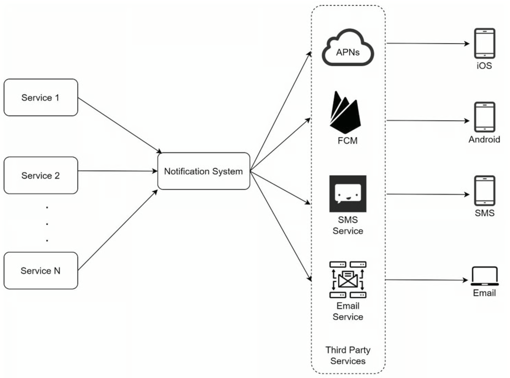
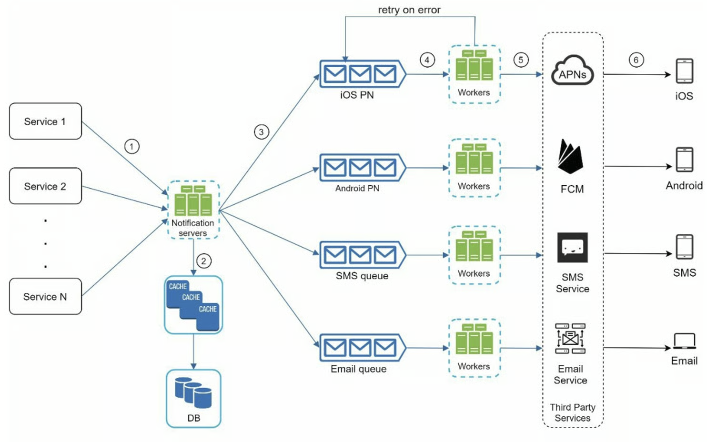

```toc
```

这个设计倒不是很复杂

## 分析

一般会要发送通知、短信、邮件等

还需要支持 PC、IOS 设备、安卓设备等

每天发送多少条通知？比如 100 万短信，500 万邮件等

## 设计

一般 IOS 设备通知需要用到 Apple 等通知服务 APNS；
安卓一般用 FCM；
短信需要使用电信运营商等服务 SMS；
邮件可以使用商用邮件服务器或者自己搭建；

一般在用户注册登录时会收集用户信息，比如一个用户可能有多个设备

那么一个最基础的设计如下



在这个设计中，发现了三个问题：
1. 单点故障（SPOF）：单一通知服务器意味着 SPOF。
2. 难以扩展：通知系统在一台服务器上处理所有与推送通知有关的事情。要独立扩展数据库、缓存和不同的通知处理组件是很有挑战性的。
3. 性能瓶颈：处理和发送通知可能是资源密集型的。例如，构建 HTML 页面和等待第三方服务的响应可能需要时间。在一个系统中处理所有事情可能会导致系统过载，尤其是在高峰期。

## 改进



- **缓存**：用户信息、设备信息、通知模板都被缓存了。
- **数据库**：它存储了关于用户、通知、设置等方面的数据。
- **消息队列**：它们消除了组件之间的依赖性。当大量的通知被发送出去时，消息队列可以作为缓冲区。每种通知类型都被分配了一个不同的消息队列，所以一个第三方服务的中断不会影响其他通知类型。
- **Workers**：Workers 是一组服务器，它们从消息队列中拉取通知事件并将它们发送到相应的第三方服务。


主要点有两个，一个是将不同类型的通知分开（这样可以更好的缓存一些固定信息，如模板等）；另外一个是增加了 workers，可以更好的进行扩展。

## 深入设计


### 可靠性

通知系统最重要的要求之一是它不能丢失数据。 通知通常可以延迟或重新排序，但绝不会丢失。 为了满足这个需求，通知系统**将通知数据持久化到数据库**中，并实现了重试机制。


### 其他组件和考虑因素

我们已经讨论了如何收集用户的联系信息，发送和接收通知。一个通知系统远不止这些。在这里，我们讨论了额外的组件，包括模板重复使用、通知设置、事件跟踪、系统监控、速率限制等。

- 通知模板
    一个大型的通知系统每天会发出数百万条通知，其中许多通知都遵循类似的格式。通知模板的引入是为了避免从头开始建立每一个通知。通知模板是一个预先格式化的通知，通过自定义参数、样式、跟踪链接等来创建你独特的通知。下面是一个推送通知的例子模板。
- 通知设置
    用户一般每天都会收到太多的通知，他们很容易感到不堪重负。因此，许多网站和应用程序让用户对通知设置进行细化控制。也就是对客户的通知信息进行记录，比如客户是否同意接收此类信息等。
- 速率限制
    为了避免用户被过多的通知所淹没，我们可以限制一个用户可以收到的通知数量。这一点很重要，因为如果我们发送得太频繁，接收者可能会完全关闭通知。
- 重试机制
    当第三方服务无法发送通知时，该通知将被添加到消息队列中进行重试。如果问题持续存在，将向开发者发出警报。
    
- 推送通知的安全问题
    对于 iOS 或 Android 应用程序，appKey 和 appSecret 被用来保护推送通知 API[6]。只有经过认证或验证的客户端才允许使用我们的 API 发送推送通知。
    
- 监视排队通知
    要监控的一个关键指标是排队通知的总数。如果这个数字很大，说明 workers 处理通知事件的速度不够快。为了避免通知交付的延迟，需要更多的工作者。

- 事件跟踪
  打开率、点击率和参与度等通知指标对于了解客户行为非常重要。 分析服务实现事件跟踪。 通常需要通知系统和分析服务之间的集成。 图 10-13 显示了可能出于分析目的而被跟踪的事件示例。其实就是收集客户的点击信息，这样便于进行用户行为分析。


