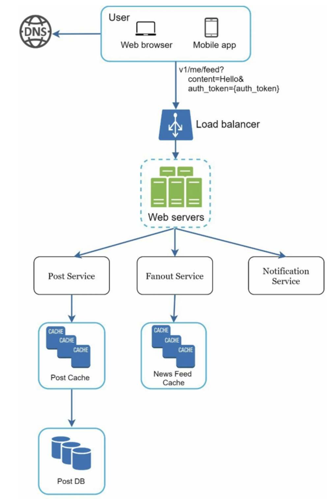
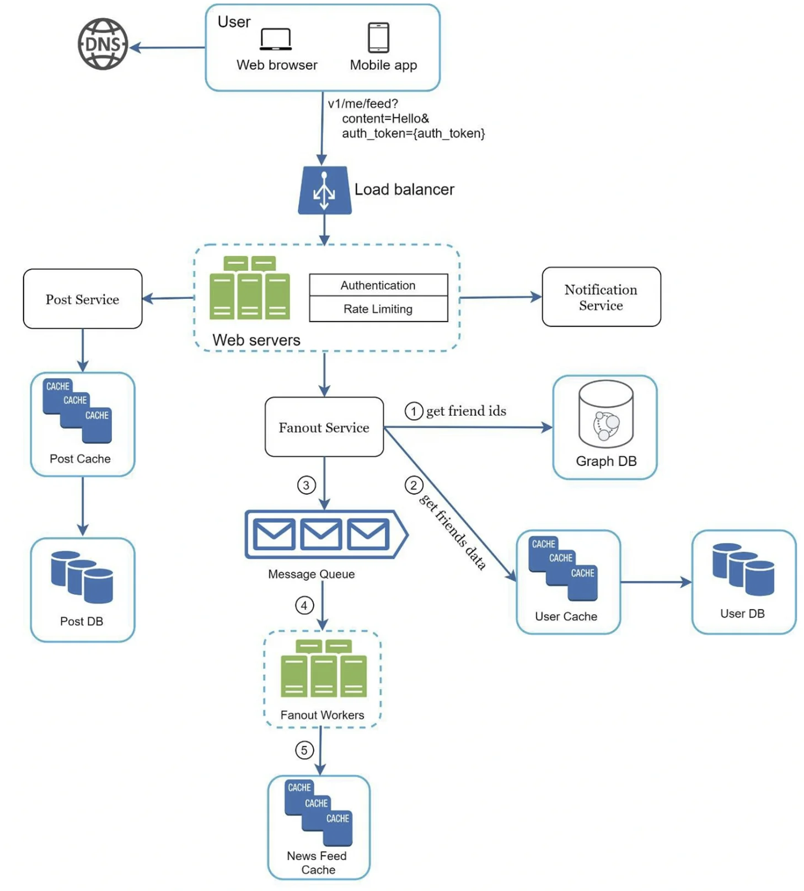

```toc
```


什么是信息推送？ 根据 Facebook 帮助页面，“动态是位于首页中间不断更新的动态列表。动态包括您在 Facebook 上关注的用户、公共主页和小组发布的状态更新、照片、视频、链接、应用事件和点赞。


## 分析

基本功能就是发帖和检索。

那这里需要好友可以看到，就需要给好友推送


## 设计

该设计分为两个流程：信息流发布和信息流构建：
- 信息发布（Feed publishing）：当用户发布帖子时，相应的数据被写入缓存和数据库。帖子被推送到她朋友的动态中。
- 信息流构建（Newsfeed building）：为简单起见，我们假设信息推送是通过按时间倒序聚合朋友的帖子来构建的。


### 信息发布



Post service: 帖子服务，需要保存帖子到数据库和缓存中
Fanout Service:推送新内容到朋友的信息流中。信息流数据存储的缓存汇总，以便快速检索。
通知服务：通知朋友有新内容，并发送通知。

## 深入设计


### 信息发布



这里帖子发布后，Fanout（扇出）需要将帖子通知给好友。一般有两种模式

**写扇出**

通过这种方法，信息流在写的时候就被预先计算了。一个新的帖子在发布后会立即被送到朋友的缓存中。

优点：
- 动态消息是实时生成的，可以第一时间推送给朋友。
- 获取信息流的速度很快，因为信息流是在写的时候预先计算的。

缺点：
- 如果一个用户有很多朋友，获取朋友列表并为所有朋友生成信息流是很慢的，而且很耗时间。这被称为**热键问题**。
- 对于不活跃的用户或那些很少登录的用户，预先计算的信息流会浪费计算资源。

**读扇出**

信息源是在阅读时间内产生的。这是一个按需分配的模式。当用户加载她的主页时，最近的帖子被拉出。

优点：
- 对于不活跃的用户或那些很少登录的用户，读取时的扇出效果更好，因为它不会在他们身上浪费计算资源。
- 数据不会被推送给朋友，所以不存在热键的问题。 

缺点：
- 获取信息源的速度很慢，因为信息源不是预先计算的。

我们采用了一种**混合方法**，以获得两种方法的好处并避免其中的缺点。由于快速获取信息流是至关重要的，我们对大多数用户使用推送模式。对于名人或有很多朋友/粉丝的用户，我们让粉丝按需提取信息内容以避免系统过载。一致性哈希是缓解热键问题的一个有用技术，因为它有助于更均匀地分配请求/数据。


## 总结

如果还剩几分钟，您可以讨论可扩展性问题。 为避免重复讨论，下面仅列出高层次的谈话要点。

数据库扩展：
- 垂直扩展 vs 水平扩展
- SQL vs NoSQL
- 主从复制
- 读写分离
- 一致性模型
- 数据库分片

其他谈话要点：
- 保持网络层的无状态
- 尽可能多地缓存数据
- 支持多个数据中心
- 使用消息队列降低耦合
- 监控关键指标。 例如，高峰时段的 QPS 和用户刷新信息流时的延迟值得监控。


