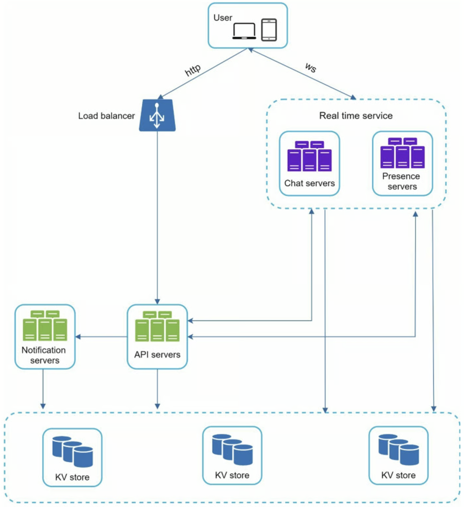
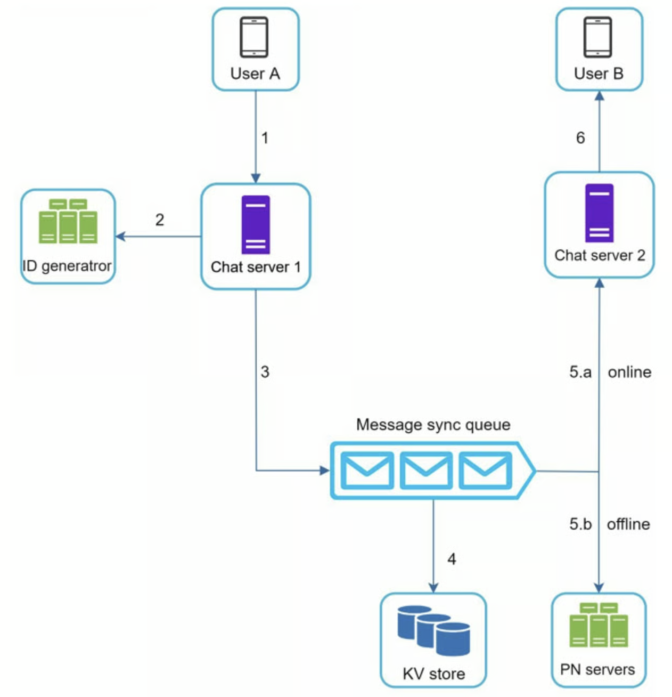
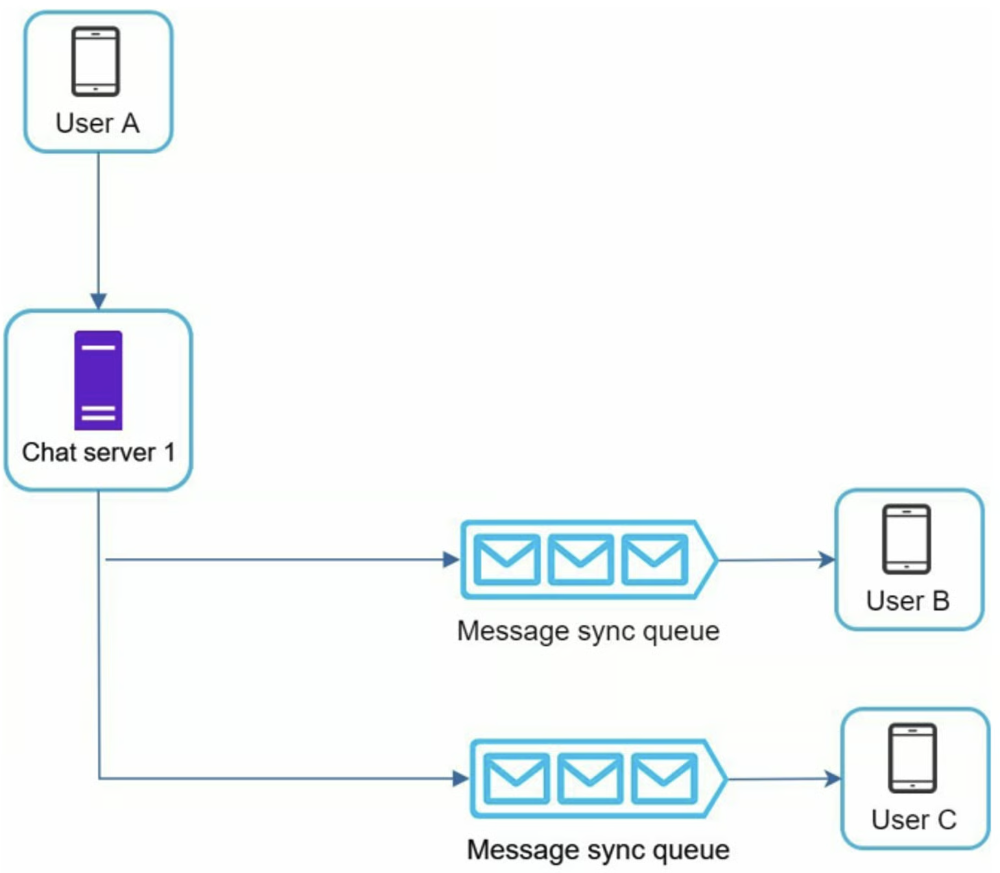

```toc
```

## 分析

支持 5000 万日活跃用户（DAU）。群组最多 100 人，文本最多 100000 字符，多设备聊天。


## 设计

这种聊天服务一般采用 websocket 服务。同时一般会将普通的注册、登陆等服务与聊天服务分开。普通的服务还是采用一般的 http 服务，而聊天单独采用 websocket 服务。

### 可扩展性



- 聊天服务器 (Chat servers) 促进了信息的发送/接收。
- 在线服务器 (Presence servers) 管理在线/离线状态。
- API 服务器 (API servers) 处理一切，包括用户登录、注册、更改资料等。
- 通知服务器 (Notification servers) 发送推送通知。
- 最后，键值存储 (KV store) 用于存储聊天历史。当一个离线用户上线时，她会看到她以前所有的聊天历史。


### 存储

存储对于一般的用户数据、好友数据、群组信息等等存储在关系型数据库会比较好。而对于聊天数据这种量大且易变的数据则需要其他类型存储了：

- 聊天系统的数据量是巨大的。之前的一项研究显示，Facebook 和 Whatsapp 每天要处理 600 亿条信息。
- 只有最近的聊天记录被频繁访问。用户通常不会查找旧的聊天记录。
- 虽然在大多数情况下都会查看最近的聊天记录，但用户可能会使用需要随机访问数据的功能，如搜索、查看您的提及内容、跳转到特定的消息等。这些情况应该由数据访问层来支持。
- 一对一聊天应用程序的读写比约为 1:1。

选择正确的存储系统，支持我们所有的使用案例是至关重要的。我们推荐键值存储，理由如下。

- 键值存储允许容易的水平扩展。
- 键值存储为访问数据提供了非常低的延迟。
- 关系型数据库不能很好地处理长尾[3]的数据。当索引变大时，随机访问是很昂贵的。
- 键值存储被其他成熟可靠的聊天应用程序所采用。

一般这种量大的数据会采用 RocksDB，可以极大提升 IO效率，其对 Value 时不可见的，不会区分存储的是文本还是图片。但是缺点是检索功能较弱，比如条件查询、模糊搜索、聚合、多字段联合检索等。一般在生产会在写入层使用 RocksDB，然后使用异步任务将数据同步到 MongoDB 或者 ES 中。

## 深入设计

### 服务发现

也就是服务器增加时需要一个服务器管理服务，一般使用 ZK

### 一对一聊天



1. 用户 A 向聊天服务器 1 发送了一条聊天信息。
2. 聊天服务器 1 从 ID 生成器获得一个信息 ID。
3. 聊天服务器 1 将消息发送至消息同步队列。
4. 消息被储存在一个键值存储中。
5. a. 如果用户 B 在线，信息被转发到用户 B 所连接的聊天服务器 2。
6. b. 如果用户 B 处于离线状态，则从推送通知（PN）服务器发送推送通知（这里又用到了之前的消息通知服务了）。
7. 聊天服务器 2 将消息转发给用户 B，用户 B 和聊天服务器 2 之间有一个持久的 WebSocket 连接。


### 群组聊天



这种设计选择很适合小群组聊天，因为：
- 它简化了信息同步流程，因为每个客户只需要检查自己的收件箱就可以获得新的信息。
- 当群组人数较少时，在每个收件人的收件箱中存储一份副本并不太昂贵。

微信使用类似的方法，它将一个群组限制在 500 个成员。然而，对于拥有大量用户的群组来说，为每个成员存储一份信息副本是不可接受的。这种一般就会让客户登陆后去拉取。其实就是 push 和 pull 的区别，对于量小的群组那么可以采用 push 的方式，否则就采用 pull 的方式。


### 用户在线状态

这种一般不会采用 ws 协议，这样太消耗资源了，因为用户状可能变化比较频繁，比如在火车上等，所以一般采用心跳进行检测。


## 总结

有额外的谈话要点：

- 扩展聊天应用程序以支持媒体文件，如照片和视频。媒体文件的大小明显大于文本。压缩、云存储和缩略图是值得讨论的话题。
- 端到端加密。Whatsapp 支持信息的端到端加密。只有发件人和收件人可以阅读信息。
- 在客户端缓存信息，可以有效地减少客户端和服务器之间的数据传输。
- 提高加载时间。Slack 建立了一个地理分布的网络来缓存用户的数据、频道等，以获得更好的加载时间。
- 故障处理。
    - 聊天服务器错误。可能有数十万，甚至更多的，坚持不懈的连接到一个聊天服务器。如果一个聊天服务器离线，服务发现（Zookeeper）会提供一个新的聊天服务器，让客户建立新的连接。
    - 消息重发机制。重试和排队是重发消息的常用技术。消息涉及排序就需要服务器时钟一致。


