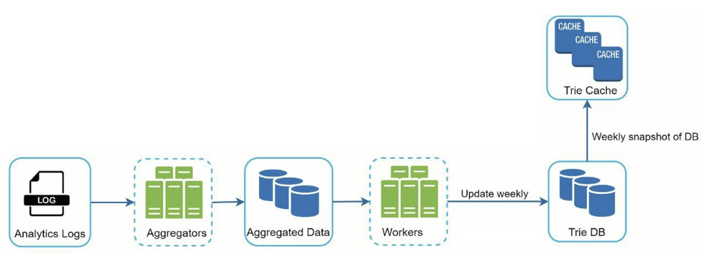

```toc
```

设计一个搜索自动完成系统，也叫 "设计 top k "或 "设计 top k 搜索最多的查询"。


## 分析

候选人：是否只支持在搜索查询的开始阶段进行匹配，还是在中间也支持？
面试官：只有在搜索查询的开始阶段。
候选人：系统应该返回多少个自动完成的建议？
面试官：5
候选人：系统如何知道要返回哪5条建议？
面试官：这是由受欢迎程度决定的，由历史查询频率决定。
应聘者：系统是否支持拼写检查？
面试官：不，不支持拼写检查或自动更正。
候选人：搜索查询是用英语吗？
面试官：是的。如果最后时间允许，我们可以讨论多语言支持。
候选人：我们允许大写字母和特殊字符吗？
面试官：不，我们假设所有的搜索查询都是小写字母。
候选人：有多少用户使用该产品？
面试官：1000万 DAU。


### 需求

以下是对要求的总结：
- 快速的响应时间：当用户输入搜索查询时，自动完成的建议必须足够快地显示出来。一篇关于 Facebook 自动完成系统的文章显示，该系统需要在 100 毫秒内返回结果，否则会造成卡顿。
- 相关性：自动完成的建议应该与搜索词相关。
- 已排序：系统返回的结果必须按受欢迎程度或其他排名模式进行排序。
- 可扩展性：该系统可以处理高流量。
- 高度可用：当系统的一部分脱机、速度减慢或遇到意外的网络错误时，系统应保持可用和可访问。

### 粗估

1000 万日活，平均每个人每天 10 次搜索，一次平均 20 字节的数据，每次搜索会发送 20 个请求，比如输入 apple，那么其实每输入一个字符就进行了一次请求。于是 QPS 约为 24000，峰值约为 96000。

同时假设 20% 的日常查询是新的。 `1000 万×10 个查询/天×每个查询 20 字节×20%=0.4 GB 1000 万×10 个查询/天×每个查询 20 字节×20%=0.4 GB`。 这意味着每天有 `0.4 GB` 的新数据被添加到存储中。


## 设计

一般主要功能有两个：数据收集服务和查询服务

### 数据收集服务

其实就是针对检索内容建立一个频率计数器，这样就可以知道每个检索输入的频率信息。


### 查询服务

我们在输入的时候输入框下方会展示一些常见的搜索结果（搜索建议），其实就是根据检索频率排序的。如果将频率信息存储在关系型数据库中就不太现实了。

## 深入设计

这里一般采用 Trie 数据结构。

### Trie 数据结构

其实就是一棵树（前缀树），根节点是空的，如果只是英文检索，那么节点中美次增加一个字母，这样就可以进行前缀匹配。但是如果只是单纯使用，可能还是会很慢。

一般有两种方式处理：
- 限制前缀的最大长度，比如 50
- 缓存节点的热门检索

### 数据收集服务

在我们以前的设计中，每当用户键入一个搜索查询，数据就会实时更新。由于以下两个原因，这种方法并不实用。

- 用户每天可能会输入数十亿次的查询。在每次查询中更新 trie，会大大减慢查询服务的速度。
- 构建 trie 后，热门建议可能不会有太大变化。 因此，没有必要经常更新 trie。
    

为了设计可扩展的数据收集服务，我们检查数据的来源和使用方式。 像 Twitter 这样的实时应用程序需要最新的自动完成建议。 但是，许多 Google 关键字的自动完成建议每天可能不会有太大变化。

尽管用例不同，但数据收集服务的底层基础保持不变，因为用于构建 trie 的数据通常来自分析或日志服务。



这里其实就是针对不那么频繁变化的场景，使用日志分析来构建 TrieDB。同时还使用 Trie Cache 来增加检索效率。

当然还有一些提速方式：比如浏览器缓存检索建议


### 扩展存储

按照上面说的仅支持英文，那么其实分片可以按照字母给每个 TrieDB 分配一个。但是其实不是很合理，因为可能 c 开头的检索比 x 开头的检索要多很多，这样就造成了分布不均。这里其实可以继续往后分，比如将 c 分成 cr、co 等等。


## 总结

**面试官：你如何扩展你的设计以支持多语言？**

为了支持其他非英语查询，我们将 Unicode 字符存储在 trie 节点中。

**面试官：如果一个国家/地区的热门搜索查询与其他国家/地区不同怎么办？**

在这种情况下，我们可能会为不同的国家建立不同的 trie。 为了缩短响应时间，我们可以将 trie 存储在 CDN 中。

**面试官：我们如何支持趋势（实时）搜索查询？**

假设一个新闻事件爆发了，一个搜索查询突然变得很流行。我们原来的设计将无法工作，因为：
- 离线工人还没有安排更新 trie，因为这被安排在每周的基础上运行。
- 即使安排了，也需要太长的时间来建立 trie。

构建一个实时搜索的自动完成器是很复杂的，超出了本书的范围，所以我们只给出一些想法：
- 通过分片减少工作数据集。
- 更改排名模型并为最近的搜索查询**分配更多权重**。


