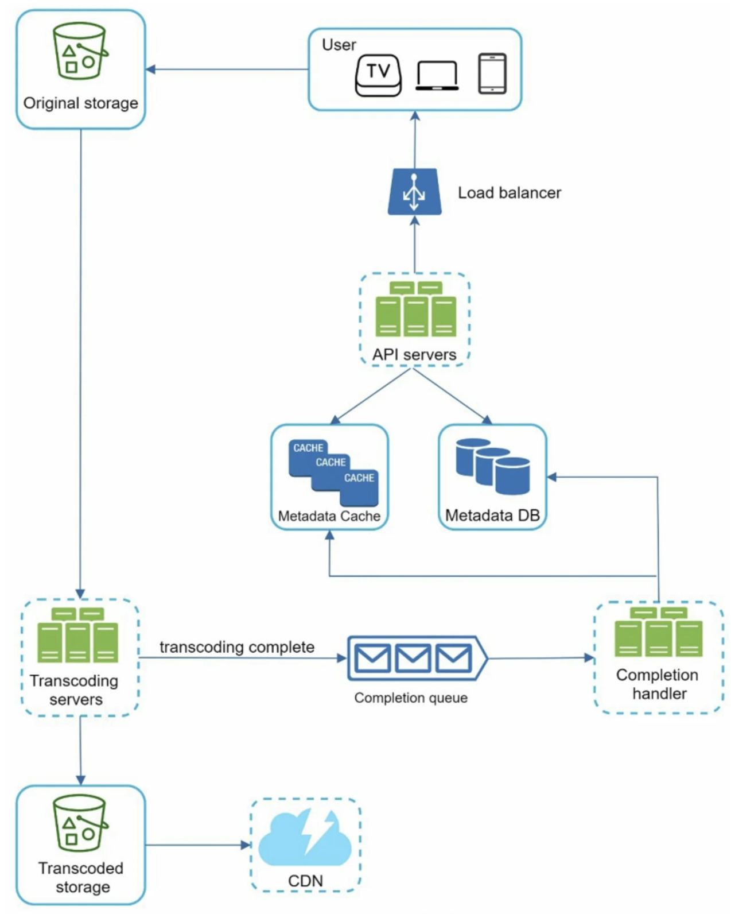

```toc
```


## 分析

一般会需要上传和观看的功能，同时涉及到 PC 和手机、电视。


### 粗估

- 假设该产品有 500 万日活跃用户（DAU）。
- 用户每天观看 5 个视频。
- 10%的用户每天上传 1 个视频。
- 假设平均视频大小为 300 MB。
- 每天需要的总存储空间。 `500 万×10%×300 MB=150 TB`
- CDN 成本比较高


## 设计


### 上传



它由以下几个部分组成：

- User（用户）：用户在电脑、移动电话或智能电视等设备上观看 YouTube。
- Load balancer（负载均衡器）：负载平衡器在 API 服务器之间均匀地分配请求。
- API servers（API 服务）：除了视频流，所有用户请求都要通过 API 服务器。
- Metadata DB（元数据数据库）：视频元数据被存储在元数据数据库中。它是分片和复制的，以满足性能和高可用性要求。
- Metadata cache（元数据缓存）：为了提高性能，视频元数据和用户对象被缓存起来。
- Original storage（原始存储）：blob 存储系统用来存储原始视频。维基百科中关于 blob 存储的一段引文显示。"二进制大对象（BLOB）是数据库管理系统中作为单一实体存储的二进制数据的集合"。
- Transcoding servers（转码服务器）：视频转码也被称为视频编码。它是将一种视频格式转换为其他格式（MPEG、HLS 等）的过程，为不同设备和带宽能力提供可能的最佳视频流。
- Transcoded storage（转码存储）：它是一个储存转码视频文件的 blob 存储。
- CDN（内容分发网络）：视频被缓存在 CDN 中。当你点击播放按钮时，视频会从 CDN 上流传下来。
- Completion queue（完成队列）：它是一个消息队列，存储有关视频转码完成事件的信息。
- Completion handler（完成处理程序）：他由一个工作者列表组成，从完成队列中提取事件数据并更新元数据缓存和数据库。


上传流程一般如下：
1. 视频被上传到原始的存储空间。
2. 转码服务器从原始存储中获取视频并开始转码。
3. 一旦转码完成，以下两个步骤将被平行执行。
    1. 转码后的视频被发送到转码后的存储空间。
    2. 转码完成事件被排在完成队列中。
4. (3 a.1)转码后的视频被分发到 CDN。
5. (3 b.1)完成处理程序包含一堆工作者，他们不断地从队列中提取事件数据。
6. (3 a.1 和 3 b.1)完成处理程序在视频转码完成后更新元数据数据库和缓存。
7. API 服务器通知客户，视频已经成功上传，可以进行流媒体播放。


这是一个基本的上传功能，当然可能还需要将视频切分成多个 chunck 以实现断点续传，同时还可以实现并行上传。上传完成后还需要更新视频元信息。


## 深入设计


### 视频转码

不需要关注细节。一般在原始视频上传完后还需要进行转码：
- 原始视频会消耗大量的存储空间。一段长达一小时的高清视频以每秒 60 帧的速度录制，可以占用几百 GB 的空间。
    
- 许多设备和浏览器只支持某些类型的视频格式。因此，出于兼容性的考虑，将视频编码为不同的格式是很重要的。
    
- 为了确保用户在观看高质量视频的同时保持流畅的播放，向拥有高网络带宽的用户提供更高分辨率的视频，向拥有低带宽的用户提供低分辨率的视频是一个好主意。
    
- 网络条件会发生变化，特别是在移动设备上。为确保视频的连续播放，根据网络条件自动或手动切换视频质量对用户的流畅体验至关重要。


转码细节比较复杂，这里需要重点关注转码效率，一般需要使用多个 worker 来对视频进行转码处理，这样比较容易扩展。**还可以将视频拆分成 vedio、audio、metedata 分别处理**。


### 系统优化

**速度优化：并行化视频上传**
将一个视频作为一个整体上传是低效的。我们可以通过 GOP 对齐将视频分割成小块 chunck。

**速度优化：将上传中心放在靠近用户的地方**
另一种提高上传速度的方法是在全球设立多个上传中心。美国的人可以把视频上传到北美的上传中心，而中国的人可以把视频上传到亚洲的上传中心。为了实现这一目标，我们使用 CDN 作为上传中心。

**速度优化：全链路并行化**
其实就是在上传和转码处理都引入消息队列实现全链路并行处理。

**安全优化：预签名的上传 URL**
安全是任何产品最重要的方面之一。为了确保只有授权用户将视频上传到正确的位置，我们引入了预签名的 URL。


### 成本优化

CDN 成本比较高，我们不需要将一个视频分发到所有 DCN，一般可以根据地区、热度进行平衡分发。


## 总结

这里有几个补充要点。

- 扩展 API 层：因为 API 服务器是无状态的，所以很容易横向扩展 API 层。
    
- 扩展数据库：你可以谈谈数据库复制和分片。
    
- 现场直播：它指的是一个视频如何被记录和实时播放的过程。虽然我们的系统不是专门为直播设计的，但直播和非直播有一些相似之处：都需要上传、编码和流媒体。显著的区别是：
    
    - 实时流媒体有更高的延迟要求，所以可能需要不同的流媒体协议。
    - 实时流媒体对并行性的要求较低，因为小块的数据已经被实时处理。
    - 实时流媒体需要不同的错误处理集。任何花费太多时间的错误处理都是不可接受的。
    
- 视频下架：对侵犯版权、色情等违法行为的视频进行下架。 有些可以在上传过程中被系统发现，而另一些则可能通过用户标记发现。


