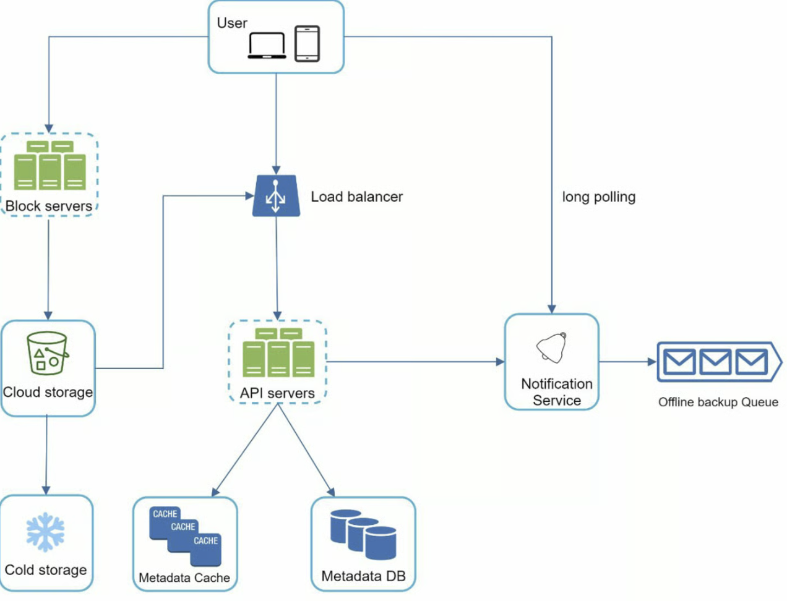

```toc
```


## 分析

主要功能就是上传下载文件，文件修改同步，通知。

一般会设计 PC 和手机端，文件大小有限制，多少用户量


### 粗估

一般这种系统的 QPS 不会太高。

## 设计

一般存储可以使用 blog 存储，为了避免磁盘空间不足导致上传失败，可以将大文件分片存储，当然更好的方式也可以使用云存储厂商的服务，比如 `Amazon S3`，提供可扩展性、数据可用性、安全性和性能服务。

可以讲基本的文件上传和一些元信息上传分开，和之前的视频上传类似。


### 同步冲突

当多个人同时修改同一个文件时一般处理方式是：先处理的版本获胜，后处理的版本接收冲突。




**User**：用户通过浏览器或移动应用程序使用该应用程序。

**Block servers**：块服务器将块上传到云存储。块存储，简称块级存储，是一种在基于云的环境中存储数据文件的技术。一个文件可以分成几个块，每个块都有一个唯一的哈希值，存储在我们的元数据数据库中。每个块都被视为一个独立的对象并存储在我们的存储系统 (S 3) 中。为了重建文件，块以特定顺序连接。至于块大小，我们参考了 Dropbox：它把一个块的最大大小设置为 4 MB [6]。

**Cloud storage**：文件被分割成更小的块并存储在云存储中。

**Cold storage**：冷存储是一种为存储非活动数据而设计的计算机系统，意味着文件在很长一段时间内不会被访问。

**Load balancer**：负载均衡器在 API 服务器之间平均分配请求。

**API servers**：这些服务器负责除上传流程以外的几乎所有工作。API 服务器用于用户认证、管理用户资料、更新文件元数据等。

**Metadata database**：它存储用户、文件、块、版本等元数据。请注意，文件存储在云端，元数据数据库仅包含元数据。

**Metadata cache**：一些元数据被缓存以便快速检索。

**Notification service**：它是一个发布者/订阅者系统，允许在某些事件发生时将数据从通知服务传输到客户端。在我们的具体案例中，通知服务会在其他地方添加/编辑/删除文件时通知相关客户，以便他们可以提取最新的更改。

**Offline backup queue**：如果客户端离线并且无法拉取最新的文件更改，离线备份队列会存储信息，以便在客户端在线时同步更改。


## 深入设计

### 块服务器

对于定期更新的大文件，在每次更新时发送整个文件会消耗大量带宽。提出了两种优化来最小化传输的网络流量：

- 增量同步。修改文件时，使用同步算法仅同步修改的块而不是整个文件。
- 压缩。对块进行压缩可以显著减少数据大小。因此，根据文件类型，使用压缩算法对块进行压缩。例如，gzip 和 bzip 2 是用来压缩文本文件的。压缩图像和视频则需要不同的压缩算法。


**高一致性要求**

我们的系统默认要求强一致性。一个文件同时被不同的客户端显示不同是不可接受的。系统需要为元数据缓存和数据库层提供强一致性。

内存缓存默认采用最终一致性模型，这意味着不同的副本可能有不同的数据。要实现强一致性，我们必须确保以下几点：

- 缓存副本和主服务器中的数据是一致的。
- 在数据库写入时使缓存无效，以确保缓存和数据库保持相同的值。

在关系数据库中实现强一致性很容易，因为它维护了 ACID（原子性、一致性、隔离性、持久性）属性。但是，NoSQL 数据库默认不支持 ACID 属性。 ACID 属性必须以编程方式合并到同步逻辑中。在我们的设计中，我们选择关系数据库，因为 ACID 是原生支持的。


