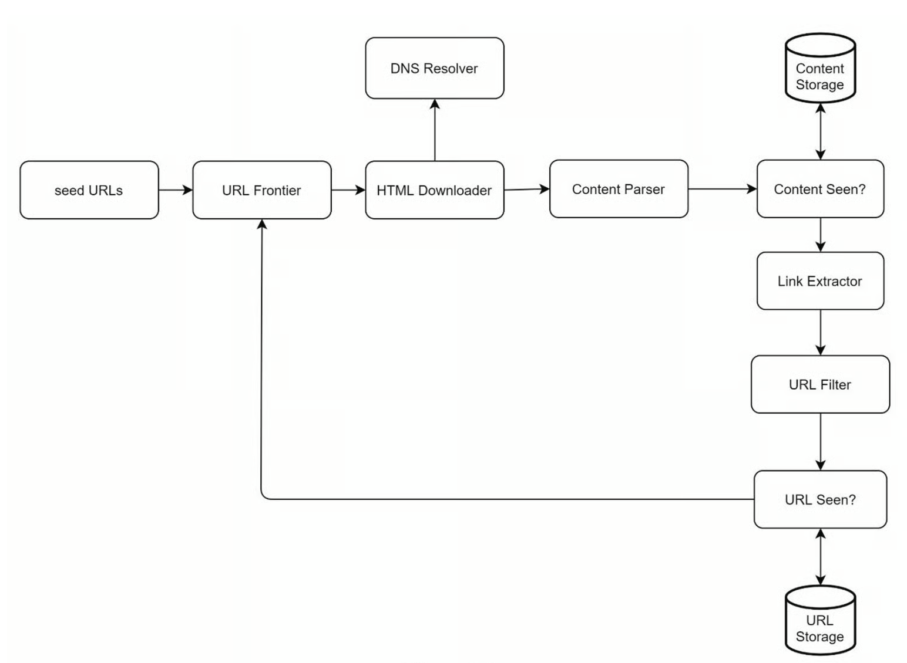
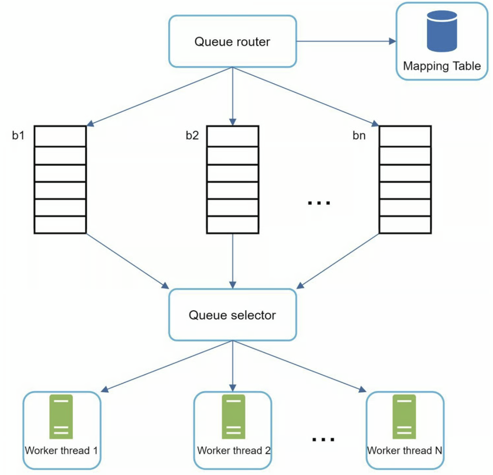
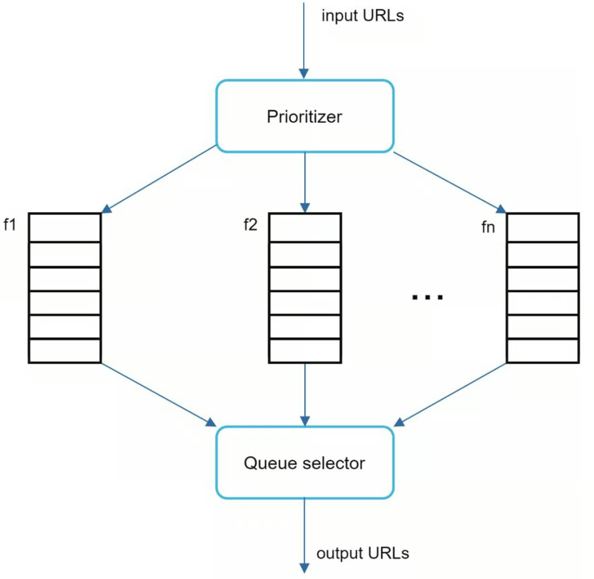
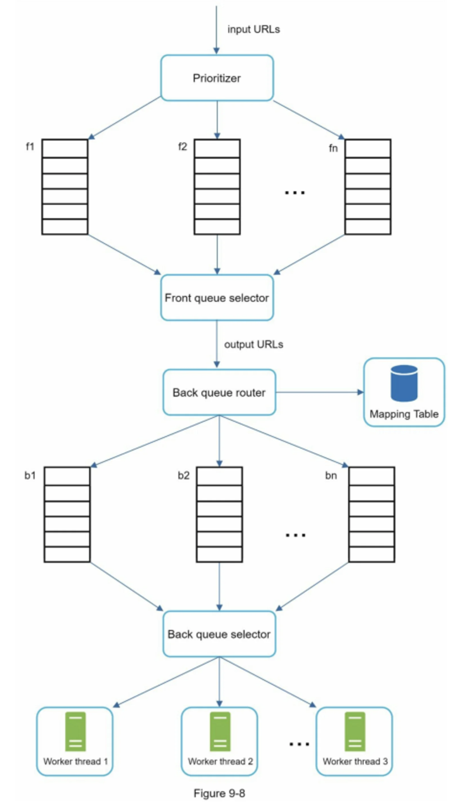
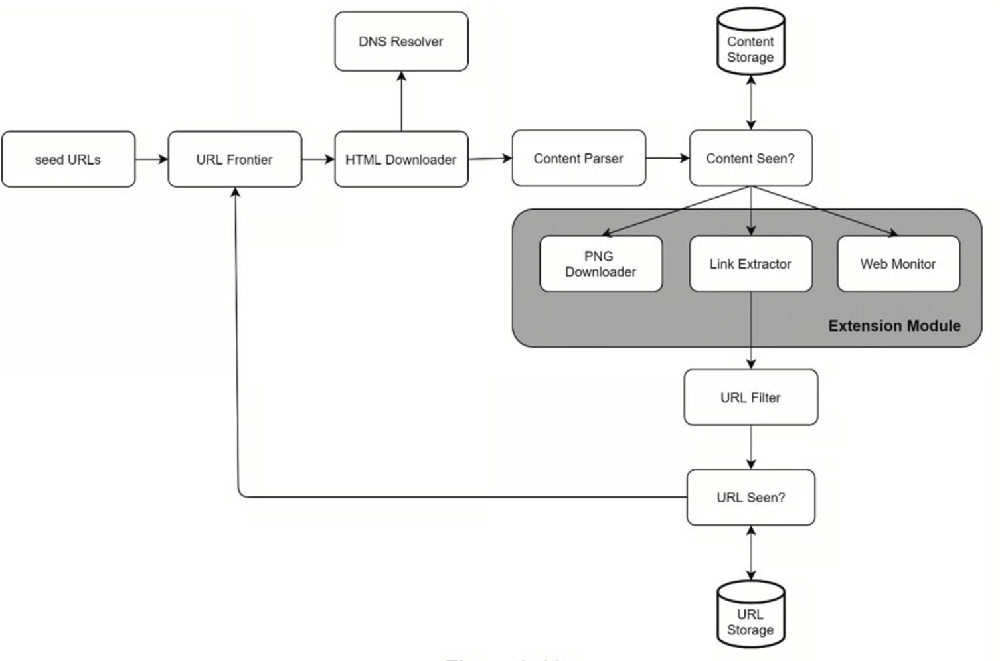

```toc
```


## 确定设计范围

网络爬虫的基本算法很简单：

- 给定一组 URLs，下载所有由 URLs 指向的网页。
- 从这些网页中提取 URL。
- 将新的 URL 添加到要下载的 URL 列表中。重复这3个步骤。

网络爬虫真的像这个基本算法一样简单吗？不完全是。设计一个高度可扩展的网络爬虫是一项极其复杂的任务。任何人都不太可能在面试时间内设计出一个庞大的网络爬虫。在进入设计之前，我们必须提出问题以了解需求并建立设计范围：


候选人：爬虫的主要目的是什么？它用于搜索引擎索引、数据挖掘或其他用途吗？
面试官：搜索引擎索引。
候选人：网络爬虫每个月收集多少网页？
面试官：10 亿页。
候选人：包括哪些内容类型？仅 HTML 还是其他内容类型（如 PDF 和图像）？
面试官：只有 HTML。
候选人：我们是否考虑新增或编辑的网页？
面试官：是的，我们应该考虑新添加或编辑的网页。
候选人：我们需要存储从网络上爬取的 HTML 页面吗？
面试官：是的，最多5年
应聘者：我们如何处理内容重复的网页？
面试官：重复内容的页面应该忽略。


除了要向面试官澄清的功能之外，记下优秀网络爬虫的以下特征也很重要：

- 可伸缩性（Scalability）：网络非常大。那里有数十亿个网页。使用并行化网络爬行应该非常有效。

- 鲁棒性（Robustness）：网络充满了陷阱。错误的 HTML、无响应的服务器、崩溃、恶意链接等都很常见。爬虫必须处理所有这些边缘情况。

- 礼貌（Politeness）：爬虫不应该在短时间间隔内向网站发出太多请求。

- 可扩展性（Extensibility）：系统非常灵活，因此只需进行最少的更改即可支持新的内容类型。比如我们以后要抓取图片文件，应该不需要重新设计整个系统。


### 粗略估算

以下估算基于许多假设，与面试官沟通以达成共识很重要。

- 假设每月下载 10 亿个网页。
- QPS： 1,000,000,000/30 天/24 小时/3600 秒=400 页/秒。
- 峰值 QPS=2×QPS=800 峰值 QPS=2×QPS=800，峰值可能更高，比如 4 倍
- 假设平均网页大小为 500 k
- 10 亿页×500 k=每月 500 TB 10 亿页×500 k=每月 500 TB 存储空间。如果您对数字存储单元不清楚，请重新阅读第 2 章中的“2 的幂”部分。
- 假设数据存储五年， 500 TB×12 个月×5 年=30 PB 500 TB×12 个月×5 年=30 PB。需要 30 PB 的存储来存储五年的内容。


## 设计

一个基本设计




### Seed URLs

网络爬虫使用种子 URL 作为爬网过程的起点。例如，要抓取大学网站的所有网页，选择种子 URL 的一种直观方法是使用大学的域名。

要抓取整个网络，我们需要创造性地选择种子 URL。一个好的种子 URL 是一个很好的起点，爬虫可以利用它来遍历尽可能多的链接。一般的策略是将整个 URL 空间分成更小的空间。第一个提议的方法是基于位置的，因为不同的国家可能有不同的流行网站.

另一种方法是根据主题选择种子网址；例如，我们可以将 URL 空间划分为购物、体育、医疗保健等。


### URL Frontier

爬虫的工作流程通常是这样的：
- 爬虫首先会从一组初始链接（称为“种子” Seeds）开始访问。
- 当它成功访问一个网页后，会解析该页面中的所有超链接。
- 这些新发现的、尚未被访问过的 URL，就会被统一放入 URL Frontier 中。
- 爬虫随后会根据 Frontier 中的调度策略，不断从中取出下一个要访问的 URL 进行抓取，如此循环往复。

**为什么它很重要？**

互联网上的网页数量是海量的，爬虫在给定时间内能下载的网页是有限的，因此不可能漫无目的地抓取。URL Frontier 的核心价值在于**决定“下一个抓取什么”**。

在 Frontier 中，未访问的链接会根据其“重要程度”或“价值”被赋予优先级，爬虫会按照这些优先级来决定访问顺序。例如：

- **通用爬虫**可能会采用广度优先或深度优先策略。
- **主题爬虫（Focused Crawler）**则会评估 URL 与特定主题的相关性，将高相关度的 URL 放在 Frontier 的前面优先抓取，从而避免下载大量无关网页。

**底层的设计挑战**

在实际的工业级爬虫中，设计一个健壮的 URL Frontier 并不只是简单地使用一个标准的先进先出（FIFO）队列。因为大多数网页的链接都指向同一个服务器，如果按顺序抓取，很容易对目标服务器造成“请求风暴”（Spamming）。

因此，成熟的 URL Frontier 设计通常会包含复杂的组件：

- **Front queues（前向队列）**：用于实现 URL 的优先级排序。
- **Back queues（后向队列）**：用于实现“礼貌性（Politeness）”，确保同一个主机（Host）的 URL 被隔离，避免并发请求过多。
- **Min-Heap（最小堆）**：用于控制对同一个服务器的请求时间间隔，确保爬虫遵守目标网站的访问限制。

简而言之，URL Frontier 是爬虫系统的“大脑”，它不仅决定了爬虫要抓哪些网页，还决定了以怎样的节奏和顺序去抓取。


### DNS Resolver

要下载网页，必须将 URL 转换为 IP 地址。 HTML Downloader 调用 DNS Resolver 为 URL 获取相应的 IP 地址。


### Content Parse

下载网页后，必须对其进行解析和验证，因为格式错误的网页可能会引发问题并浪费存储空间。在爬网服务器中实现内容解析器会减慢爬网过程。因此，Content Parser（内容解析器）是一个单独的组件。


### Content Seen

研究显示，29%的网页是重复的内容，这可能导致同一内容被多次存储。我们引入了 "Content Seen? "数据结构，以消除数据的冗余，缩短处理时间。它有助于检测以前存储在系统中的新内容。为了比较两个 HTML 文档，我们可以逐个字符进行比较。然而，这种方法既慢又费时，特别是当涉及到数十亿的网页时。完成这项任务的一个有效方法是**比较两个网页的哈希值**。


### Content Storage

它是一个用于存储 HTML 内容的存储系统。存储系统的选择取决于诸如数据类型、数据大小、访问频率、寿命等因素，磁盘和内存都被使用。

- 大部分内容存储在磁盘上，因为数据集太大而无法放入内存。
- 热门内容保存在内存中以减少延迟。


### URL Extractor

就是将网页中的 URL 提取出来。

### URL Filter

URL Filter 排除某些内容类型、文件扩展名、错误链接和“黑名单”站点中的 URL。

### URL Seen

"URL Seen? "是一个数据结构，用于跟踪之前被访问过的或已经在 Frontier 中的 URL。"URL Seen? "有助于避免多次添加相同的 URL，因为这可能会增加服务器负载并导致潜在的无限循环。

**布隆过滤器和哈希表**是实现 "URL Seen? "组件的常用技术。


**布隆过滤器**

布隆过滤器的底层结构非常简单，主要由两部分组成：
- 一个固定大小的位数组（Bit Array）：初始时所有的位（bit）都被置为 0。
- k 个相互独立的哈希函数：用于将输入的元素映射到位数组的不同索引位置。

插入元素时：
将元素输入到这 k 个哈希函数中，得到 k 个哈希值（对应位数组中的 k 个位置），然后将这些位置上的值全部置为 1。

查询元素时：
使用相同的 k 个哈希函数对要查询的元素进行计算，检查对应的 k 个位置：
- 肯定不存在（No False Negatives）：只要这 k 个位置中有任何一个是 0，那么这个元素绝对不存在于集合中。
- 可能存在（False Positives）：如果这 k 个位置全都是 1，那么这个元素可能存在于集合中。因为不同的元素经过哈希后可能会映射到相同的位置（哈希冲突），导致误判。

**核心优缺点**
优点：
极高的空间效率：不需要存储元素本身，只使用位数组，内存占用通常仅为传统哈希表的 1/8 到 1/4。
查询速度极快：插入和查询的时间复杂度均为 O(k)，k 为哈希函数个数，通常是常数级别。

局限性：
存在误判率：无法做到 100% 准确，随着集合中元素数量的增加，误判率会上升。
不支持直接删除：因为多个元素可能共用某些位，直接将某位置为 0 会影响其他元素的判断。
无法获取元素本身：只能判断存在性，不能从布隆过滤器中反推或提取原始数据。

为了解决基础布隆过滤器“无法删除”的痛点，工程上衍生出了**计数布隆过滤器（Counting Bloom Filter）**。


## 深入设计

接下来，我们将深入讨论最重要的构建组件和技术：
- 深度优先搜索 (DFS) 与广度优先搜索 (BFS)
- URL Frontier
- HTML Downloader
- 鲁棒性（Robustness）
- 可扩展性（Extensibility）
- 检测并避免有问题的内容


### DFS vs BFS


你可以把网络想象成一个有向图，其中网页作为节点，超链接（URL）作为边。抓取过程可以被视为从一个网页到其他网页的有向图的遍历。两种常见的图形遍历算法是 DFS 和 BFS。然而，**DFS 通常不是一个好的选择，因为 DFS 的深度可能很深**。

BFS 通常被网络爬虫使用，并通过先进先出 (FIFO) 队列实现。在 FIFO 队列中，URL 按照它们入队的顺序出队。但是，这种实现有两个问题：

1. 来自同一网页的大多数链接都链接回同一主机。[wikipedia.com](http://wikipedia.com/) 中的所有链接都是内部链接，使得爬虫忙于处理来自同一主机（[wikipedia.com](http://wikipedia.com/)）的 URL。当爬虫试图并行下载网页时，维基百科服务器将被请求淹没。这被认为是“不礼貌的”
2. 标准的 BFS 没有考虑到一个 URL 的优先级。网络很大，不是每个页面都有相同的质量和重要性。因此，我们可能希望根据页面排名、网络流量、更新频率等来确定 URL 的优先级。


### URL Frontier

URL Frontier 有助于解决这些问题。 URL Frontier 是一种存储要下载的 URL 的数据结构。 URL Frontier 是确保礼貌、URL 优先级和新鲜度的重要组成部分。

**礼貌性**

一般来说，网络爬虫应该避免在短时间内向同一个托管服务器发送过多的请求。发送过多请求会被视为“不礼貌”，甚至被视为拒绝服务 (DOS) 攻击。例如，在没有任何限制的情况下，爬虫可以每秒向同一个网站发送数千个请求。这会使 Web 服务器不堪重负。

强制礼貌的一般想法是一次从同一主机下载一个页面。可以在两个下载任务之间添加延迟。礼貌约束是通过维护从网站主机名到下载（工作）线程的映射来实现的。每个下载线程都有一个单独的 FIFO 队列，并且只下载从该队列中获得的 URL。如图所示：



- Queue router：它确保每个队列（`b1，b2，... bn`）仅包含来自同一主机的 URL。
- Mapping table：它将每个主机(`wikipedia.com`)映射到一个队列
- FIFO 队列 b 1、b 2 到 bn：每个队列包含来自同一主机的 URL。
- Queue selector：每个工作线程都映射到一个 FIFO 队列，它只从该队列下载 URL。队列选择逻辑由 Queue selector 完成
- Worker thread 1 到 N：一个工作线程从同一台主机上一个接一个地下载网页，可以在两个下载任务之间添加延迟。


**优先级**

一个关于 Apple 产品的讨论论坛上的随机帖子与苹果主页上的帖子具有非常不同的权重。尽管它们都有 "Apple "这个关键词，但爬虫首先抓取 Apple 主页是明智之举。

我们根据实用性对 URL 进行优先级排序，这可以通过 PageRank [10]、网站流量、更新频率等来衡量。“Prioritizer”是处理 URL 优先级的组件。

下图显示了管理 URL 优先级的设计。



- Prioritizer：它将 URL 作为输入并计算优先级。
- Queue f 1 到 fn：每个队列都有一个分配的优先级。优先级高的队列被选中的概率更高。
- Queue selector：随机选择一个偏向于具有更高优先级的队列

完整的 URL frontier 设计，它包含两个模块：
- 前端队列：管理优先级
- 后端队列：管理礼貌



**新鲜度**

网页不断被添加、删除和编辑。网络爬虫必须定期重新抓取下载的页面以保持我们的数据集最新。重新抓取所有 URL 既耗时又耗费资源。下面列出了几种优化新鲜度的策略：

- 根据网页的更新历史重新抓取。
- 对 URL 进行优先排序，优先和频繁地重新抓取重要页面。

**URL Frontier 存储**

在搜索引擎的真实世界抓取中，frontier 的 URL 数量可能达到数亿 [4]。将所有内容都放在内存中既不耐用也不可扩展。将所有内容都保存在磁盘中是不可取的，因为磁盘很慢；它很容易成为抓取的瓶颈。我们采用了混合方法。大多数 URL 都存储在磁盘上，因此存储空间不是问题。为了降低从磁盘读取和写入磁盘的成本，我们在内存中维护缓冲区以进行入队/出队操作。缓冲区中的数据会定期写入磁盘。


### HTML 下载器

#### Robots.txt

Robots.txt，称为 Robots 排除协议，是网站用来与爬虫沟通的标准。它规定了爬虫可以下载哪些页面。在尝试爬行一个网站之前，爬虫应首先检查其相应的 robots.txt，并遵守其规则。为了避免重复下载 robots.txt 文件，我们对该文件的结果进行了缓存。该文件会定期下载并保存到缓存中。下面是取自 https://www.amazon.com/robots.txt 的 robots.txt 文件的一个片段。一些目录，如 creatorhub，是不允许谷歌机器人访问的。

```
User-agent: Googlebot
Disallow: /creatorhub/*
Disallow: /rss/people/*/reviews
Disallow: /gp/pdp/rss/*/reviews
Disallow: /gp/cdp/member-reviews/
Disallow: /gp/aw/cr/
```


#### 性能优化

以下是 HTML 下载器的性能优化列表

1、分布式抓取

为了实现高性能，抓取工作被分配到多个服务器，每个服务器运行多个线程。URL 空间被分割成更小的部分；因此，每个下载器负责 URL 的一个子集。


2、缓存 DNS 解析器

DNS 解析器是爬虫的一个瓶颈，因为由于许多 DNS 接口的同步性，DNS 请求可能需要时间。DNS 响应时间从 10ms 到 200ms 不等。一旦爬虫线程对 DNS 进行了请求，其他线程就会被阻断，直到第一个请求完成。维护我们的 DNS 缓存以避免频繁调用 DNS 是一种有效的速度优化技术。我们的 DNS 缓存保持域名到 IP 地址的映射，并通过 cron 作业定期更新。

3、位置

按地理分布抓取服务器。当爬行服务器离网站主机较近时，爬行者会体验到更快的下载时间。设计定位适用于大多数系统组件：抓取服务器、缓存、队列、存储等。

4、短暂的超时

有些网络服务器响应缓慢，或者根本不响应。为了避免漫长的等待时间，指定了一个最大的等待时间。如果一个主机在预定的时间内没有反应，爬虫将停止工作并抓取一些其他的网页。


### 鲁棒性

除了性能优化，鲁棒性也是一个重要的考虑因素。我们提出了一些提高系统鲁棒性的方法。

- 一致性哈希：这有助于在下载者之间分配负载。 可以使用一致性哈希添加或删除新的下载服务器。 有关详细信息，请参阅第 5 章：设计一致性哈希。
    
- 保存爬行状态和数据：为了防止失败，爬行状态和数据被写入存储系统。 通过加载保存的状态和数据，可以轻松地重新启动中断的爬网。
    
- 异常处理：错误在大型系统中是不可避免的，也是常见的。 爬虫必须在不使系统崩溃的情况下优雅地处理异常。
    
- 数据校验：这是防止系统出错的重要措施。


### 可扩展性（Exensibility）

差不多每个系统都在不断发展，设计目标之一是使系统足够灵活，以支持新的内容类型。抓取器可以通过插入新的模块来扩展。图中显示了如何添加新模块。


- PNG 下载器模块是用于下载 PNG 文件的插件。
- 增加了网络监控模块，以监控网络并防止版权和商标侵权。


### 检测并避免有问题的内容

1. 冗余内容
    如前所述，近30%的网页是重复的。哈希值或校验和有助于检测重复[11]。
    
2. 搜索引擎蜘蛛陷阱
    搜索引擎蜘蛛陷阱是导致爬虫陷入无限循环的网页。 例如，一个无限深的目录结构如下：`http://www.spidertrapexample.com/foo/bar/foo/bar/foo/bar/...` 可以通过设置 URL 的最大长度来避免此类蜘蛛陷阱。但是，不存在检测蜘蛛陷阱的万能解决方案。 包含蜘蛛陷阱的网站很容易识别，因为在此类网站上发现的网页数量异常多。 很难开发自动算法来避免蜘蛛陷阱； 但是，用户可以手动验证和识别蜘蛛陷阱，并从爬虫中排除这些网站或应用一些自定义的 URL 过滤器。
    
3. 垃圾数据
    有些内容价值很小或没有价值，例如广告、代码片段、垃圾邮件 URL 等。这些内容对爬虫没有用，应尽可能排除。


