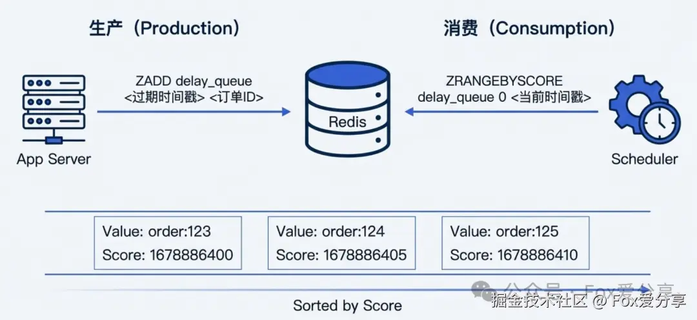
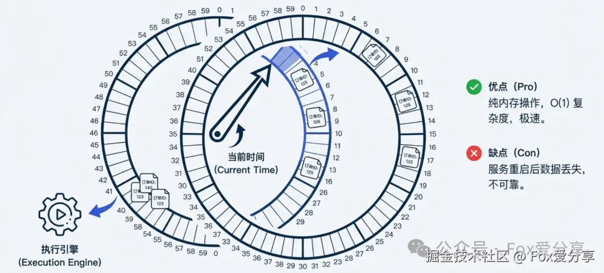

```toc
```

淘宝/美团的订单，如果用户下单 30 分钟没支付，怎么自动取消订单？

简单回答：写个定时任务（Schedule），每分钟去数据库捞一次，把超过 30 分钟的订单查出来，状态改成取消不就行了？

一般会被连问了三个问题：

1. 如果数据库里有 1000 万条未支付订单，你每一分钟全表扫一次？数据库不崩吗？
2. 你每分钟扫一次，那用户第 1 分钟下单，岂不是可能第 31 分 59 秒才被取消？延迟这么大能接受吗？
3. 如果你的定时任务机器挂了，或者任务执行时间超过了 1 分钟，这期间的订单怎么办？

## 定时任务是简单回答

在低并发、数据量小的系统（比如内部 OA），用 Spring `@Scheduled` 跑定时任务没问题。但在大厂高并发场景下，它有三个致命死穴：

1. **时效性差**：轮询有间隔，无法精确到秒级取消。
2. **数据库压力大**：由“推”变“拉”，频繁的全表扫描（Scan）是数据库 CPU 飙升的元凶。
3. **资源浪费**：大部分时候可能根本没有超时订单，但任务还在空跑。

**所以，高分答案的核心思路必须是：不要去轮询数据库，而是让超时订单“自己找上门”。**

  
## 三种解法

### Redis 过期监听

就是将相关 key 存入 redis，设置过期时间。但是这是陷阱

- **不可靠**：Redis 的过期监听（Expired Event）是“发后即忘”的。如果你的服务当时重启了，或者网络抖动没收到通知，这个事件就**丢了**！订单永远不会被取消。
- **延迟大**：Redis 的过期删除策略是“惰性+定期”，并不保证 Key 刚好在 30 分钟那一刻立刻删除，延迟几分钟是常事。

  
### Redis ZSet + 轮询




- **原理**：利用 ZSet 的 `Score` 属性存储“订单超时的具体时间戳”，`Value` 存订单号。
- **生产阶段（下单）** ：`ZADD delay_queue <30分钟后的时间戳> <OrderId>`
- **消费阶段（轮询）** ： 启动一个后台线程，每秒从 ZSet 里“捞”数据。我们要找的是 `Score <= 当前时间` 的元素（即已经超时的）。`ZRANGEBYSCORE delay_queue 0 <当前时间戳> LIMIT 0 10`
- **优点**：性能高（内存读写），精准（秒级误差）。

**⚠️ 高阶防坑点（关键）：** 面试官可能会问：“如果 Lua 脚本把 Redis 数据删了，但业务逻辑执行失败（比如服务挂了），这笔订单岂不是**永久丢失**了？”

**满分补丁**： “为了防止这种情况，我们采用 **Ack 机制** 或 **二段式处理**： Lua 脚本不是直接删除，而是把订单号从 `delay_queue` 原子移动到 `processing_queue`（处理中队列）。 业务处理完毕后，再删除 `processing_queue` 里的数据。 如果服务宕机，后台有守护线程扫描 `processing_queue` 中停留过久的任务进行重试。这样就保证了**至少消费一次（At Least Once）** 。”

  

### 消息队列/时间轮

如果数据量达到亿级，ZSet 的大 Key 也会有性能瓶颈。这时候要搬出“大杀器”。

**A. 消息队列（RocketMQ / RabbitMQ）**

利用 MQ 的  **“延时消息”**  功能。

- **RocketMQ**：注意！RocketMQ 4.x 只支持固定的延时等级（1 s, 5 s...30 m），不够灵活。如果面试官问“非固定时间的任意延迟怎么办”，你要提 **RocketMQ 5.0**（支持任意时间）或者用 **Redis ZSet** 兜底。
- **RabbitMQ**：原生 TTL + 死信队列有一个坑叫**队头阻塞**（如果第一个消息没过期，后面的过期了也取不出来）。必须使用 `rabbitmq_delayed_message_exchange` 插件才能解决。


**B. 时间轮算法 (Hashed Wheel Timer)**

这是 Netty、Kafka 内部都在用的底层算法。



- **逻辑**：想象一个钟表，有 60 个格子，指针每秒走一格。订单 30 分钟后过期，就把它挂在“当前格子 + 1800”的那个槽位上。
- **优势**：纯内存操作，极其高效。
- **短板**：内存不可靠，重启即丢。
- **大厂实践**：通常是用 **Redis ZSet 做持久化存储 + 内存时间轮做高频触发**。Redis 负责存 1 小时后的任务，应用启动时把近期任务加载到内存时间轮里执行。
- 
为什么比“每个任务一个 Timer”高效？
- **插入 O(1)**：算个槽位挂上去就行，不需要遍历或排序。
- **触发批量**：指针走到哪，整个槽位的任务一起处理，而不是每个任务单独调度。
- **空间可控**：槽位数固定，任务以链表形式挂在槽位上，内存开销小。
- **适合海量短任务**：Netty 用它管理大量连接的超时、心跳等。


## 最后的“防杠”指南（扫清死角）


**Q1：多个节点同时轮询 ZSet，怎么防止重复取消订单？**

**答**： “这是一个经典的并发问题。 第一，利用 **Lua 脚本** 保证 `ZRANGE` 和 `ZREM` 的原子性，谁抢到谁删，防止多线程读到同一条。 第二，**业务幂等**。取消订单的 Service 接口必须实现幂等，不管调几次，状态只能从‘未支付’变‘已取消’，更新成功才返回 true，否则返回 false。”

**Q2：Redis ZSet 变成大 Key 怎么办（千万级订单）？**

**答**： “**分片（Sharding）** 。 不要把所有订单放一个 Key。按订单 ID 哈希取模，分散到 `delay_queue_0` 到 `delay_queue_9` 这 10 个 ZSet 里。启动 10 个线程分别去轮询，吞吐量直接翻 10 倍。”

**Q3：万一中间件全崩了，怎么办？**

**答**： “虽然概率极低，但必须有**兜底（Fallback）** 。 我会保留一个 **T+1 的离线扫描任务**（跑在从库上），每天凌晨把昨天遗漏的未支付订单扫一遍进行取消。架构设计要有‘中间件解耦’的自信，也要有‘最终一致性’的敬畏。”

  


