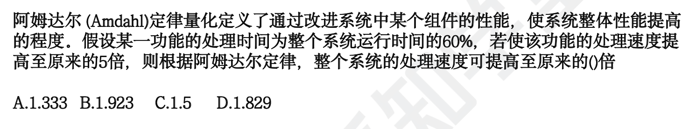

```toc

```

一般 1，2 分

## 性能指标

对计算机评价的主要性能指标（以下都要了解掌握)：
计算机评价的主要性能指标是用来衡量计算机系统性能的重要标准。

时钟频率、运算速度、运算精度、内存的存储容量、存储器的存取周期、数据处理速率
PDR (`processingdatarate`)吞吐率、各种响应时间、各种利用率、RASIS 特性 (可靠性 Reliability、可用性 `Availability`、可维护性 `Sericeability`、完整性和安全性 `Integraity and Security`)、平均故障响应时间、兼容性、可扩充性、性能价格比。


对路由器评价的主要性能指标（对核心指标要知道）：
路由器性能评价指标的主要作用是帮助评估和描述路由器的性能表现。

设备吞吐量、端口吞吐量、全双工线速转发能力、背靠背帧数、路由表能力、背板能力、
丢包率、时延、时延抖动、VPN 支持能力、内部时钟精度、队列管理机制、端口硬件队列数、分类业务带宽保证、RSVP、IP DiffServ、CAR 支持、冗余、热插拔组件、路由器冗余协议、网管、基于 web 的管理、网管类型、带外网管支持、网管粒度、计费能力/协议、分组语音支持方式、协议支持、语音压缩能力、端口密度、信令支持。

对交换机评价的主要性能指标（了解就可以）：
对交换机评价的主要性能指标有：交换机类型、配置、支持的网络类型、最大 ATM 端口数、最大 SONET 端口数、最大 FDDI 端口数、背板吞吐量、缓冲区大小、最大 MAC 地址表大小、最大电源数、支持协议和标准、路由信息协议（RIP)、RiP 2、开放式最短路径优先第 2 版、边界网关林议（BGP）、无类城问路由（CIDR）、百联网成组管理协议（IGMP)、距离天量多播路由协议（DVMRP）、开放式最短路径优先多播路由协议（MOSPF)、协议无关的多播协议（PIM）、资源预留协议（RSYP)、802.1 p 优先级标记，多队列、路由、支持第3层交换、支持多层 (4 到 7 层）交换、支持多协议路由、
文持路电缓存、可支持最大路由表数、VLAN、最大 VLAN 数量、网管、支持网管类型、支持端口镜像、Qos、支持基于策略的第 2 层交换、每端口最大优先级队列数、支持基于策略的第 3 层交换，支持基于策略的应用级 QoS、支持最小最大带宽分配、几余、热交换组件 (管理卡，交换结构，接口模块，电源，冷却系统、支持端口链路聚集协议、负载均衡。

对网络评价主要性能指标（要掌握）：
设备级性能指标、网络级性能指标、应用级性能指标、用户级性能指标；

对操作系统评价主要性能指标（要掌握)：
系统的可靠性、系统的吞吐率 (量）、系统响应时间、系统资源利用率、可移植性

对数据库管理系统的主要性能指标（要掌握）：
分为数据库本身和管理系统两部分，数据库的大小，数据库中表的数量、单个表的大小、
表中允许的记录（行)数量、单个记录 (行） 的大小、表上所允许的索引数量、数据库所允许的索引数量、最大并发事务处理能力、负教均街能力、最大连接数等

对 WEB 服务器评价的主要性能指标有（要掌握）：
最大并发连接数、响应延迟、吞吐量


## 性能评价方法

性能评测的常用方法
(1) 时钟频率。一般来讲，主频越高，速度越快
(2) 指令执行速度。计量单位 KIPS、 MIPS.
(3) 等效指令速度法。统计各类指令在程序中所占比例，并进行折算，是一种固定比例法。
(4) 数据处理速率 (Processing Data Rate. PDR) 法，采用计算 PDR 值的方法来衡量机器性能，PDR 值越大，机器性能越好。PDR 与每条指令和每个操作数的平均位数以及每条指令的平均运算速度有关

基准程序法 (Benchmark)：把应用程序中用得最多最频繁的那部分核心程序作为评价计
算机性能的标准程序，称为基准测试程序（benchmark)是目前被用户一致承认的测试性能的较好方法，有多种多样的基准程序.

其中包含：
1、整数测试程序。同一家的机器，采用相同的体系结构，用相同的基准程序测试，得到的MIPS 值越大，一般说明机器速度越快。
2、浮点测试程序。指标 MFLOPS (理论峰值浮点速度）
3、SPEC 基准程序 (SPEC Benchmark)。重点面向处理器性能的基准程序集将被测计算机的执行时间标准化，即将被测计算机的执行时间除以一个参考处理器的执行时间.
4、TPC 基准程序。用于评测计算机在事务处理、数据库处理、企业管理与决策支持系统等方面的性能。其中，TPC-C 是在线事务处理 (`On-line TransactionProcessing， OLTP`) 的基准程序．TPC-D 是决策支持的基准程序。TPC-E 作为大型企业信息服务的基准程序大多数情况下，为测试新系统的性能，用户必须依靠评价程序来评价机器的性能。下面列出了 4 种评价程序，它们评测的准确程度依次递减：真实的程序、核心程序、小型基准程序、合成基准程序。


## 阿姆达尔解决方法

阿姆达尔 (Amdah)定律主要用于系统性能改进的计算中。阿姆达尔定律是指计算机系统中对某一部件采用某种更快的执行方式所获得的系统性能改变程度取决于这种方式被使用的频率，或所占总执行时间的比例。

$加速比 = \displaystyle\frac{不使用增强部件时完成整个任务的时间}{使用增强部件时完成整个任务的时间}$

$新的执行时间=原来的执行时间×\big((1-增强比例) + \displaystyle\frac{增强比例}{增强加速比}\big)$

$总加速比 = \displaystyle\frac{原来的执行时间}{新的执行时间} = \displaystyle\frac{1}{\big((1-增强比例) + \displaystyle\frac{增强比例}{增强加速比}\big)}$

这里加速比和总加速比不就是一个概念吗？



如果以前的时间是 t，那么新的时间就是 `40%t + (60%/5)t`, 于是提高比就是 `1/52% = 1.923`