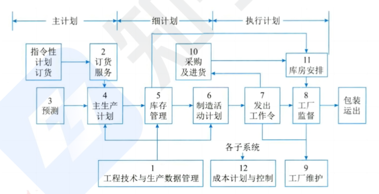
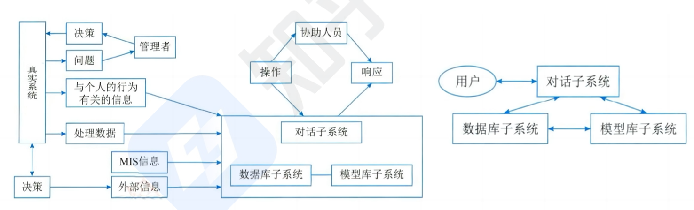

```toc
```

## 信息系统开发方法

### 结构化方法

结构化方法：结构是指系统内各个组成要素之间的相互联系、相互作用的框架．结构化开发方法就是把软件开发过程划分成若干个阶段和步骤, 每个阶段有明确的输人和输出, 并采用一定的技术或表示方式来描述各个阶段的工作成果，结构化方法是一种传统的信息
系统开发方法，由结构化分析 (SA)、结构化设计 (SD)和结构化程序设计 (SP)三部分有机组合而成，其精髓是自顶向下、逐步求精和模块化设计。

结构化方法的主要阶段：
- 需求分析阶段：与用户沟通, 明确软件需求和业务流程, 绘制需求模型图.
- 概要设计阶段：根据需求, 设计软件的总体结构和模块, 描绘系统结构图.
- 详细设计阶段：对各个模块进行详细的接口设计、数据库设计、业务逻辑设计, 画出详细设计图.
- 编码实现阶段：根据详细设计文档, 选择编程语言编写程序代码.
- 测试阶段：对编写的代码进行测试, 确保软件符合需求。
- 部署阶段：将测试通过的代码安装部署到服务器, 推向产品环境.

结构化方法的主要特点
- 开发目标清晰化．结构化方法的系统开发遵循“用户第一”的原则.
- 开发工作阶段化．每个阶段工作完成后，要根据阶段工作目标和要求进行审查，这使各阶段工作有条不紊地进行，便于项目管理与控制.
- 开发文档规范化．结构化方法每个阶段工作完成后，要按照要求完成相应的文档，以保证各个工作阶段的街接与系统维护工作的遍历，
- 设计方法结构化．在系统分析与设计时，从整体和全局考虑，自顶向下地分解; 在系统实现时，根据设计的要求，先编写各个具体的功能模块，然后自底向上逐步实现整个系统.

结构化方法的不足和局限
- 开发周期长：按顺序经历各个阶段，直到实施阶段结束后，用广才能使用系统.
- 难以适应需求变化：不适用于需求不明确或经常变更的项目.
- 很少考虑数据结构：结构化方法是一种面向数据流的开发方法，很少考虑数据结构.

结构化方法一般利用图形表达用户需求，常用工具有数据流图、数据字典、结构化语言、判定表以及判定树等

### 原型化方法

原型化方法：也称为快速原型法，或者简称为原型法．它是一种根据用户初步需求，利用系统开发工具，快速地建立一个系统模型展示给用户，在此基础上与用户交流，最终实现用户需求的信息系统快速开发的方法，有以下分类和特点：
- 按是否实现功能分类：分为水平原型 (行为原型，功能的导航)、垂直原型（结构化原型，实现了部分功能).
- 按最终结果分类：分为抛弃式原型、演化式原型.
- 原型法可以使系统开发的周期缩短、成本和风险降低、速度加快，获得较高的综合开发效益
- 原型法是以用户为中心来开发系统的，用户参与的程度大大提高，开发的系统符合用户的需求，因而增加了用户的满意度，提高了系统开发的成功率，
- 由于用户参与了系统开发的全过程，对系统的功能和结构容易理解和接受，有利于系统的移交，有利于系统的运行与维护.
- 原型法的不足之处： 开发的环境要求高。管理水平要求高

由以上的分析可以看出，原型法的优点主要在于能更有效地确认用户需求。从直观上来看，原型法适用于那些需求不明确的系统开发。事实上，对于分析层面难度大、技术层面难度不大的系统，适合于原型法开发

### 面向对象的方法

面向对象方法：面向对象 (OO)方法认为，客观世界是由各种对象组成的，任何事物都是对象每一个对象都有自己的运动规律和内部状态，都属于某个对象类，是该对象类的一个元素．复杂的对象可由相对简单的各种对象以某种方式而构成，不同对象的组合及相互作用就构成了系统，有以下特点：
- 使用 00 方法构造的系统具有更好的复用性，其关键在于建立一个全面、合理、统一的模型．00 方法也划分阶段，但其中的系统分析、系统设计和系统实现三个阶段之间已经没有"缝隙"也就是说，这三个阶段的界限变得不明确，某项工作既可以在前一个阶段完成，也可以在后一个阶段完成; 前一个阶段工作做得不够细，在后一个阶段可以补充。
- 面向对象方法可以普遍适用于各类信息系统的开发
- 面向对象方法的不足之处：必须依靠一定的面向对象技术支持，在大型项目的开发上具有一定的局限性，不能涉足系统分析以前的开发环节.

当前，一些大型信息系统的开发，通常是将结构化方法和 OO 方法结合起来。首先，使用结构化方法进行自顶向下的整体划分; 然后，自底向上地采用 00 方法进行开发．因此，结构化方法和 OO 方法仍是两种在系统开发领域中相互依存的、不可替代的方法

### 面向服务的方法

面向服务的方法．面向服务 (Service Oriented Architecture, 简称 SOA)的方法：进一步将接口的定义与实现进行解耦，则催生了服务和面向服务的开发方法

举例：面向服务开发方法, 就像我们日常生活中使用的各种服务一样。比如叫外卖, 我们可以选择用美团外卖、饿了么等应用, 它们都提供了外卖订餐服务．这些外卖应用就是调用了餐馆提供的“外卖服务”。再比如坐车, 我们可以选择用滴滴、微信打车等应用叫车, 它们调用了出租车公司提供的“叫车服务"．可以看到, 餐馆和出租车公司将自己的服务以标准接口的形式对外提供, 各种应用可以灵活调用这些服务。如果餐馆或者出租车公司要改进服务流程, 对外部调用者没有影响, 因为服务接口没有变。这就实现了服务提供者和服务调用者的松耦合．服务调用者只关心服务接口, 不关心服务的内部实现。面向服务开发就是这样一种思想, 要把系统分割成不同的服务，每个服务完成一项业务功能, 服务之间通过开放接口进行交互。这样可以提高服务的重用性和系统的灵活性.比如新增业务时, 可以调用已有服务, 无需从头开发．

从应用的角度来看，组织内部、组织之间各种应用系统的互相通信和互操作性直接影响着组织对信息的掌握程度和处理速度。如何使信息系统快速响应需求与环境变化，提高系统可复用性、信息资源共享和系统之间的互操作性，成为影响信息化建设效率的关键问题，而 SOA 的思维方式恰好满足了这种需求。

## 业务处理系统 TPS

又可称为电子数据处理系统 (EDP)，最初级形式的信息系统．针对管理中具体的事务 (如财会、销售、库存等)来辅助管理人员将所发生的数据进行记录、传票、记账、统计和分类，并制成报表等活动，为经营决策提供有效信息的基于计算机的信息系统.

由于 TPS 的主要功能就是对企业管理中日常事务所发生的数据进行输入、处理和输出．因此，TPS 的数据处理周期由以下几个构成：
- 数据输入：主要解决如何将企业经营活动中产生的大量原始数据准确、迅速地输人到计算机系统中并存储起来，这是信息系统进行信息处理的瓶颈”．因此，数据的输人方式和进度是这个阶段的关键问题．常见的数据输入方式有 3 种，即人工、自动及二者结合.
- 数据处理：TPS 中常见的数据处理方式有两种，一种是批处理方式 (将事务数据积累到一段时间后进行定期处理); 另一种是联机事务处理方式 (OLTP，实时处理）.
- 数据维护：一个组织的数据库通过 TPS 来更新，以确保数据库中的数据能及时、正确地反映当前最新的经营状况，因此数据库的维护是 TPS 的一项主要功能．对数据库的访问形式基本有 4 种：检素、修改、存入和删除.
- 文件报表的产生：TPS 的输出就是为终端用户提供所需的有关文件和报表，这些文件和报表根据其用途不同可分为：行动文件 (该文件的接收者持有文件后可进行某项事务处理)、信息文件 (类文件向其持有者表明某项业务己发生了)、周转文件 (交给接受者之后通常还要返回到发送者手中).
- 查询处理：TPS 支持终端用户的批次查询或联机实时查询，典型的查询方式是用户通过屏幕显示获得查询结果．

特点：TPS 是其他类型信息系统的信息产生器，企业在推进全面信息化的过程中往往是从开发 TPS 入手的。许多 TPS 是处于企业系统的边界，它是将企业与外部环境联系起来的‘桥梁”．因此，TPS 性能的好坏将直接影响着组织的整体形象，是提高企业市场
竞争力的重要因素．由于 TPS 面对的是结构化程度很高的管理问题，因此可以采用结构化生命周期法来进行开发。


## 管理信息系统 MIS

由业务处理系统发展而成的，是在 TPS 基础上引进大最管理方法对企业整体信息进行处理，并利用信息进行预测、控制、计划、辅助企业全面管理的信息系统.

管理信息系统由四大部件组成，即信息源、信息处理器、信息用户和信息管理者.

根招各部件之间的服系可分为开环（不收集外部信息不反馈）和闭环 (不断手机信息反馈调整）

根据处理的内容及决策的层次来看，我们可以把管理信息系统看成一个金字塔式的结构分为战略计划、管理控制和运行控制 3 层，最下方就是 TPS 进行的业务处理部分．

管理信息系统的功能：职能的完成往往是通过“过程”实现，过程是逻辑上相关活动的集合，因而往往把管理信息系统的功能结构表示成功能-过程结构，如下图.



管理信息系统的组成（用功能/层次矩阵表示）.
- 总体销售市场子系统．它包括销售和推销，在运行控制方面包括雇用和训练销售人员、销售和推销的日常调度，还包括按区域、产品、顾客销售数量的定期分析等.
- 生产子系统。它包括产品设计、生产设备计划、生产设备的调度和运行、生产人员的雇用和训练、质量控制和检查等.
- 后勤子系统。它包括采购、收货、库存控制和分发.
- 人事子系统。它包括雇用、培训、考核记录、工资和解雇等。
- 财务和会计子系统。财务的目标是保证企业的财务要求，并使其花费尽可能的低; 会计则是把财务业务分类、总结，填入标准财务报告，准备预算、成本数据的分析与分类等.
- 信息处理子系统。该系统的作用是保证企业的信息需要。典型的任务是处理请求、收集数据、改变数据和程序的请求、报告硬件和软件的故障及规划建议等。
- 高层管理子系统．为高层领导服务．业务包括查询信息和支持决策，编写文件和信件，向公司其他部门发送指今．

## 决策支持系统 DSS

DSS 应当是一个交互式的、灵活的、适应性强的基于计算机的信息系统，能够为解决非结构化管理问题提供支持，以改善决策的质量。

DSS 的基本模式反映 DSS 的形式及其与“真实系统”、人和外部环境的关系，如图所示．其中管理者处于核心地位，运用自己的知识和经验，结合决策支持系统提供的支持，对其管理的“真实系统”进行决策。

DSS 的两种基本结构形式是两库结构和基于知识的结构，实际中的 DSS 由这两种基本结构通过分解或增加某些部件演变而来。两库结构由数据库子系统、模型库子系统和对话子系统形成三角形分布的结构：


### 功能

决策支持系统的总体功能是支持各种层次的人们进行决策．具体可细分为：
- 决策支持系统用来整理和提供本系统与决策问题有关的各种数据.
- 决第支持系统要尽可能地收集、存储和及时提供与决策有关的外部信息.
- 决策支持系统能及时收集和提供有关各项活动的反馈信息.
- 决策支持系统对各种与次策有关的模型具有存储和管理的能力.
- 决策支持系统提供对常用的数学方法、统计方法和运筹方法的存储和管理.
- 决策支持系统能对各种数据、模型、方法进行有效管理，为用户提供查找、变更、增加、删除等操作功能.
- 决策支持系统运用所提供的模型和方法对数据进行加工，并得出有效支持决策的信息.
- 决策支持系统具有人-机对话接口和图形加工、输出功能，不仅用户可以对所需要的数据进行查询，而且可以输出相应的图形.
- 决策支持系统应能支持分布使用方式，提供有效的传输功能，以保证分散在不同地点的用户能共享系统所提供的模型、方法和可共享的数据

### 特点 

- 决策支持系统面向决策者.
- 决策支持系统支持对**半结构化问题**的决策.
- 决策支持系统的作用是辅助决策者、支持决策者.
- 决策支持系统体现决策过程的动态性。
- 决策支持系统提倡交互式处理。

### 组成

数据的重组和确认．与决策支持系统相关的数据库的问题是，获得正确的数据并且可用理想的形式操作这些数据．这个问题可以通过数据仓库的概念解决.

数据字典的建立。数据仓库是一个与作业层系统分离存在的数据库．通过对数据仓库的存取，管理者可以做出以事实为根据的决策来解决许多业务问题.

数据挖掘和智能体．一旦建成数据仓库，管理者们需要运用工具进行数据存取和查询，使用的工具称为智能体。数据挖掘的结果类型包括：
- 把各个事件联系在一起的过程．例如购买面包的用户 80%也会购买牛奶。
- 指对数据集中的变量进行排序, 挖掘出其间的顺序关系或先后逻辑．例如，分析疫情期间每日确诊病例数量的数据, 观察病例数随时间的变化规律.
- 根据模式组织数据的过程．例如，将银行客户分成不同信用级别, 比如 A 级 (信用最好）、B 级、C 级、D 级 (信用最差）.
- 推导特定小组与其他小组相区分的判断规则的过程，例如，在网购站上, 根据用广浏览和购买记录,; 将用户分成受购买家电的一族、爱买化牧品的一族等, 用于个性化推荐，又或者是在音乐 app 上, 根据用户听歌习惯, 将用户自动分成爱听古典乐的一类、罗听流行乐的一类, 以便推荐相应歌曲，＞是在社交平台上, 根据用户兴趣和社交关系, 自动将用户聚类为游戏群体、摄影群体、旅游群体等, 以匹配同类用户.

模型建立．针对模型库的处理，根据实际业务场景和需求, 选择或构建不同的分析模型, 用来进行预测、优化、规划等，以便做出更好的决策，模型管理的目的就是帮助决策者理解与选择有关的现象。建立模型的方法有穷枚举法算法、启发式和模拟法.

比如一个制造业公司, 需要决策支持系统帮助生产计划. 模型建立步骤可以是：
- 收集历史生产和销售数据
- 建立预测模型, 预测未来几个月的产品销量
- 建立线性规划模型, 确定每个产品的最优生产量
- 建立产能规划模型，合理分配生产资源
- 将这些模型整合, 形成决策支持系统, 进行生产计划优化简单来说, 就是根据实际业务需求, 选择合适的预测模型、优化模型、仿真模型等, 让系统可以对复杂问题进行分析, 以提供决策依据.