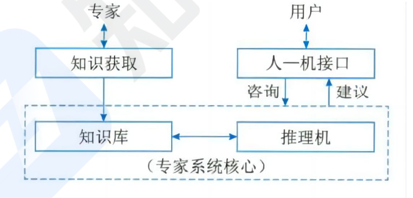
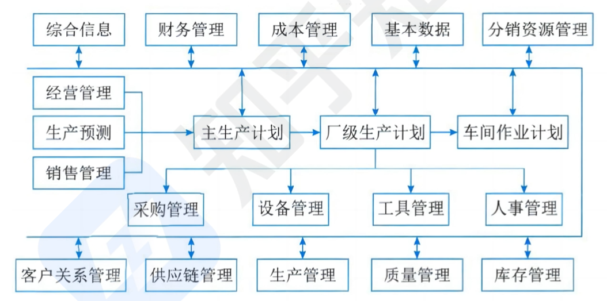

```toc
```

## 专家系统 ES

基于知识的专家系统 (专家系统：Expert System，ES)，是**人工智能的一个重要分支**．专家系统的能力来自于它所拥有的专家知识，知识的表示及推理的方法则提供了应用的机理。

我们可以把专家系统想象成一个很聪明的机器人, 它可以像专家一样提供专业建议和解决问题．比如一个医生专家系统, 病人描述了自己的症状, 专家系统就可以按照它存储的医学知识给出诊断意见．一个下棋的专家系统, 它学习了大量的棋谱和下棋策略，可以和人类高手对弈。专家系统之所以看起來很智能, 是因为它事先向专家学习了大量知识, 并根据这些知识模拟专家进行推理，但专家系统只能解决特定领域的问题, 不像人类能通用地思考．而且它的知识库需要不断更新, 才能给出准确的建议．简单来说, **专家系统就是一个可模拟专家进行推理的智能系统, 让普通人也能获得专家级建议**。

专家系统不同于传统的应用程序和其他类型的人工智能问题求解程序。主要表现在以下 5 个方面。
- 系统属于人工智能范畴，其求解的问题是**半结构化或非结构化**问题.
- 系统模拟的是**人类专家在问题领城的推理**，而不是模拟问题领域本身.
- 系统由 3 个要素组成：描述问题状态的综合数据库、存放启发式经验知识的知识库和对知识库的知识进行推理的推理机。三要素分别对应数据级、知识库级和控制级三级知识，而传统应用程序只有数据和程序两级结构.
- 系统处理的问题是实际的问题，而不是纯学术的问题.
- 解决手段来看，专家系统专用性强，通用性差．


人工智能（AI)旨在利用机械、电子、光电或生物器件等制造的裝置或机器模仿人类的智能. AI 研究的重点放在开发具有智能行为的计算机系统上，智能行为表现出以下 5 个特点.
- 从过去的事件或情形中汲取经验，并将从经验中得到的知识应用于新的环境和场景.
- 具有在缺乏重要信息时解决问题的能力．
- 具有处理和操纵各种符号、理解形象化图片（图像)的能力．
- 想象力和创造力。
- 善于启发．

人工智能是一个极为广泛的领城，AI 的主要分支有专家系统、机器人技术、视觉系统、自然语言处理、学习系统和神经网络等。

**专家系统的特点：超越时间限制、操作成本低廉、易于传递与复制、处理手段一致 (不会因人而异)、善于克服难题、适用特定领域．**

专家系统的组成
- 知识库．用来存放系统求解实际问题的领城知识．知识库中的知识可分成两类：一类为事实性知识：另一类是启发性知识．
- 综合数据库．是专家系统在执行与推理过程中用以存放所需要和产生的各种信息的工作存储器，因此，综合数据库又叫动态知识库，其内容在系统运行过程中是不断变化的，相应地把专家系统的知识库称为静态知识库。二者一起构成完整知识库．
- 推理机．推理机和完整知识库一起构成专家系统的核心．推理机也被称为控制结构或规则解释器，通常包括推理机制和控制策略，是一组用来控制系统的运行、执行各种任务、根据知识库进行各种搜素和推理的程序模块.
- 知识获取，主要有两方面功能：一是知识的编辑和求精; 二是知识自学习。
- 解释程序。是面向用户服务的, 负责解答用户提出的各种问题．
- 人机接口．通常包括两部分：一部分是专家系统与用户的接口; 另一部分是专家系统与领域专家和知识工程师的接口.



专家系统 (Expert System, ES)是一种人工智能技术，旨在模拟人类专家的知识和推理过程，用于解决复杂的问题．在日常生活中，专家系统可以应用于各种领域。以下是几个日常生活中的应用例子：

医疗诊断：
专家系统在医疗领域有广泛的应用．它可以根据患者的症状和病史，进行诊断和建议治疗方案．例如，一个专家系统可以针对常见的感冒症状，询问患者的体温、咳嗽、头痛等情况，并根据这些信息给出可能的痪病诊断和自我治疗建议，比如是否需要去看医生或服用何种药物.

金融规划：
专专家系统可用于个人财务规划和投资建议．通过收集用户的财务目标、风险承受能力和投资偏好等信息，专家系统可以推荐适合的投资组合和理财计划．例如，根据用户的收人、年龄、家庭状况等，系统可以建议分配资产的比例，包括投资股票、债券、房地产等.

故障诊断与维修：
专家系统可以在家电、汽车等设备的故障诊断和维修方面发挥作用．当设备出现故障时，用户可以通过与专家系统的对话，描述问题的细节，例如故障现象、出现的错误代码等．专家系统会根据这些信息，参考预先设定的故障库和修复方案，为用户提供初步的排查指南或建议维修措施.

烹饪食谱推荐：
专家系统可以帮助用户根据自己的口味和饮食需求，推荐合适的烹饪食谱、用户可以告诉系统他们的喜好、食物过敏情况、偏好的烹饪方式等，专家系统会据此生成适合的食谱，并提供烹饪步骤和营养信息.

## 办公自动化系统 OAS

办公自动化就是办公信息处理手段的自动化．OAS 要解决的是包括数据、文字、声音、图像等信息的一体化处理问题．从本质上讲，办公自动化就是以先进的科学技术为基础，利用有关办公自对化没备协助办公人员售理各项办公信息，主要利用资派以提商办公效
率和办公质量．计算机技术、通信技术、系统科学和行为科学是它的 4 大支柱。其中以行为科学为主导，系统科学为理论基础，合运用计算机技术和通信技术。

OAS 的主要功能
事务处理。完成办公部分内的大量繁琐事情，又称为事务办公系统，分为单机处理系统和多机处理系统 (通信、信息共享)，类似于我们前面的 TPS 系统

信息管理．对信息流的控制管理，主要包括信息的收集、加工、传递、交流、存取、提供、分析、判断、应用和反馈那些办公人员的综合性工作，可称为管理型办公系统，它能将事务型办公系统中各项孤立的事务处理通过信息交换和共享资源联系起来，获得准确、快捷、及时、优质的功效．管理型办公系统是一种分布式的处理系统，具有计算机通信和网络功能．类似于我们前面的 MIS 系统

辅助决策．可称为决策型办公系统，以经理型办公系统提供的大量信息作为决策工作的基础，建立起能综合分析、预测发展、判断利弊的计算机可运
行的决策模型，根据原始数据信息，自动做出比较符合实际的决策方案．类似于我们前面的 DSS 系统

办公自动化系统的组成：计算机设备、办公设备、数据通信及网络设备、软件系统.

OAS 的日常使用举例：
- 事务处理
	小明要请一天假, 没有 OAS 系统前，他需要填写请假条, 找到部门主管签字批准, 然后送到人事部档案。使用 OAS 系统后, 小明可以在系统内提出请假申请, 系统自动提醒主管并取得批准, 人事部也可以在系统查看，整个流程自动完成.
	
	小花需要采购一批办公用品, 传统做法是填表申请, 等待多个部门审批, 浪费时间．使用 OAS 系统, 小花可以在移动 App 上提出申请, 系统自动把采购需求发
	送给采购部, 并根据设置的审批流程发送各部门主管，一个星期后办公用品直接送到了小花的办公桌．
	所以 OAS 系统通过流程自动化和信息共享, 可以优化企业内部的协同工作, 提高工作效率, 减少重复劳动.
	
- 信息管理
	假设小明是一位自由职业者，他使用某 OAS 系统来管理自己的工作内容。
	小明可以在 OAS 系统里建立客户数据库, 记录每位客户的姓名、联系方式、服务类型等信息.
	在进行设计项目时, 小明可以在系统里针对每个项目建立文件夹, 上传设计草图、文档等资料。
	系统会自动统计每个项目的工作时间, 小明可以随时查看每个项目的总消耗时间.
- 每完成一个项目, 小明会在系统里标记项目状态已结单, 系统会自动生成项目结单、账单，
- 辅助决策
	系统根据历史计费数据，可以生成小明不同服务类型的收入报告.
	根据系统生成的收人报告, 小明可以分析哪些服务收入较高, 从而决定业务发展方向.
	小明也可以使用系统的预算管理功能, 模拟不同方案的收支情况, 辅助其制定合理的财务计划.
	系统可以配置时长预警, 当某项目时间超过预定范国时, 系统提醒小明关注进度.


## 企业资源规划系统 ERP

**企业资源规划是指建立在信息技术基础上，以系统化的管理思想，为企业提供决策和运营手段的管理平台 ERP 系统是将企业所有资源进行集成整合，并进行全面、一体化管理的信息系统.**

演变过程：物料需求计划 (物料单系统)＞制造资源计划 (增加库存、分销等)＞企业资源计划 (打通了供应链，加入财务、人力资源、销售管理等）.

**企业有三大资源： 物流 （物流管理）、资金流（财务管理)、信息流（生产控制管理)、现在一般认为人力资源（人力资源管理)是企业第四大资源.**

企业的资源计划可从下面三点来理解：
- 管理思想：ERP 首先是一种管理思想，将企业资源分类管理，是管理思想的变革.
- 软件产品：其次，ERP 是个软件产品，为企业用户提供一体化的解决方案，不是买来直接用的，需要个性化的开发和部署.
- 管理系统：ERP 最后是一个管理系统，存在众多的子系统，这些子系统有统一的规划，是互联互通的，便于事前事中监控.

### 结构-11 个模块

生产预测．市场需求是企业生存的基础，在 ERP 中首先需要对市场进行较准确的预测．预测主要用于计划，在 ERP 的5个层次的计划中，前 3 个层次计划，即经营计划、生产计划大纲和主生产计划的编制都离不开预测．

销售管理。销售管理主要是针对企业的销售部门的相关业务进行管理．


经营计划（生产计划大纲)．是根据经营计划的生产目标制定的，是对企业经营计划的细化，用以描述企业在可用资源的条件下，在一定时期中的产量计划。

主生产计划．是对企业生产计划大纲的细化，说明在一定时期内的下计划：生产什么，生产多少和什么时候交货．主生产计划的编制以生产大纲为准，其汇总结果应当等同于生产计划大纲.

物料需求计划。物料需求计划是对主生产计划的各个项目所需的全部制造件和全部采购件的网络支持计划和时间进度计划. 它根据主生产计划对最终产品的需求数量和交货期，推导出构成产品的零部件及材料的需求数量和需求时期，再导出自制零部件的制作订单下达日期和采购件的采购订单发送日期，并进行需求资源和可用能力之间的进一步平衡.

能力需求计划．是对物料需求计划所需能力进行核算的一种计划管理方法．旨在通过分析比较 MRP 的需求和企业现有生产能力，及早发现能力的瓶颈所在，为实现企业的生产任务而提供能力方面的保障。

车间作业计划。是在 MRP 所产生的加工制造订单（即自制零部件生产计划)的基础上，按照交货期的前后和生产优先级选择原则以及车间的生产资源情况 (如设备、人员、物料的可用性、加工能力的大小等)，将零部件的生产计划以订单的形式下达给适当的车间。

采购与库存管理．**采购与库存管理是 ERP 的基本模块**，其中采购管理模块是对采购工作，即从采购订单产生至货物收到的全过程进行组织、实施与控制，库存管理模块则是对企业物料的进、出、存进行管理.

质量与设备管理．质量管理贯穿于企业管理的始终．设备管理是指依据企业的生产经营目标，通过一系列的技术、经济和组织措施，**对设备寿命周期内的所有设备物资运动形态和价值运动形态进行的综合管理**

财务管理．会计工作是企业管理的重要组成部分，是以货币的形式反映和监督企业的日常经济活动，并对这些经济业务的数据进行分类、汇总，以便为企业管理和决策提供必要的信息支持．**企业财务管理是企业会计工作和活动的统称。**

ERP 有关扩展应用模块．如客户关系管理、分销资源管理、供应链管理和电子商务等。这几个扩展模块本身也是一个独立的系统，在市场上它们常作为独立的软件产品进行出售和实施.

ERP 的功能：**支持决策的功能、为处于不同行业的企业提供有针对性的 IT 解决方案、从企业内部的供应链发展为全行业和跨行业的供应链。**

### 案例-政府信息化和电子政务

电子政务实质上是对现有的、工业时代形成的政府形态的一种改造，即利用信息技术和其他相关技术，将其管理和服务职能进行集成，在网络上实现政府组织结构和工作流程优化重组，超越时间、空间与部门分隔的制约，实现公务、政务、商务、事务的一体化管理与运行.

电子政务主要包括 3 个组成部分：
- 政府部门内部的电子化和网络化办公。
- 政府部门之间通过计算机网络进行的信息共享和实时通信.
- 政府部门通过网络与居民之间进行的双向信息交流.

电子政务在世界范围内的发展有 2 个主要的特征：第 1 个特征是以互联网为基础设施，构造和发展电子政务．第 2 个特征是，就电子政务的内涵而言，更强调政府服务功能的发挥和完善，包括政府对企业、对居民的服务以及政府各部门之间的相互服务.

电子政务的发展大致经历了 4 个阶段：起步阶段、政府与用户单向互动、政府与用户双向互动、网上事务处理。

电子政务的应用领城：面向社会、政府部门之间、政府部门内部的各类应用系统涉及政府部门内部的各类核心数据的应用系统、政府电子化采购、电子社区。


政府到政府 (Government-to-Government, `G2G`）、政府到企业 (Government-to-Business, `G2B`)、政府到公众 (Government to-Citizen, `G2C`)
企业到政府 (Business-to-Government, `B2G`) 和公众到政府 (Citizen-to-Government, `C2G`)：

`G2G`（政府到政府）：
- 双边合作协议：两个国家政府之间签署协议，以促进贸易、合作项目、科技研发等领域的合作．例如，两国政府签署的关于环保合作的协议，共同应对气候变化和环境污染．
	- 政府间数据共享：两个政府部门之问共享数据，以加强安全合作、犯罪打击、边境管理等。例如，两国情报部门之间分享情报信息，以便预防跨国恐怖主义活动.

`G2B`（政府到企业）
- 政府招标和采购：政府向企业发布招标公告，邀请企业竞标政府项目或服务．例如，政府部门发布建设一所新学校的招标公告，邀请建筑公司投标竞争。
	- 政府发放补贴和奖励：政府向企业提供财政支持，以鼓励特定产业的发展或实现特定目标．例如，政府向可再生能源公司提供津贴，以促进清洁能源的发展．

`G2C`（政府到公众）：
- 电子政务服务：政府通过互联网平台向公众提供各种在线服务，例如在线申请身份证、驾驶执照或社会福利等．例如，公民可以通过政府网站在线申请护照.
- 警示和通知：政府向公众发布警示和通知，以提醒市民注意安全或宣传重要信息．例如，政府发布台风预警，提醒市民采取必要的防护措施.

`B2G`（企业到政府）：
- 税务申报和缴税：企业向政府部门申报税务信息，并缴纳相关税款．例如，企业根据税法规定向税务局报告年度财务状况，并缴纳应纳税款。
- 合规申报和监管报告：企业根据政府法规和监管要求向相关政府部门提交合规申报和监管报告．例如，某制药公司向药品监管机构提交新药研发和临床试验报告.

`C2G` （公众到政府）
- 公众意见和建汉公众向政府表达意见、建汉或对政策的看法。例如，市民可以通过公开听证会或信件向政府表达对特定法规的意见。
- 投诉和申诉：公众向政府部门提出投诉或申诉，寻求问题解决或寻求公平裁决．例如，消费者向市场监管部门投诉某家企业的不当商业行为。

企业信息化就是企业利用现代信息技术，通过信息资源的深人开发和广泛利用，实现企业生产过程的自动化、管理方式的网络化、决策支持的智能化和商务运营的电子化，不断提高生产、经营、管理、决策的效率和水平，进而提高企业经济效益和企业竞争力的过程。

企业信息化的具体目标是优化企业业务流程，使之更加有效，它的根本目的在于提高企业竞争能力，使得企业具有平稳和有效的运作能力，对紧急情说和机会做出快速反应，为企业内外部用户提供有价值的信息．包括技术创新、管理创新和制度创新．

企业信息化一定要建立在企业战略规划基础之上，以企业战略规划为基础建立的企业管理模式是建立企业战略数据模型的依据.

企业信息化就是技术和业务的融合．需要从 3 个层面来实现。
- 企业战略的层面．必须对企业目前的业务策略和未来的发展方向作深人分析．达到战略上的融合.
- 业务运作层面．针对企业所确定的业务战略，通过分析获得实现这些目标的关键驱动力和实现这些目标的关键流程.
- 管理运作层面．虽然这一层面从价值链的角度上来说，是属于辅助流程，但它对企业日常管理的科学性、高效性是非常重要的．除了提出应用功能的需求外，还必须给出相应的信息技术体系，这些将确保管理模式和组织架构适应信息化的需要.


### 模型

**企业战略数据模型分为数据库模型和数据仓库模型**，数据库模型用来描述日常事务处理中数据及其关系; 数据仓库模型则描述企业高层管理决策者所需信息及其关系.

企业信息化方法
- 业务流程重构方法．对企业的组织结构和工作方法进行“彻底的、根本性的”重新设计.
- 核心业务应用方法。任何一家企业，要想在市场竞争的环境中生存发展，都必须有自己的核心业务．围绕核心业务应用计算机技术和网络技术是很多企业信息化成功的秘诀。
- 信息系统建设方法．对大多数企业来说，建设信息系统是企业信息化的重点和关键．因此，信息系统建设成了最具普遍意义的企业信息化方法.
- 主题数据库方法．主题数据库就是面向企业业务主题的数据库，也就是面向企业的核心业务的数据库．
- 资源管理方法．目前，流行的企业信息化的资源管理方法有很多，最常见的有企业资源计划 (ERP)、供应链管理 (SCM)等。
- 人力资本投资方法．人力资本与人力资源的主要区别是人力资本理论把一部分企业的优秀员工看作是一种资本，能够取得投资收益。人力资本投资方法特别适用于那些依靠智力和知识而生存的企业。