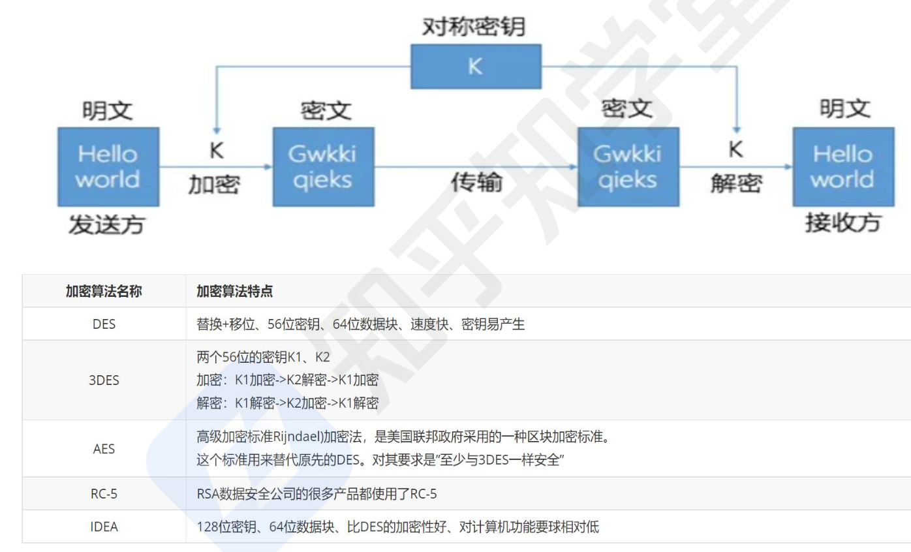
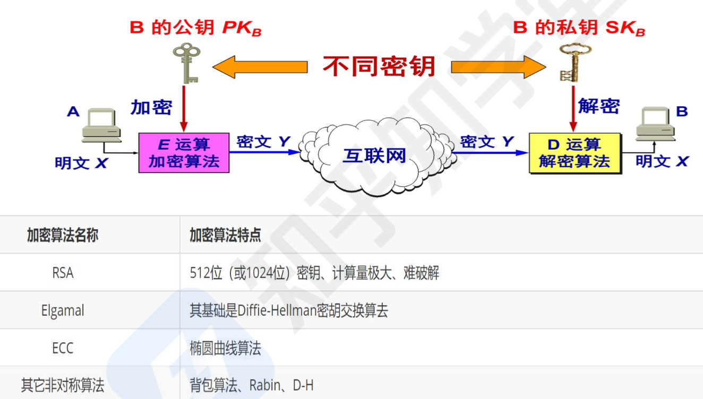
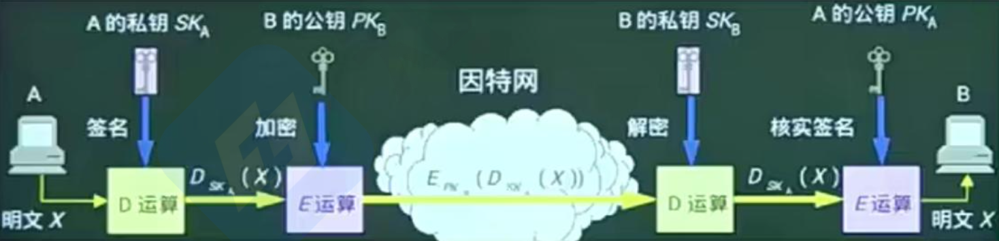

```toc

```

## 基础知识

**信息安全包括 5 个基本要素：机密性（需授权）、完整性（避免被篡改）、可用性（设备冗余避免服务不可用）、可控性（权限控制）与可审查性（信息操作可追溯）**

机密性：机密性指的是信息只能被授权的人员或实体访问，防止未经授权的人获取敏感信息.
- 假设你要通过电子邮件发送包含敏感个人信息的文件给你的朋友．为确保机密性，你可以使用端到端加密的方式发送邮件，这样只有你和你的朋友能够解密和查看邮件的内容，其他人无法获取其中的信息.

完整性：确保信息在传输或存储过程中不被篡改或损坏，保持其准确性和完整性.
- 假设你是一家互联网银行的客户，你要发送一笔转账请求给银行．为确保请求的完整性，银行使用数字签名来对你的请求进行签名．当银行收到请求后，会验证数字签名的有效性，以确保请求没有被篡改，然后继续处理转账

可用性：确保信息和资源在需要时可供访问和使用，避免因服务中断或不可用性导致的损失.
- 假设你是一家在线零售商，你的网站每天都有大量访问量．为确保网站的可用性，你可以设置元余服务器，当一个服务器发生故障时，备用服务器可以接管服务，保持网站在线，避免服务中断.

可控性：是指对系统或信息进行管理和控制，确保只有授权的人员可以进行合法的操作。
- 假设你是一家大型公司的系统管理员，你要设置员工访问公司内部数据库的权限。根据员工的角色和现责，分配不同级别的访问权限，只有被授权的员工才能访问敏感数据

可审查性：指对系统和操作进行监控和审查的能力，记录和跟踪系统中发生的事件，以便追查和解决安全问题


信息安全的范围包括： **设备安全、数据安全、内容安全和行为安全**
- 信息安全是信息系统安全的首要问题，是信息系统安全的物质基础，主要涉及到保护计算机系统、网络设备和其他硬件设备免受恶意攻击和未经授权的访问，设备安全的主要目标是确保这些设备的操作和功能不会被破坏、篡改或滥用．它包括 3 个方面：**设备的稳定性、可靠性、可用性**

- 比如防火墙是一种网络设备，用于监控和控制网络流量，阳止未经授权的访问和恶意攻击．它可以过滤进出网络的数据包，根据事先设定的规则，允许合法的数据包通过，而拒绝潜在的恶意数据包，从而保护网络设备免受攻击


**数据安全即采取措施确保数据免受未授权的泄露、篡改和毁坏，包括 3 个方面：数据的秘密性、完整性、可用性**
- 比如数据库加密技术，为了保护患者隐私和数据安全，你可以使用数据库加密技术，将敏感的病历数据加密存储，只有经过授权的医院员工才能解密和访问这些数据.

内容安全是信息安全在政治、法律、道德层次上的要求，包括 3 个方面：信息内容政治上健康、符合国家法律法规。

行为安全关注人的行为和习惯，以预防社会工程学攻击和其他利用人为因素的安全威胁。行为安全措施可能包括培训员工识别垃圾邮件、不受信任的链接和附件，以及避免与陌生人共享敏感信息．行为安全的特性包括：行为的秘密性、完整性、可控性。


**信息的存储安全包括信息使用的安全、系统安全监控、计算机病毒防治、数据的加密和防止非法的攻击等。**

- 信息使用的安全。包括用户的标识与验证、用户存取权限限制.
- 系统安全监控．系统必须建立一套安全监控系统，全面监控系统的活动，并随时检查系统的使用情况，且有非法入侵者进人系统，能及时发现并采取相应措施，确定和填补安全及保密的漏洞．还应当建立完善的审计系统和日志管理系统，利用日志和审计功能对系统进行安全监控.
- 计算机病毒防治．计算机网络服务器必须加装网络病毒自动检测系统，以保护网络系统的安全，防范计算机病毒的侵袭，并且必须定期更新网络病毒检测系统。


网络安全
- 网络安全漏洞：物理安全性、软件安全漏洞、不兼容使用安全漏洞、选择合适的安全哲理。
- 网络安全威胁： 非授权的访问、信息泄露或丢失、破坏数据完整性、拒绝服务攻击DDOS、利用网络传播病毒.
- 安全措施的目标：访问控制、认证、完整性、审计、保密.


## 信息安全系统的组成框架

信息安全系统的组成框架包含三个体系：技术体系、组织结构体系和管理体系


技术体系：从实现技术上来看，信息安全系统涉及以下技术：
- 基础安全设备包括密码芯片、加密卡、身份识别卡等，此外还涵盖运用到物理安全的物理环境保障技术，建筑物、机房条件及硬件设备条件满足信息系统的机械防护安全，通过对电力供应设备以及信息系统组件的抗电磁干扰和电磁泄漏性能的选择性措施达到相应的安全目的。
- 计算机网络安全指信息在网络传输过程中的安全防范，用于防止和监控未经授权破坏、更改和盗取数据的行为．通常涉及物理隔商，防火墙及访问控制，加密传输、认证、数字签名、摘要，隧道及 VPN 技术，病毒防范及上网行为管理，安全审计等实现技术.
- 操作系统安全是指操作系统的无错误配置、无漏洞、无后门、无特洛伊木马等，能防止非法用户对计算机资源的非法存取，一般用来表达对操作系统的安全需求．操作系统的安全机制包括标识与鉴别机制、访问控制机制、最小特权管理、可信通路机制、运行保障机制、存储保护机制、文件保护机制、安全审计机制, 等等.
- 数据库安全可粗略划分为数据库管理系统安全和数据库应用系统安全两个部分，主要涉及物理数据库的完整性、逻辑数据库的完整性、元素安全性、可审计性、访问控制、身份认证、可用性、推理控制、多级保护以及消除隐通道等相关技术.
- 终端安全设备从电信网终端设备的角度分为电话密码机、传真密码机、异步数据密码机等。

## 加密技术

### 相关概念

明文：实际传输的真正数据。
密文：经过加密之后的数据。
解密：将密文转换为明文的过程。
加密：将明文转换为密文的过程。
加密算法：一般是公开的，包括两大规则，代换（转换成完全不同的其他数据）和置换（打乱明文顺序，进行重新置换）。
密钥：加密和解密过程中使用的密码等，是隐藏的。


### 保密性

**对称加密技术：对数据的加密和解密的密钥 (密码）是相同的，也称为共享密钥加密技术，属于不公开密钥加密算法**．其缺点是加密安全性不高 (因为只有一个密钥), 且密钥分发困难 (因为密钥还需要传输给接收方，也要考虑保密性等问题)。但是其加密速度快，非常适合于大数据的加密.



非对称加密技术：又称为公开密钥加密技术，各个用户分别有一对密钥（两对，接收方和发送方的不同），称为公钥和私钥，其中公钥是公开的，所有用户都知道，私钥是保密的，只有自己知道，使用公钥加密，只能对应的私钥能解密，使用私钥加密，同样也只有对应的公钥能解密；非对称加密就是运用了公钥和私钥的原理，其对数据的加密和解密的密钥是不同的，是公开密钥加密算法．缺点是加密速度慢 (密钥多，计算量大，不适合加密大数据)。密钥不需要在数据中传输了。




## 信息摘要-完整性

信息摘要：就是一段数据的特征信息，当数据发生了改变，信息摘要也会发生改变，发送方会将数据和信息摘要一起传给接收方，接收方会根据接收到的数据重新生成一个信息摘要，若此摘要和接收到的摘要相同，则说明数据正确。**信息摘要是由哈希函数生成的，一般用于消息认证**

信息摘要的特点：不算数据多长，都会产生**固定长度**的信息摘要；任何不同的输入数据，都会产生不同的信息摘要；单向性，即只能由数据生成信息摘要，不能由信息摘要还原数据

信息摘要算法： `MD5` (产生 128 位的输出）、SHA（安全散列算法，产生 160 位的输出，安全性更高）

可知使用信息摘要可以保证传输数据的完整性，只需要双方比对生成的信息摘要是否相同即可判断数据有没有被篡改，但是这样会出现一个问题，就是当发送方发送的数据和信息摘要都被篡改了，那么接收方拿到错误的数据生成的信息摘要也和篡改的信息摘要相同，接受方就无能为力了，这个问题，在后面的数字签名技术会解决。

## 数字签名-不可抵赖性

上述技术只保证了数据传输过程的保密性和完整性，但却无法保证发送者是否非法，即在传输过程中，数据被第三方截获，即使他不能解密获取真实数据，但是他可以伪造一段数据，也用加密算法加密后再发送给按收方，那么接收方无法判断发送方是否合法，其只会用发送方告诉他的方法来解密．此时就要用到数字签名技术来验证发送方是否合法。**相当于全部信息都是假的**

数字签名属于非对称加密体制，主要功能有不可否认、无法篡改和伪造 (报文鉴别）、报文的完整性

**原理：若发送方需要发送数据，应该使用发送方的私钥进行数字签名，而其公钥是共享的，任何接收方都可以拿来解密，因此，接收方使用了发送方的公钥解密，就必然知道此数据是由发送方的私钥加密的，而发送的私钥只属于发送方，唯一标识了数据是由谁发送的，这就是数字签名的过程原理.**



这里都是使用私钥进行签名或者加密。一般都是使用公钥进行解密。

## 数字证书

上述的技术都是在原发送方是正确的的情况下所做的加密和认证技术，然而当发送方本身就是伪造的，即发送的公钥本身就是假的，那么后续的加密、数字签名都没有意义了，因此对发送方的公钥进行验证是十分重要的. 比如一个网站是冒充的。

数字证书又称为数字标识，由用户申请，证书签证机关 CA 对其核实签发的，对用户的公钥的认证．现在的数字证书版本大多为 `x.509`.

数字证书的原理：每一个发送方都要先向 CA 申请数字证书，数字证书是经过 CA 数字签名了的，也即 CA 使用私钥加密，当发送方要发送数据时，接收方首先下载 CA 的公钥，去验证数字证书的真伪，如果是真的，就能保证发送方是真的，因为 CA 是官方权威的机构，其合法性毋庸置疑.

数字证书的格式：序列号、版本号、签名算法、发行者 `ID`、发行者、主体 `ID`、有效期、公钥.

最安全的过程要验证两步
- 在网银系统中，使用网银时，要先下载该银行的数字证书，之后，本地客户机会用 CA 的公钥对数字证书进行解密，解密成功说明是 CA 颁发的，是该银行系统而非黑客冒充.
- 确认了通信对方无误后，就可以采用上述的一系列加密和认证技术来对通信数据进行加密，确保数据不会在发送过程中被截获篡改.

## PKI 公钥基础设施

PKI 公钥基础设施是提供公钥加密和数字签名服务的系统或平台，目的是为了管理密钥和证书．一个机构通过采用 PKI 框架管理密钥和证书可以建立一个安全的网络环境．

PKI 主要包括四个部分：X.509 格式的证书；CA 操作协议；CA 管理协议；CA 政策制定．

PKI 的基础技术包括加密、数字签名、数据完整性机制、数字信封、双重数宇签名等.

一个 PKI 应用系统至少应具有以下部分：
- 公钥密码证书管理。
- 黑名单的发布和管理。
- 密钥的备份和恢复.
	自动更新密钥。
- 自动管理历史密钥。
	支持交叉认证。