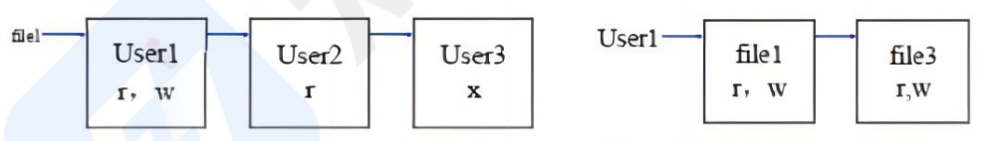
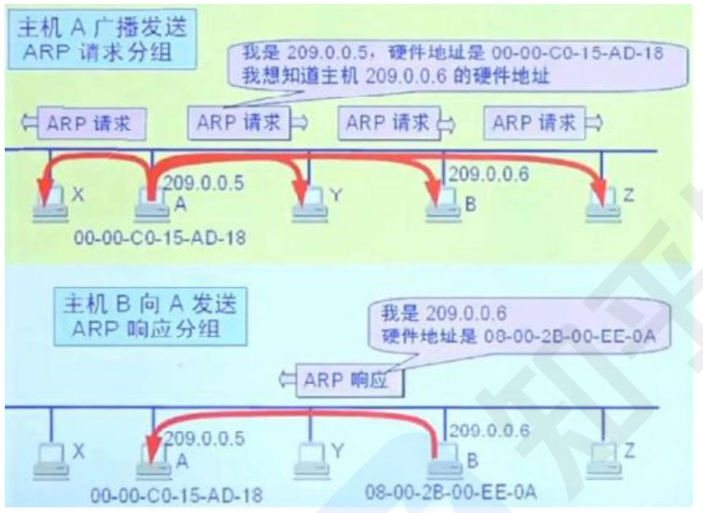

```toc

```

## 信息安全技术

访问控制是指主体依据某些控制策略或权限对客体本身或是其资源进行的不同授权访问．访问控制包括 3 个要素，即主体、客体和控制策略，其中访问控制包括认证、控制策略实现和审计 3 方面的内容．

访问控制的实现技术
- 访问控制矩阵（ACM〉．是通过矩阵形式表示访问控制规则和授权用户权限的方法．主体作为行，客体作为列.

|- | `file1` | `file2` | `file3` |
|-|-|-|-|
| `User1` |rw||rw|
| `User2` |r|`rwx`|x|
| `User3` |x|r||
	这种控制方法中要为每个主体设置每一个文件的访问权限，这样一个是量会很大，很容易产生纰漏

- 访问控制表 (ACL)．目前最流行、使用最多的访问控制实现技术．每个客体有一个访问控制表，是系统中每一个有权访问这个客体的主体的信息．这种实现技术实际上是按列保存访问矩阵. 如图所示
- 能力表．对应于访问控制表，这种实现技术实际上是按行保存访问矩阵．每个主体有一个能力表，是该主体对系统中每一个客体的访问权限信息．使用能力表实现的访问控制系统可以很方便地查询某一个主体的所有访问权限. 如图所示



	通过这两种控制表就能很直观的检查权限，而不需要查看整个矩阵。
- 授权关系表，每一行（或者说元组）就是访问矩降中的一个非空元素，是某一个主体对应于某一个客体的访问权限信息．如果授权关系表按主体排序，查询时就可以得到能力表的效率; 如果按客体排序查询时就可以得到访问控制表的效率。


## 信息安全的抗攻击技术

为对抗攻击者的攻击，密钥生成需要考虑 3 个方面的因素： *增大密钥空间、选择强钥（复杂的）、密钥的随机性（使用随机数）*

拒绝服务攻击有许多种，网络的内外部用户都可以发动这种攻击。内部用户可以*通过长时间占用系统的内存、CPU 处理时间*使其他用户不能及时得到这些资源，而引起拒绝服务攻击; 外部黑客也可以通过占用网络连接使其他用户得不到网络服务．

外部用户针对网络连接发动拒绝服务攻击主要有以下几种模式：消耗资源、破坏或更改配置信息、物理破坏或改变网络部件、利用服务程序中的处理错误使服务失效．

分布式拒绝服务 DDos 攻击是传统 DoS 攻击的发展，攻击者首先侵入并控制一些计算机，然后控制这些计算机同时向一个特定的目标发起拒绝服务攻击．克服了传统 DOS 受网络资源的限制和隐蔽性两大缺点。

拒绝服务攻击的防御方式
- 加强对数据包的特征识别，攻击者发送的数据包中是有一些特征字符串．通过搜寻这些特征字符串, 就可以确定攻击服务器和攻击者的位置。
- 设置防火墙监视本地主机端口的使用情况。如果发现端口处于监听状态，则系统很可能受到攻击．
- 对通信数据量进行统计也可获得有关攻击系统的位置和数量信息．在攻击时，攻击数据的来源地址会发出超出正常极限的数据量.
- 尽可能的修正己经发现的问题和系统漏洞.

## 信息安全的抗攻击技术-ARP 欺骗

正常 ARP 原理：如图所示，主机 A 想知道局域网内主机 B 的MAC 地址，那么主机 A 就广播发送 ARP 请求分组，局域网内主机都会收到，但只有 B 收到解析后知道是请求自己的 MAC 地址，所以只有 B 会返回单播的响应分组，告诉 A 自己的 MAC 地址。A收到响应分组后，会建立一个 B 的 IP 地址和 MAC 地址映射，这个映射是动态存在的，如果一定时间 AB 不再通信，那么就会清空这个地址映射，下次如果还要通信，则重复这个过程。

ARP 欺骗原理：上述过程主机 A 是不管其有没有发送过请求广播分组的，而是只要收到了返回的分组信息，就会刷新 IP 地址和 MAC 地址的映射关系，这样就存在安全隐患，假设有主机 C，模拟返回分组格式，构造正确的 IP 地址和自己的 MAC 地址映射，A 收到后也会刷新映射关系，那么当 A 再次向 B 发送信息时，实际就发送到了 C 的 MAC 地址，数据就被 C 监听到了




### ARP 欺骗的防范措施：
- 在 `winxp` 下输入命令：`arp-s gate-way-ip gate-way-mac` 固化 arp 表，阻止 arp 欺骗.
	使用 ARP 服务器．通过该服务器查找自己的 ARP 转换表来响应其他机器的 ARP 广播．确保这台 ARP 服务器不被黑。
- 采用双向绑定的方法解决并且防止 ARP 欺骗．
- ARP 防护软件——ARPGuard。通过系统底层核心驱动，无须安装其他任何第三方软件（如 WinPcap), 以*服务及进程并存*的形式随系统启动并运行，不占用计算机系统资源．无需对计算机进行 IP 地址及 MAC 地址绑定，从而避免了大量且无效的工作量．也不用担心计算机会在重启后新建 ARP 缓存列表，因为此软件是以服务与进程相结合的形式存在于计算机中，当计算机重启后软件的防护功能也会随操作系统自动启动并工作。

## 信息安全的抗攻击技术-DNS 欺骗

DNS 欺骗首先是冒充域名服务器，然后把查询的 IP 地址设为攻击者的 IP 地址，这样的话，用户上网就只能看到攻击者的主页，而不是用户想要取得的网站的主页了，这就是 DNS 欺骗的基本原理．也即改掉了域名和 IP 地址的对应关系．黑客是通过冒充 DNS 服务器回复查询 IP 的.

DNS 欺骗的检测：
- 被动监听检测：通过旁路监听的方式，捕获所有 DNS 请求和应答数据包，并为其建立一个请求应答映射表．如果在一定的时间间隔内，一个请求对应两个或两个以上结果不同的应答包，则怀疑受到了 DNS 欺骗攻击。
- 虚假报文探测：采用主动发送探测包的手段来检测网络内是否存在 DNS 欺骗攻击者．如果向一个非 DNS 服务器发送请求包，正常来说不会收到任何应答，如果收到了应答包，则说明受到了攻击．
- 交叉检查查询：在客户端收到 DNS 应答包之后，向 DNS 服务器反向查询应答包中返回的 IP 地址所对应的 DNS 名字，如果二者一致说明没有受到攻击，否则说明被欺骗

## 信息安全的抗攻击技术-IP 欺骗

IP 欺骗的原理和流程：
- 首先使被冒充主机 `host b` 的网络暂时瘫痪，以免对攻击够成干扰；
- 然后黑客计算机会发起 TCP 连接到目标机 `host a` 的某个端口来猜测 ISN 基值和增加规律；
- 接下来冒充主机 host b 的 ip 地址来向 host a 来发送请求连接：
- 然后等待目标机 hosta 发送响应数据包给已经瘫痪的主机，但是因为 hostb 已经瘫痪，所以无法看不到这个包：
- 最后黑客再次伪装成主机 `host b` 向目标主机 `host a` 发送带有预测的目标机的 ISN 的数据包；
- 连接建立，发送命令请求。

IP 欺骗的防范：虽然 IP 欺骗攻击有着相当难度，但这种攻击非常广泛，入侵往往由这里开始．预防这种攻击可以删除 UNIX 中所有的 `/etc/hosts.equiv、 $HOME/.rhosts` 文件，修改 `/etc/inetd.conf` 文件，使得 RPC 机制无法应用．另外，还可以通过设置防火墙过滤来自外部而信源地址却是内部 IP 的报文。


## 信息安全的抗攻击技术-端口扫描

端口扫描就是尝试与目标主机的某些端口建立连接，如果目标主机该端口有回复（见三次握手中的第二次），则说明该端口开放，即为“活动端口”

扫描原理分类：
- 全 TCP 连接。这种扫描方法使用三次握手，与目标计算机建立标准的 TCP 连接.
- 半打开式扫描 (SYN 扫描)。在这种扫描技术中，扫描主机自动向目标计算机的指定端口发送 SYN 数据段, 表示发送建立连接请求．如果目标计算机的回应 TCP 报文中 SYN=1 ACK=1，则说明该端口是活动的，接着扫描主机传送一个 RST 给目标主机拒绝建立 TCP 连接，从而导致三次握手的过程失败．如果目标计算机的回应是 RST，则表示该端口为“死端口”，这种情况下，扫描主机不用做任何回应.
- FIN 扫描．依靠发送 FIN 来判断目标计算机的指定端口是否是活动的．发送一个 `FIN=1` 的 TCP 报文到一个关闭的端口时，该报文会被丢掉，并返回一个 RST 报文．但是，如果当 FIN 报文到一个活动的端口时，该报文只是被简单的丢掉，不会返回任何回应。从 FIN 扫描可以看出，这种扫描没有涉及任何 TCP 连接部分．因此，这种扫描比前两种都安全，可以称之为秘密扫描.
- 第三方扫描．第三方扫描又称“代理扫描”这种扫描是利用第三方主机来代替入侵者进行扫描。这个第三方主机一般是入侵者通过入侵其他计算机而得到的，该"第三方”主机常被入侵者称之为“肉鸡”这些“肉鸡”般为安全防御系数极低的个人计算机.

## 信息安全的抗攻击技术-强化 `TCP/IP` 堆栈

强化 TCP/IP 堆栈以抵御拒绝服务攻击：
- 同步包风暴 (SYN Flooding)：利用 TCP 协议缺陷发送大量伪造的 TCP 连接请求，使得被攻击者资源耗尽．三次握手，进行了两次，不进行第三次握手，连接队列处于等待状态，大量这样的等待，会占满全部队列空间，使得系统挂起．可以通过修改注册表防御 SYN Flooding 攻击。
- ICMP 攻击：ICMP 协议本身的特点决定了它非常容易被用于攻击网络上的路由器和主机。比如，前面提到的 `Ping of Death` 攻击就是利用操作系统规定的 ICMP 数据包的最大尺寸不超过 64 KB 这一规定，达到使 `TCP/IP` 堆栈崩溃、主机死机的效果．可以通过修改注册表防御 ICMP 攻击。
- SNMP 攻击：SNMP 还能被用于控制这些设备和产品，重定向通信流，改变通信数据包的优先级，甚至断开通信连接．总之，入侵者如果具备相应能力，就能完全接管你的网络。可以通过修改注册表项防御 SNMP 攻击。系统漏洞扫描指对重要计算机信息系统进行检查，发现其中可能被黑客利用的漏洞。包括基于网络的漏洞扫描 (通过网络远程扫描主机)、基于主机的漏洞扫描（在目标系统安装了代理扫描）

## 信息安全的保证体系和评估方法

`GB17859—999` 标准规定了计算机系统安全保护能力的五个等级：
- 第一级用户自主保护级：实现基本的用户隔离和自主访问控制。比如：个人电脑操作系统, 通过账号密码隔离不同用户, 用户只能访问自己的文件和进程。
- 第二级系统审计保护级：在第一级基础上实现更细粒度的访问控制和审计。比如：公司内部办公系统，有账号密码登录, 对安全相关的登录、文件访问进行日志记录, 对不同部门的数据访问设置权限控制.
- 第三级安全标记保护级：在第二级基础上实现安全标记和强制访问控制. 比如：政府内部文件系统, 对文件设置密级标记, 用户的访问权限按照政策与文件标记相匹配判定, 进行强制访问控制.
- 第四级结构化保护级：在第三级基础上实现形式化安全策略和对所有资源的访问控制. 比如：军方信息系统, 有多级安全策略模型, 对所有用户身份、存储数据、网络资源等实施严格的强制访问控制.
- 第五级访问验证保护级：实现抗篡改的访问监控器, 对单个用户的所有访问进行仲裁．比如：核设施监控系统，通过抗篡改的访问控制器验证每个用户每次访问的权限，拒绝非授权访问.

安全风险管理：在风险评估实施前，应该考虑：
- 确定风险评估的范围。
- 确定风险评估的目标.
- 建立适当的组织结构.
- 建立系统性的风险评估方法.
- 获得最高管理者对风险评估策划的批准.

风险评估的基本要素为*脆弱性、资产、威胁、风险和安全措施*，与这些要素相关的属性分别为业务战略、资产价值、安全需求、安全事件和残余风险，这些也是风险评估要素的一部分。

风险计算模型包含信息资产、弱点脆弱性、威胁等关键要素．每个要素有各自的属性，信息资产的属性是资产价值，弱点的属性是弱点被威胁利用后对资产带来的影响的严重程度，威胁的属性是威胁发生的可能性.

风险计算的过程如下：
- 对信息资产进行识别，并对资产赋值.
- 对威胁进行分析，并对威胁发生的可能性赋值.
- 识别信息资产的脆弱性，并对弱点的严重程度赋值.
- 根据威胁和脆弱性计算安全事件发生的可能性．
- 结合信息资产的重要性和发生安全事件的可能性，计算信息资产的风险值.