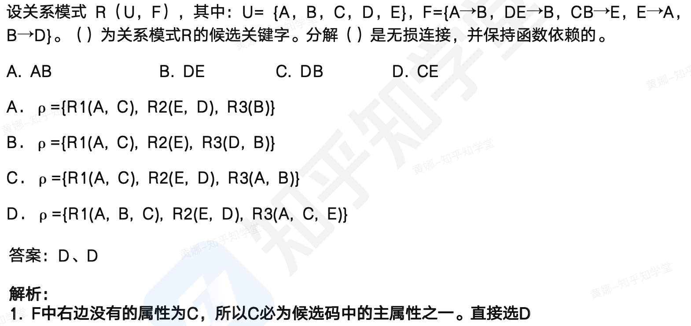

```toc
```

## 模式分解


把一个关系模式分解成若干个关系模式的过程，也就是由低范式转换为高范式的过程，称为关系模式的分解，简称模式分解。

模式分解具体是通过将原关系模式的属性集进行拆分来实现，拆分后的关系模式包含新的属性集，以及新的函数依赖集。

为使分解后的模式与原模式等价，一般要求模式分解具有无损连接性(属性）与保持依赖性（函数依赖）

保持函数依赖的定义：
对于关系模式 R，有依赖集 F，若对 R 进行分解，分解出来的多个关系模式，都有对应的函数依赖集。

所谓的保持函数依赖就是将分解之后的函数依赖集合并起来（令其等于 G），与原来的函
数依赖集 F 是保持等价的，也就是我们就会说是保持函数依赖的。

判断函数依赖集等价公式为：G+（函数依赖集 G 的闭包）=F+（函数依赖集 F 的闭包）
注意：拆分前后的函数依赖集判断是否等价时，不需要考虑冗余依赖 (如传递依赖）

函数依赖（FD） 集的闭包：
F 闭包：由 F 中的所有 FD 可以推导出所有 FD 的集合，记为 F+。
例如：对于关系模式 `R(ABC)`，`F={A一>B, B一>C}`，求 F+。根据 FD 的定义，可推出 $F+={\psi->\psi, A->\psi, A->A, A->B, A->C, A->AB, A->BC, A->ABC,⋯}$，共有 43 个 FD。其中，p 表示空属性集。


属性集闭包定义：
对 F，F+中所有 X->A 的 A 的集合称为 X 的闭包，记为 X+。可以理解为 X+表示所有 X 可以决定的属性。

简单点说属性的闭包就是由一个属性直接或间接推导出的所有属性的集合

例如：`f={a->b, b->c, a->d, e->f}` 由 a 可直接得到 b 和 d，间接得到 c，则 a 的闭包就是 `{a, b, c, d}`，可以写出 `a+={a, b, c, d}`。

例 1：有关系模式 `R(A， B, C)`, `F={A一>B，B一>C}`，将其拆分为：`R1{A,B}，R2{B,C}`，是否保持函数依赖。
`R1{A,B}, F1{A->B}`
`R2{B,C}, F2{B一>C}`


$F1 \cup F2$ 与 F 是等价的，所以保持函数依赖分解。

例 2：有关系模式 `R(A，B, C)，F={A->B，B->C，A一>C}`，将其拆分为：`R1{A，B}，R2{B，C}`，是否保持函数依赖。
`R1{A, B}，F1{A一>B}`
`R2{B, C}，F2{B一>C}`

$F1 \cup F2$ 可以推导出 A 一>C，因此 A 一>C 是冗余函数依赖，不考虑。

$F1 \cup F2$ 与 F 是等价的，所以保持函数依赖分解。

完整的判断保持函数依赖的方法：
- 先求函数依赖集投影到分解后的 `Ri` 上的函数依赖子集 `Fi`。
- 求分解后关系模式函数依赖集的并集，并令其等于 G。
- 判断 F 是否包含在 G 的闭包中。（此处不需要判断 G 是否包含在 F 的闭包中，因为 G 中的每个函数依赖都是由 F 根据 Armstrong 公理推导出来的，所以 G 必定包含于 F 闭包）

例子, 关系模式 `R(U,F)`，其中 `U={A,B,C,D},F={A->B,B->C,C->D,D->A}`，分解 $\rho=\{R1(A,B),R2(B,C),R3(C,D)\}$ 是否具有函数依赖保持性？
解：
- 求函数依赖子集
$F1 = \pi_{U1}(F)=(A->B, B->A);$
$F2 = \pi_{U2}(F)=(B ->C, C->B);$
$F3 = \pi_{U3}(F)=(C->D, D->C);$


- 求分解后函数依赖的并集，令其等于 G
$G=F1 \cup F2 \cup F3=\{(A->B, B->A, B->C, C->B, C->D, D->C\}$
$F=\{A->B, B->C, C->D, D->A\}$。

- 判断 F 是否包含在 G 的闭包中
经过初步观察，F 中的 `{D->A}` 不包含在 G 中，但是通过求 G 的闭包后，也就是根据 G 中的依赖集 `D->C，C->B，B->A`，得出 G 中是包含 `{D->A}` 这个依赖的，所以 F 包含于 G 的闭包中。因此，有 `G+=F+`，即 $\rho$ 具有函数依赖保持性。

- 无损连接分解：是指在关系模式分解过程中，通过连接操作可以恢复原始关系模式的能力。即使对拆分后的关系进行连接操作，也不会丢失任何信息。分解后的关系模式能够还原出原关系模式，就是无损连接分解，不能还原就是有损连接分解。

- 如何判断是否无损连接？
	- 公式法：判断分解为两个关系模式的情况：如果 R 的分解为 $\rho=\{R1，R2\}$，F 为 R 所满足的函数依赖集合，分解 $\rho$ 具有无损连接性的充分必要条件是：$R1 \cap R2->(R1-R2)$ 或者 $R1 \cap R2->(R2-R1)$
	- 表格法：当分解为三个及以上关系模式时，可以通过表格法求解，如下：




## 反规范化技术

反规范化技术：规范化设计后，会导致关系的概念愈来愈单一化，在查询时往往需要涉及更多表的关联操作，导致查询性能下降。数据库设计者希望牺牲部分规范化设计（比如对部分影响性能的关系模式进行处理，包括分解、合并、增加冗余属性等）来提高读操作性能。

采用反规范化技术的益处：降低过多连接操作的需求、降低外码和索引的数目，还可能减少表的数目，进而能够提高查询效率。

采用反规范化技术的问题：数据的重复存储，浪费了磁盘空间；可能出现数据的完整性问题，为了保障数据的一致性，增加了数据维护的复杂性，会降低修改速度。

- 增加冗余列
	增加元余列是指在多个表中具有相同的列，它常用来在查询时避免连接操作。

	例如：以规范化设计的理念，学生成绩表中不需要字段〝姓名〞，因为〝姓名’字段可以通过学号在学生表中查询到，但在反规范化设计中，会将〝姓名〞字段加入学生成绩表中。这样查询一个学生的成绩时，不需要与学生表进行连接操作，便可得到对应的〝姓名〞。

- 增加派生列
	增加派生列指增加的列可以通过表中其他数据计算生成。它的作用是在查询时减少计算量，从而加快查询速度。
	
	例如：订单表中，有商品号、商品单价、采购数量，我们需要订单总价时，可以通过计算得到总价，所以规范化设计的理念是无须在订单表中设计〝订单总价’字段。但反规范化则不这样考虑，由于订单总价在每次查询都需要计算，这样会占用系统大量资源，所以在此表中增加派生列“订单总价”以提高查询效率。

- 重新组表
	重新组表指如果许多用户需要查看两个表连接出来的结果数据，则把这两个表重新组成一个表来减少连接而提高性能。
- 分割表
	有时对表做分割可以提高性能。表分割有两种方式。
	
	水平分割：根据一列或多列数据的值把数据行放到两个独立的表中。水平分割通常在下面的情况下使用。
	- 情况 1：表很大，分割后可以降低在查询时需要读的数据和索引的页数，同时也降低了索引的层数，提高查询效率。
	- 情况 2：表中的数据本来就有独立性，例如按照日期或地点进行冷热数据分割。
	- 情况 3：需要把数据存放到多个介质上。
	垂直分割：
	- 把主码和一些列放到一个表，然后把主码和另外的列放到另一个表中如果一个表中某些列常用，而另外一些列不常用，则可以采用垂直分割，另外垂直分割可以使得数据行变小，一个数据页就能存放更多的数据，在查询时就会减少 `I/O` 次数，其缺点是需要管理冗余列，查询所有数据需要连接操作。