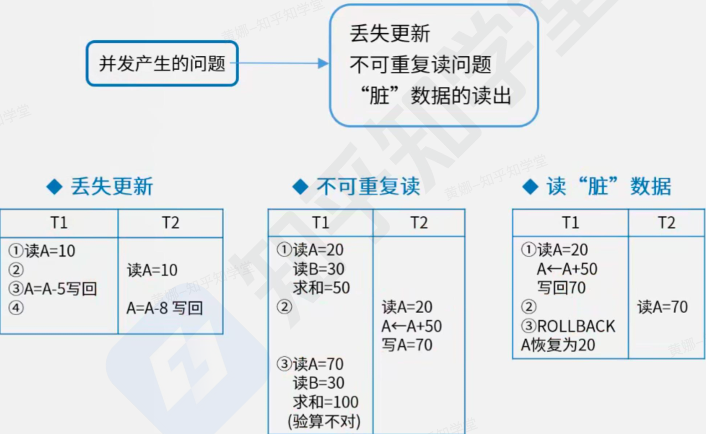
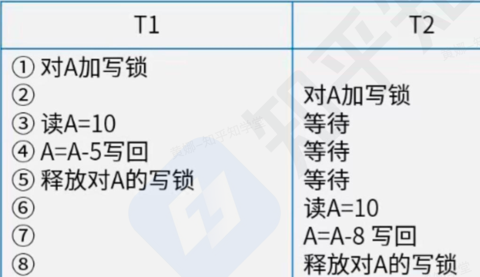
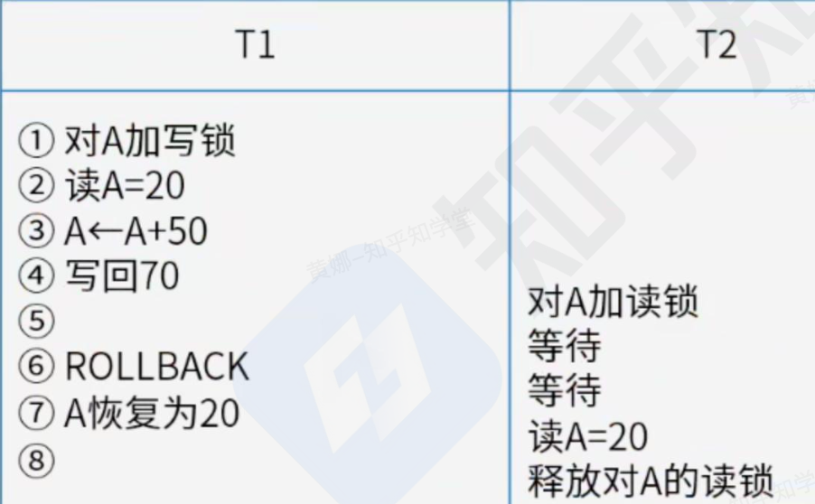
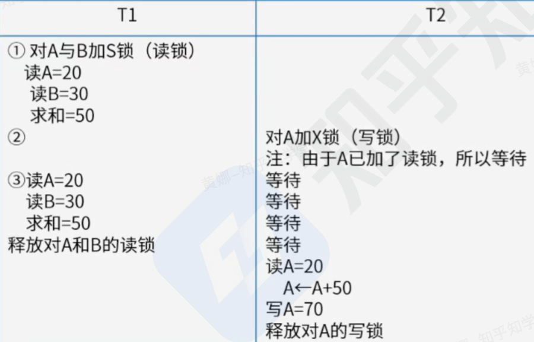
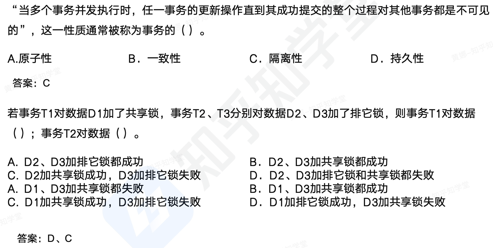

```toc
```

## 事务管理

数据库系统运行的基本工作单位是事务，事务相当于操作系统中的进程，是用户定义的一个数据库操作序列，这些操作序列要么全做要么全不做，是一个不可分割的工作单位。

事务通常以 BEGIN TRANSACTION（事务开始）语句开始，以 COMMIT 或 ROLLBACK 语句结束。
- COMMIT 称为〝事务提交语句〞，表示事务执行成功的结束。
- ROLLBACK 称为〝事务回退语句〞，表示事务执行不成功的结束。

主要特性有：
- 原子性（Atomicity）-操作。操作序列要么全做要么全不做
- 一致性（Consistency）-数据。数据库从一个一致性状态变到另一个一致性状态。
- 隔离性（Isolation）-执行。不能被其他事务干扰。
- 持续性（永久性/持久化 Durability）-变化。一旦提交，改变就是永久性的。

## 并发问题



## 封锁协议

排他型封锁（简称 X 封锁，也叫写锁）。若事务 T 对数据对象 A 加上 X 锁，则只允许 T 读取和修改 A，其他事务都不能再对 A 加任何类型的锁，直到 T 释放 A 上的锁。可见 X 封锁只允许一个事务独锁某个数据，具有排他性。

共享型封锁（简称 S 封锁，也叫读锁）。若事务 T 对数据对象 A 加上 S 锁则只允许 T 读取 A，但不能修改 A，其他事务只能再对 A 加 S 锁（也即能读不能修改），直到 T 释放 A 上的 S 锁。


共分为三级封锁协议，分别是：一级封锁协议，二级封锁协议和三级封锁协议

| 协议     | 操作                                               | 解决问题点                          |
| ------ | ------------------------------------------------ | ------------------------------ |
| 一级封锁协议 | 事务 T 在修改数据 R 之前必须先对其加 X 锁，<br>直到事务结束才释放。         | 可防止丢失修改                        |
| 二级封锁协议 | 一级封锁协议加上事务 T 在读取数据 R 之前先<br>对其加 S 锁，读完后即可释放 S 锁。 | 可防止丢失修改，还可防止读“脏”数据             |
| 三级封锁协议 | 一级封锁协议加上事务 T 在读取数据 R 之前先<br>对其加 S 锁，直到事务结束才释放。   | 可防止丢失修改，还可防止读“脏〞数据与防止数据重复读<br> |
| 两段封锁协议 | 分为封锁阶段（扩展）和释放阶段（收缩）。<br>封锁阶段只能加锁、扩展阶段只能解锁。       | 可串行化，可能发生死锁。                   |


一级封锁协议：事务在修改数据 R 之前必须先对其加 X 锁，直到事务结束才释放。可解决丢失更新问题。




二级封锁协议：一级封锁协议的基础上加上事务 T 在读数据 R 之前必须先对其加 S 锁，读完后即可释放 S 锁。可解决丢失更新、读脏数据问题。



三级封锁协议：一级封锁协议加上事务 T 在读取数据 R 之前先对其加 S 锁，直到事务结束才释放。可解决丢失更新、读脏数据、数据重复读问题。



