```toc
```

一般 2-3 分

## 逆向工程

软件复用：*是将已有软件的各种有关知识用于建立新的软件，以缩减软件开发和维护的花费*。软件复用是提高软件生产力和质量的一种重要技术。早期的软件复用主要是代码级复用，被复用的知识专指程序，后来扩大到包括领域知识、开发经验、设计决定、体系结构、需求、设计、代码和文档等一切有关方面。

逆向工程：软件的逆向工程是分析程序，力图在比源代码更高抽象层次上建立程序的表示过程，逆向工程是设计的恢复过程。

逆向工程的四个级别：
- 实现级：包括程序的抽象语法树、符号表、过程的设计表示。
- 结构级：包括反映程序分量之间相互依赖关系的信息，例如调用图、结构图、程序和数据结构。
- 功能级：包括反映程序段功能及程序段之间关系的信息，例如数据和控制流模型。
- 领域级：包括反映程序分量或程序诸实体与应用领域概念之间对应关系的信息，例如 E-R 模型。
其中，领域级抽象级别最高，完备性 (完整)最低，实现级抽象级别最低，完备性最高。

实现级（Implementation Level)
- 例子：比如我们要逆向工程一个简单的计算器程序。在实现级别，我们可以通过分析程序的源代码，了解它是如何实现加法、减法、乘法和除法的，还可以找到程序中定义的变量和函数。

结构级（Structural Level)：
- 例子：对于一个网站的逆向工程，我们可以在结构级别分析页面之间的跳转关系，了解不同页面的组织结构，确定哪些页面是主要页面、哪些页面是引用页面等。

功能级 (Functional Level)：
例子：假设我们想逆向工程一个邮件客户端。在功能级别，我们可以分析程序的逻辑和流程，理解用户发送邮件的过程、邮件的接收和显示等功能的实现方式。

领域级 (Domain Level)：
- 例子：一个电子商务网站的逆向工程可以涉及领域级别的分析。我们可以通过分析程序中的实体和关系，了解不同产品、订单和用户之间的关系，进而理解电子商务业务流程。

### 相关概念

重构是指通过改变程序的内部结构，以改进其设计、可读性、可维护性和性能，而不改变其外部行为。重构可以通过重新组织代码、简化算法、消除重复等方式来改善程序的质量和结构。
- 假设我们有一个庞大而复杂的代码库，并且我们意识到其中的某个函数或模块存在问题。我们可以对该函数或模块进行重构，以提高其可读性、可维护性和性能，同时保持其外部行为一致。

设计恢复是指通过对已有软件系统的逆向工程分析，还原出其设计和结构。这可以帮助我们理解现有系统的组织方式、模块之间的关系以及它们之间的交互。
- 假设我们继承了一个老旧的软件系统，但缺乏相关的文档和设计说明，我们可以使用逆向工程技术对该系统进行分析，还原出其设计和结构，以便更好地理解和维护它。

再工程是指对现有软件系统进行重构、改进和现代化，以满足新的需求、提高性能或增强可维护性等方面的要求。是在逆向工程所获得信息的基础上，修改或重构已有的系统，产生系统的一个新版本
- 假设我们的软件系统存在性能问题，并且需要对其进行优化。我们可以进行再工程，在保持系统功能不受影响的情况下，通过对其进行重构、重新设计和优化，以提高其性能和可维护性。

正向工程是指将软件设计的高级概念和抽象转化为实现代码的过程。它是逆向工程的相反过程，不仅从现有系统中恢复设计信息，而且使用该信息去改变或重构现有系统
- 假设我们在软件设计阶段使用 UML 建模工具，我们可以使用正向工程将 UML 模型转化为具体的代码实现，从而生成可执行程序。

### 需求工程

软件需求：是指用户对系统在功能、行为、性能、设计约束等方面的期望。是指用户解决问题或达到目标所需的条件或能力，是系统或系统部件要满足合同、标准、规范或其他正式规定文档所需具有的条件或能力，以及反映这些条件或能力的文档说明。

分为需求开发和需求管理两大过程，如下所示：
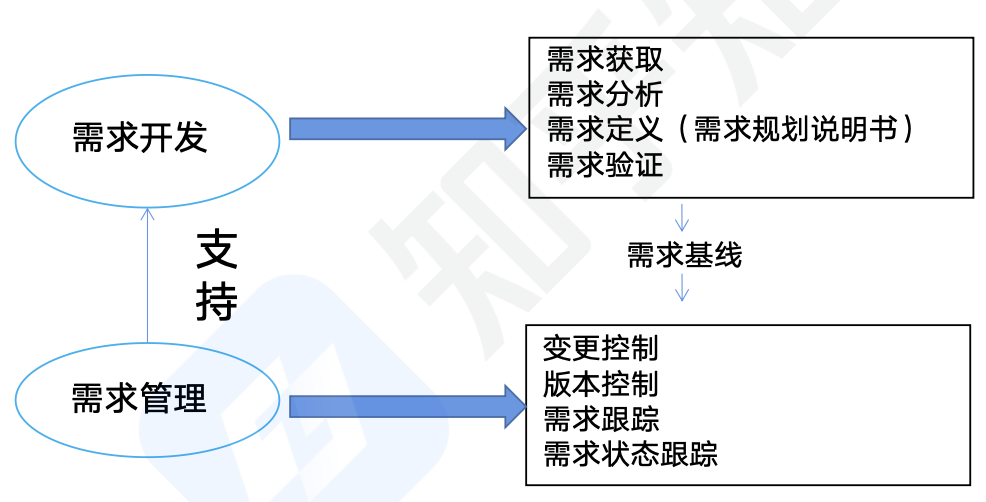

#### 软件需求分类

业务需求：反映企业或客户对系统高层次的目标要求，通常来自项目投资人、客户、市场营销部门或产品策划部门。通过业务需求可以确定项目视图和范围。

用户需求：描述的是用户的具体目标，或用户要求系统必须能完成的任务。即描述了用户能使用系统来做什么。通常采取用户访谈和问卷调查等方式，对用户使用的场景进行整理，从而建立用户需求。

系统需求：从系统的角度来说明软件的需求，包括功能需求、非功能需求和设计约束等。
- 功能需求：也称为行为需求，规定了开发人员必须在系统中实现的软件功能，用户利用这些功能来完成任务，满足业务需要。
- 非功能需求：指系统必须具备的属性或品质，又可以细分为软件质量属性（如可维护性、可靠性、效率等)、性能需求以及其他非功能需求。
- 设计约束：也称为限制条件或补充规约，通常是对系统的一些约束说明，例如必须采用国有自主知识产权的数据库系统，必须运行在 UNIX 操作系统之，又比如涉及到金钱的要精确到小数点后面 2 位等人为规定的或约束。

#### 需求获取

需求获取：是一个确定和理解不同的项目干系人的需求和约束的过程。

常见的需求获取法包括：
- 用户访谈：1 对 1-3, 找有代表性的用户进行访谈，对提问者的水平是有要求的。其形式包括结构化 (有剧本)和非结构化 (随意发挥)两种。
- 问卷调查：用户多，无法一一访谈，收集到的需求不够精准，比较杂乱，比较考验问卷编写者的水平
- 采样：从种群中系统地选出有代表性的样本集的过程，类似于数学中的数理统计。`样本数量=0.25*(可信度因子/错误率) 2`
- 情节串联板：一系列图片，通过这些图片来把需求给进行叙述出来，这样虽然生动，但是耗时
- 联合需求计划 (JRP)：通过联合各个关键用户代表、系统分析师、开发团队代表一起，通过有组织的会议来讨论需求。
- 需求记录技术：任务卡片、场景说明、用户故事、Volere 白卡。

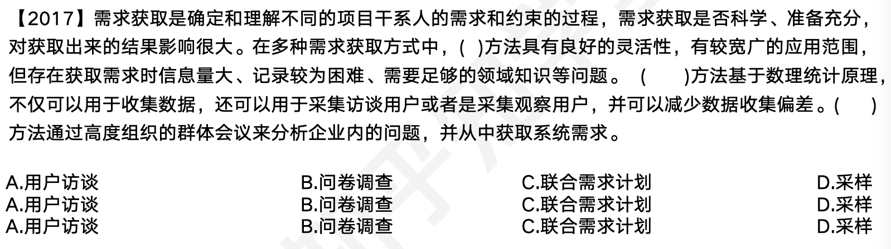

选择为 A (注意：记录较为困难)，D，C

需求分析：一个好的需求应该具有无二义性、完整性、一致性、可测试性、确定性、可跟踪性、正确性、必要性等特性，因此，需要分析人员把杂乱无章的用户要求和期望转化为用户需求，这就是需求分析的工作。

常见的需求分析任务包括：
- 绘制系统上下文范围关系图（数据流图）
- 创建用户界面原型
- 分析需求的可行性
- 确定需求的优先级
- 为需求建立模型
- 创建数据字典
- 使用 QFD (QFD: 质量功能部署，把需求和 QFD 进行关联)


#### 结构化的需求分析

面向对象的分析方法：UML+ER

结构化特点：自顶向下，逐步分解，面向数据。
三大模型：功能模型 (数据流图)、行为模型 (状态转换图)、数据模型 (E-R 图)以及数据字典。

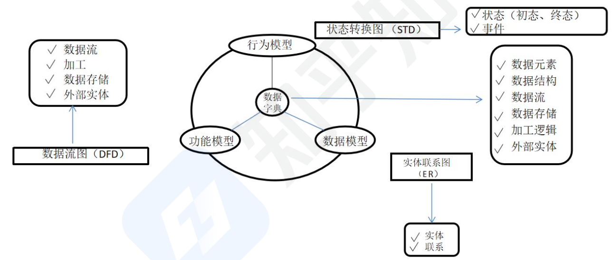

#### 需求分析-数据流图

数据流图 DFD 基本图形元素：外部实体、加工、数据存储、数据流。

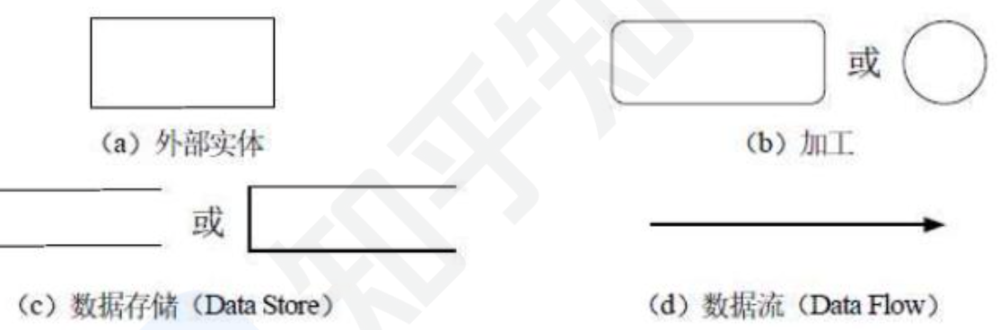

数据流：由一组固定成分的数据组成，表示数据的流向。在DFD 中，数据流的流向必须经过加工。
加工：描述了输入数据流到输出数据流之间的变换，数据流图中常见的三种错误如图所示：
- 加工 3.1.2 有输入但是没有输出，称之为“黑洞”
- 加工 3.1.3 有输出但没有输入。称之为“奇迹”。
- 加工 3.1.1 中输入不足以产生输出，我们称之为“灰洞"。

数据存储：用来存储数据。

外部实体 (外部主体)：是指存在于软件系统之外的人员或组织，它指出系统所需数据的发源地 (源)和系统所产生的数据的归宿地(宿)。

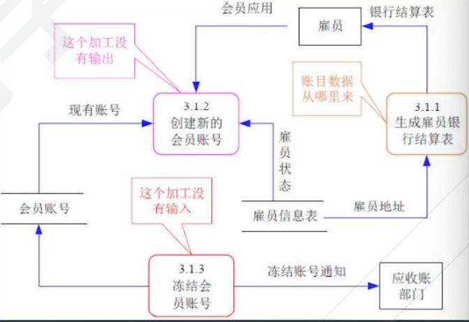

#### 需求分析-分成数据流图

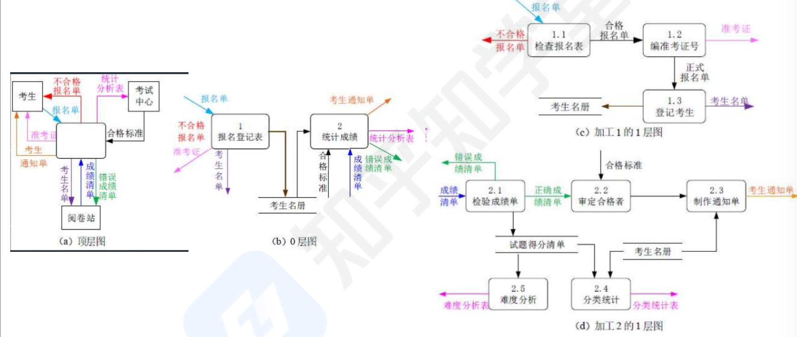

顶层图一般表示有哪些外部内容交互，中间空白地方应该就是一个系统。然后进行展开成 0 层图

#### 需求分析-数据字典 DD

数据流图描述了系统的分解，但没有对图中各成分进行说明。数据字典就是为数据流图中的每个数据流、文件、加工，以及组成数据流或文件的数据项做出说明，即为了描述数据流图的。

数据字典有以下 4 类条目：数据流、数据项、数据存储和基本加工。（注意这里没有描述外部实体，因为外部实体不是系统内部的内容）

加工逻辑也称为“小说明”。常用的加工逻辑描述方法有结构化语言、判定表和判定树 3 种。

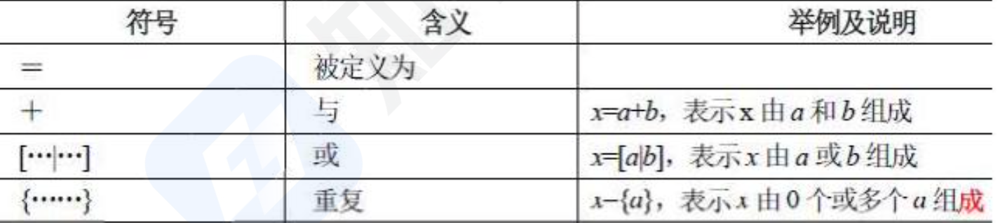


### 需求定义

需求定义 (软件需求规格说明书 SRS)：是需求开发活动的产物，编制该文档的目的是使项目干系人与开发团队对系统的初始规定有一个共同的理解，使之成为整个开发工作的基础。SRS 是软件开发过程中最重要的文档之一，对于任何规模和性质的软件项目都不应该缺少。

需求定义方法
- 严格定义也称为预先定义（结构化定义），需求的严格定义建立在以下的基本假设之上：所有需求都能够被预先定义。开发人员与用户之间能够准确而清晰地交流。采用图形 (或文字)可以充分体现最终系统，适合需求明确的情况。
- 原型方法，迭代的循环型开发方式，需要注意的问题：并非所有的需求都能在系统开发前被准确地说明。项目干系人之间通常都存在交流上的困难，原型提供了克该服困难的一个手段。特点：需要实际的、可供用户参与的系统模型。有合适的系统开发环境。反复是完全需要和值得提倡的，需求一旦确定，就应遵从严格的方法。

### 需求验证

需求验证：也称为需求确认，目的是与用户一起确认需求无误，对需求规格说明书 SAS 进行评审和测试，包括两个步骤：
- 需求评审：正式评审和非正式评审。
- 需求测试：设计概念测试用例，设计场景来测试需求，没有代码。

需求验证通过后，要请用户签字确认，作为验收标准之一，此时，这个需求规格说明书就是需求基线，不可以再随意更新，如果需要更改必须走需求变更流程。

### 需求管理

定义需求基线：通过了评审的需求说明书就是需求基线，下次如果需要变更需求，就需要按照流程来一步步进行。需求的流程及状态如下图所示：

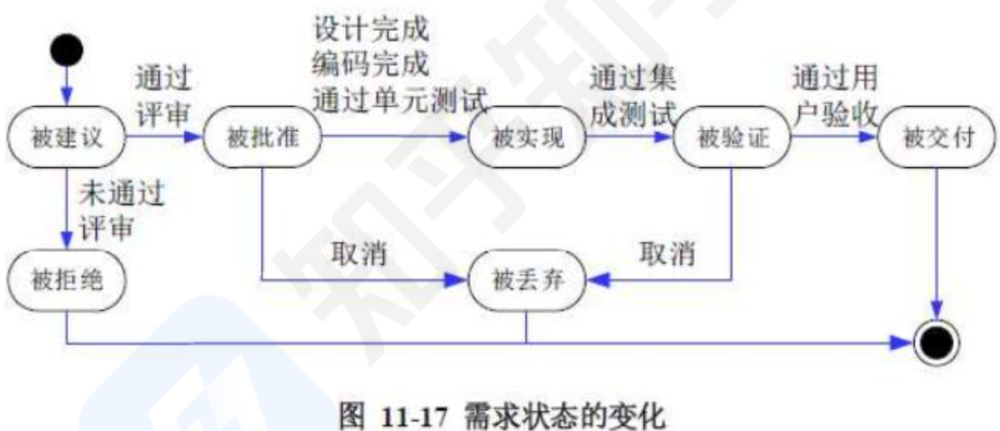

### 需求管理-需求变更和风险

主要关心需求变更过程中的需求风险管理，带有风险的做法有：无足够用户参与、忽略了用户分类、用户需求的不断增加、模棱两可的需求、不必要的特性、过于精简的 SRS、不准确的估算。

变更产生的原因：外部环境的变化、需求和设计做的不够完整、新技术的出现、公司机构重组造成业务流程的变化。

变更控制委员会 CCB: 也称为配置控制委员会，其任务时对建议的配置项变更做出评价、审批，以及监督已经批准变更的实施，

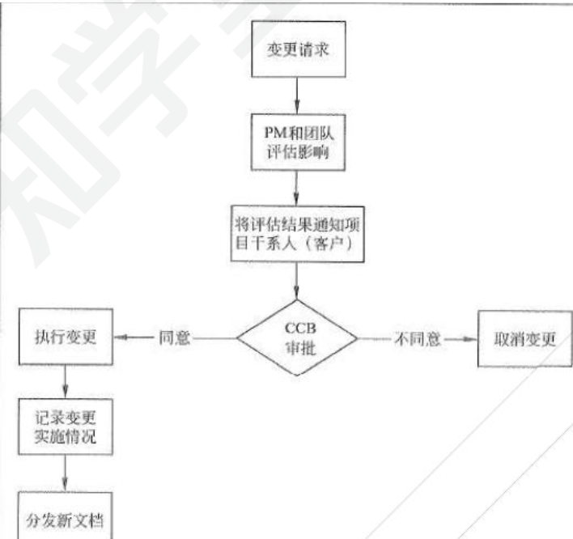


### 需求跟踪

需求跟踪：也称之为双向跟踪。分为两种方式：
- 正向跟踪表示用户原始需求是否都实现了，正向跟踪一般是用来判断产品有没有少实现
- 反向跟踪表示软件实现的是否都是用户要求的，不多不少，可以用原始需求和用例表格 (需求跟踪矩阵）来表示，反向跟踪一般是用来判断产品有没有多实现

使用方式：若原始需求和用例有对应，则在对应栏打对号，若某行都没有对号，表明原始需求未实现，正向跟踪发现问题：若某列都没有对号，表明有多余功能用例，软件实现了多余功能，反向跟踪发现问题。

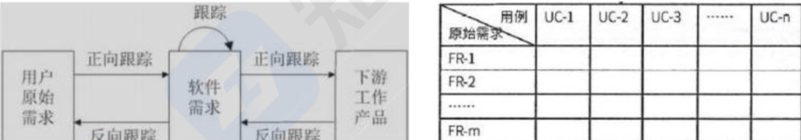

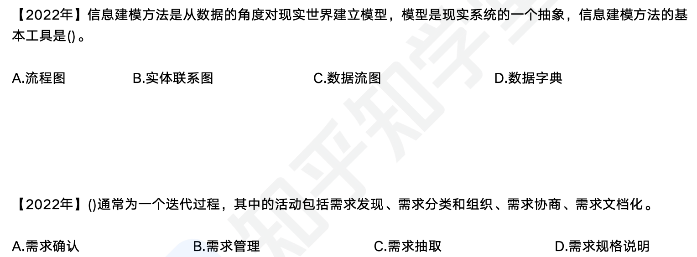

这里选择 B（从数据的角度，C 是从功能角度），C（A 不需要发现了，B 这里还没到管理的程度，因为此时需求已经确认了，AD 都比较片面）

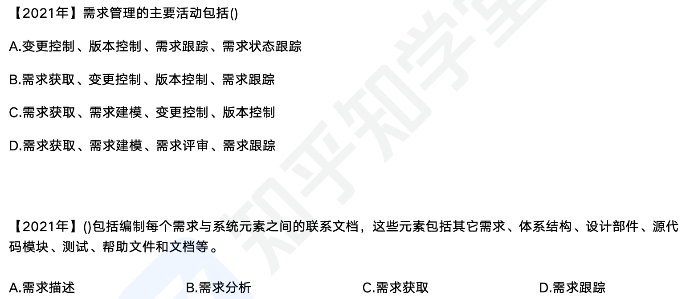

这里选择 A，D（需求与系统元素之间的联系，没有需求描述）


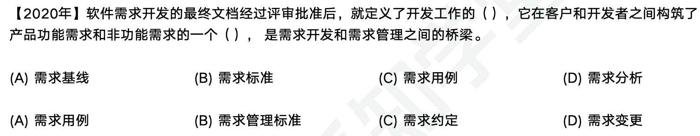

 A，C