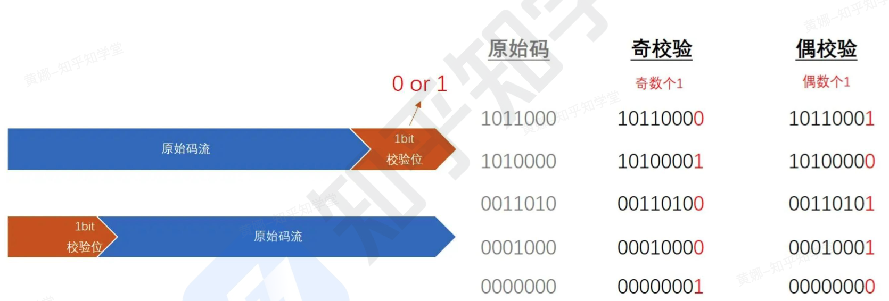
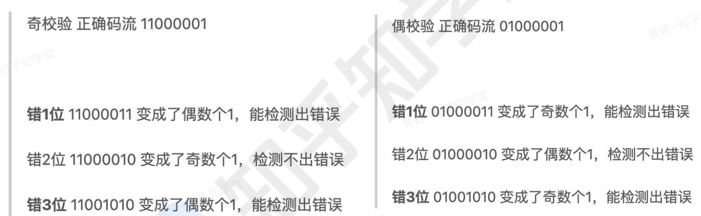
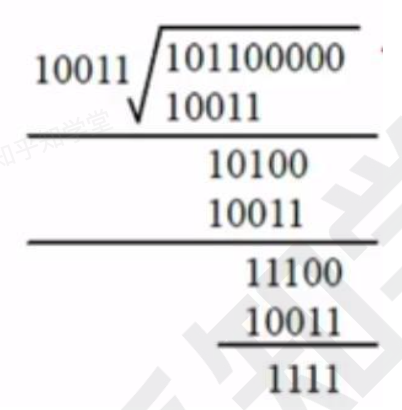

```toc
```

## 计算机硬件组成

- 计算机的基本硬件系统由运算器、控制器、存储器、输入设备和输出设备 5 大部件组成。

- 运算器、控制器等部件被集成在一起统称为中央处理单元 (`Central ProcessingUnit, CPU`). CPU 是硬件系统的核心，用于数据的加工处理，能完成各种算术、逻辑运算及控制功能。

- 存储器是计算机系统中的记忆设备，分为内部存储器和外部存储器．前者速度高、容量小，一般用于临时存放程序、数据及中间结果。而后者容量大、速度慢，可以长期保存程序和数据。

- 输入设备和输出设备合称为外部设备（简称外设），输人设备用于输入原始数据及各种命令，而输出设备则用于输出计算机运行的结果。

## CPU

CPU 的功能：
(1）程序控制：CPU 通过执行指令来控制程序的执行顺序，这是 CPU 的重要功能。
(2）操作控制：一条指令功能的实现需要若干操作信号配合来完成，CPU 产生每条指令的操
作信号并将操作信号送往对应的部件，控制相应的部件按指令的功能要求进行操作。
(3）时间控制：CPU 对各种操作进行时间上的控制，即指令执行过程中操作信号的出现时间、持续时间及出现的时间顺序都需要进行严格控制。
(4）数据处理：CPU 通过对数据进行算术运算及逻辑运算等方式进行加工处理，数据加工处理的结果被人们所利用。所以，对数据的加工处理也是 CPU 最根本的任务.

此外，CPU 还需要对系统内部和外部的中断或异常做出响应，进行相应的处理.

CPU 的组成：CPU 主要由运算器、控制器、奇存器组和内部总线等部件组成

运算器：
执行所有的算术运算，如加减乘除等；执行所有的逻辑运算并进行逻辑测试，如与、或、非、比较等。
- 算术逻辑单元 ALU（实现对数据的算术和逻辑运算）
- 累加寄存器 AC（运算结果或源操作数的存放区）
- 数据缓冲寄存器 DR（暂时存放内存的指令或数据）
- 状态条件寄存器 PSW（保存指令运行结果的条件码内容，如溢出标志等）组成。

控制器：
控制整个 CPU 的工作，最为重要。
- 指令寄存器 IR（暂存 CPU 执行指令）
- 程序计数器 PC（存放指令执行地址）
- 地址寄存器 AR（保存当前 CPU 所访问的内存地址）
- 指令译码器 ID（分析指令操作码）等组成。

CPU 依据指令周期的不同阶段来区分二进制的指令和数据，因为在指令周期的不同阶
段，指令会命令 CPU 分别去取指令或者数据。


## 校验码


### 为什么要用校验码

- 突发错误 (BurstError)：两个或更多个数据位在码流中出现错误

- 为什么可能会出现这些位错误呢？
	对于电子系统通信，它涉及到物理层、链路层、通信介质等，其中物理层主要将原始二进制数据利用一定的编解码原理对其进行调制，然后经由发送电路将调制信号输送至传输介质，接收端利用接收电路进行接收并解调，将信息还原成二进制码流．在这个过程中介质有可能被干扰，接收电路、发送电路、调制电路、解调电路都可能由于某些干扰原因导致工作失效而出现误码．此时，如果没有一个很好的机制去确保数据的正确性，比如一个飞控系统中某些控制命令、车辆系统中 CAN 报文数据，系统直接使用这些错误数据去控制被控对象（比如电机、发动机等），严重的时候就会造成难以估量的生命财产灾难。
	
- 所以，对于数据完整性检测的重要性不言而喻。

### 校验码

码距：就单个编码 `A：00` 而言，其码距为 1，因为其只需要改变一位就变成另一
个编码．在两个编码中，从 A 码到 B 码转换所需要改变的位数称为码距，如 `A：00` 要转换为 `B：11`，码距为 2。一般来说，码距越大，越利于纠错和检错。其实就是位数越多越准确。

奇偶校验码：
1. 无论数据位多少位，校验位只有一位
2. 数据位和校验位一共所含 1 的个数为奇数，称为奇校验
3. 数据位和校验位一共所含 1 的个数为偶数，称为偶校验



### 奇偶校验码错误检测能力

**只能检测出奇数个错误**



那么使用中是选择奇校验还是偶校验呢？其实都有应用了。

奇校验一个重要的特征是产生不了全 0 代码，所以在实际操作过程中选择的时候要考虑到这一点。


### CRC 校验码

CRC 只能检错，不能纠错．使用 CRC 编码，需要先约定一个生成多项式 `G(x)`。生成多项式的最高位和最低位必须是 1. 假设原始信息有 m 位，则对应多项式 `M(x)`。生成校验码思想就是在原始信息位后追加若干校验位，使得追加的信息能被 `G(x)` 整除．接收方接收到带校验位的信息，然后用 `G(x)` 整除．余数为 0，则没有错误；反之则发生错误.

计算过程：
例：假设原始信息串为 `10110`，CRC 的生成多项式为 `G(x)=x^4+x+1`，求 CRC 校验码.
(1) 在原始信息位后面添 0，假设生成多项式的阶为 r，则在原始信息位后添加 r 个 0，本题中，`G(x)` 阶为 4，则在原始信息串后加 4 个 0，得到的新串为 `101100000`，作为被除数.
(2) 由多项式得到除数，多项中 x 的幂指数存在的位置 1，不存在的位置 0. 本题中，x 的幂指数为0，1，4 的变量都存在，而幂指数为 2，3 的不存在，因此得到串 `10011`.
(3) 生成 CRC 校验码，将前两步得出的被除数和除数进行模 2 除法运算即不进位也不借位的除法运算）。除法过程如下图所示。得到余数 `1111`


注意：余数不足 r，则余数左边用若干个 0 补齐．如求得余数为 11，r=4，则补两个 0 得到 `0011`.
(4）生成最终发送信息串，将余数添加到原始信息后．上例中，原始信息为 `10110`，添加余数`1111` 后，结果为 `101101111`．发送方将此数据发送给接收方．
(5）接收方进行校验．接收方的 CRC 校验过程与生成过程类似，接收方接收了带校验和的帧后，用多项式 `G(x)` 来除．余数为 0，则表示信息无错；否则要求发送方进行重传。

注意：收发信息双方需使用相同的生成多项式。

补充：模 2 除法其实和普通除法类似，只不过每一位相除时采用异或运算，比如上面例子中最后的商就是 `10101`。

总结：也就是将余数接到原始码上，如果余数不足阶，则在余数左边补 0.