```toc
```

## 指令系统- Instruction System

计算机指令的组成：一条指令由操作码和操作数两部分组成，操作码决定要完成的操作，操作数指参加运算的数据及其所在的单元地址。

在计算机中，操作要求和操作数地址都由二进制数码表示，分别称作操作码和地址码，整条指令以二进制编码的形式存放在存储器中。

计算机指令执行过程：取指令——分析指令——执行指令三个步骤，首先将程序计数器 PC 中的指令地址取出，送入地址总线，CPU 依据指令地址去内存中取出指令内容存入指令寄存器 IR；而后由指令译码器进行分析，分析指令操作码；最后执行指令，取出指令执行所需的源操作数。

指令寻址方式 （怎么找到下一条指令）
- 顺序寻址方式：当执行一段程序时，根据 PC（程序计数器）中指令，是一条指令接着一条指令地顺序执行。
- 跳跃寻址方式：指下一条指令的地址码不是由程序计数器给出，而是由本条指令直接给出。程序跳跃后，按新的指令地址开始顺序执行。因此，程序计数器的内容也必须相应改变，以便及时跟踪新的指令地址。

指令操作数的寻址方式（怎么找到操作数）
- 立即寻址方式：指令的地址码字段指出的不是地址，而是操作数本身。
- 直接寻址方式：在指令的地址字段中直接指出操作数在主存中的地址：
- 间接寻址方式：指令地址码字段所指向的存储单元中存储的是操作数的地址。
- 寄存器寻址方式：指令中的地址码是寄存器的编号。
- 基址寻址方式：将基址寄存器的内容加上指令中的形式地址而形成操作数的有效地址，其优点是可以扩大寻址能力。
- 变址寻址方式：变址寻址方式计算有效地址的方法与基址寻址方式很相似，它是将变址寄存器的內容加上指令中的形式地址而形成操作数的有效地址。


CISC 是复杂指令系统，兼容性强，指令繁多、长度可变，由微程序实现；
RISC 是精简指令系统，指令少，使用频率接近，主要依靠硬件实现（通用寄存器、硬布线逻辑控制）。具体区别如下：

|指令系统类型|指令|寻址方式|实现方式|其他|
|-|-|-|-|-|
|CISC（复杂） |数量多，使用频率差别大，可变长格式 ||||
||||||

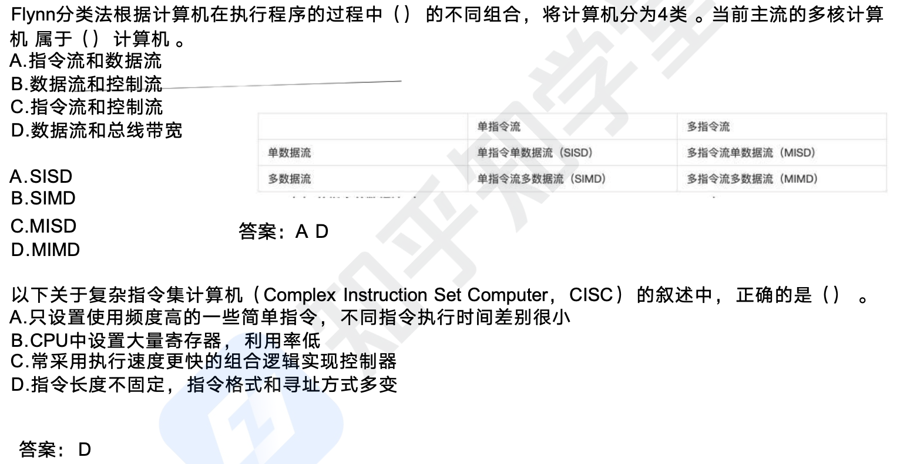

指令流水线原理：将指令分成不同段，每段由不同的部分去处理，因此可以产生叠加的
效果，所有的部件去处理指令的不同段

RISC 中的流水线技术：
（1）超流水线 ( Super Pipe Line）技术。它通过细化流水、增加级数和提高主频，使得每个机器周期内能完成一个甚至两个浮点操作。其实质是*以时间换取空间*。
（2）超标量（Super Scalar) 技术。它通过内装多条流水线来同时执行多个处理，其
时钟频率虽然与一般流水接近，却有更小的CPI。其实质是以空间换取时间。
（3）超长指令字（`Very Long Instruction Word, VLIW`） 技术。VLIW 和超标量都是20 世纪 80 年代出现的概念，其共同点是要同时执行多条指令，其不同在于超标量依靠硬件来实现并行处理的调度，VLIW 则充分发挥软件的作用，而使硬件简化，性能提高。

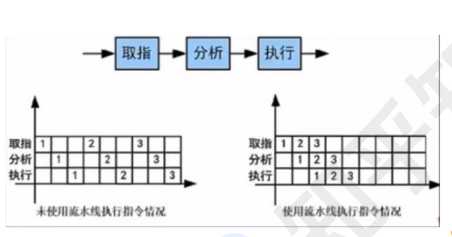

流水线时间计算
1. 流水线周期：指令分成不同执行段，其中执行时间最长的段为流水线周期。
2. 流水线执行时间：1 条指令总执行时间+（总指令条数-1）*流水线周期。要记住
3. 流水线吞吐率计算：吞吐率即单位时间内执行的指令条数。
	公式：指令条数 / 流水线执行时间
4. 流水线的加速比计算：加速比即使用流水线后的效率提升度，即比不使用流水线快了多少倍，越高表明流水线效率越高，
	公式：不使用流水线执行时间 /使用流水线执行时间。

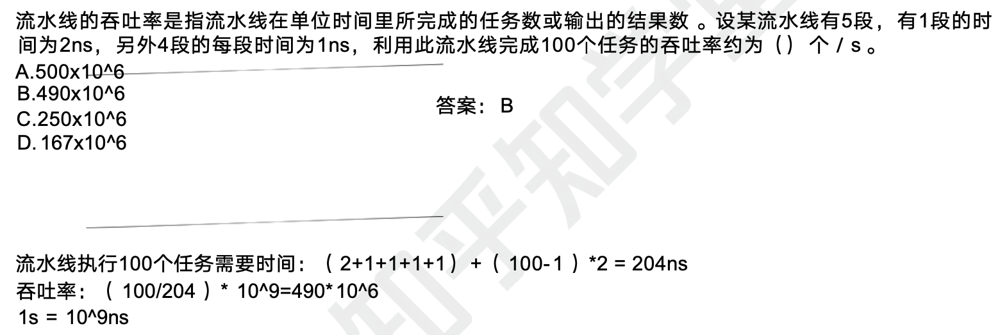

流水线分成了 5 个段，那么一条执行总执行时间就是 5 个段时间之和。流水线周期就是最长那个段的时间。注意单位是 `ns`。一个任务就是一个指令，如果只有一个任务，那么流水线 5 个段段时间和就是流水线的执行时间。

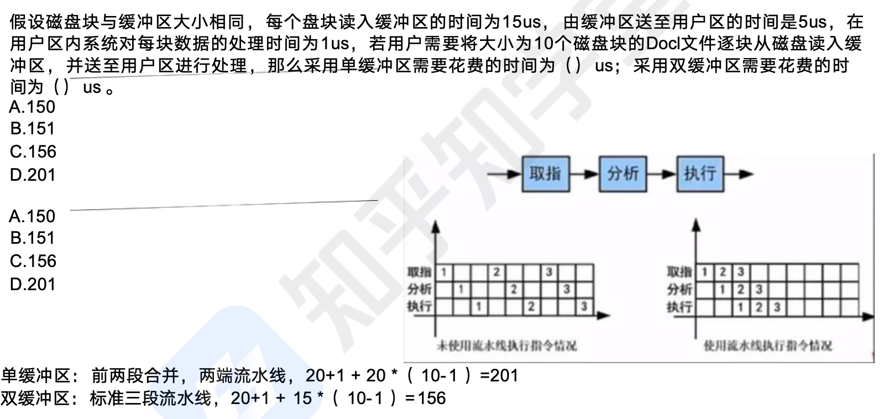

如果采用单缓冲区，其实就是将前两个段合二为一，最终就是两端执行，流水线周期就是 20（因为只能串行处理），指令执行的总时间为 21. 如果采用双缓冲区，那么就是标准三段流水线，指令执行总时间不变，但是流水线周期是 15.

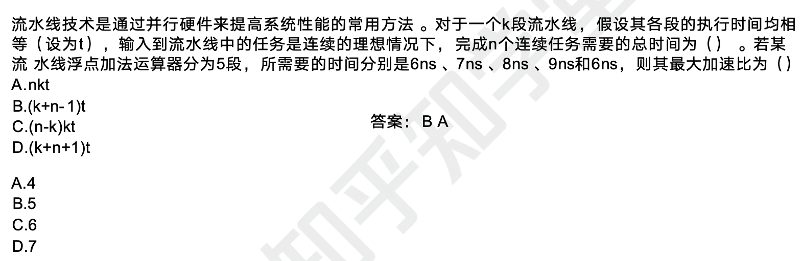

第一题略。后面一条，如果不使用流水线，则总时间为 36n，如果使用流水线则总时间为 `36+(n-1)*9=9n+27`。可以看到加速比 `36n/(9n+27)` 中 n 越大，加速比越大，取极值就是 4.

## 存储系统和缓存

计算机采用分级存储体系的主要目的是为了解决存储容量、成本和速度之间的矛盾问题

两级存储：Cache-主存、主存-辅存（虚拟存储体系）

局部性原理：总的来说，在 CPU 运行时，所访问的数据会趋向于一个较小的局部空间地
址内，包括下面两个方面：
- 时间局部性原理：如果一个数据项正在被访问，那么在近期它很可能会被再次访问，即在相邻的时间里会访问同一个数据项。
- 空间局部性原理：在最近的将来会用到的数据的地址和现在正在访问的数据地址很可能是相近的，即相邻的空间地址会被连续访问。

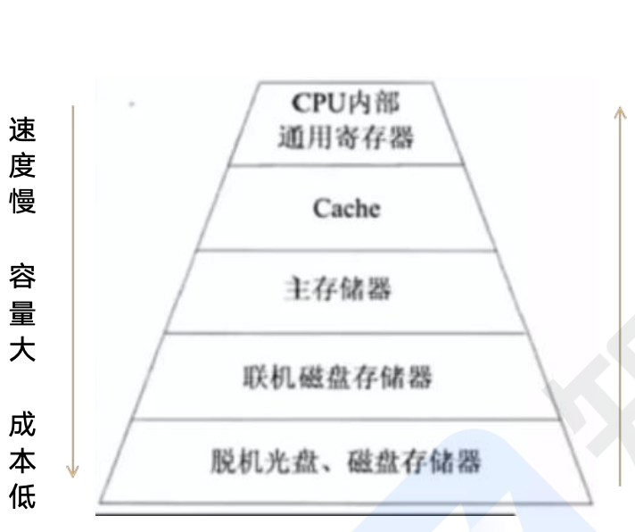

高速缓存 Cache 用来存储当前最活跃的程序和数据，直接与 CPU 交互，位于 CPU 和主存之间，容量小，速度为内存的 5—10 倍，由半导体材料构成。其内容是主存内存的副本拷贝，对于程序员来说是透明的。

Cache 由控制部分和存储器组成，存储器存储数据，控制部分判断 CPU 要访问的数据是否在 Cache 中，在则命中，不在则依据一定的算法从主存中替换。

地址映射：在 CPU 工作时，送出的是主存单元的地址，而应从 Cache 存储器中读/写信息。这就需要将主存地址转换为 Cache 存储器地址，这种地址的转换称为地址映射，由硬件自动完成映射，分为下列三种方法：

直接映射：将 Cache 存储器等分成块，主存也等分成块并编号。主存中的块与 Cache
中的块的对应关系是固定的，也即二者块号相同才能命中。地址变换简单但不灵活，
容易造成资源浪费。（如图所示）
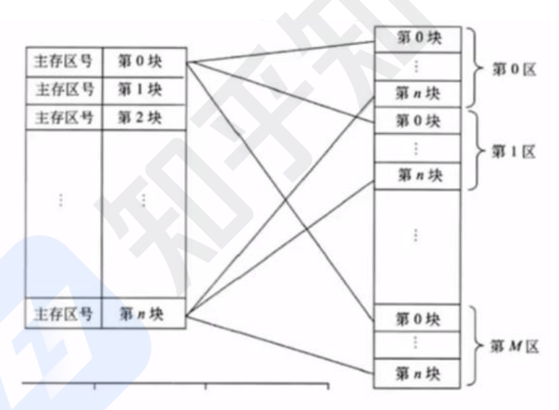


全相联映射：同样都等分成块并编号。主存中任意一块都与 Cache 中任意一块对应。
因此可以随意调入 Cache 任意位置，但地址变换复杂，速度较慢。因为主存可以随
意调入 Cache 任意块，只有当 Cache 满了才会发生块冲突，**是最不容易发生块冲
的映像方式。

组组相连映射： 前面两种方式的结合，将Cache 存储器先分块再分组，主存也同样
先分块再分组，组间采用直接映像，即主存中组号与 Cache 中组号相同的组才能命
中，但是组內全相联映像，也即组号相同的两个组内的所有块可以任意调换。

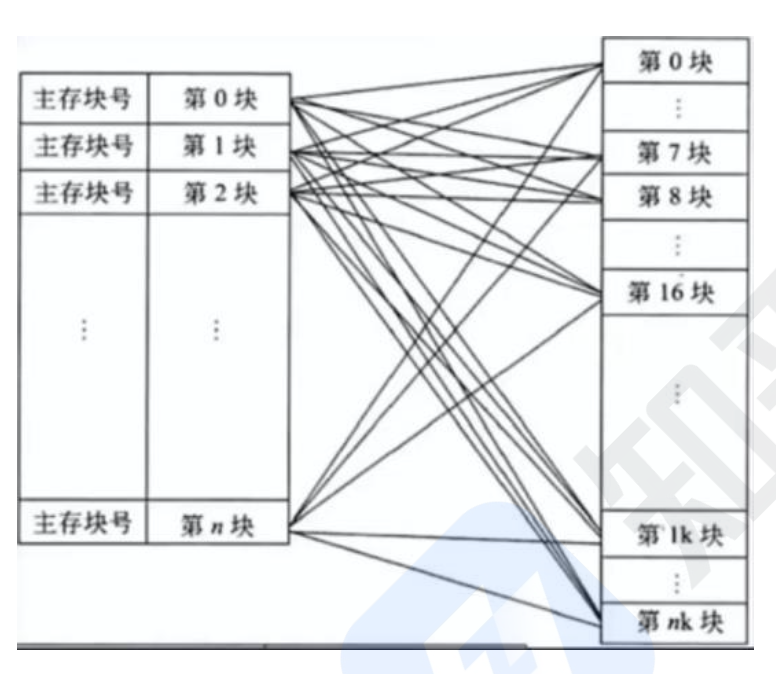


替换算法的目标就是使 Cache 获得尽可能高的命中率。常用算法有如下几种。
（1）随机替换算法。就是用随机数发生器产生一个要替换的块号，将该块替换出去。
（2）先进先出算法。就是将最先进入 Cache 的信息块替换出去。
（3）近期最少使用算法。这种方法是将近期最少使用的 Cache 中的信息块替换出去。
（4）优化替换算法。这种方法必须先执行一次程序，统计 Cache 的替换情况。有了这样的先验信息，在第二次执行该程序时便可以用最有效的方式来替换。


命中率及平均时间
Cache 有一个命中率的概念，即当 CPU 所访问的数据在 Cache 中时命中，直接从 Cache 中读取数据，设读取一次 Cache 时间为 1ns，若 CPU 访问的数据不在 Cache 中，则需要从内存中读取，设读取一次内存的时间为 1000 ns，若在 CPU 多次读取数据过程中，有 90％命中 Cache, 则 CPU 读取一次的平均时间为（90%* 1+10%* 1000) ns

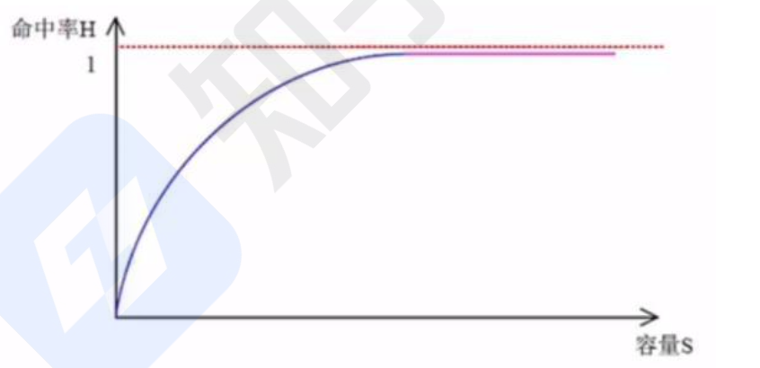

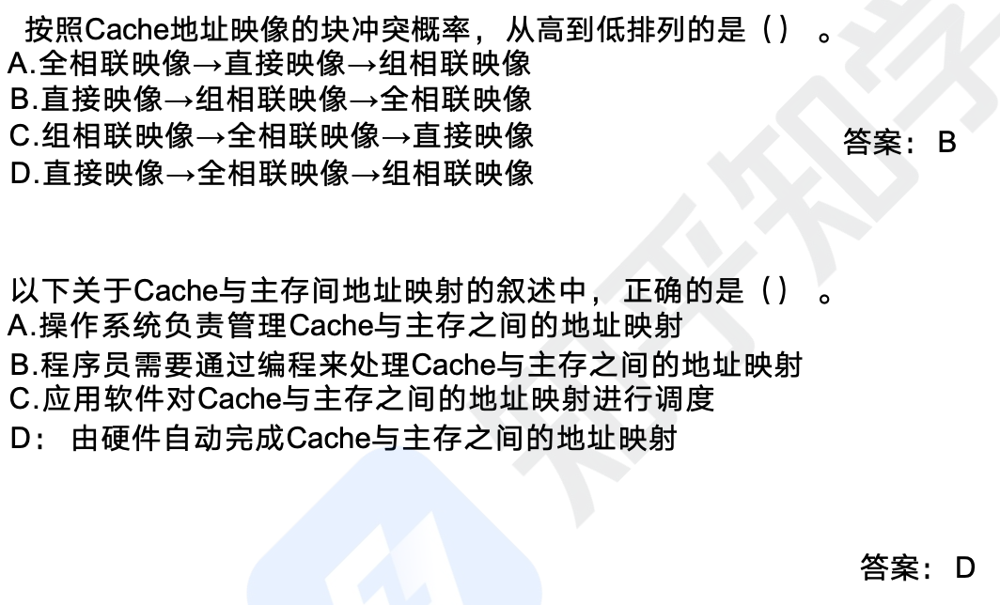


磁盘结构和参数
磁盘有正反两个盘面，每个盘面有多个同心圆，每个同心圆是一个磁道，每个同
心圆又被划分为多个扇区，数据就被存放在一个个扇区中。

磁头首先要寻找到对应的磁道，然后等待磁盘进行周期旋转，旋转到指定的扇区
才能读取到对应的数据，因此，会产生寻道时间和等待时间。公式为：存取时间=
寻道时间＋等待时间（平均定位时间 ＋转动延迟）。

注意：寻道时间是指磁头移动到磁道所需的时间；等待时间为等待读写的扇区转
至头下方所用的时间

磁盘调度算法
之前已经说过，磁盘数据的读取时间分为寻道时间+旋转时间，也即先找到对应的磁道，而后再旋转到对应的扇区才能读取数据，其中寻道时间耗时最长，需要重点调度，有如下调度算法：
- 先来先服务 FCFS：根据进程请求访问磁盘的先后顺序进行调度。
- 最短寻道时间优先 SSTF：请求访问的磁道与当前磁道最近的进程优先调度，使得
	每次的寻道时间最短。会产生“饥俄”现象，即远处进程可能永远无法访问。
- 扫描算法 SCAN：又称“电梯算法〞，磁头在磁盘上双向移动，其会选择离磁头当
	前所在磁道最近的请求访问的磁道，并且与磁头移动方向一致，磁头永远都是从里
	向外或者从外向里一直移动完才掉头，与电梯类似。
- 单向扫描调度算法 CSCAN：与 SCAN 不同的是，其只做单向移动，即只能从里向外或者从外向里.
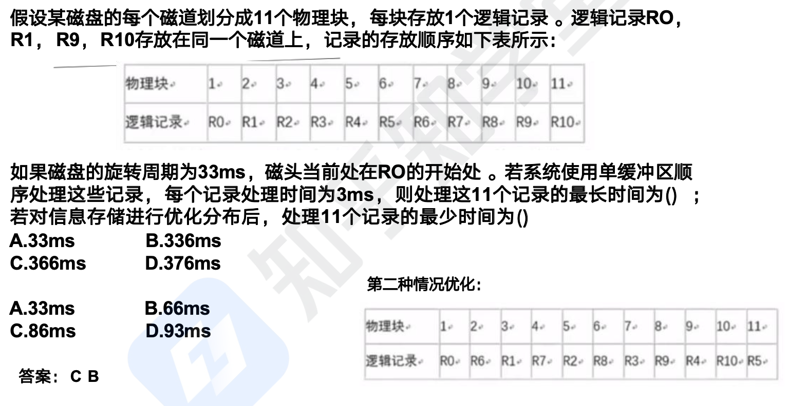

第一题是 `36+(11-1)*33`, 第二题是，总共 33ms 可以读取 11 个快，则平均每个快是 3ms，加上处理时间就是 6ms，于是总时间就是 `6+(11-1)*6`. 两个方式的区别其实就是前面一个是每次转一圈读取一个块，然后处理，而后面的读取方式就是总共转一圈将所有的磁盘块全部读取完毕。当然也可以手动排列计算，比如第一种情况，处理第一个块花了 6ms，此时磁针指向 3，此时要处理 R1，则需要等待转圈转回来，以此类推计算时间。第二种情况我们调整顺序，如图所示，就是当 R0 处理完时，磁针指向 3，此时 3 这个位置刚好时 R1，这样就可以直接读取然后处理，以此类推计算时间，思路其实是一样的。

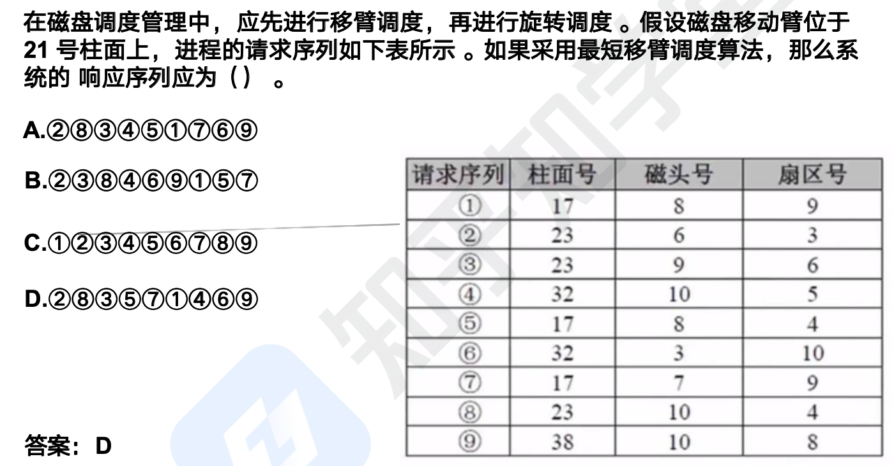

其实就是哪个近选哪个。