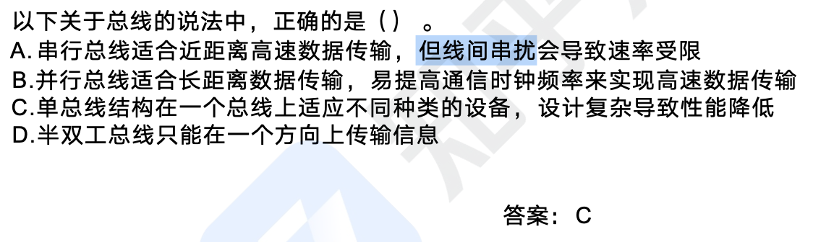

```toc
```

## 输入输出技术

计算机系统中存在多种内存与接口地址的编址方法，常见的是下面两种：
（1）内存与接口地址独立编址方法
内存地址和接口地址是完全独立的两个地址空间。访问数据时所使用的指令也完全不同，用于接口的指令只用于接口的读/ 写，其余的指令全都是用于内存的。因此，在编程序或读程序时很易使用和辦认。这种编址方法的缺点是用于接口的指令太少、功能太弱。
（2）内存与接口地址统一编址方法
内存地址和接口地址统一在一个公共的地址空间里，即内存单元和接口共用地址空间。优点是原则上用于内存的指令全都可以用于接口，这就大大地增强了对接口的操作功能，而且在指令上也不再区分内存或接口指令。该编址方法的缺点就在于整个地址空间被分成两部分，其中一部分分配给接口使用，剩余的为内存所用，这经常会导致内存地址不连续

计算机和外设间的数据交互方式：
- 程序控制（查询）方式：CPU 主动查询外设是否完成数据传输，效率极低
- 程序中断方式：外设完成数据传输后，向 CPU 发送中断，等待 CPU 处理数据，效率相对较高。中断响应时间指的是从发出中断请求到开始进入中断处理程序；中断处理时间指的是从中断处理开始到中断处理结束。中断向量提供中断服务程序的入口地址。多级中断嵌套，使用堆栈来保护断点和现场。
- DMA 方式（直接主存存取）：CPU 只需完成必要的初始化等操作，数据传输的整个过程都由 DMA 控制器来完成，主存和外设之间建立直接的数据通路，效率很高
- 一个总线周期结束后，CPU 会响应 DMA 请求开始读取数据；CPU 响应程序中断方式请求是在一条指令执行结束时。


## 总线结构

总线（Bus），是指计算机设备和设备之间传输信息的公共数据通道。总线是连接计算机硬件系统内多种设备的通信线路，它的一个重要特征是由总线上的所有设备共享，因此可以将计算机系统内的多种设备连接到总线上。

从广义上讲，任何连接两个以上电子元器件的导线都可以称为总线，通常分为以下三类：
- 内部总线：内部芯片级别的总线，芯片与处理器之间通信的总线。
- 系统总线：是板级总线，用于计算机内各部分之间的连接，具体分为数据总线（并行数据传输位数）、地址总线（系统可管理的内存空间的大小）、控制总线（传送控制命令）。代表的有 ISA 总线、EISA 总线、PCI 总线。
- 外部总线：设备一级的总线，微机和外部设备的总线。代表的有 `RS232`（串行总线）、ScSI（并行总线）、USB（通用串行总线，即插即用，支持热插拔）



串行总线是一种数据在一条线路上按照一定顺序逐位或逐字节传送的方式，这种方式简单易实现，但是传输效率较低，因为数据必须按顺序依次处理。

并行总线是把数据分割成若干个部分分别通过几条线路同时传送的方式，这种方式可以大幅提高传输效率，但是实现难度较大，而且需要额外的同步机制来保证数据的正确性。

总的来说，串行总线适合于传输少量数据，实现简单；并行总线适合于传输大量数据，传输效率高。