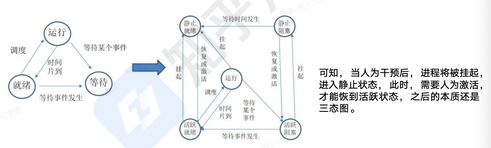
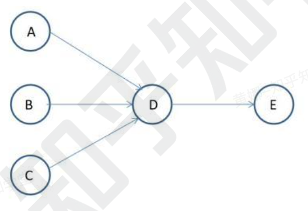
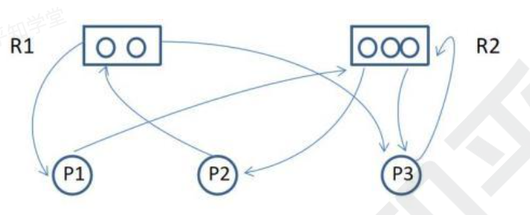
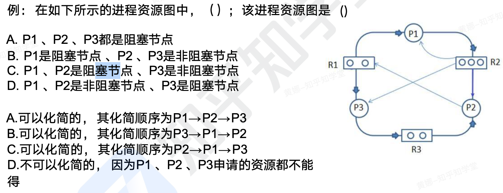
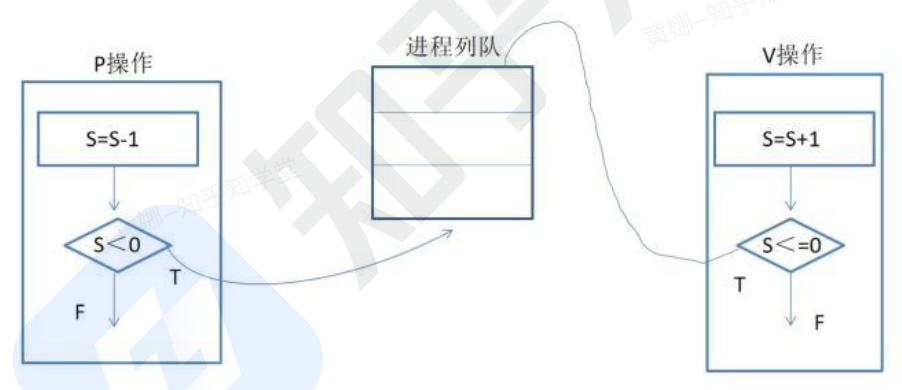
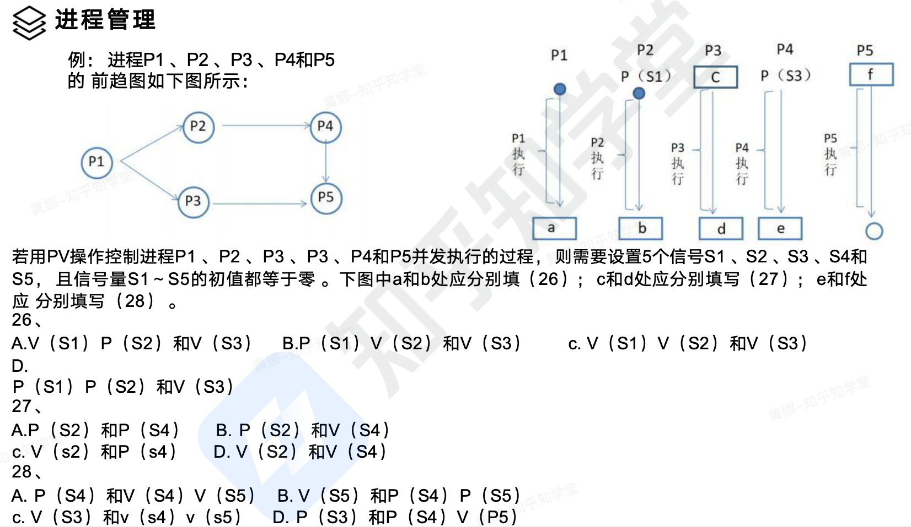
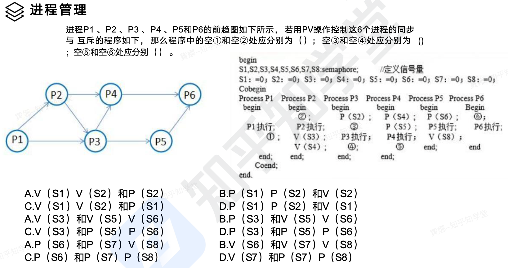
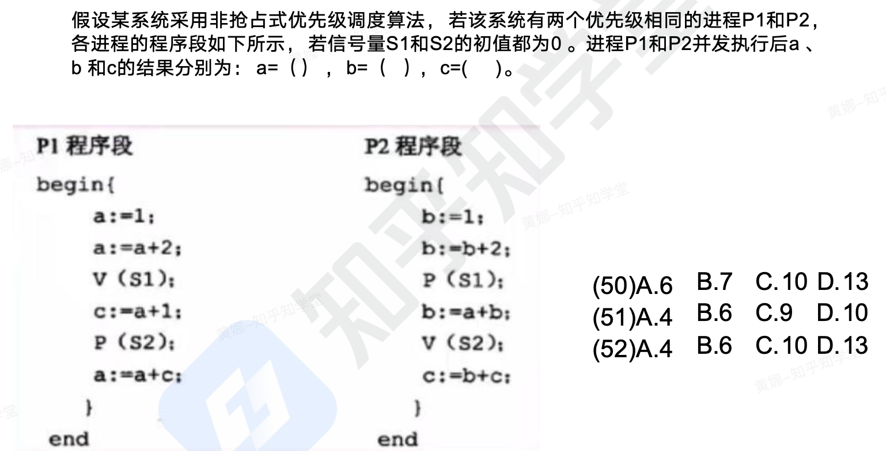
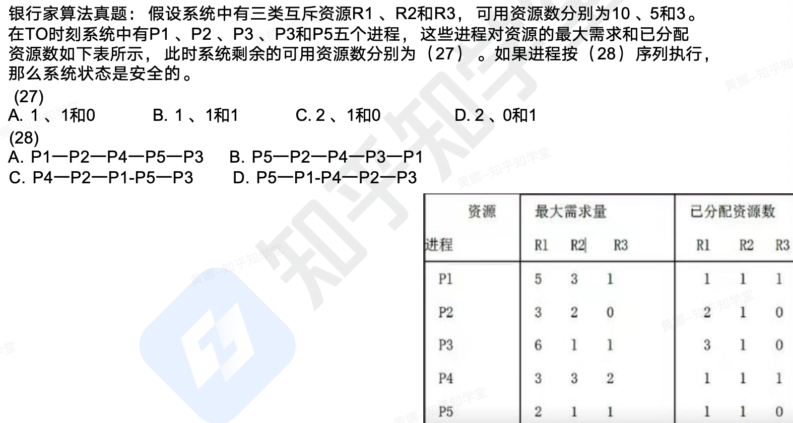

```toc
```

## 操作系统概述

操作系统的作用：通过资源管理提高计算机系统的效率；改善人机界面向用户提供友好的工作环境。

操作系统的特征：并发性、共享性、虚拟性、不确定性

操作系统的功能：进程管理、存储管理、文件管理、设备管理、作业管理。

操作系统的分类：批处理操作系统、分时操作系统（轮流使用 CPU 工作片）、实时操作系统（快速响应）、网络操作系统、分布式操作系统（物理分散的计算机互联系统）、微机操作系统（Windows）、嵌入式操作系统。

计算机启动的基本流程为：BIOS->主引导记录->操作系统。


## 进程管理

### 进程的组成和状态

进程是计算机中正在运行的程序的实例。它是操作系统进行资源分配和管理的基本单位，包括代码、数据和执行状态等信息。

进程的组成：进程控制块 PCB（唯一标志）、程序（描述进程要做什么）、数据（存放进程执行时所需数据）

进程基础的状态是下左图中的三态图，这是系统自动控制时只有三种状态，而下右图中的五态，是多了两种状态：静止就绪和静止阻塞，需要人为的操作才会进入对应状态，活跃就绪即就绪，活跃阻塞即等待。



### 前趋图

前趋图：用来表示哪些任务可以并行执行，哪些任务之间有顺序关系具体如下图：



可知，ABC 可以并行执行，但是必须 ABC 都执行完后，才能执行 D，这就确定了两点：任务间的并行、任务间的先后顺序


### 进程资源图

进程资源图：用来表示进程和资源之间的分配和请求关系。如下图所示：



P 代表进程，R 代表资源，R 方框中有几个圆球就表示有几个这种资源，在图中，`R1` 指向 `P1`，表示 `R1`有一个资源已经分配给了 `P1`，`P1` 指向 `R2`，表示 `P1`还需要 `P1` 请求一个 `R2` 资源才能执行。

阻塞节点：某进程所请求的资源已经全部分配完毕，无法获取所需资源，该进程被阻塞了无法继续。如上图中 `P2`。
非阻塞节点：某进程所请求的资源还有剩余，可以分配给该进程继续运行。如上图中 `P1`、`P3`。当一个进程资源图中所有进程都是阻塞节点时，即陷入死锁状态。



这里可以很容易确认 `P2` 是阻塞节点，`P3` 是非阻塞节点。比较绕的是 `P1` 节点，我们可以看到 `R2` 将其 3 个资源都分配出去了，但是此时 `P1` 还要请求 `R2` 资源，所以 `P1` 是阻塞节点（不要理解为 `R2` 分配给了 `P1`，`P1` 就不需要了，因为有时候是需要多个资源的）。所以选择 C。

第二题中，首先没有出现死锁，如果出现死锁，那么就不能化简，所以是可以化简的。那如何化简呢？很简单，首先将非阻塞节点运行完毕，因为运行完毕就可以将资源释放，便于阻塞节点运行。

### 同步与户互斥

互斥：某资源（即临界资源）在同一时间内只能由一个任务单独使用，使用时需要加锁，
使用完后解锁才能被其他任务使用；如打印机

同步：多个任务可以并发执行，只不过有速度上的差异，在一定情况下停下等待，不存
在资源是否单独或共享的问题；如自行车和汽车。

临界资源：各进程间需要以互斥方式对其进行访问的资源

临界区：指进程中对临界资源实施操作的那段程序。本质是一段程序代码。

互斥信号量：对临界资源采用互斥访问，使用互斥信号量后其他进程无法访问，初值为1。

同步信号量：对共享资源的访问控制，初值一般是共享资源的数量。


### 信号量

P 操作：申请资源，`S=S-1`，若 `S>=0`，则执行 P 操作的进程继续执行；若 `S<0`，则
置该进程为阻塞状态（因为无可用资源），并将其插入阻塞队列。
V 操作：释放资源，`S=S+1`，若 `S>0`，代表此时资源有空余，没有阻塞的进程，则该进程继续执行；若 `S<=0`，代表此时线程在被阻塞，所以需要从阻塞状态唤醒一个进程，并将其插入就绪队列（此时因为缺少资源被 P 操作阻塞的进程可以继续执行），然后执行 V 操作的进程继续。这里注意：如果为负数，那么表示阻塞的线程数量。



### 生产者和消费者

经典问题：生产者和消费者的问题
三个信号量：互斥信号量 `SO`（仓库独立使用权），同步信号量 `S1`（仓库空闲位
置），同步信号量 `S2`（仓库商品个数）。*表格看列，从上到下的顺序。*

| 生产者流程 | 消费者流程 |
| ---- | ---- |
| 生产一个商品 S | `P(SO)` |
| `P(SO)` | `P(S2)` |
| `P(S1)` | 取出一个商品 |
| 将商品放入仓库中 | `V(S1)` |
| `V(S2)` | `V(SO)` |
| `V(SO)` |  |




这里有个技巧，很简单，上面的都是 P 操作，下面的都是 V 操作。所以第一题选择 C。于是我们知道 `P1` 执行完后释放了两个资源 `S1，S2`，而刚好 `P2` 执行时用到了 `S1`，所以 `S2` 肯定是给 `P3` 用的，于是 c 就是 `P(S2)`，第二题选择 B。于是我们知道 `P3` 执行完后释放了 `S4` 给 `P5` 使用，而 `P2` 执行完后释放了 `S3` 给 `P4` 用，于是最后一题选择 B。同时我们在做的过程中最好将信号量填入到前趋图中，这样分析会快很多。



根据前一题的方法，这个就很容易了，C，B，D。



这里 `P1` 开始执行，到 `P(S2)` 处阻塞。而 `P2` 开始执行，b=6，然后 `V(S2)`，此时将 `P1` 唤醒，c=10，因为 `P2` 要先执行完毕才会执行 `P1`，所以 a=13.


### 死锁

当一个进程在等待永远不可能发生的事件时，就会产生死锁，若系统中有多个进程处于死锁状态，就会造成系统死锁。

死锁产生的四个必要条件：
- 资源互斥
- 每个进程占有资源并等待其他资源
- 系统不能剥夺进程资源
- 进程资源图是一个环路。

死锁产生后，解决措施是打破四大条件，有下列方法：
- 死锁预防：采用某种策略限制并发进程对于资源的请求，破坏死锁产生的四个条件之一，使系统任何时刻都不满足死锁的条件。
- 死锁避免：一般采用银行家算法来避免，银行家算法，就是提前计算出一条不会死锁的资源分配方法，才分配资源，否则不分配资源，相当于借货，考虑对方还得起才借钱，提前考虑好以后，就可以避免死锁。
- 死锁检测：允许死锁产生，但系统定时运行一个检测死锁的程序，若检测到系统中发生死锁，则设法加以解除。
- 死锁解除：即死锁发生后的解除方法，如强制剥夺资源，撤销进程等。


死锁计算问题：系统内有 n 个进程，每个进程都需要 R 个资源，那么其发生死锁的
最大资源数为 `n*（R-1）`。其不发生死锁的最小资源数为 `n*（R-1） +1`。


选择 B。



第一题很简单，选择 C。第二题方法是，目前资源 `R1，R2，R3` 还剩下 `2，0，1`，此时我们一个一个看怎么执行，如果 `P1` 先执行，此时还需要 `R1` 为 4，于是 `P1` 阻塞，排除掉。以此类推就先执行 `P5`。执行完后 `R1，R2，R3` 还剩下 `3，1，1`（可以将 P5 排除掉，计算剩下可用资源量），接续推导得到答案为 B。

传统的进程有两个属性：
- 可拥有资源的独立单位
- 可独立调度和分配的基本单位

引入线程后，线程是独立调度的最小单位，进程是拥有资源的最小单位线程可以共享进程的公共数据、全局变量、代码、文件等资源，但不能共享线程独有的资源，如线程的栈指针等标识数据。