```toc
```

## 存储管理

### 页式存储

页式存储是操作系统的一种存储管理方式
因为我们的程序往往是远远大于内存的，所以程序在执行的时候，是不会一次性把所有内容都装入到内存中，它会把程序数据分为若干个页，每个页固定大小，一般是 `4K`，然后把这些页离散存入到内存中，而内存是按块来划分的，所以就通过页表来进行映射程序中的页在内存中的块的存储；

进程 (程序)中的地址，我们称之为逻辑地址 (虚地址),而内存中的地址我们称之为物理地址 (实地址)；

每个页分为页号和页内地址，页号用来和块号对应，代表存储的位置，大小可以代表页的数量，页内地址代表的是存储的数据内容，大小可以代表数据大小

优点：利用率（每一页大小都比较小）、碎片小（只在最后一个页中有）、分配及管理简单。缺点：增加了系统开销，可能产生抖动现象。

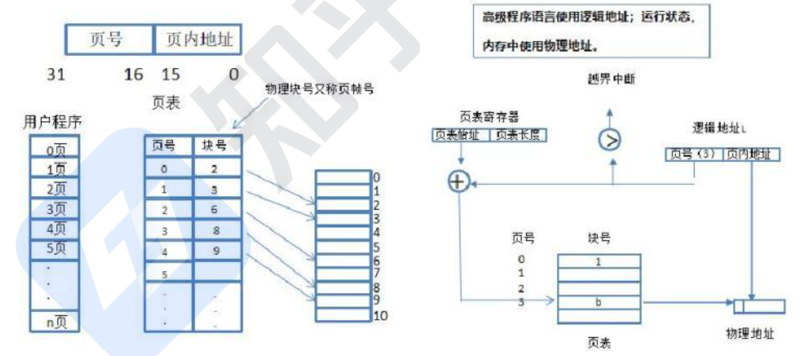

这里可以看到页号在高位，页内地址在低位，一共 32 位 4K 大小。业内地址表示的是真实的地址，其大小表示了这一页能够存储的真实最大数据的大小。页号的大小就表示总共有多少页。而比如 4k 的页有多少是页号，多少是页内地址，这个要视具体情况而定。注意：不要理解为途中的一半一半来分，一般来说页号占位会比较少。

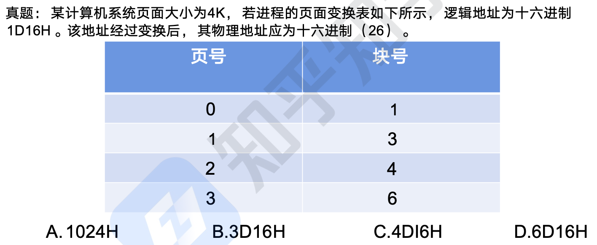

简单的做法就是第一位是页号，那块号就是 3，而数据地址是不会变的，于是选择 B。还是正规的计算，一页是 4K，表示可以存储 `2^12` 的数据，换算成 16 进制那就是 4 位，也就是 16 进制的 `FFFF`, 也就是说数据位有 4 位，于是第一位就是页号了。

#### 页面置换算法

有时候，进程空间分为 100 个页面，而系统内存只有 10 个物理块，无法全部满足分配，就需要将马上要执行的页面先分配进去，而后根据算法进行淘汰，使 100 个页面能够按执行顺序调入物理块中执行完。

缺页表示需要执行的页不在内存物理块中，需要从外部调入内存，会增加执行时间，
因此，缺页数越多，系统效率越低。

- 最优算法：OPT，理论上的算法，无法实现，是在进程执行完后进行的最佳效率计算，用来让其他算法比较差距。原理是选择未来最长时间内不被访问的页面置换，这样可以保证未来执行的都是马上要访问的。
- 先进先出算法：FIFO，先调入内存的页先被置换淘汰，会产生抖动现象，即分配的页数越多，缺页率可能越多（即效率越低）
- 最近最少使用：LRU，在最近的过去，进程执行过程中，过去最少使用的页面被置换淘汰，根据局部性原理，这种方式效率高，且不会产生抖动现象。

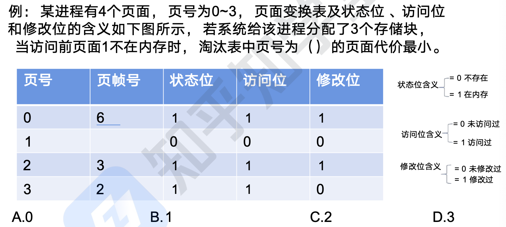

其实我们对比一下 0，2，3 中的状态位、访问位、修改位就可以知道选择 D。因为按照局部性原理 3 被淘汰代价最小。

#### 快表

快表是一块小容量的相联存储器，由快速存储器组成，按内容访问，速度快，并且可以从硬件上保证按内容并行查找，一般用来存放当前访问最频繁的少数活动页面的页号 (可以看成是页表的频繁访问数据的副本）。

快表是将页表存于 Cache 中

慢表是将页表存于内存上

因此慢表需要访问两次内存才能取出数据，而快表是访问一次 Cache 和一次内存，因此更快。

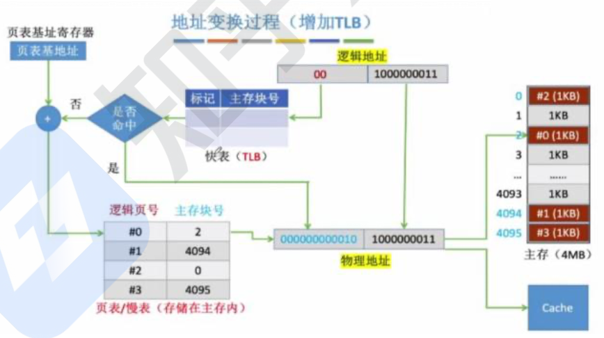


这里首先去快表中查找，如果没有找到，那么则使用普通的页表（页号和页内地址）进行计算出物理地址。而如果找到，则直接拿到物理地址。最后还会往快表中存储。


### 段式存储

将进程空间分为一个个段，每段也有段号和段内地址，*与页式存储不同的是，每段物理大小不同，分段是根据逻辑整体分段的*。碎片比较多

地址表示：`(段号，段内偏移)`：其中段内偏移不能超过该段号对应的段长，否则越界错误，而此地址对应的真正内存地址应该是：段号对应的基地址+段内偏移。

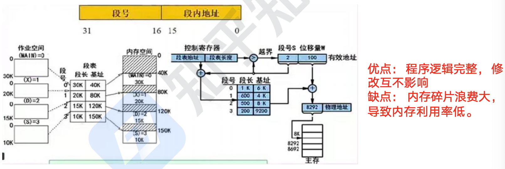

可以看到段表中有段长和基址。段长表示这个段最多一个存多大数据，基址表示地址的开始位置。

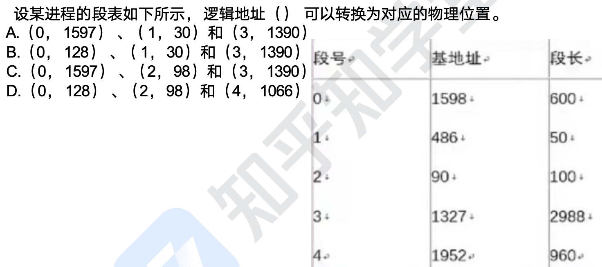

这里其实很简单，不过不要理解错误，这个表示法 `(0,1597)` 表示 0 号段，段内偏移是 1597，不是说起始地址是 1597，而段长只有 600，所以是存不下的。所以很简单可以看到选择 B。与基地址是无关的。


#### 段页存储

对进程空间先分段，后分页，具体原理图和优缺点如下：
优点：空间浪费小、存储共享容易、能动态连接。
缺点：由于管理软件的增加，复杂性和开销也增加，执行速度下降

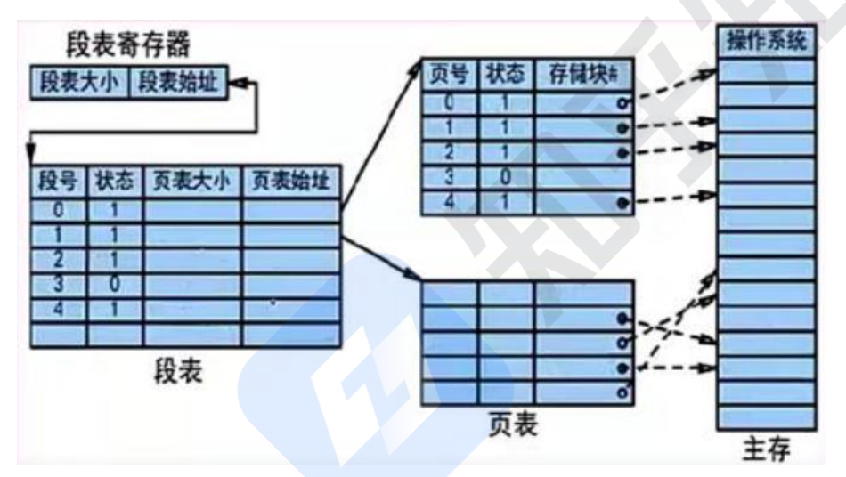

优点：程序逻辑完整，修改互不影响
缺点：内存利用率低，内存碎片浪费大


## 文件管理

### 文件结构

计算机系统中采用的索引文件结构如下图所示：
系统中有 13 个索引节点，0-9 为直接索引，即每个索引节点存放的是内容，假设每个物理盘大小为 4 KB，共可存 `4 KB*10=40 KB` 数据；

10 号索引节点为一级间接索引节点，大小为 4 KB，存放的并非直接数据，而是链接到直接物理盘块的地址，假设每个地址占 4 B，则共有 1024 个地址，对应 1024 个物理盘，可存`1024*4 KB=4098 KB` 数据。

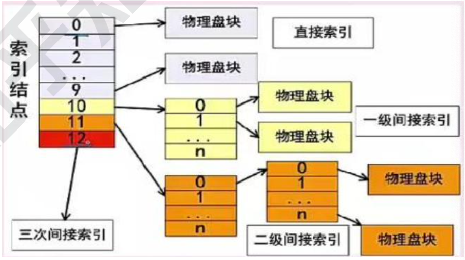

二级索引节点类似，直接盘存放一级地址，一级地址再存放物理盘快地址，而后链接到存放数据的物理盘块，容量又扩大了一个数量级，为`1024*1024*4 KB` 数据。

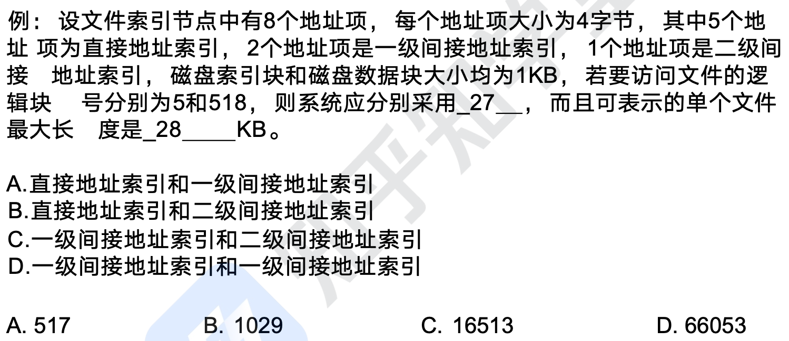

这里最好是将存储结果画出来，首先 `0～4` 是直接地址索引，题目中块号为 5（没有明确指明，都是从 0 开始），于是采用一级间接地址索引。`5，6` 是一级间接地址索引。7 是二级间接地址索引。直接地址索引，共 5 个，每个磁盘数据块大小是 1KB，于是前面直接地址索引可以存 5KB 数据。对于一级间接地址索引，里面存的是地址，一个索引块大小是 1KB，一个地址大小是 4 字节，于是可以存 256 个索引，对应 `256*1KB` 的数据，共 512KB 数据，加上直接地址索引，可以保存 517KB 数据。而二级间接地址索引就可以保存 `256*256*1KB` 的数据，题中块号为 518，应保存为第 519 号，应采用于二级间接地址索引，最大保存为 C。

### 树形文件

相对路径：是从当前路径开始的路径。
绝对路径：是从根目录开始的路径。
全文件名=绝对路径+文件名。要注意，绝对路径和相对路径是不加最后的
文件名的，只是单纯的路径序列。

树形结构主要是区分相对路径和绝对路径，如下图所示：

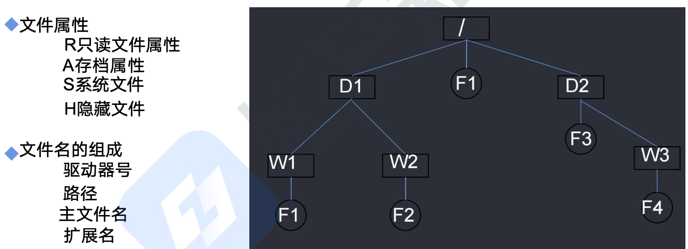

几个属性要记住

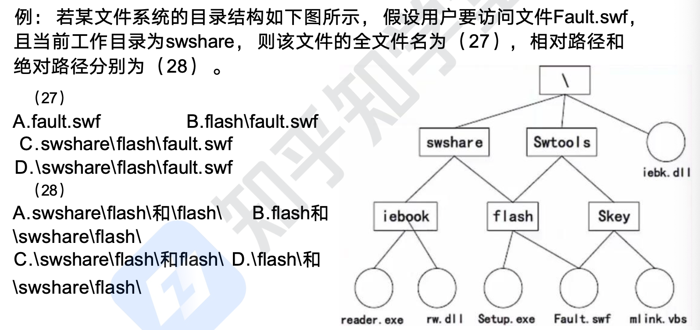

选择 D， B

### 空间存储

空闲区表法：将所有空闲空间整合成一张表，即空闲文件目录。
空闲链表法：将所有空闲空间链接成一个链表，根据需要分配。
成组链接法：既分组，每组内又链接成链表，是上述两种方法的综合。
位示图法：对每个物理空间用一位标识，为 1 则使用，为 0 则空闲，形成一张位示图。

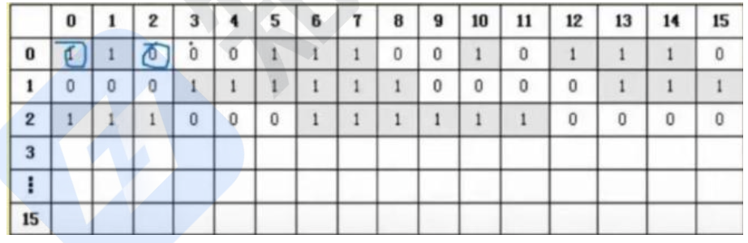

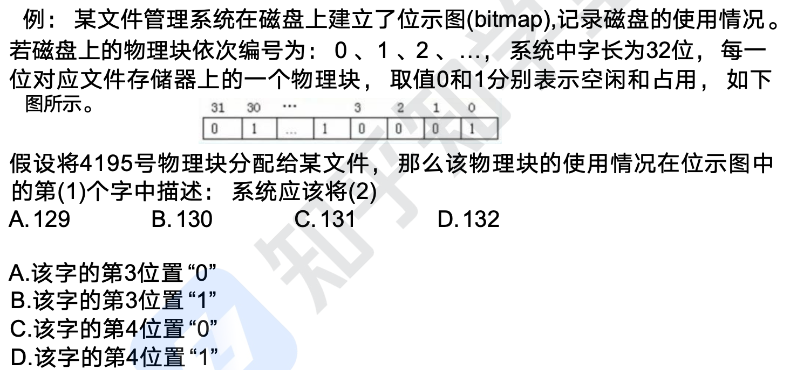

选择 D，B。这里每一位可以表示一个文件，`4195%32=131...3`。注意：第 3 位置那么位置号就是 3，第 132 个位置那位置号就是 131.

## 微内核操作系统

微內核，顾名思义，就是尽可能的将内核做的很小，只将最为核心必要的东西放入内核中，其他能独立的东西都放入用户进程中，这样，系统就被分为了用户态和内核态，如下图所示：

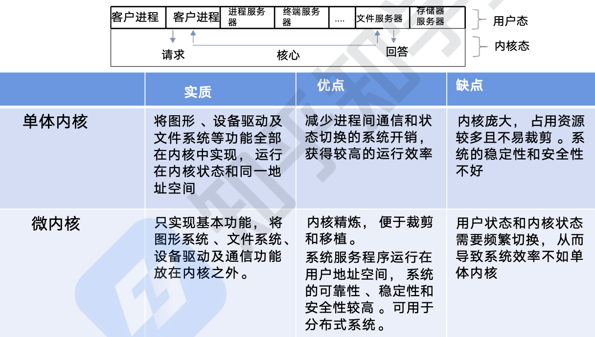


嵌入式操作系统特点：微型化、代码质量高、专业化、实时性强、可裁剪可配置

实时嵌入式操作系统的内核服务：异常和中断、计时器、V/O 管理。

常见的嵌入式 RTOS（实时操作系统）：`VxWorks`、`RT-Linux`、`QNX`、`pSOS`。

嵌入式系统初始化过程按照自底向上、从硬件到软件的次序依次为：
芯片级初始化->板卡级初始化->系统级初始化。

芯片级是微处理器的初始化，板卡级是其他硬件设备初始化，系统级初始化就是软件及操作系统初始化

