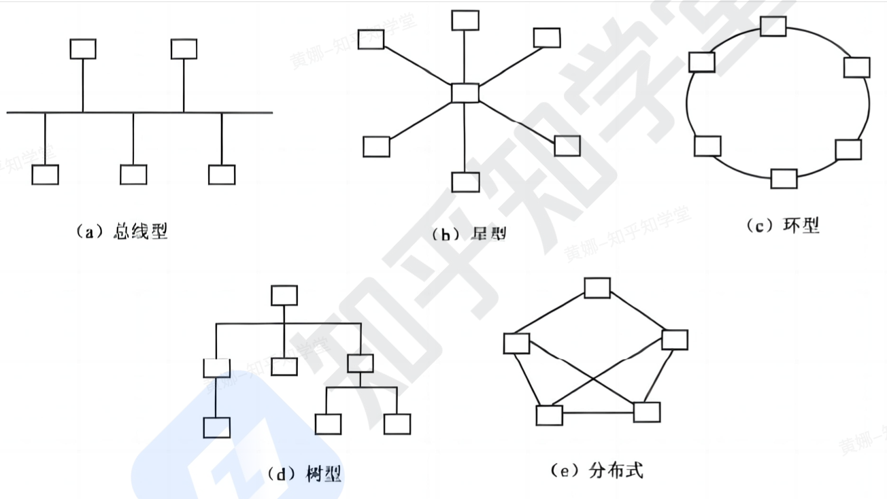
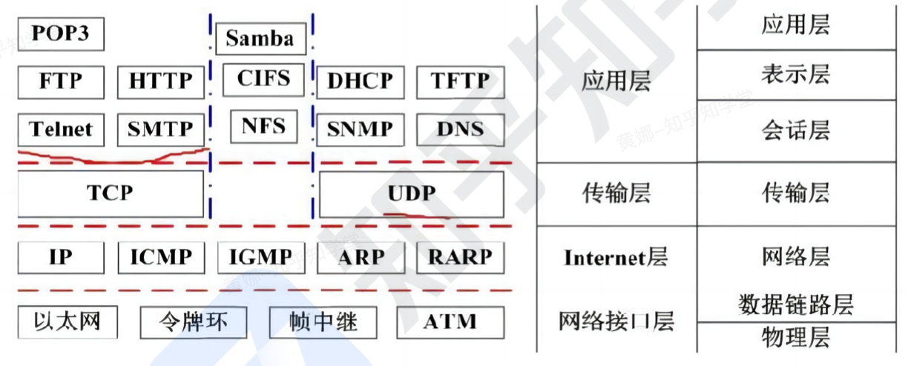
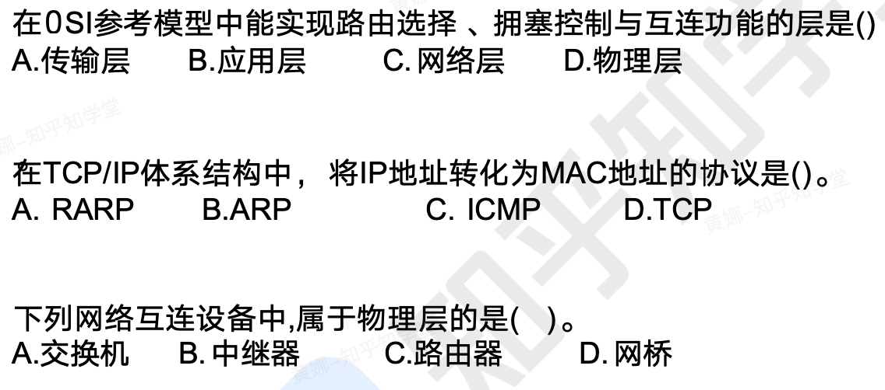

```toc
```

## 网络功能和分类

计算机网络是计算机技术与通信技术相结合的产物，它实现了远程通信、远程信息处理和
资源共享。计算机网络的功能：数据通信、资源共享、管理集中化、实现分布式处理、
负载均衡。
网络性能指标：速率、带宽 (频带宽度或传送线路速率)、吞吐量、时延、往返时间、利用率。网络非性能指标：费用、质量、标准化、可靠性、可扩展性、可升级性、易管理性和可维护性。
计算机网络按分布范围和拓扑结构划分如下图所示：

|网络分类|缩写|分布距离|计算机分布范围|传输速率范围|
|-|-|-|-|-|
|局域网|LAN| `10m左右，100m左右，1000m左右` |房间，公寓，校园| `4Mbps~1Gbps` |
|城域网|MAN|10km|城市| `50Kbps～100Mbps` |
|广域网|WAN|100km 以上|国家或全球| `9.6Kbps～45Mbps` |



1. 总线型拓扑：
- 特点：采用总线的形式将所有计算机相连, 信息只能在一条线路上传输。
- 优点: 成本低, 实现简单。
- 缺点：带宽低, 延迟高, 任何节点发生故障整条总线瘫痪。
- 举例：一个简单的以太网线路就是总线型拓扑的一个例子。所有计算机通过网线连接到交换机的各个端口上, 数据只能在这条总线上传输
2. 星型拓扑：
- 特点: 通过一个中心交换机将计算机互联, 形成星型网络。
- 优点: 容易扩展, 集中管理。
- 缺点：中央交换机单点故障会瘫痪全网。
- 举例：一个小型办公室的网络就可以采用星型拓扑。计算机通过网线连接到中心的交换机上, 形成星型结构
3. 环型拓扑：
- 特点：计算机按环形连接, 信息只能前进或后退进行传输。
- 优点：故障启闭容易诊断。
- 缺点: 数据传输效率低, 扩展性差。
4. 树型拓扑：
- 特点：采用分级交换机进行分层管理的方式构建局域网。
- 优点：易于管理和扩展, 并行数据传输, 性能高。
- 缺点：增加层次会降低效率。
- 举例：一个大型的企业网络可能采用树型拓扑。计算机先连接到分支交换机上，分支交换机再连接到主干交换机上, 实现分级管理
5. 分布式拓扑：
- 特点：任何节点都能与其他节点互联，不存在集中交换。
- 优点：无中心, 任意节点故障不影响全网。
- 缺点：管理复杂, 成本高。
- 举例：比特币网络就是一个分布式拓扑的例子。网络中的每个节点都是对等的，没有中心机构。任意两个节点都可以直接通信


## 通信技术

计算机网络是利用通信技术将数据从一个结点传送到另一结点的过程
通信技术是计算机网络的基础。
信道可分为物理信道和逻辑信道

物理信道由传输介质和设备组成，根据传输介质的不同，分为无线信道和有线信道。
逻

辑信道是指在数据发送端和接收端之间存在的一条虚拟线路，可以是有连接的或无连接的。逻辑信道以物理信道为载体。

发信机进行的信号处理包括信源编码、信道编码、交织、脉冲成形和调制。相反地，收信机进行的信号处理包括解调、采样判决、去交织、信道译码和信源译码。

如果同时传递多路数据就需要复用技术和多址技术。复用技术是指在一条信道上同时传输多路数据的技术，如TDM 时分复用、FDM 频分复用和 CDM 码分复用等。多址技术是指在一条线上同时传输多个用户数据的技术，在接收端把多个用户的数据分离 (TDMA 时分多址、FDMA 频分多址和 CDMA 码分多址)。作为新一代的移动通信技术，`5G` 特征体现在以下方面。
- 基于 OFDM 优化的波形和多址接入
- OFDM 加窗提高多路传输效率
- 实现可扩展的 OFDM 间隔参数配直
- 大规模 MIMO：最多 256 根天线
- 灵活框架设计
- 频谱共享
- 毫米波：频率大于 24 GHz 以上的频段
- 先进的信道编码设计

`5G` 网络的主要特征：服务化架构、网络切片。

## OSI 七层模型

| 层      | 功能                                                                                                 | 单位   | 协议                                           | 设备      |
| ------ | -------------------------------------------------------------------------------------------------- | ---- | -------------------------------------------- | ------- |
| 1. 物理层 | 在链路上透明地传输位。需要完成的工作包括线路配置、确定数据传输模式、确定信号形式、对信号进行编码、连接传输介质。为此定义了建立、维护和拆除物理链路所具备的机械特性、电气特性、功能特性以及规程特性。 | 比特   | `EIA/TIA RS-232、 RS-449、V. 35、RJ-45、 FDDI`   | 中继器、集线器 |
| 2. 数据链 | 把不可靠的信道变为可靠的信道。为此将比特组成帧，在链帧路上提供点到点的帧传输，并进行差错控制、流量控制等。                                              | 帧    | `SDLC、 HDLC、 LAPB、 PPP、STP、帧中继等、IEEE802、ATM` | 交换器、网桥  |
| 3. 网络层 | 在源节点-目的节点之间进行路由选择、拥塞控制、顺序控制、传送包，保证报文的正确性。网络层控制着通信子网的运行，因而它又称为通信子网层。                                | IP分组 | `IP、 ICMP、 IGMP、ARP、RARP`                    | 路由器     |
| 4. 传输层 | 提供端-端间可靠的、透明的数据传输，保证报文顺序的正确性、数据的完整性。                                                               | 报文段  | `TCP、 UDP`                                   | 网关      |
| 5.会话层  | 建立通信进程的逻辑名字与物理名字之间的联系，提供进程之间建立、管理和终止会话的方法，处理同步与恢复问题。                                               | -    | `RPC、 SQL、 NFS`                              | 网关      |
| 6. 表示层 | 实现数据转换（包括格式转换、压缩、加密等），提供标准的应用接口、公用的通信服务、公共数据表示方法。                                                  | -    | `JPEG、 ASCII、 GIF、 MPEG、DES`                 | 网关      |
| 7. 应用层 | 对用户不透明的提供各种服务，如E-mail。                                                                             | 数据   | `Telnet、 FTP、 HTTP、 SMTP、POP3、 DNS、 DHCP等`   | 网关      |


ARP 将 IP 转换为 MAC 地址，而 RARP 功能刚好相反。
ICMP 工作在 TCP/IP 体系中的网络层，是 IP 协议的一个补充，主要用于在主机与路由器之间传递控制信息，包括报告错误、交换受限控制和状态信息等。
IGMP，就是 Internet Group Management Protocol 的意思。该协议用来在 ip 主机和与其直接相邻的组播路由器之间建立、维护**组播组成员**关系，但不包括组播路由器之间的组成员关系信息的传播与维护，这部分工作由各组播路由协议完成

  
  
作者：w1992wishes  
链接：https://www.jianshu.com/p/4bd8758f9fbd  
来源：简书  
著作权归作者所有。商业转载请联系作者获得授权，非商业转载请注明出处。

## 局域网和广域网协议

以太网是一种计算机局域网组网技术。以太网规范 IEEE 802.3 是重要的局域网协议，包括：

|协议|中文名|速率|介质|
|-|-|-|-|
|`IEEE 802.3`|标准以太网|`10Mb/s`|传输介质为细同轴电缆|
|`IEEE 802.3u`|快速以太网|`100Mb/s`|双绞线|
|`IEEE 802.3z`|干兆以太网|`1000Mb/s`|光纤或双绞线|
|`IEEE 802.3ae`|万兆以太网|`10Gb/s`|光纤|


`DMAC,SMAC,Length/Type DATA/PAD,FCS`
目的 MAC 地址, 源 MAC 地址, 长度/类型,数据填充、校验。
最小帧长：64字节。

无线局域网WLAN技术标准：`IEEE 802. 11`
在WLAN 中，通常使用的拓扑结构主要有3 种形式：点对点型、HUB 型和全分布型。

广域网相关技术：同步光网络(SONET，利用光纤进行数字化信息通信）、数字数据网（DDN，利 用数字信道提供半永久性连接电路以传输数据）、帧中继（FR，数据包交换技术）、异步传输技术（ATM，以信元为基础的面向连接的一种分组交换和复用技术）

## TCP/IP 协议

网络协议三要素：语法、语义、时序。其中语法部分规定传输数据的格式，语义部分规定所要完成的功能，时序部分规定执行各种操作的条件、顺序关系等。



网络层协议：
- IP: 网络层最重要的核心协议，在源地址和目的地址之间传送数据报，无连接、不可靠。
- ICMP: 因特网控制报文协议，用于在 lP 主机、路由器之间传递控制消息。控制消息是指网络通不通、主机是否可达、路由是否可用等网络本身的消息。
- ARP 和 RARP: 地址解析协议，ARP 是将 IP 地址转换为物理地址，RARP 是将物理地址转换为 `IP` 地址。
- IGMP: 网络组管理协议，允许因特网中的计算机参加多播，是计算机用做向相邻多目路由器报告多目组成员的协议，支持组播。

传输层协议：
- TCP: 整个 TCP/P 协议族中最重要的协议之一，在 IP 协议提供的不可靠数据数据基础上，采用了重发技术，为应用程序提供了一个可靠的、面向连接的、全双工的数据传输服务。一般用于传输数据量比较少，且对可靠性要求高的场食。
- UDP: 是一种不可靠、无连接的协议，有助于提高传输速率，一般用于传输数据量大，对可靠性要求不高，但要求速度快的场合。

应用层协议：
基于 TCP 的 FTP、HTTP 等都是可靠传输。基于 UDP 的 DHCP、DNS 等都是不可靠
传输。
- FTP: 可靠的文件传输协议，用于因特网上的控制文件的双向传输
- HTTP: 超文本传输协议，用于从 WWw 服务器传输超文本到本地浏览器的传输协议。使用SSL 加密后的安全网页协议为 HTTPS。
- SMTP 和 `POP3`: 简单邮件传输协议，是一组用于由源地址到目的地址传送邮件的规则，邮件报文采用 ASCI 格式表示，SMTP 是发送，POP 3是接收
- Telnet: 远程连接协议，是因特网远程登录服务的标准协议和主要方式。
- TFTP: 不可靠的、开销不大的小文件传输协议。
- SNMP: 简单网络管理协议，它主要用于网络设备与网络管理系统 (NMS)之间进行监测与管理，比如路由器和交换机设备通过 SNMP 定期向网络管理系统上报接口流量、CPU 利用率等性能指标
- DHCP: 动态主机配置协议，基于 UDP, 基于 C/S 模型，为主机动态分配 IP 地址，有三种方式：固定分配、动态分配、自动分配。
- DNS: 域名解析协议，通过域名解析出 IP 地址。

### 协议端口对照表

|端口|服务|端口|服务|
|-|-|-|-|
|20|文件传输协议（数据）|80|超文本传输协议（HTTP）|
|21|文件传输协议（控制）|110| `POP3` 服务器（邮箱接收服务器）|
|23|Telnet 终端仿真协议|69|简单文件传输协议（TFTP）|
|67|DHCP（服务端）|68|DHCP（客户端）|
|25|SMTP 简单邮件发送协议|161|SNMP（轮询）|
|53|域名服务器（DNS）|162|SNMP（陷阱）|



C, B, B


## 交换技术

数据在网络中转发通常离不开交换机。人们日常使用的计算机通常就是通过交换机接入网络的。

交换机功能包括：
- 集线功能。提供大量可供线缆连接的端口达到部署星状拓扑网络的目的。
- 中继功能。在转发帧时重新产生不失真的电信号。
- 桥接功能。在内置的端口上使用相同的转发和过滤逻辑。
- 隔离冲突域功能。将部署好的局域网分为多个冲突域，而每个冲突域都有自己独立的带宽，以提高交换机整体宽带利用效率。

交换机的功能包括：
(1)转发路径学习。根据收到数据帧中的源 MAC 地址建立该地址同交换机端口的映射写入 MAC 地址表中。
(2)数据转发。如果交换机根据数据帧中的目的 MAC 地址在建立好的 MAC 地址表中查询到了，就向对应端口进行转发。
(3)数据泛洪。如果数据帧中的目的 MAC 地址不在 MAC 地址表中，则向所有端口转发也就是泛洪。广播帧和组播帧向所有端口（不包括源端口）进行转发。
(4)链路地址更新。MAC 地址表会每隔一定时间（如 300 s）更新一次。

## 路由技术

路由功能由路由器来提供，具体包括：
(1)异种网络互连，比如具有异种子网协议的网络互连：
(2)子网协议转换，不同子网间包括局城网和广域网之间的协议转换：
(3)数据路由，即将数据从一个网络依据路由规则转发到另一个网络：
(4)速率适配，利用缓存和流控协议进行适配：
(5)隔离网络，防止广播风暴, 实现防火墙；
(6)报文分片和重组，超过接口的 MTU 报文被分片，到达目的地之后的报文被重组：
(7)备份、流量控制，如主备线路的切换和复杂流量控制等。

路由器工作在 OSl 七层协议中的第 3 层，即网络层。其主要任务是接收来源于一个网络接口的数据包，常根据此数据包的目地址决定待转发的下一个地址（即下一跳地址)。路由器中维持着数据转发所需的路由表，所有数据包的发送或转发都通过查找路由表来实现。这个路由表可以静态配置，也可以通过动态路由协议自动生成。

一般来说，路由协议可分为内部网关协议（IGP）和外部网关协议 (EGP）两类。网络建设工程可分为网络规划、网络设计和网络实施三个环节。
