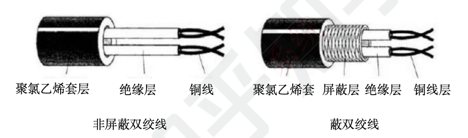
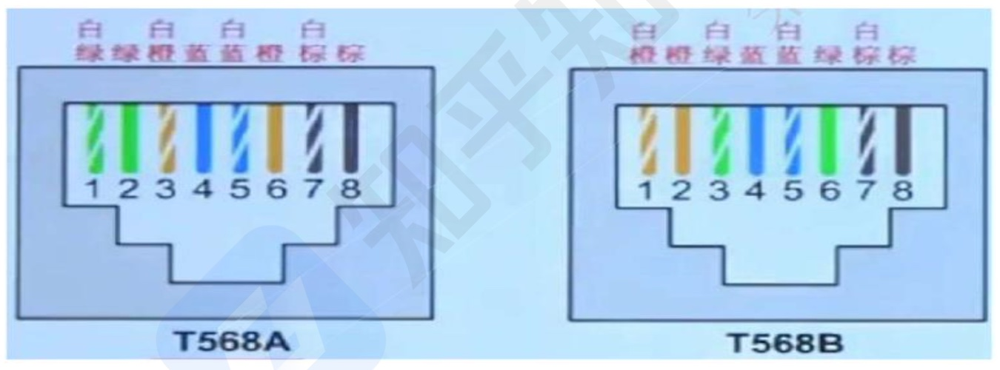
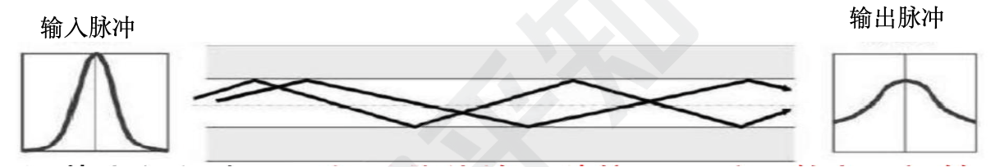
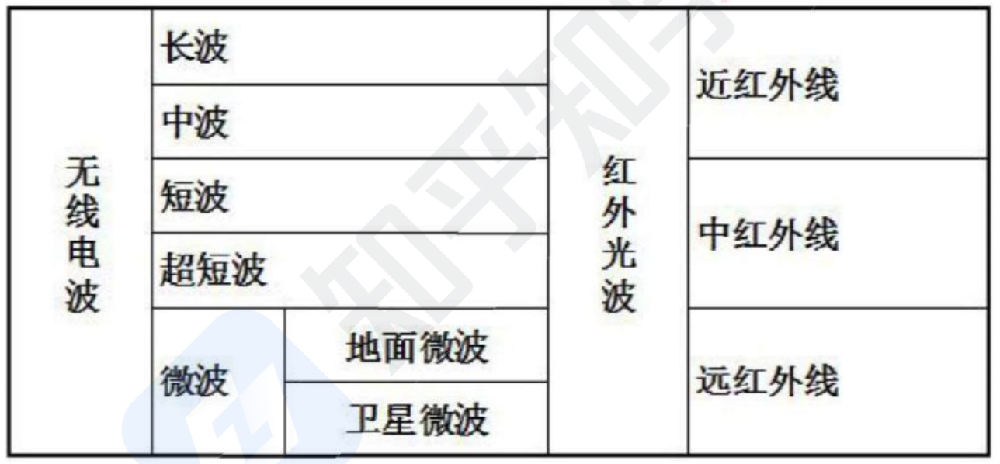
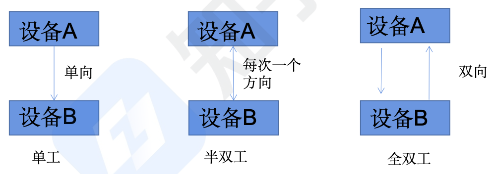
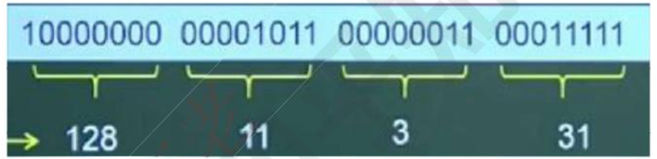
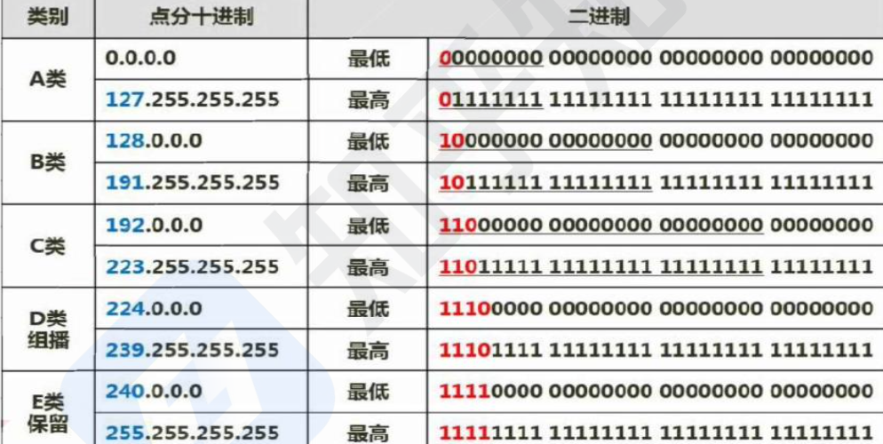
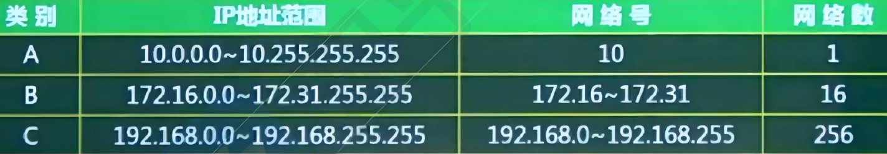

```toc
```

## 传输介质-双绞线

双绞线：将多根铜线按规则缠绕在一起，能够减少干扰; 分为无屏蔽双绞线 UTP 和屏蔽双绞线 STP，都是由一对铜线簇组成。也即我们常说的网线; 双绞线的传输距离在 `100m` 以内。


无屏蔽双绞线 UTP：价格低，安装简单，但可靠性相对较低，分为 `CAT3` (3 类 UTP，速率为 `10Mbps`)、`CAT4` (4 类 UTP，与 3 类差不多，无应用）、`CAT5` (5 类 UTP，速率为 `100Mbps`，用于快速以太网)、`CAT5E` (超 5 类 UTP，速率为 `1000 Mbps`)、`CAT6` (6 类 UTP，用来替代 `CAT5E`，速率也是 `1000Mbps`) 屏蔽双绞线 

STP: 比之 UTP 增加了一层屏蔽层，可以有效的提高可靠性，但对应的价格高，安装麻烦，一般用于对传输可靠性要求很高的场合。

网线有如下两种安装标准：都是八根不同颜色的网线，按照不同的顺序排序，插入水晶头中，区分在第 1236 四根网线的位置不同．




## 传输介质-光纤

光纤：由纤芯和包层组成，传输的光信号在纤芯中传输，然而从 PC 端出来的信号都是电信号，要经过光纤传输的话，就必须将电信号转换为光信号.
- 多模光纤 MMF: 纤芯半径较大，因此可以同时传输多种不同的信号，光信号在光纤中以全反射的形式传输，采用发光二极管 LED 为光源，成本低，但是传输的效率和可靠性都较低，适合于短距离传输，其传输距离与传输速率相关，速率为`100 Mbps` 时为 `2KM`，速率为 `1000 Mbps` 时为 `550m`.



- 单模光纤 SMF: 纤芯半径很小，一般只能传输一种信号，采用激光二极管 LD 作为光源，并且只支持激光信号的传播同样是以全反射形式传播，只不过反射角很大，看起来像一条直线，成本高，但是传输距离远，可靠性高。传输距离可达 5 KM。


## 传输介质-无线信道

无线信道：分为无线电波和红外光波




## 通信方向

通信方向: 数据通信是指发送方发送数据到接收方，这个传输过程可以分类如下：
- 单工：只能由设备 A 发给设备 B，即数据流只能单向流动。
- 半双工：设备 A 和设备 B 可以互相通信，但是同一时刻数据流只能单向流动
- 全双工：设备 A 和设备 B 在任意时刻都能互相通信。



异步传输：发送方每发送一个字符，需要在字符的起始和结尾处插人标识，当接收方接收到该字符时需要处理开始和结尾处的标识，处理完之后就能识别发送过来的数据，但是这样会造成资源浪费，传输效率降低。发送方和接收方并不是同时进行处理数据

同步传输：以数据块为单位进行传输，当发送方要发送数据时，先发送一个同步帧，接收
方收到后做好接收准备，开始接收数据块，结束后又会有结束帧确认，这样一次传输一
个数据块，效率高。

串行传输：只有一根数据线，数据只能 1 bit 挨个排队传送，适合低速设备、远距离的传送一般用于广域网中。

并行传输：有多根数据线，可以同时传输多个 bit 数据，适合高速设备的传送，常用语计算机内部各硬件模块之间。

## 交换方式

电路交换：通信一方进行呼叫，另一方接收后，在二者之间会建立一个专用电路，特点为面向连接、实时性高、链路利用率低，一般用手语音视频通信．

报文交换：以报文为单位，存储转发模式，接收到数据后先存储，进行差错校验，没有错误则转发，有错误则丢弃，因此会有延时，但可靠性高，是面向无连接的

分组交换：以分组为单位，也是存储转发模式，因为分组的长度比报文小，所以时延小于报文交换，又可分为三种方式：
- 数据报：是现在主流的交换方式，各个分组携带地址信息，自由的选择不同的路由路径传送到接收方，接收方接收到分组后再根据地址信息重新组装成原数据，是面向无连接的，但是不可靠的。
- 虚电路：发送方发送一个分组，接收方收到后二者之间就建立了一个虚拟的通信线路，二者之间的分组数据交互都通过这条线路传送，在空闲的时候这条线路也可以传输其他数据，是面向连接的，可靠的。
- 信元交换：异步传输模式 ATM 采用的交换方式，本质是按照虚电路方式进行转发，只不过信元是固定长度的分组，共 53 B，其中 5 B 为头部，48 B 为数据域，也是面向连接的，可靠的。

以下关于光纤的说法中，错误的是（B）
A.单模光纤的纤芯直径更细
B.单模光纤采用 LED 作为光源
C.多模光纤比单模光纤的传输距离近
D.多模光纤中光波在光导纤维中以多种模式传播

数据通信模型按照数据信息在传输链路上的传送方向，可以分为三类．下列选项中，（D）不属于这三类传输方式。
A、单工通信：信号只能向一个方向传送
B、半双工通信：信息的传递可以是双向的
C、全双工通信：通信的双方可以同时发送和接收信息
D、全单工通信：信号同时向两个方向传输


## IP 地址表示

机器中存放的 IP 地址是 32 位的二进制代码，每隔 8 位插人一个空格，可提高可读性，为了便于理解和设置，一般会采用点分十进制方法来表示：将 32 位二进制代码每 8 位二进制转换成十进制，就变成了 4 个十进制数，而后在每个十进制数间隔中插人：，如下所示，最终为 128.11.3.31：



因为每个十进制数都是由 8 个二进制数转换而来，因此每个十进制数的取值范围为 0-255 掌握二进制转十进制的快速计算方法，牢记 2 的幂指数值，实现快速转换）。

分类 IP 地址：IP 地址分四段，每段八位，共 32 位二进制数组成。在逻辑上，这 32 位 IP 地址分为网络号 (带下划线的）和主机号，依据网络号位数的不同，可以将 IP 地址分为以下几类：
- 按照 A 类来分配 IP 地址，总计可以分配：2^24-2=16777214, B 类的分配数为：2^16-2=65534, C 类的分配数为：2^8-2=254,，这里将全 0 和全 1 要去掉，因为全 0 全 1 是子网号



- 无分类编址：即不按照 ABC 类规则，自动规定网络号，无分类编址格式为：IP 地址/网络号，示例：128.168.0.11/20 表示的 IP 地址为 128.168.0.11，其网络号占 20 位，因此主机号占 32-20=12 位，也可以划分子网。

特殊 IP 地址
- 公有地址：通过它直接访问因特网．是全网唯一的 IP 地址.
- 私有地址：属于非注册地址，专门为组织机构内部使用，不能直接访问因特网，下表所示为私有地址范围：



## 子网划分

- 子网划分：一般公司在申请网络时，会直接获得一个范围很大的网络，如一个 A 类地址，因为主机数之间相差的太大了，不利于分配，我们一般采用子网划分的方法来划分网络，即自定义网络号位数，就能自定义主机号位数，就能根据主机个数来划分出最适合的方案，不会造成资源的浪费。
- 子网号：一般的 IP 地址按标准划分为 A B C 类后可以进行再一步的划分，将主机号多出的几位作为子网号，就可以划分出多个子网，比如只需要为 30 台主机分配 ip 地址，那么我们会申请 C 类的地址，C 类地址是 2^8 次方个主机号，远远超过了 30 的需求，于是我们按照 2^n-2=30 来计算，n=5 是最合适的，那么多于的那 3 位就是用来作为子网号，那么子网就一共可以划分 2^3=8 个，按照 IP 地址组成为：网络号+子网号+主机号来算的话，那么就是 `网络号 24`  +  `子网号 3`  +   `主机号 5`.
- 网络号和子网号都为 1, 主机号都为 0, 这样的地址为子网掩码。如果把上面的例子拿来算子网掩码的话就是：`24 个 1`  + `3 个 1`  + `5 个 0`，得到的就是 255.255.255.224，子网掩码就是网络号全 1，主机号全 0
- 要注意的是：子网号可以为全 0 和全 1, 主机号不能为全 0 或全 1, 因此，主机数需要-2, 而子网数不用。
- 还可以聚合网络为超网，就是划分子网的逆过程，将网络号取出几位作为主机号，此时，这个网络内的主机数量就变多了，成为一个更大的网络。

把网络 117.15.32.0/23 划分为 117.15.32.0/27, 得到的子网是 (C）个，每个子网中可使用的主机地址是 (A)个
A.4 B.8 C. 16 D.32

A.30 B.31 C. 32 D.34

这里子网数为（9-5=4 -> 16 个），主机数是（2^5-2=30）


分配给某公司网络的地址块是 220.17.192.0/20, 该网络被划分为（C）个 C 类子网，不属于该公司网络的子网地址是（D）。
A. 4 B.8 C. 16 D. 32

A.220.17.203.0
B.220.17.205.0
C.220.17.207.0
D.220.17.213.0

这里 C 类网络是 24 位网络号，这里是 20 位网络号，相当于有 4 位是可以划分子网，于是是 16 个子网。而四个地址中不是该公司网络可以这样计算，就是保证地址的前 20 位与 `220.17.192.0` 一致即可。


