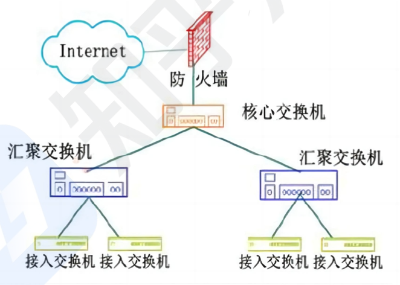
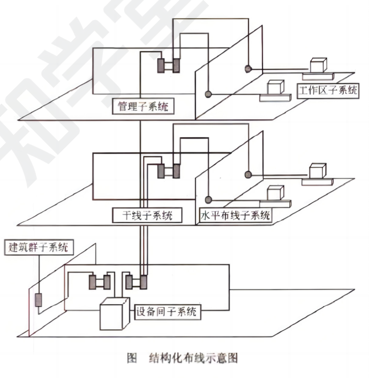
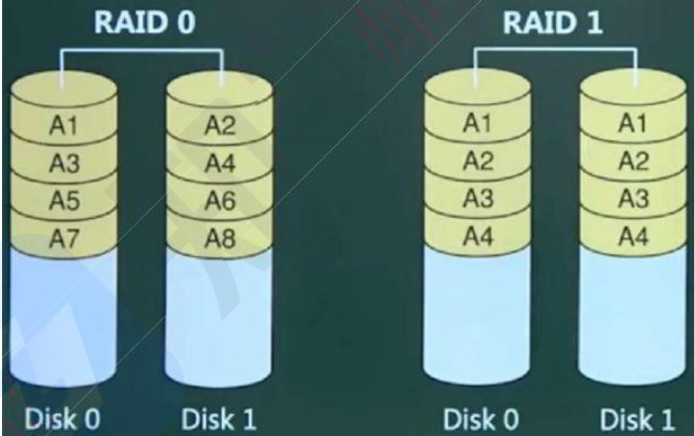
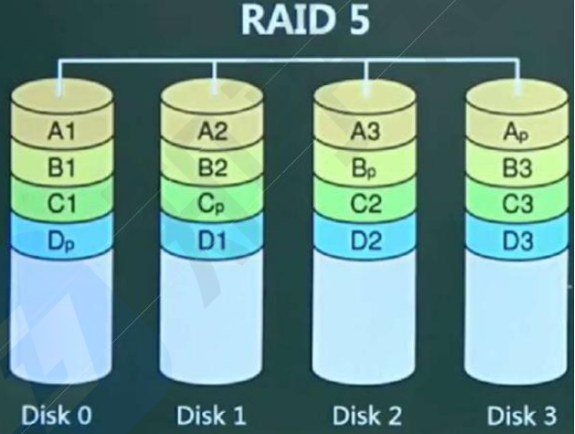
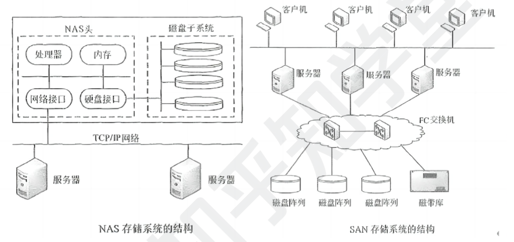

```toc
```

## IPV-6

`IPV6` 主要是为了解决 `IPv4` 地址数不够用的情况而提出的设计方案，IPv 6 具有以下特性：
- IPv 6 地址长度为 128 位，而 IPV 4 地址仅 32 位，空间增大了 2^96 倍。
- 灵活的 IP 报文头部格式，使用一系列固定格式的扩展头部取代了 IPv 4 中可变长度的选项字段。
- IPv 6 简化了报文头部格式，加快报文转发，提高了吞吐量；
- 提高安全性，身份认证和隐私权是 IPv 6 的关键特性；
- 支持更多的服务类型；
- 允许协议继续演变，增加新的功能，使之适应未来技术的发展。

IPv 4 和IPv 6 的过渡期间，主要采用三种基本技术：
- 双协议栈：主机同时运行 IPv 4 和 IPv 6 两套协议栈，同时支持两套协议，一般来说 IPv 4 和 IPV 6 地址之间存在某种转换关系，如 IPV 6 的低 32 位可以直接转换为 IPv 4 地址，实现互相通信.
- 隧道技术：这种机制用来在 IPv 4 网络之上建立一条能够传输 IPv 6 数据报的隧道，例如可以将 IPv6数据报当做 IPv 4 数据报的数据部分加以封装，只需要加一个 IPv 4 的首部，就能在 IPv 4 网络中传输 IPv6报文。
- 翻译技术：利用一台专门的翻译设备 (如转换网关), 在纯 IPv 4 和纯 IPv 6 网络之间转换IP 报头的地址，同时根据协议不同对分组做相应的语义翻译，从而使纯 IPv 4 和纯 IPv 6 站点之间能够透明通信

## 网络三层模型

三层模型将网络划分为核心层、汇聚层和接入层：
- 核心层：提供不同区域之间的最佳路由和高速数据传送；
- 汇聚层：将网络业务连接到接入层，并且实施与安全、流量、负载和路由相关的策略；
- 接入层：为用户提供了在本地网段访问应用系统的能力，还要解决相邻用户之间的互访需要，接入层要负责一些用户信息 (例如用户 IP 地址、MAC 地址和访问日志等）的收集工作和用户管理功能 (包括认证和计费等)。




## 网络规划与设计

建筑物综合布线系统 PDS：
- 工作区子系统：实现工作区终端设备到水平子系统的信息插座之间的互联。
- 水平布线子系统：实现信息插座和管理子系统之间的连接。
- 管理子系统：连接各楼层水平布线子系统和垂直干缆线，负责连接控制其他子系统为连接其他子系统提供连接手段
- 垂直干线子系统：实现各楼层设备间子系统之间的互连。
- 设备间子系统：实现中央主配线架与各种不同设备之间的连接。
- 建筑群子系统：各个建筑物通信系统之间的互联。



总结
- 工作区子系统负责房间内部各个设备终端的互联
- 水平和垂直子系统负责不同楼层和建筑内的互联
- 设备间子系统实现各种设备与交换机之间的互联。
- 管理子系统实现整个综合布线系统的管理。
- 建筑群子系统实现不同建筑物之间的互联。


以下关于层次化局域网模型中核心层的叙述，正确的是 (B）。
A.为了保障安全性，对分组要进行有效性检查 
B.将分组从一个区城高速地转发到另一个区域
C.由多台二、三层交换机组成
D.提供多条路径来缓解通信瓶颈

结构化布线系统分为六个子系统，其中水平子系统 (A）。
A.由各种交叉连接设备以及集线器和交换机等设备组成 
B.连接了干线子系统和工作区子系统
C.由终端设备到信息插座的整个区域组成
D.实现各楼层设备间子系统之间的互连


## 廉价磁盘冗余阵列

- RAID 即磁盘冗余阵列技术，将数据分散存储在不同磁盘中，可并行读取，可冗余存储，提高磁盘访问速度，保障数据安全性。
- RAIDO 将数据分散的存储在不同磁盘中，磁盘利用率 100％, 访问速度最快，但是没有提供元余和错误修复技术；
- RAID 1 在成对的独立磁盘上产生互为备份的数据，增加存储可靠性，可以纠错，但磁盘利用率只有 50%；



- RAID 2 将数据条块化的分布于不同硬盘上，并使用海明码校验；RAID2 在 RAID0 的基础上进行了改进，采用了汉明码来实现数据差错的检测和纠正（ECC），这一方式被广泛使用于内存数据的差错检测和纠正中。使用汉明码将数据编码后，再按照 RAID0 的方式存放到磁盘中。RAID2 存储的数据虽然比原始数据大一些（根据磁盘数量的不同，可能会多出 12％-38% 的校验数据），但是显著提升了数据的可靠性。
- RAID 3 使用奇偶校验，并用单块磁盘存储奇偶校验信息 (可靠性低于 RAID 5); RAID2 采用了内存差错检测纠正（ECC）的方案，但实际上这是不必要的。由于磁盘控制器能够确定具体是哪一块硬盘发生了故障，所以我们并不需要复杂的汉明码来帮助差错检测和纠正。基于此，RAID3 采用了一种简单的位交错奇偶校验码来实现硬盘数据的差错检测与纠正。*相比于 RAID2，RAID3 只需要一块额外的校验盘，提高了硬盘的利用率*。在实际的使用场景中，大多数情况下采用的也是 RAID3 而非 RAID2 方案。
- RAID 5 在所有磁盘上交叉的存储数据及奇偶校验信息 (所有校验信息存储总量为一个磁盘容量，但分布式存储在不同的磁盘上), 读/写指针可同时操作



- RAID 0+1 (是两个 RAID 0, 若一个磁盘损坏，则当前 RAID 0 无法工作，即有一半的磁盘无法工作）;
- RAID 1+0 (是两个 RAID 1, 不允许同一组中的两个磁盘同时损坏)与 RAID 1 原理类似，磁盘利用率都只有 50%, 但安全性更高。


## 网络存储技术

1.直接附加存储 (DAS)：是指将存储设备通过 SCSI 接口直接连接到一台服务器上使用，其本身是硬件的堆叠，存储操作依赖于服务器，不带有任何存储操作系统。
- 存在问题：在传递距离、连接数量、传输速率等方面都受到限制。容量难以扩展升级；数据处理和传输能力降低；服务器异常会波及存储器。

2.网络附加存储 (NAS)：通过网络接口与网络直接相连，由用户通过网络访问，有独立的存储系统．如下图所示。NAS 存储设备类似于一个专用的文件服务器，去掉了通用服务器大多数计算功能，而仅仅提供文件系统功能．以数据为中心，将存储设备与服务器分离，其存储备在功能上完全独立于网络中的主服务器。客户机与存储设备之间的数据访问不再需要文件服务器的干预，同时它允许客户机与存储设备之间进行直接的数据访问，所以不仅响应速度快，而且数据传输速率也很高。
- NAS 的性能特点是进行小文件级的共享存取；支持即插即用；可以很经济的解决存储容量不足的问题，但难以获得满意的性能。

3.存储区域网 (SAN)：SAN 是通过专用交换机将磁盘阵列与服务器连接起来的高速专用子网。它没有采用文件共享存取方式，而是采用块 (block)级别存储。SAN 是通过专用高速网将一个或多个网络存储设备和服务器连接起来的专用存储系统，其最大特点是将存储设备从传统的以太网中分离了出来，成为独立的存储区城网络 SAN 的系统结构。根据数据传输过程采用的协议，其技术划分为 FCSAN (光纤通道)、IP SAN (IP 网络)和 IB SAN (无线带宽)技术。




## 其他考点

网络地址翻译 NAT：公司内有很多电脑，在公司局域网内可以互联通信，但是要访问外部因特网时，只提供固定的少量 IP 地址能够访问因特网，将公司所有电脑这个大的地址集合映射到能够访问因特网的少量 IP 地址集合的过程就称为 NAT。很明显，使用了 NAT 后，一个公司只有少量固定 IP 地址可以上网，大大减少了 IP 地址的使用量.

默认网关：一台主机可以有多个网关．默认网关的意思是一台主机如果找不到可用的网关，就把数据包发给默认指定的网关，由这个网关来处理数据包。现在主机使用的网关，一般指的是默认网关。默认网关的 IP 地址必须与本机 IP 地址在同一个网段内，即同网络号。

虚拟局城网 VLAN：VLAN 技术可以将局域网内的计算机、服务器等设备按共同的工作需求或业务类型分组。

举个例子, 一个公司的办公室内有多组部门, 开发部、销售部、财务部等等。
如果不用 VLAN 技术, 它们的计算机就是直接连接在同一个交换机上, 对网络来说看不出这些设备属于哪个部门。

但是使用 VLAN 技术后, 我们就可以为每个部门分别设置一个 VLAN。比如：
- 开发部所有计算机设置为 VLAN 100
- 销售部所有计算机设置为 VLAN 200
- 财务部所有计算机设置为 VLAN 300

这样就具备了如下优点：
1. 隔离：每个 VLAN 内的计算机可以相互通信，但不同 VLAN 的计算机互不影响。
2. 管理：可以为每个 VLAN 设置不同的 IP 段、安全规则, 方便分类管理。
3. 共享：设备虽然在不同的 VLAN 内，但仍然共享同一个交换机, 节省成本。
VLAN 技术就是通过在交换设备上为每个端口设置 VLAN ID, 来划分网络内的计算机到不同的虚拟LAN 中。

这样公司的网络结构就变得更清晰、更有层次了。帮助不同的部门完成私有而独立的工作。

- 虚拟专用网 VPN: 是在公用网络上建立专用网络的技术。其之所以称为虚拟网，主要是因为整个VPN 网络的任意两个节点之间的连接并没有传统专网所需的端到端的物理链路，而是架构在公用网络服务商所提供的网络平台，如 Interet、ATM (异步传输模式〉、Frame Relay (帧中继)等之上的逻辑网络，用户数据在逻辑链路中传输。
- URL (Uniform Resource Locator)：统一资源定位符，能够对因特网的资源进行定位。
	- URL 一般有四部分组成：＜协议>;/<主机>：<端口>/<路径>
	- 现在最常用的<协议>为 http 协议。
	- <主机>是指主机在因特网上的城名，如果要拆开看的话，那么 www是主机名 ，后面的就是域名。
	- Http 协议的默认<端口>为 80（可以省略）
	- <路径>是指要活的的文件的路径。