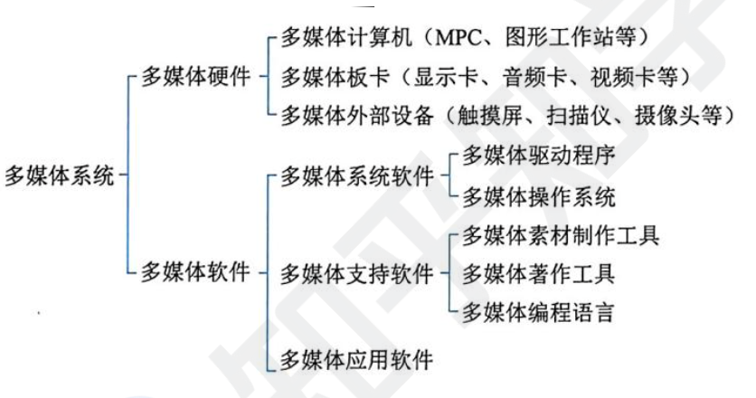
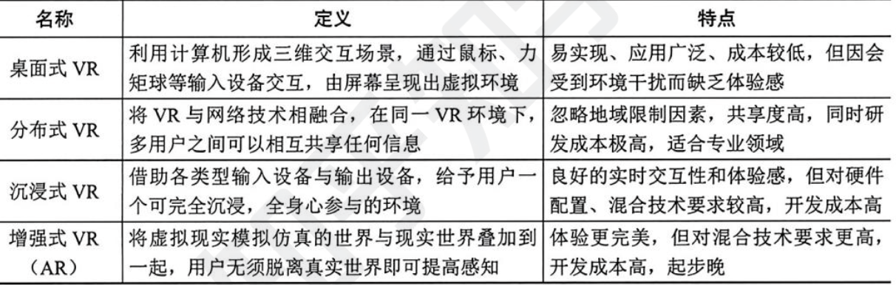

```toc
```

## 计算机语言

计算机语言是指用于人与计算机之间通讯的语言，也被称为编程语言．它是一种被设计用来编写计算机程序的规则和约定，可以用来描述计算机所需执行的操作和计算步骤.

计算机语言主要由一套指令组成，而这种指令一般包括表达式、流程控制和集合三大部分内容。计算机语言可以分为不同的类别，包括机器语言、汇编语言和高级语言。

机器语言
机器语言是一种指令集的体系，是计算机的设计者通过计算机的硬件结构赋予计算机的操作功能。

第一代计算机语言，计算机自身语言，二进制代码串。操作码、操作数的地址、操作结果的存储地址、下条指令的地址。

机器语言指令必须包括：操作码、操作数的地址、操作结果的存储地址、下条指令的地址

指令格式：
三地址指今：这种指今格式通常包括两个操作数地址和一个结果地址。在三地址指令中，
第一个地址（`A1`） 确定第一个操作数，第二个地址（`A2`）确定第二个操作数，第三个地址(`A3`)则用于存储执行操作后的结果。执行完指令后，下一条指令的地址通常由程序计数器按顺序给出。

二地址指令：这种指令格式只包括一个操作数地址和一个结果地址．第一个地址（`A1`）确定第一个操作数，而第二个地址（`A2`）同时确定第二个操作数和结果．这类指令隐含了第二操作数和结果的地址，所以其操作码部分通常较短。

单地址指令：这类指令只包括一个操作数地址。操作数被存储在指定地址（A）中，而结果则通常被隐含在特定的寄存器中．为了执行操作，需要使用一个指定的寄存器来存储第二个操作数和操作结果。

四地址指令：这种指令格式包括四个地址码字段，分别为两个操作数地址和一个结果地址。这和格式的操作码部分通常比较长，可以表示更多的操作类型。四地址指令的第一个地址 (`A1`) 确定第一个操作数，第二个地址（`A2`）确定第二个操作数，第三个地址（`A3`） 和第四个地址（`A4`）用于存储执行操作后的结果。

汇编语言：面向机器的程序设计语言，用于电子计算机、微处理器、微控制器或其他可编程器件。它也被称为符号语言，因为用助记符代替机器指令的操作码，用地址符号或标号代替指令或操作数的地址。

汇编语言 3 种语句：指令、伪指令、宏指令
- 指令：指令是汇编语言中最基本的语句类型，用于描述计算机要执行的操作。
- 伪指令：伪指令是用于控制汇编过程的语句，不是真正的机器指令。
- 宏指令：宏指令是一种特殊的指令，用于定义可重用的代码块。

高级语言：是一种与特定计算机体系结构无关的程序设计语言，它更接近于自然语言，能够以更简洁、更易读的方式描述计算机程序。与低级语言相比，高级语言具有更好的可读性、可维护性和可移植性。

根据语言的抽象程度，高级语言可以分为面向过程、面向对象和泛型等类型。

面向过程的语言：这种语言遵循“自上而下”的程序设计方法，以功能模块化的方式组织程序，将程序分解为一系列的功能模块，每个模块都有特定的功能和作用。C 语言就是一种典型的面向过程的语言。

面向对象的语言：这种语言遵循“面向对象”的程序设计方法，将程序看作是一系列对象的集合，每个对象都有自己的属性和方法。Java、C++和 `C#`就是面向对象语言的典型代表 。

泛型语言：这种语言遵循“泛型程序设计”的方法，将程序看作是一系列类型的集合，每个类型都有自己的属性和方法。Python 就是一种泛型语言.

建模语言：一种用于描述、设计和构建计算机系统、软件、网络等的技术，它可以是图形语言或文本语言。

图形语言通常使用图表来表示系统或软件的结构和行为，常用的图形元素包括概念、连接符号、图形符号等，这些元素可以用来表示系统的组件、关系、约束等．例如，统一建模语言（UML）是一种常用的图形建模语言，它提供了一系列标准化的图形符号和表达方式，用于帮助软件工程师可视化、构建和记录软件系统的设计。

形式化语言：形式化方法是把概念、判断、推理转化成特定的形式符号后，对形式符号表达系统进行研究的方法，是用具有精确语义的形式语言书写的程序功能描述，它是设计和编制程序的出发点，也是验证程序是否正确的依据。

形式化语言通常分为以下几类：
- 形式逻辑语言形式逻辑语言是数学基础的一个重要组成部分，它使用一组符号和规则来表示概念、关系和推理，可以用来描述计算机程序或系统的行为和性质。
- 自动机理论语言：自动机理论语言是一组用来描述自动机（包括计算机程序）行为的数学模型，它可以用来描述程序的流程、操作和行为。
- 程序设计语言：程序设计语言是一种形式化语言，它用来定义计算机程序，可以包括数据类型、变量、操作符和控制结构等，它可以用来描述程序的语法、语义和行为。
- 描述性语言：描达性语言是一种用来描达计算机系统结构和行为的自然语言，它通常包括系统需求、系统设计、系统实现等部分，可以用来描述系统的功能、行为和性能等。

## 多媒体

媒体是承载信息的载体，即信息的表现形式 (或者传播形式)，如文字、声音、图像、动画和视频等。

按照 ITU-F 建议的定义，媒体可分为感觉媒体、表示媒体、显示媒体、存储媒体和传输媒体

感觉媒体，指的是用户接触信息的感觉形式，如视觉、听觉和触觉等

表示媒体，指的是信息的表示形式，如图像、声音、视频等。

表现媒体，也称为显示媒体，指表现和获取信息的物理设备，如键盘、鼠标、扫描仪、话简和摄像机等为输入媒体; 显示器、打印机和音箱等为输出媒体．

存储媒体，指用于存储表示媒体的物理介质，如硬盘、软盘、磁盘、光盘、ROM 及 RAM 等

传输媒体，指传输表示媒体的物理介质，如电缆、光缆和电磁波等

多媒体有 4 个重要的特征。
- 多维化。多维化是指媒体的多样化。它提供了多维化信息空间下的交互能力和获得多维化信息空间的方法，如输人、输出、传输、存储和处理的手段与方法等．
- 集成性。集成性不仅指多媒体设备集成，而且指多媒体信息集成或表现集成。
- 交互性。交互性是人们获取和使用信息时变被动为主动的最重要的标志。交互性可向用户提供更有效地控制和使用信息的手段，可增加大们对信息的注意和理解。
- 实时性。实时性是指多媒体技术中涉及的一些媒体。例如，音频和视频信息具有很强的时间特性，会随着时间的变化而变化。

基本组成



多媒体系统的关键技术。

视音频技术：视频技术包括视频数字化和视频编码技术两个方面，音频技术包括音频数字化、语音处理、语音合成及语音识别 4 个方面。

通信技术是多媒体系统中的一项关键技术，是指将信息从一个地点传送到另一个地点所采取的方法和措施。通信技术通常包括了数据传输信道技术和数据传输技术。
数据压缩技术。数据压缩算法分为下面三类
- 1、即时压缩和非即时压缩。即时/非即时压缩的区别在于信息在传输过程中被压缩还是信息压缩后再传输。即时压缩一般应用在影像、声音数据的传送中．即时压缩常用到专门的硬件设备，如压缩卡等
- 2、数据压缩和文件压缩。数据压缩是专指一些具有时间性的数据，这些数据常常是即时采集即时处理或传输的．而文件压缩是指对将要保存在磁盘等物理介质的数据进行压缩。
- 3、无损压缩与有损压缩。无损压缩是利用数据的统计元余进行压缩，通常无损压缩的压缩比比较低，而有损压缩是利用了人类对视觉、听觉对图像、声音中的某些频率成分不敏感的特性，允许压缩的过程中损失一定的信息.

压缩编码格式：联合图像专家小组标准 (JPEG)、动态图像视频编码标准 (MPEG)、视频编解码器标准(H.26 L)。

虚拟现实 (VR) /增强现实 (AR) 技术
VR 是一种可以创建和体验虚拟世界的计算机仿真系统，它利用计算机生成一种模拟环境，使用户沉浸到该环境申，让人有种身临其境的感觉，

VR 采用计算机技术生成一个逼真的视觉、听觉、触觉、味觉及嗅觉的感知系统，用户可以用人的自然技能与这个生成的虚拟实体进行交互操作，

其概念包含 3 层含义。
1、虚拟实体是用计算机生成的一个逼真的实体。
2、用户可以通过人的自然技能与该环境交互
3、要借助一些三维传感设备来完成交互动作，常用的有头益立体显示器、数据于套、数据服装和三维鼠标等。

增强现实技术是指把原本在现实世界的一定时间和空间范围内很难体验到的实体信息《视觉信息、声音、味道和触觉等)，通过模拟仿真后，再叠加到现实世界中被人类感官所感知，从而达到超越现实的感官体验。包括下面技术：
(1)计算机图形图像技术。增强现实的用户可以戴上透明的护目镜，透过它看到整个世界，连同计算机生成而投射到这一世界表面的图像，从而使物理世界的景象超出用户的日常经验之外。这种增强的信息可以是在真实环境中与之共存的虚拟物体，也可以是实际存在的物体的非几何信息．
(2) 空间定位技术。为了改善效果，增强现实所投射的图像必须在空间定位上与用户相关。当用户转动或移动头部时，视野变动，计算机产生的增强信息随之做相应的变化。
(3) 人文智能．该技术以将处理设备和人的身心能力结合起来为特点，井非仿真人的智能，而是试图发挥传感器、可穿戴计算等技术的优势，使人们能够捕获自己的日常经历、记忆及所见所闻，并与他人进行更有效的交流。

VR 和 AR 技术主要分为：桌面式、分布式、沉浸式、增强式



VRIAR 技术发展至今，虽然被广泛应用，其主要关键技术还有待深入研究：
(1)数据采集与优化传输技术。数据采集主要解如何获取光照、火焰、动态地形等自然现象的数据问题，通常用 3 种设备获取，即全向相机、高速摄像机和激光设备。优化数据传输技术是要满足低功耗、低延时、高效率等特点，保证数据传输的可靠性。
(2)交互与情形实时再现技术．交互技术的接触方式可分为力觉反馈和触觉反馈两种。力觉反馈是指借助操作控制杆的反作用力效果将虚拟物体的运动轨迹转换成真实物体的机械运动触觉反馈是指通过手戴 3 D 数据手套获取手掌和手指的形态和温度等信息，来满足用户对虚拟物体的移动、抓取和触摸等操作。情形实时再现包含了跟踪定位技术、高效可靠的渲染技术和逼真的显示技术等.


## 系统工程

系统工程是利用计算机作为工具，对系统的结构、元素、信息和反馈等进行分析，以达到最优规划、最优设计、最优管理和最优控制的目的。

系统之系统 (System of Systems，Sos）是一种复杂系统设计和组织的方式，其中一个或多个子系统被组合到一起以实现更大的整体系统功能。这些子系统本身也可以被视为独立的系统，具有自己的组件、接口和功能。适用于其系统元素本身也是系统的情况。

系统工程方法是一种现代的科学决策方法，也是一门基本的决策技术。它针对主要问题、主要情况和全过程，运用有效工具进行全面的分析和处理。

霍尔的三维结构。集中体现了系统工程方法的系统化、综合化、最优化、程序化和标准化等特点是系统工程方法论的重要基础内容。

霍尔三维结构是将系统工程整个活动过程分为前后紧密街接的 7 个阶段和 7 个步骤，同时还考虑了为完成这些阶段和步骤所需要的各种专业知识和技能。

这样，就形成了由时间维、逻辑维和知识维组成的三维空间结构。

切克兰德方法。社会经济系统中的问题往往很难和工程技术系统中的问题一样，事先将需求确定清楚，难以按价值系统的评价准则设计出符合这种需求的最优系统方案

切克兰德方法论的核心不是“最优化”而是“比较”与“探寻”．从模型和现状的比较中来学习改善现状的途径。

切克兰德方法将工作过程分为 7 个步骤.
(1)认识问题．收集与问题有关的信息，表达问题现状，寻找构成和影响因素及其关系，以便明确系统问题结构、现存过程及其相互之间的不适应之处，确定有关的行为主体和利益主体。
(2)根底定义。初步弄清、改善与现状有关的各种因素及其相互关系．根底定义的目的是弄清系统问题的关键要素以及关联因素，为系统的发展及其研究确立各种基本的看法，并尽可能选择出最合适的基本观点。
(3) 建立概念模型．在不能建立精确数学模型的情况下，用结构模型或语言模型来描述系统的现状概念模型来自于根底定义，是通过系统化语言对问题抽象描述的结果，其结构及要素必须符合根底定义的思想，并能实现其要求。
(4）比较及探寻．将现实问题和概念模型进行对比，找出符合决策者意图且可行的方案或途径。有时通过比较，需要对根底定义的结果进行适当修正。
(5)选择。针对比较的结果，考虑有关人员的态度及其他社会、行为等因素，选出现实可行的改善方案。
(6)设计与实施，通过详尽和有针对性的设计，形成具有可操作性的方案，并使得有关人员乐于接受和原意为方案的实现竭尽全力。
(7 评估与反馈，根据在实施过程中获得的新认识，修正问题描述、根底定义及概念模型等

并行工程方法。是对产品及其相关过程进行并行、集成化处理的系统方法和综合技术。它要求产品开发人员从设计开始就考虑产品生命周期的全过程，不仅考虑产品的各项性能，如质量、成本和用户要求，还应考虑与产品有关的各工艺过程的质量及服务的质量．并行工程的目标是提高质量、降低成本、缩短产品开发周期和产品上市时间。

并行工程核心点：
1、在产品的设计开发期间，将概念设计、结构设计、工艺设计、最终需求等结合起来，保证以最快的速度按要求的质量完成。
2、各项工作由与此相关的项目小组完成。进程中小组成员各自安排自身的工作，但可以随时或定期反馈信息，并对出现的问题协调解决。
3、依据适当的信息系统工具，反馈与协调整个项目的进行．利用现代 CIM 技术，在产品的研制与开发期间，辅助项目进程的并行化

综合集成法。钱学森等首次把处理开放的复杂巨系统的方法命名为从定性到定量的综合集成法。综合集成是从整体上考虑并解决问题的方法论。是现代科学条件下认识方法论上的一次飞跃。开放的复杂巨系统的一般基本原则与一般系统论的原则相一致：
- 整体论原则；
- 相互联系原则;
- 是有序性原则；
- 动态原则。

开放的复杂巨系统主要性质; 开放性、复杂性、进化与涌现性、层次性、巨量性.

综合集成方法的主要特点有：
- 定性研究与定量研究有机结合，贯穿全过程。
- 科学理论与经验知识结合，把人们对客观事物的知识综合集成解决问题
- 应用系统思想把多种学科结合起来进行综合研究。
- 根据复杂巨系统的层次结构，把宏观研究与微观研究统一起来。
- 必须有大型计算机系统支持，不仅有管理信息系统、决策支持系统等功能，而且还要有综合集成的功能。

WSR (物理-事理-人理）系统方法．wSR 是物理、事理和人理三者如何巧妙配置、有效利用以解决问题的一种系统方法论。
	“懂物理、明事理、通人理〞就是 WSR 方法论的实践准则，

WSR 方法论一般工作过程可理解为这样的 7 步：理解意图、制定目标、调查分析、构造策略、选择方案、协调关系和实现构想.

WSR 系统方法不是二种具体的解决问题的方法，而是一种问题分析与解决的方法论，可以广泛应用于各种领城和学科．同时，它也强调与具体实践相结合，从实际出发，以解决实际问题为目标，具有很强的实用性。

系统工程生命周期 7 阶段
1、探索性研究阶段: 目的是识别利益攸关者的需求，探索创意和技术.
2、概念阶段：目的是细化利益攸关者的需求，探索可行概念，提出有望实现的解决方案
3、开发阶段：目的是细化系统需求，创建解决方案的描述，构建系统，验证并确认系统
4、生产阶段：目的是生产系统并进行检验和验证。
5、使用阶段：目的是运行系统以满足用户需求。
6、保障阶段：目的是提供持续的系统能力。
7、退役阶段：目的是存储、归档或退出系统

生命周期方法
(1)计划驱动方法：特征在于整个过程始终守规定流程的系统化方法。特别关注文档的完整性需求的可追溯性以及每种表示的事后验证。
(2) 渐进迭代式开发：允许为项目提供一个初始能力，随之提供连续交付以达到期望的系统。目标在于快速产生价值并提供快速响应能力。适合需求不清晰，较小的，不太复杂的系统。
(3) 精益开发：精益思想是一种整体性的范式，聚焦于向客户交付最大价值并使浪费活动最小化是一个动态的、知识驱动的、以客户为中心的过程，通过这一过程使特定企业的所有人员以创造竹值为目标不断地消除浪费。
(4)敏捷开发: 敏捷的关键目标在于灵活性，当风险可接受时允许从序列中排除选定的事件. 适用于系统工程的敏捷原则如下：
- 最高的优先级是通过尽早地和持续地交付有价值的软件来满足客户.
- 欢迎需求变更，即使是在项目开发后期．
- 敏捷流程利用需求变更帮助客户获得竞争优势.
- 不断交付可用的软件，周期从几周到几个月不等，且越短越好。
- 在项目中业务人员与开发人员每天在一起工作，业务人员始终参与到开发工作中，
- 在开发团队内部和团队之间，传递信息最有效的方法是面对面交谈。
- 工作软供是进展的主要度量。
- 对技术的精益求精以及对设计的不断完善将提升敏捷性
- 简单性（尽最大可能减少不必要的工作的艺术）是精髓
- 最佳的架构、需求和设计出自于自组织的团队。
- 团队要定期反省如何能够做到更加高效，并相应地调整团队的行为.

基于模型的系统工程 (MBSE)是建模方法的形式化应用，以使建模方法支持系统需求、分析、设计、验证和确认等活动，这些活动从概念性设计阶段开始，持续贯穿到设计开发以及后来的所有生命周期
阶段。
系统工程过程的三个阶段分别产生三种图形：
- 在需求分析阶段，产生需求图、用例图及包图；
- 在功能分析与分配阶段，产生顺序图、活动图及状态机图；
- 在设计综合阶段，产生模块定义图、内部块图及参数图等。

MBSE 的三大支柱分别是建模语言、建模工具和建模思路.

系统工程利用计算机作为工具，对系统的结构、元素、（18)和反馈等进行分析，以达到最优（19）、最优设计、最优管理和最优控制的目的。霍尔 (AD. Hal)于 1969 年提出了系统方法的三维结构体系，通常称为霍尔三维结构，这是系统工程方法论的基础，霍尔三维结构以时间维 (20)维、知识维组成的立体结构概括性地表示出系统工程的各阶段、各步骤以及所涉及的知识范围。其中时间维是系统的工作进程，对于一个具体的工程项目，可以分为 7 个阶段，在 (21）阶段会做出研制方案及生产计划。

(18）A 知识 B 需求 C 文档 D 信息
(19）A 战略 B 规划 C 实现 D 处理
(20) A 空间 B 结构 C 组织 D 逻辑
(21) A 规划 B 拟定 C 研制 D 生产

答案：(18) D， (19) B, (20) D, (21) C